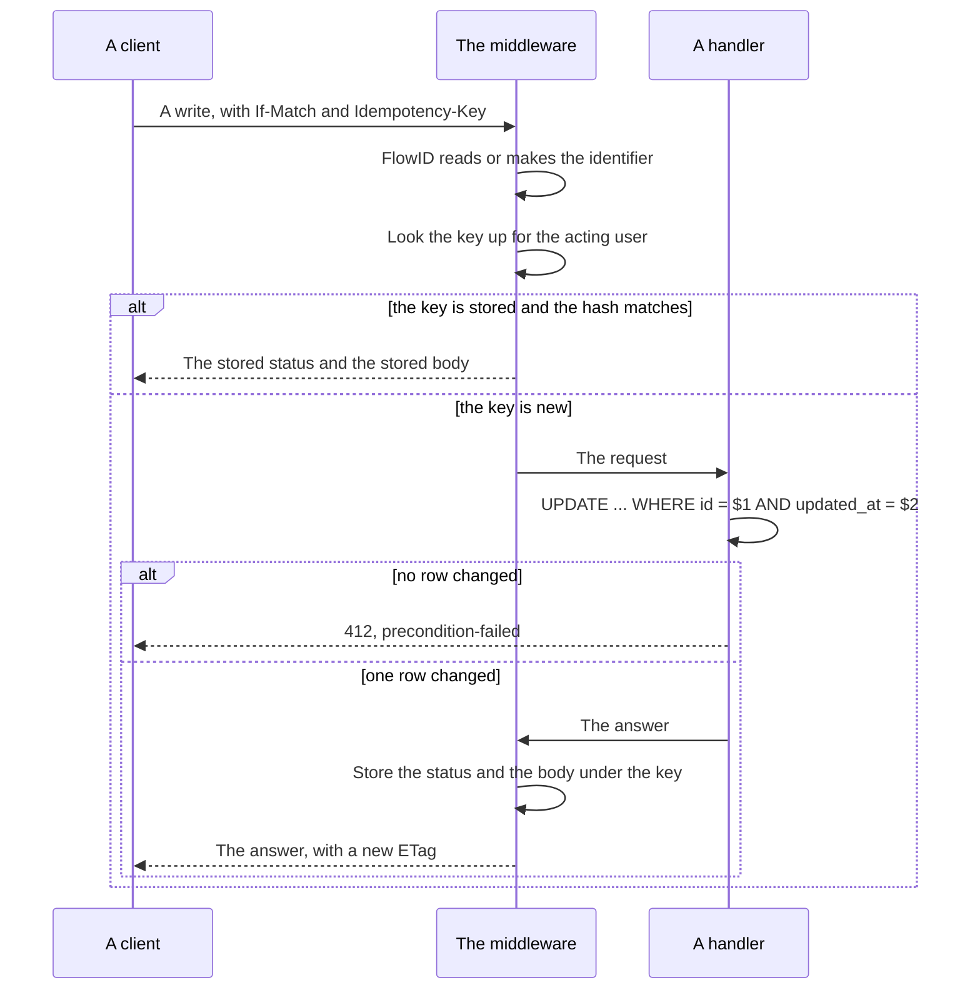

# Specification: The platform that carries the API

`spec.md` holds the body of an answer. This file holds the routes, the stored
address, the migrations, the published documents, and the headers. `SPC-001`
divides the two.

## 1. Summary

The route table of `API-003` replaces the one that runs. `server.hostname`
becomes `server.external_url`, and three readers build their address from it. A
migration corrects the trigger that writes `updated_at`, and the migrator orders
the core before every plugin. A Go command merges the fragments into three
documents and a linter checks them. Four headers join the answer.

## 2. Coverage

| Statement       | Section                       |
| --------------- | ------------------------------ |
| `APIFMT-FR-011` | 4.3, `APIFMT-DD-009`          |
| `APIFMT-FR-012` | 4.3, `APIFMT-DD-009`          |
| `APIFMT-FR-013` | 4.2, `APIFMT-DD-008`          |
| `APIFMT-FR-014` | 4.4, `APIFMT-DD-010`          |
| `APIFMT-FR-015` | `APIFMT-DD-011`               |
| `APIFMT-FR-016` | `APIFMT-DD-012`               |
| `APIFMT-FR-017` | `APIFMT-DD-012`               |
| `APIFMT-FR-018` | 4.5, `APIFMT-DD-013`          |
| `APIFMT-FR-019` | 4.5, `APIFMT-DD-014`          |
| `APIFMT-FR-020` | 4.4, 4.5, `APIFMT-DD-015`     |
| `APIFMT-FR-021` | 4.5, `APIFMT-DD-016`          |

## 3. Guideline compliance

| Rule      | How this design obeys it                                                   |
| --------- | ---------------------------------------------------------------------------- |
| `API-003` | Section 4.3 answers every row of the table, and adds no route of its own.  |
| `API-007` | Section 4.5 builds `Allow`, and gives `WWW-Authenticate` to `/mcp` alone.  |
| `RES-001` | `Z-227` gives the cache default, `Z-230` the key cache, `Z-182` the `ETag`. |
| `RES-004` | Only the discovery route keeps a derived address.                          |
| `RES-007` | The build writes the meta block of each of the three documents.            |
| `RES-008` | `pnpm api:build` and `pnpm api:lint` carry the merge and the check.        |
| `RES-011` | Every route that goes here goes under the exemption of `APIFMT-FR-012`.    |
| `ERR-006` | The middleware reads `X-Flow-ID`, bounds it, and answers it.               |
| `DAT-010` | The trigger assigns `now()`, and every column stays `TIMESTAMPTZ`.         |
| `DAT-011` | The migrator runs the core target first.                                   |
| `CFG-003` | `external_url` carries a `validate` tag, and the hub stops without it.     |
| `CLI-001` | The merge is a command of `tools/`, and joins no command tree of the hub.  |
| `LOG-009` | The access record reads the flow identifier from the context.              |
| `OWN-006` | A route that answers the rows of one person forbids a shared cache.        |

## 4. Design

### 4.1 Components

| File                                          | Change | Holds                                                    |
| --------------------------------------------- | ------ | ----------------------------------------------------------- |
| `apps/hub/internal/config/config.go`          | change | `ExternalURL` replaces `Hostname`.                       |
| `apps/hub/internal/handler/auth.go`           | change | The routes of `API-003`. The three starts answer 202.    |
| `apps/hub/internal/handler/ping.go`           | delete | Nothing. `APIFMT-FR-012`.                                |
| `apps/hub/internal/handler/mcp.go`            | change | The origin reads `ExternalURL`. `resourceScheme` goes.   |
| `apps/hub/internal/telegram/handler.go`       | change | The webhook address reads `ExternalURL`.                 |
| `apps/hub/internal/migrator/migrator.go`      | change | `buildMigrationPlan` orders the core first.              |
| `apps/hub/internal/server/http.go`            | change | `rest.FlowID` and `rest.Allow` join the chain.           |
| `apps/hub/internal/repository/idempotency.go` | create | The store of a repeated write.                           |
| `libs/rest/flow.go`                           | rename | `FlowID`, `FlowIDFromContext`, `Instance`. From `request.go`. |
| `libs/rest/concurrency.go`                    | create | `ETag`, `IfMatch`, `ErrModified`.                        |
| `libs/rest/cache.go`                          | create | `NoStore`, `Immutable`, and the middleware that sets the first. |
| `libs/rest/idempotency.go`                    | create | The middleware and the `IdempotencyStore` interface.     |
| `tools/apibuild/main.go`                      | create | The merge of `APIFMT-DD-012`.                            |
| `specs/api/components.yaml`                   | change | The five headers of section 4.5, and `PreconditionFailed`. |
| `specs/api/vacuum-ruleset.yaml`               | exists | The ruleset for `hub.yaml`.                              |
| `package.json`                                | change | `api:build` and `api:lint`.                              |
| `libs/api-client/src/client.ts`               | change | The new paths, `X-Flow-ID`, `If-Match`.                  |
| `apps/deck/src/lib/api/`                      | change | The three starts read a 202 and navigate.                |

### 4.2 Configuration

| Key                   | Type     | Default | Validation           | Realizes        |
| --------------------- | -------- | ------- | -------------------- | --------------- |
| `server.external_url` | `string` | none    | `required,url`       | `APIFMT-FR-013` |

`server.hostname` goes. `validate:"url"` demands the scheme, which `fqdn` did not.
Three readers take the value: the MCP discovery document, the webhook that
Telegram registers, and a link that `RES-005` builds.

`libs/pluginapi` does not change. A middleware of the hub puts the value in the
request context, and the link builder of `libs/rest` reads it there. The hub
mounts every plugin route inside its own router, so that middleware reaches a
plugin handler. A plugin therefore builds a link with no configuration of its
own, and it never holds the `Host` header that `RES-005` forbids.

### 4.3 Declarations

| Method and path                     | Change | Was                              | Realizes        |
| ----------------------------------- | ------ | --------------------------------- | --------------- |
| `POST /auth/sessions`               | rename | `GET /auth`                       | `APIFMT-FR-011` |
| `GET /auth/sessions/self`           | rename | `GET /auth/me`                    | `APIFMT-FR-011` |
| `DELETE /auth/sessions/self`        | rename | `POST /auth/logout`               | `APIFMT-FR-011` |
| `POST /auth/invitation-redemptions` | rename | `GET /auth/invite`                | `APIFMT-FR-011` |
| `POST /auth/identities`             | rename | `GET /auth/link`                  | `APIFMT-FR-011` |
| `GET /auth/callback`                | keep   | The same                          | `APIFMT-FR-011` |
| `GET /auth/identities`              | keep   | The same                          | `APIFMT-FR-011` |
| `DELETE /auth/identities/{provider}` | keep  | The same                          | `APIFMT-FR-011` |
| `GET /ping`                         | delete | The same                          | `APIFMT-FR-012` |

The three renamed starts answer 202 with the address of the IdP in the body, and
the deck navigates there. `API-003` gives the reason: each one mints a binding
and writes a cookie, which `Z-149` forbids a `GET` to do.

No window guards any row. `RES-011` exempts a route that goes before the first
version of a document reaches a reader, and `ADR-0006` names them.

### 4.4 Data model

| Table               | Schema   | Holds                                          | Realizes        |
| ------------------- | -------- | ----------------------------------------------- | --------------- |
| `idempotency_keys`  | `public` | The answer of a write that a client may repeat. | `APIFMT-FR-020` |

```sql
CREATE TABLE idempotency_keys (
    id           UUID        PRIMARY KEY DEFAULT uuidv7(),
    user_id      UUID        NOT NULL REFERENCES users (id) ON DELETE CASCADE,
    key          TEXT        NOT NULL,
    request_hash TEXT        NOT NULL,
    status       SMALLINT    NOT NULL,
    body         JSONB       NOT NULL,
    created_at   TIMESTAMPTZ NOT NULL DEFAULT now(),
    updated_at   TIMESTAMPTZ NOT NULL DEFAULT now()
);

CREATE UNIQUE INDEX idempotency_keys_user_key ON idempotency_keys (user_id, key);
```

`OWN-004` and `OWN-006` scope it: the table carries `user_id`, forces row level
security, and takes the policy of every other scoped table. `request_hash` holds
a digest of the method, the path, and the body, so a repeat under one key with
another body answers a failure rather than the wrong record.

The migration that corrects the trigger replaces the body of one function:

```sql
CREATE OR REPLACE FUNCTION set_updated_at() RETURNS TRIGGER AS $$
BEGIN
    NEW.updated_at = now();
    RETURN NEW;
END;
$$ LANGUAGE plpgsql;
```

No table changes, and no trigger is rebuilt. Every trigger already names this
function. `APIFMT-FR-014`.

### 4.5 Headers

| Header              | On                                    | Value                                   | Realizes        |
| ------------------- | ------------------------------------- | ---------------------------------------- | --------------- |
| `X-Flow-ID`         | Every answer                          | The flow identifier, bare                | `APIFMT-FR-018` |
| `ETag`              | A single record that a client writes  | `W/"<updated_at in unix nanoseconds>"`   | `APIFMT-FR-019` |
| `If-Match`          | Read from a write                     | The value of an earlier `ETag`           | `APIFMT-FR-019` |
| `Idempotency-Key`   | Read from a write that creates        | A value that the client picks            | `APIFMT-FR-020` |
| `Cache-Control`     | Every answer                          | See below                                | `APIFMT-FR-021` |
| `Allow`             | Every 405                             | The methods of the route                 | `API-007`       |

| Route class                         | `Cache-Control`                              |
| ----------------------------------- | --------------------------------------------- |
| Every route, by default             | `no-cache, no-store, must-revalidate, max-age=0` |
| `/plugins/{id}/ui/*`                | `public, max-age=31536000, immutable`         |

`Z-227` gives the default string and asks every deviation to carry a reason.
`/plugins/{id}/ui/*` is the one deviation. `SEC-006` makes it public, and a
bundler puts a content hash in each asset name, so a changed asset takes a new
address and no cache serves a stale one.

That route also carries `Vary: Accept-Encoding` and an `ETag`, which `Z-227`
demands of a route that declares itself cacheable. Its fragment declares all
three headers.



## 5. Design decisions

### `APIFMT-DD-008`

**Realizes:** `APIFMT-FR-013`

**Decision:** `server.external_url` replaces `server.hostname`. It carries the
scheme, the host and the port, and `validate:"required,url"` checks it at the
start.

**Rationale:** Three readers build an address today and two build a broken one.
`mcp.go` fixes `https://` in a constant, so a deployment on another scheme reports
a document that reaches nobody. `telegram/handler.go` concatenates the bare
hostname with the path, so the address it registers carries no scheme at all. One
value with the scheme in it fixes both, and `CFG-003` makes a missing value stop
the start.

**Alternatives:** Keep the hostname and add a scheme beside it. A reader then
joins two values and a deployment can set one and forget the other. Read the
address from the headers that a proxy sends. A caller then picks the address that
a link carries, which is a forgery surface.

### `APIFMT-DD-009`

**Realizes:** `APIFMT-FR-011`, `APIFMT-FR-012`

**Decision:** The route table of `API-003` replaces the one that runs, in one
step, with no window.

**Rationale:** `RES-011` exempts a route that goes before the first version of a
document reaches a reader, and `ADR-0006` names these. The deck and
`libs/api-client` are the only clients, and both live in this repository, so one
commit moves every caller.

**Alternatives:** Serve both tables for 90 days. It doubles the route table and
the tests for a window that guards nobody.

### `APIFMT-DD-010`

**Realizes:** `APIFMT-FR-014`

**Decision:** One migration replaces the body of `set_updated_at` with `now()`.
No column changes, and no trigger is rebuilt.

**Rationale:** `now() AT TIME ZONE 'utc'` answers a value with no zone, which
PostgreSQL then reads in the zone of the session before it stores it in a
`TIMESTAMPTZ`. Two servers in two zones store two instants for one moment.
`CREATE OR REPLACE FUNCTION` keeps the name, so all eight triggers that call it
take the correction with no change of their own.

**Alternatives:** Set the zone of the session on every connection. It corrects
this function and leaves the next naive expression unguarded.

### `APIFMT-DD-011`

**Realizes:** `APIFMT-FR-015`

**Decision:** `buildMigrationPlan` puts `TargetCore` first, then the plugin
identifiers sorted.

**Rationale:** `slices.Collect(maps.Keys(migrations))` gives the order of a Go map,
which is deliberately random, so two starts of one build apply the migrations in
two orders. A plugin that runs first finds no `set_updated_at`. Sorting the rest
makes a failed run reproduce.

**Alternatives:** Declare the order in the configuration. It puts a rule that the
code knows into a file that a deployment maintains.

### `APIFMT-DD-012`

**Realizes:** `APIFMT-FR-016`, `APIFMT-FR-017`

**Decision:** `tools/apibuild` is a Go command built on `libopenapi`. It reads
every `specs/features/*/api.yaml`, groups them by `x-maroid-document`, resolves
each reference to `specs/api/components.yaml`, writes the meta block of `RES-007`,
and emits `build/openapi/{hub,mcp,telegram}.yaml`. `pnpm api:lint` then runs
`vacuum` over the three.

**Rationale:** The repository already builds Go, and `libopenapi` is the library
that `vacuum` itself parses with, so the merge and the check read one model.
`CLI-001` keeps a build step out of the command tree of the hub, so this is a
command of `tools/` and not a subcommand of `apps/hub/cmd`.

**Alternatives:** A Node script with `@redocly/openapi-core`. It adds a second
OpenAPI implementation, and the merge and the check would then disagree on what
a fragment means. A hand-written document. It drifts from the fragments with
nothing to catch the drift.

The build fails on a duplicated component name whose two definitions differ, as
`SPC-002` demands, and on any `vacuum` finding of severity `error`.

### `APIFMT-DD-013`

**Realizes:** `APIFMT-FR-018`

**Decision:** `rest.FlowID` replaces `rest.RequestID`. It reads `X-Flow-ID`,
removes every character outside `[a-zA-Z0-9/+_=-]`, cuts to 128 characters, and
makes a UUID version 7 when nothing remains. `Instance` answers `/flows/<value>`.

**Rationale:** `ERR-006` gives each step. The middleware that runs today makes its
own identifier and ignores the header, so a caller cannot name the value that its
log records carry. The bound is what makes reading a caller's value safe: a
header of any length and any bytes would otherwise reach the log and the body of
a problem.

**Alternatives:** Keep `X-Request-Id` and add `X-Flow-ID` beside it. Two
identifiers for one request give a person two values to report and a searcher two
fields to join.

`instancePrefix` changes from `urn:maroid:request:` to `/flows/`. `Z-176` shapes
an `instance` like a type, and `ERR-002` gives the relative form.

### `APIFMT-DD-014`

**Realizes:** `APIFMT-FR-019`

**Decision:** An `ETag` is the weak validator `W/"<updated_at in unix
nanoseconds>"`. A write that carries `If-Match` adds `AND updated_at = $n` to its
`UPDATE`, and zero rows changed answers 412.

**Rationale:** Every scoped table already carries `updated_at` with the trigger
that fills it, so this adds no column and no migration. The comparison runs
inside the same statement as the write, so no window sits between the check and
the change. The validator is weak because two answers with one `updated_at` can
still differ in a member that another table feeds.

**Alternatives:** A `version` integer on every table. It adds a column and a
migration to nine tables and duplicates what `updated_at` already orders. A
digest of the answer body. It costs a read and a hash on every write, and it
changes when a field that no client wrote changes.

A write with no `If-Match` lands, as `APIFMT-FR-019` allows. `Z-182` asks for the
optimistic path and does not make the header mandatory.

### `APIFMT-DD-015`

**Realizes:** `APIFMT-FR-020`

**Decision:** A middleware of `libs/rest` reads `Idempotency-Key` on a write that
creates. It stores the status and the body under the key of the acting user, and
answers the stored pair on a repeat. The hub implements the store over
`idempotency_keys`, and a plugin reaches it through `pluginapi.Host`.

**Rationale:** The store belongs to the hub because it is one table for every
plugin, and the middleware belongs to `libs/rest` because a plugin route needs
it and `PLG-007` denies a plugin `apps/hub`. An interface between the two keeps
`libs/rest` free of the database.

**Alternatives:** A natural key on each table, so that a repeat collides. It works
per table, needs a migration on each one, and answers a conflict rather than the
earlier result.

A repeat under one key with another request hash answers 400, which `Z-230`
recommends. A stored row older than 24 hours expires, and a cron job removes it.
`Z-230` gives that lifetime and calls the store a key cache, not a request log.

`Z-230` also gives the schema of the header. `specs/api/components.yaml` gains
it as a parameter, and a write references it.

### `APIFMT-DD-016`

**Realizes:** `APIFMT-FR-021`

**Decision:** A middleware sets the default `Cache-Control` of `Z-227` on every
answer, and a handler overrides it by setting the header itself.

**Rationale:** `Z-227` makes that string the default and asks a service to attach
it rather than assume a framework does. A route added later then carries it
without anyone deciding, which is the safe direction: `OWN-006` scopes every
collection to the acting user, so a shared cache holding one of those answers
would hand one person the rows of another.

**Alternatives:** Set the header in each handler. A handler added later sets
nothing, and a proxy then decides.

## 6. Scenarios

### `APIFMT-SC-012` (verifies `APIFMT-FR-011`)

**Layer:** integration.
**Given** the router of the hub.
**When** a test calls each row of `API-003`.
**Then** each one answers, and no path of the table holds a verb.

### `APIFMT-SC-013` (verifies `APIFMT-FR-012`)

**Layer:** integration.
**Given** the router of the hub.
**When** a client calls `GET /ping`.
**Then** the answer is `/problems/http/not-found`.

### `APIFMT-SC-014` (verifies `APIFMT-FR-013`)

**Layer:** unit.
**Given** a configuration whose external address names one scheme and one host.
**When** the hub builds the discovery document and the webhook address.
**Then** both carry that scheme and that host, and a configuration with no
external address stops the start.

### `APIFMT-SC-015` (verifies `APIFMT-FR-014`)

**Layer:** integration.
**Given** a database session in a zone that is not UTC.
**When** a write fires the trigger.
**Then** the stored instant equals the instant of the write.

### `APIFMT-SC-016` (verifies `APIFMT-FR-015`)

**Layer:** unit.
**Given** a registry holding the core and three plugins.
**When** a test builds the plan ten times.
**Then** the core is first every time, and the plugins follow in one order.

### `APIFMT-SC-017` (verifies `APIFMT-FR-016`, `APIFMT-FR-017`)

**Layer:** integration.
**Given** the fragments of the repository.
**When** the build merges them and the linter reads the result.
**Then** three documents exist, each carries its own `x-api-id`, and the linter
reports no error. A fragment that breaks a rule that no ruleset exempts fails the
build.

### `APIFMT-SC-018` (verifies `APIFMT-FR-018`)

**Layer:** integration.
**Given** a request that carries a flow identifier of its own.
**When** the hub answers a failure.
**Then** the header, the `instance` member and the `flow_id` attribute name that
value. A request that carries none gets a UUID version 7, and a value of 300
characters is cut to 128.

### `APIFMT-SC-019` (verifies `APIFMT-FR-019`)

**Layer:** integration.
**Given** two clients that read one record.
**When** both write it back with the `ETag` that they read.
**Then** the first write lands, and the second answers 412.

### `APIFMT-SC-020` (verifies `APIFMT-FR-020`)

**Layer:** integration.
**Given** a write that carries a key.
**When** a client sends it twice.
**Then** one record exists, and both answers hold one body. A second send under
that key with another body answers 400.

### `APIFMT-SC-021` (verifies `APIFMT-FR-021`)

**Layer:** integration.
**Given** every route of `API-003`.
**When** a test reads the answer of each one.
**Then** each carries the default of `Z-227`, and only the assets of a plugin
carry `public`, `Vary` and an `ETag`.

## 7. Build plan

| #   | Step                                                                   | Realizes                         | Done |
| --- | ------------------------------------------------------------------------ | -------------------------------- | ---- |
| 1   | Correct the trigger with one migration.                                 | `APIFMT-FR-014`                  | [ ]  |
| 2   | Order the migration plan.                                               | `APIFMT-FR-015`                  | [ ]  |
| 3   | Replace `Hostname` with `ExternalURL`, and change the three readers.    | `APIFMT-FR-013`                  | [ ]  |
| 4   | Rename `RequestID` to `FlowID`, read the header, and change `Instance`. | `APIFMT-FR-018`                  | [ ]  |
| 5   | Rename the routes, delete `/ping`, and answer 202 from the three starts. | `APIFMT-FR-011`, `APIFMT-FR-012` | [ ]  |
| 6   | Change the deck and `libs/api-client` to the new routes.                | `APIFMT-FR-011`                  | [ ]  |
| 7   | Add `concurrency.go`, and take `If-Match` in each write.                | `APIFMT-FR-019`                  | [ ]  |
| 8   | Add the table, the store, and the idempotency middleware.               | `APIFMT-FR-020`                  | [ ]  |
| 9   | Add `cache.go`, the middleware, and the override on the asset route.    | `APIFMT-FR-021`                  | [ ]  |
| 10  | Write `tools/apibuild`, and add `api:build` and `api:lint`.             | `APIFMT-FR-016`, `APIFMT-FR-017` | [ ]  |
| 11  | Add the five headers and `PreconditionFailed` to `components.yaml`.     | `SPC-002`                        | [ ]  |
| 12  | Change `extid/api.yaml` and `websess/api.yaml` to the renamed routes.   | `SPC-002`                        | [ ]  |
| 13  | Add the two commands to `BLD-001`.                                      | `RES-008`                        | [ ]  |

Step 1 and step 2 land before any other, because a deployment that starts on the
wrong order stores the wrong instant.

## 8. Out of scope for this specification

- The design of a health check. `APIFMT-FR-012` removes the route that answers a
  fixed word, and a later decision designs the replacement.
- The body of an answer. `spec.md` holds it.

## Retired identifiers

This file has no retired identifier.
