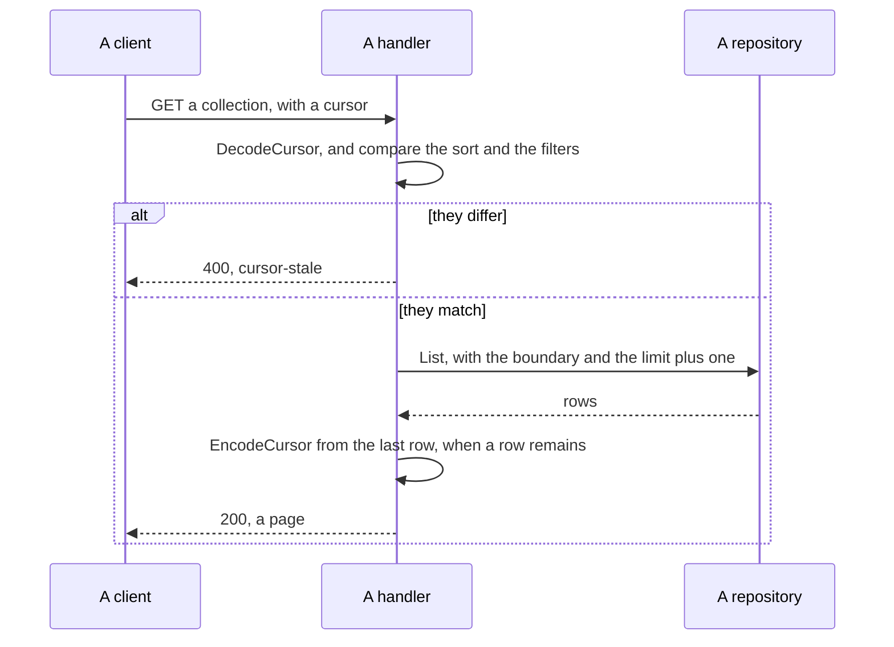

# Specification: The answer that a client reads

`spec-platform.md` holds the routes, the stored address, the migrations, the
published documents, and the headers. `SPC-001` divides the two.

## 1. Summary

`libs/problem` becomes `libs/rest` and gains the page and the cursor. Every
handler of the hub and of a plugin answers a collection through
`rest.Page[T]`. Every JSON tag of the API takes snake case, and every point in
time takes UTC. The deck and `libs/api-client` read the new shape.

## 2. Coverage

| Statement       | Section                              |
| --------------- | ------------------------------------- |
| `APIFMT-FR-001` | 4.1, `APIFMT-DD-004`                  |
| `APIFMT-FR-002` | 4.1, `APIFMT-DD-002`                  |
| `APIFMT-FR-003` | 4.1, `APIFMT-DD-003`                  |
| `APIFMT-FR-004` | 4.3, `APIFMT-DD-006`                  |
| `APIFMT-FR-005` | 4.5, `APIFMT-DD-003`                  |
| `APIFMT-FR-006` | 4.3, `APIFMT-DD-003`                  |
| `APIFMT-FR-007` | 4.5                                   |
| `APIFMT-FR-008` | 4.1, `APIFMT-DD-005`                  |
| `APIFMT-FR-009` | `APIFMT-DD-007`                       |
| `APIFMT-FR-010` | 4.5                                   |
| `APIFMT-NFR-001`| `APIFMT-SC-011`                       |
| `APIFMT-NFR-002`| 4.3, `APIFMT-SC-005`                  |
| `APIFMT-INV-001`| `APIFMT-DD-003`, `APIFMT-SC-004`      |
| `APIFMT-INV-002`| `APIFMT-DD-004`, `APIFMT-SC-001`      |

## 3. Guideline compliance

| Rule      | How this design obeys it                                                  |
| --------- | --------------------------------------------------------------------------- |
| `RES-005` | `rest.Page[T]` carries the five members, and `items`, `self` and `first` are required. |
| `RES-006` | `rest.Cursor` holds the five members, and a client never builds one.      |
| `ERR-001` | Every failure answers `rest.Write`.                                       |
| `ERR-003` | `cursor-stale` joins the registry of `libs/rest`.                         |
| `PLG-007` | `libs/rest` imports no package of `apps/hub`.                             |
| `ARC-005` | `libs/rest` holds what the hub and a plugin both import.                  |
| `DAT-009` | The keyset reads the primary key, so no query gains an index.             |
| `OWN-005` | No repository filters by user. A page counts the rows that the policy leaves. |
| `GO-003`  | Every exported identifier of `libs/rest` carries a documentation comment. |

## 4. Design

### 4.1 Components

| File                                   | Change | Holds                                                         |
| -------------------------------------- | ------ | --------------------------------------------------------------- |
| `libs/rest/go.mod`                     | rename | The module path becomes `github.com/abgeo/maroid/libs/rest`.  |
| `libs/rest/problem.go`                 | move   | `Problem`, `FieldFailure`, and the three builders. Unchanged.  |
| `libs/rest/registry.go`                | change | The constructors. `NewCursorStale` joins them.                |
| `libs/rest/writer.go`                  | move   | `Fill` and `Write`. Unchanged.                                |
| `libs/rest/page.go`                    | create | `Page[T]`, `NewPage`, and the link builder.                   |
| `libs/rest/cursor.go`                  | create | `Cursor`, `EncodeCursor`, `DecodeCursor`.                     |
| `libs/rest/flow.go`                    | rename | The middleware. `spec-platform.md` holds it.                  |
| `apps/hub/internal/handler/plugin.go`  | change | `List` answers a page. `SaveSettings` keeps its shape.        |
| `apps/hub/internal/handler/auth.go`    | change | Five tags take snake case. `Identities` answers a page.       |
| `plugins/jasmine/dto/plant.go`         | change | Four tags take snake case. The two times take UTC.            |
| `plugins/jasmine/dto/environment.go`   | change | Two tags take snake case. The two times take UTC.             |
| `plugins/jasmine/repository/plant.go`  | change | `List` takes a cursor and a limit.                            |
| `plugins/jasmine/repository/environment.go` | change | The same.                                                |
| `libs/api-client/src/page.ts`          | create | `Page<T>` and the reader that follows a cursor.               |
| `libs/api-client/src/problem.ts`       | change | Eleven type constants take the relative form.                 |
| `apps/deck/src/lib/api/types.ts`       | change | The five members already read snake case. See `APIFMT-DD-004`. |
| `.golangci.yaml`                       | change | `tagliatelle` takes `json: snake`, with the exemptions of `APIFMT-DD-004`. |

`Page[T]` and its members:

```go
// Page is one answer of a collection. RES-005 gives the members.
type Page[T any] struct {
    Items []T     `json:"items"`
    Self  string  `json:"self"`
    First string  `json:"first"`
    Next  *string `json:"next,omitempty"`
    Prev  *string `json:"prev,omitempty"`
}
```

### 4.2 Data model

This specification adds no table and no column. The cursor holds a position and
no row stores one. `spec-platform.md` holds the migration that corrects the
trigger.

### 4.3 Declarations

| Method and path                      | Access        | Answers                          | Realizes        |
| ------------------------------------ | ------------- | --------------------------------- | --------------- |
| `GET /plugins`                       | Authenticated | One page, no cursor               | `APIFMT-FR-004` |
| `GET /auth/identities`               | Authenticated | One page, no cursor               | `APIFMT-FR-004` |
| `GET /plugins/{id}/api/plants`       | Authenticated | A page, with a cursor             | `APIFMT-FR-002` |
| `GET /plugins/{id}/api/environments` | Authenticated | A page, with a cursor             | `APIFMT-FR-002` |

Every route above takes `limit` and `cursor` from `specs/api/components.yaml`,
except the two that answer one page. `RES-005` holds the default of 20 and the
ceiling of 100, and neither reaches a bounded collection. `APIFMT-NFR-002`.

This feature adds no route, so it owns no fragment. Every route above already
lives in the fragment of the feature that added it, and this specification changes
that fragment. `SPC-002`. The routes of `jasmine` live in no fragment, because
`jasmine` has no feature directory. Section 8 holds that.

### 4.4 Flow



The repository reads one row more than the limit. A row that remains proves a
next page exists, and the handler drops it before it answers.

### 4.5 Errors

| Condition                                  | Type                              | Status |
| ------------------------------------------ | --------------------------------- | ------ |
| A cursor that does not decode              | `/problems/http/request-invalid`  | 400    |
| A cursor whose sort or filters differ      | `/problems/http/cursor-stale`     | 400    |
| A `limit` below 1, above 100, or not a number | `/problems/http/request-invalid` | 400    |
| A `sort` naming a field the route does not declare | `/problems/http/request-invalid` | 400 |
| A bounded collection that a request pages   | `/problems/http/request-invalid`  | 400    |

Every `detail` names the parameter that failed. `ERR-005` bounds it.

## 5. Design decisions

### `APIFMT-DD-001`

**Realizes:** `APIFMT-FR-002`, `APIFMT-FR-003`

**Decision:** `libs/problem` becomes `libs/rest`, and holds the problem, the
page, the cursor, the writer and the middleware.

**Rationale:** A plugin answers a collection, so the page must sit where a plugin
may import it, and `PLG-007` denies it `apps/hub`. `libs/problem` already carries
the wire contract that the hub and every plugin share, and its name describes one
of the three things it now holds. `rest` matches the guideline that governs it.

**Alternatives:** `libs/pluginapi`, which every plugin imports already. It
defines what a plugin declares to the hub, and a page is what a plugin answers to
a client, so the two contracts differ. A new `libs/page`, which adds a tenth
module for one type.

**This decision needs an ADR.** It changes `ERR-007`, which names
`libs/problem`, and the import of every plugin including the out-of-tree `asg` of
`go.work`. `ADR-0006` does not name `ERR-007`.

### `APIFMT-DD-002`

**Realizes:** `APIFMT-FR-002`

**Decision:** `Page[T]` is generic. A handler answers `rest.Page[PlantResponse]`
and never a page of `any`.

**Rationale:** The compiler then checks that the items match the schema that
`api.yaml` declares. A page of `any` moves that check to a test.

**Alternatives:** A page of `any` with a separate typed schema. Go 1.26 carries
generics, so the weaker form buys nothing.

### `APIFMT-DD-003`

**Realizes:** `APIFMT-FR-003`, `APIFMT-FR-005`, `APIFMT-FR-006`,
`APIFMT-INV-001`

**Decision:** A cursor is `base64url` over a JSON object with five members, and
carries no signature. The hub refuses a cursor whose sort or filters differ from
the request.

**Rationale:** A constructed cursor names a position in a collection that the
caller already reads, because `OWN-006` scopes every row to them, so a signature
guards nothing. A signature would add a secret to the configuration and would
invalidate every live cursor when that secret rotates.

**Alternatives:** An HMAC over the object, which enforces opacity rather than
asking for it. It buys no confidentiality here and costs a rotation story.

### `APIFMT-DD-004`

**Realizes:** `APIFMT-FR-001`, `APIFMT-INV-002`

**Decision:** Every JSON tag of the API takes snake case. `.golangci.yaml` sets
`tagliatelle` to `json: snake`, and exempts the files that `RES-003` puts outside
the standard.

**Rationale:** The linter enforces the rule that a reviewer would otherwise
carry. Eleven tags on the API surface change. The 90 tags of
`plugins/*/dto/api-client.go` describe a third-party answer, the two of
`apps/hub/internal/mcpserver/tools/` sit inside an MCP payload, and the two of
`plugins/parking/config/config.go` are keys of a map that a person stored.

**Alternatives:** Turn `tagliatelle` off and rely on review. The repository
already carries the opposite setting, so the rule would hold for exactly as long
as the next reviewer remembers it.

The deck already declares `first_name`, `last_name`, `display_name`,
`picture_url` and `attached_at` in snake case, against a hub that answers camel
case. This step repairs a defect that runs today.

### `APIFMT-DD-005`

**Realizes:** `APIFMT-FR-008`

**Decision:** A DTO calls `.UTC()` before it formats a point in time, and formats
with `time.RFC3339`.

**Rationale:** `time.RFC3339` writes `Z` for a zero offset and a numeric offset
otherwise. The value that reaches a DTO carries the zone of the session of the
database, which no code sets. `.UTC()` makes the offset zero, so the format
writes the upper case `Z` that `Z-169` requires, in the form without an offset
that the same rule recommends over `+00:00`.

**Alternatives:** Set the zone of the session at the connection. It fixes the
read and leaves any value that another path builds unguarded.

### `APIFMT-DD-006`

**Realizes:** `APIFMT-FR-004`

**Decision:** A route that answers a bounded collection declares no `limit` and
no `cursor`, and answers a failure when a request names either.

**Rationale:** The deployment bounds the loaded plugins, and the connectors that
the IdP federates bound the external accounts of one person. A parameter that a
route ignores teaches a client that paging works there.

**Alternatives:** Accept the parameters and ignore them. A client then pages
forever over a collection that answers everything each time.

### `APIFMT-DD-007`

**Realizes:** `APIFMT-FR-009`

**Decision:** A member that holds no value is absent. Every optional member
carries `omitempty`, and no answer holds a JSON null.

**Rationale:** `Z-123` gives one meaning to an absent member and to a null one,
so answering both costs a client a rule and buys nothing. `Z-124` asks a
collection to answer an empty array rather than a null, which `Page.Items`
satisfies because it is never a pointer.

**Alternatives:** Answer null and omit nothing. It reads more uniformly on the
wire and doubles the states a client tests.

## 6. Scenarios

### `APIFMT-SC-001` (verifies `APIFMT-FR-001`, `APIFMT-INV-002`)

**Layer:** unit.
**Given** the answer of every route of the hub and of `jasmine`.
**When** a test reads each member name.
**Then** every name matches `^[a-z_][a-z_0-9]*$`.

### `APIFMT-SC-002` (verifies `APIFMT-FR-002`)

**Layer:** integration.
**Given** a collection that holds two rows.
**When** a client reads it.
**Then** the answer is an object that holds `items`, `self` and `first`, and
`items` holds two entries.

### `APIFMT-SC-003` (verifies `APIFMT-FR-002`)

**Layer:** integration.
**Given** a collection that holds no row.
**When** a client reads it.
**Then** `items` holds an empty array, and the answer carries no null.

### `APIFMT-SC-004` (verifies `APIFMT-FR-003`, `APIFMT-INV-001`)

**Layer:** integration.
**Given** a collection of 25 rows and a limit of 10.
**When** a client follows every cursor to the last page.
**Then** the client reads 25 distinct rows, and the last page carries no `next`.

### `APIFMT-SC-005` (verifies `APIFMT-FR-004`, measures `APIFMT-NFR-002`)

**Layer:** integration.
**Given** a request that names no limit.
**When** the route answers an unbounded collection.
**Then** the answer holds at most 20 items, and a request naming 101 answers
`/problems/http/request-invalid`.

### `APIFMT-SC-006` (verifies `APIFMT-FR-004`)

**Layer:** integration.
**Given** a request for the loaded plugins that names a limit.
**When** the route answers.
**Then** the answer is `/problems/http/request-invalid`.

### `APIFMT-SC-007` (verifies `APIFMT-FR-005`)

**Layer:** integration.
**Given** a cursor that a request built under one filter.
**When** a client sends it with another filter.
**Then** the answer is `/problems/http/cursor-stale`, and a cursor that does not
decode answers `/problems/http/request-invalid`.

### `APIFMT-SC-008` (verifies `APIFMT-FR-006`, `APIFMT-FR-007`)

**Layer:** integration.
**Given** a route that declares no sort field.
**When** a client names one.
**Then** the answer is `/problems/http/request-invalid`, and the `detail` names
the field.

### `APIFMT-SC-009` (verifies `APIFMT-FR-008`)

**Layer:** unit.
**Given** a row whose stored moment is known.
**When** a DTO formats it while the process runs in a zone that is not UTC.
**Then** the value ends in `Z` and names the same instant.

### `APIFMT-SC-010` (verifies `APIFMT-FR-009`, `APIFMT-FR-010`)

**Layer:** unit.
**Given** a record whose optional member holds nothing, and a failure of each
registered type.
**When** a test encodes each one.
**Then** no body holds a JSON null, and every `type` begins with `/problems/`.

### `APIFMT-SC-011` (measures `APIFMT-NFR-001`)

**Layer:** integration.
**Given** a collection of ten thousand rows.
**When** a client reads page 1 and then page 100, each with a limit of 100.
**Then** the second answer takes at most one fifth longer than the first.

## 7. Build plan

| #   | Step                                                                      | Realizes                        | Done |
| --- | --------------------------------------------------------------------------- | ------------------------------- | ---- |
| 1   | Rename `libs/problem` to `libs/rest` in `go.work`, `go.mod` and every import. | `APIFMT-DD-001`                | [ ]  |
| 2   | Add `page.go` and `cursor.go` to `libs/rest`, with their tests.            | `APIFMT-FR-002`, `APIFMT-FR-003` | [ ]  |
| 3   | Add `NewCursorStale` to the registry.                                     | `APIFMT-FR-005`                 | [ ]  |
| 4   | Flip `tagliatelle` and add the exemptions. Change the eleven tags.        | `APIFMT-FR-001`                 | [ ]  |
| 5   | Add `.UTC()` to each DTO that formats a moment.                           | `APIFMT-FR-008`                 | [ ]  |
| 6   | Add `omitempty` to every optional member.                                 | `APIFMT-FR-009`                 | [ ]  |
| 7   | Take a cursor and a limit in each `List` of `jasmine`.                    | `APIFMT-FR-003`                 | [ ]  |
| 8   | Answer a page from the four list routes.                                  | `APIFMT-FR-002`, `APIFMT-FR-004` | [ ]  |
| 9   | Add `page.ts` to `libs/api-client`, and change the relative type constants. | `APIFMT-FR-010`                | [ ]  |
| 10  | Change the four list call sites of the deck and of the plugin interface.  | `APIFMT-FR-002`                 | [ ]  |
| 11  | Change `pcap/api.yaml` and `extid/api.yaml` to the page and the cursor.   | `SPC-002`                       | [ ]  |

Step 1 lands alone, because every later step imports the new path.

## 8. Out of scope for this specification

- The routes, the stored address, the migrations, the published documents, and
  the headers. `spec-platform.md` holds each one.
- A sort field that a route declares. No route declares one, and
  `APIFMT-FR-007` answers every named field with a failure.
- A fragment for the routes of `jasmine`. No feature directory owns that plugin,
  so no fragment can hold them. This specification changes the handlers and the
  repositories, and a later feature declares the routes.

## Retired identifiers

This file has no retired identifier.
