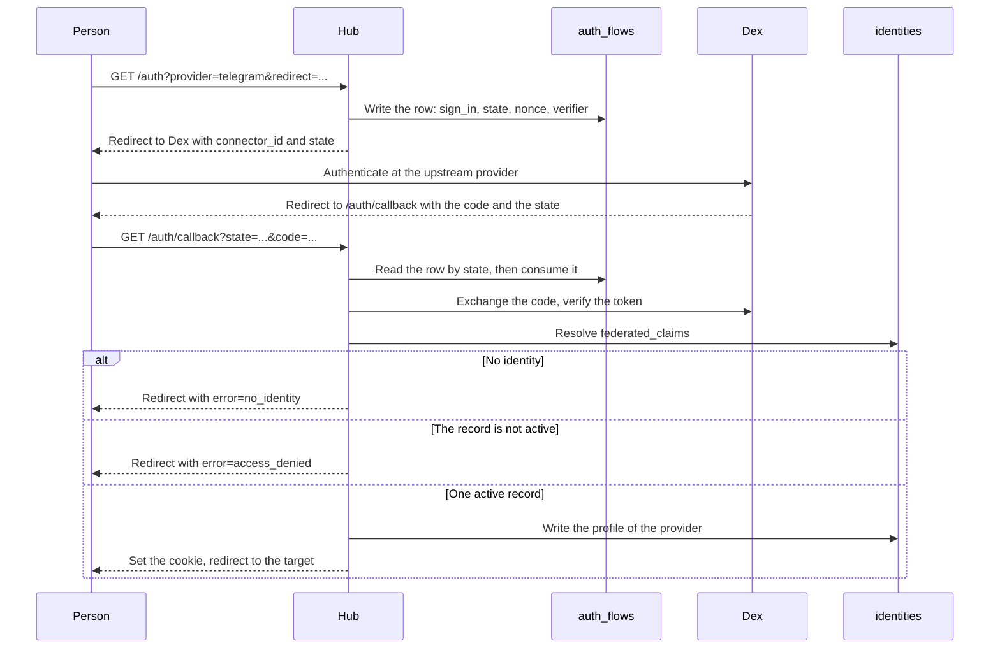

# Specification: External identities and the delegated sign in

## 1. Summary

The hub stops signing a token and verifies a token of Dex instead. Three shared tables arrive. `public.identities` binds an external account to a user
record. `public.auth_flows` holds one authorization in flight. `public.invitations`
holds the grant that binds the first identity of a record. One resolver reads the
identity for the HTTP path and for the Telegram path.

## 2. Coverage

| Requirement     | Where this specification realizes it                          |
| --------------- | --------------------------------------------------------------- |
| `EXTID-FR-001`  | Section 4.4, `EXTID-DD-012`, `EXTID-SC-001`, `EXTID-SC-003`     |
| `EXTID-FR-002`  | Section 4.5, `EXTID-DD-013`, `EXTID-SC-004`                     |
| `EXTID-FR-003`  | Section 4.4, `EXTID-SC-002`                                     |
| `EXTID-FR-004`  | Section 4.3, Section 4.4, `EXTID-DD-004`, `EXTID-SC-005`, `EXTID-SC-006` |
| `EXTID-FR-005`  | Section 4.2, `EXTID-DD-002`, `EXTID-SC-007`                     |
| `EXTID-FR-006`  | Section 4.2, `EXTID-DD-001`, `EXTID-SC-008`                     |
| `EXTID-FR-007`  | Section 4.3, `EXTID-SC-009`                                     |
| `EXTID-FR-008`  | Section 4.2, `EXTID-DD-003`, `EXTID-SC-010`, `EXTID-SC-022`     |
| `EXTID-FR-009`  | Section 4.3, `EXTID-DD-009`, `EXTID-SC-011`                     |
| `EXTID-FR-010`  | Section 4.3, `EXTID-DD-010`, `EXTID-SC-012`                     |
| `EXTID-FR-011`  | Section 4.3, `EXTID-SC-013`                                     |
| `EXTID-FR-012`  | Section 4.4, `EXTID-DD-008`, `EXTID-SC-014`                     |
| `EXTID-FR-013`  | Section 4.2, `EXTID-DD-007`, `EXTID-DD-008`, `EXTID-SC-015`     |
| `EXTID-FR-014`  | Section 4.2, `EXTID-SC-016`                                     |
| `EXTID-FR-015`  | Section 4.2, `EXTID-DD-011`, `EXTID-SC-017`                     |
| `EXTID-FR-016`  | Section 4.2, `EXTID-DD-011`, `EXTID-SC-018`                     |
| `EXTID-FR-017`  | Section 4.2, Section 4.4, `EXTID-DD-012`, `EXTID-DD-014`, `EXTID-SC-019`, `EXTID-SC-024` |
| `EXTID-NFR-001` | `EXTID-DD-005`, `EXTID-SC-020`                                  |
| `EXTID-NFR-002` | `EXTID-DD-006`, `EXTID-SC-021`                                  |
| `EXTID-INV-001` | Section 4.2, `EXTID-DD-002`, `EXTID-SC-007`                     |
| `EXTID-INV-002` | Section 4.2, `EXTID-DD-003`, `EXTID-SC-022`                     |
| `EXTID-INV-003` | Section 4.4, `EXTID-DD-012`, `EXTID-SC-023`                     |

## 3. Guideline compliance

| Rule      | Guideline        | How this specification obeys it                                                            |
| --------- | ---------------- | -------------------------------------------------------------------------------------------- |
| `SEC-002` | Security         | `EXTID-DD-005`. The hub verifies against the JWKS of Dex and signs nothing.                 |
| `SEC-003` | Security         | Section 4.4 reads `federated_claims` and resolves through `public.identities`.               |
| `SEC-004` | Security         | Section 4.4 reads the user record on each request. The status decides.                       |
| `SEC-005` | Security         | `EXTID-DD-006`. The cookie `maroid_token` keeps its name and its place.                      |
| `OWN-001` | Record ownership | Section 4.2 gives `public.identities`, the natural key.                                      |
| `OWN-002` | Record ownership | `EXTID-DD-010`. The command of the owner creates the record. No sign in creates one.         |
| `OWN-003` | Record ownership | `EXTID-DD-012`. One resolver serves the HTTP entry point and the Telegram entry point.       |
| `OWN-004` | Record ownership | Section 4.2 states the reason that each of the three tables is shared.                       |
| `API-003` | HTTP API         | Section 4.3 uses the prefixes that the rule fixes, and adds none.                            |
| `API-005` | HTTP API         | Each handler implements `handler.Handler` and returns an error.                              |
| `API-006` | HTTP API         | Section 4.5 gives the status and the body of each failure.                                   |
| `TG-006`  | Telegram         | The conversation store keeps the Telegram identifier as its key. This feature changes no store. |
| `DAT-005` | Data             | Section 4.2 names the four migrations.                                                       |
| `DAT-009` | Data             | Each table declares `id UUID ... DEFAULT uuidv7()`, and no insert names `id`.                |
| `REP-002` | Repository       | Each repository declares its interface and asserts the implementation.                       |
| `CFG-003` | Configuration    | Section 4.3 gives the configuration scheme.                                                  |
| `CLI-001` | The command line | The tree holds `maroid user invite`. Section 4.3 declares its flags.                         |
| `CLI-004` | The command line | `PreRunE` validates the flags. `RunE` writes the rows and prints the address.                |

`ADR-0002` changed `SEC-001`, `SEC-002`, `SEC-003`, `OWN-001`, `OWN-003`, `API-003`,
and `GLO-user` for this specification.

`CLI-001` gained the row `maroid user invite` for this specification.

## 4. Design

### 4.1 Components

| Path                                                   | Action | Holds                                                               |
| ------------------------------------------------------ | ------ | --------------------------------------------------------------------- |
| `apps/hub/db/migrations/20260915120300_table_users_alter.*`        | create | The extract, then the new shape of `public.users`         |
| `apps/hub/db/migrations/20260915120000_table_identities_create.*`  | create | `public.identities`                                       |
| `apps/hub/db/migrations/20260915120100_table_invitations_create.*` | create | `public.invitations`                                      |
| `apps/hub/db/migrations/20260915120200_table_auth_flows_create.*`  | create | `public.auth_flows`                                       |
| `apps/hub/internal/model/user.go`                      | change | `first_name` and `last_name`. `TelegramID` goes                      |
| `apps/hub/internal/model/identity.go`                  | create | `model.Identity`, `model.Profile` moves here                         |
| `apps/hub/internal/model/invitation.go`                | create | `model.Invitation`                                                    |
| `apps/hub/internal/model/authflow.go`                  | create | `model.AuthFlow`, `model.Intent`, `model.ParseIntent`                |
| `apps/hub/internal/repository/user.go`                 | change | `GetActiveByTelegramID` and `SyncProfileByTelegramID` go. `Create` arrives |
| `apps/hub/internal/repository/identity.go`             | create | `IdentityRepository`, `Identity`                                      |
| `apps/hub/internal/repository/invitation.go`           | create | `InvitationRepository`, `Invitation`                                  |
| `apps/hub/internal/repository/authflow.go`             | create | `AuthFlowRepository`, `AuthFlow`                                      |
| `apps/hub/internal/auth/jwt.go`                        | delete | The hub signs no token. `SEC-002`                                     |
| `apps/hub/internal/auth/verifier.go`                   | create | `auth.TokenVerifier`, `auth.Claims`, `auth.FederatedClaims`           |
| `apps/hub/internal/auth/resolver.go`                   | create | `auth.IdentityResolver`, `auth.Resolver`                              |
| `apps/hub/internal/auth/middleware.go`                 | change | Verifies with `TokenVerifier`, resolves with `IdentityResolver`       |
| `apps/hub/internal/auth/oidc.go`                       | change | `AuthURL` takes the provider and sends `connector_id`                 |
| `apps/hub/internal/auth/oidc_flow.go`                  | change | `Verify` returns `federated_claims`. The flow row holds the secrets   |
| `apps/hub/internal/auth/service.go`                    | create | `auth.Service`, which holds the attach, the detach, and the redemption |
| `apps/hub/internal/handler/auth.go`                    | change | The five routes of section 4.3                                        |
| `apps/hub/internal/telegram/middleware/acting_user.go` | change | Resolves through `IdentityResolver`                                   |
| `apps/hub/internal/command/user/invite.go`             | create | `maroid user invite`. `EXTID-DD-010`                                  |
| `apps/hub/internal/command/root.go`                    | change | The `user` command joins the tree                                     |
| `apps/hub/internal/config/config.go`                   | change | The `JWT` block goes. `Auth.Providers` and two lifetimes arrive       |
| `apps/hub/internal/depresolver/{auth,resolver}.go`     | change | `JWTService` goes. The verifier, the resolver, and three repositories arrive |
| `apps/hub/internal/domain/errs/errs.go`                | change | The sentinel errors of section 4.5                                    |
| `.keys/`                                               | delete | The hub holds no key pair                                             |
| `config.yaml`                                          | change | The `jwt` block goes. The `auth` block grows                          |
| `apps/deck/src/lib/api/types.ts`                       | change | `User` follows the body of `/auth/me`                                 |
| `apps/deck/src/lib/components/UserDropdown.svelte`     | change | Reads the name and the picture from the identity list                 |

The signatures:

```go
// apps/hub/internal/auth/verifier.go
type FederatedClaims struct {
    ConnectorID string `json:"connector_id"`
    UserID      string `json:"user_id"`
}

type Claims struct {
    Subject   string          `json:"sub"`
    Name      string          `json:"name"`
    Username  string          `json:"preferred_username"`
    Picture   string          `json:"picture"`
    Federated FederatedClaims `json:"federated_claims"`
}

type TokenVerifier interface {
    Verify(ctx context.Context, rawToken string) (*Claims, error)
}

// apps/hub/internal/auth/resolver.go
type IdentityResolver interface {
    ResolveByProvider(ctx context.Context, provider, providerUserID string) (*model.User, error)
}

// apps/hub/internal/repository/identity.go
type IdentityRepository interface {
    GetActiveUserByProvider(ctx context.Context, provider, providerUserID string) (*model.User, error)
    ListByUser(ctx context.Context, userID string) ([]model.Identity, error)
    Attach(ctx context.Context, tx *sqlx.Tx, userID, provider, providerUserID string, profile model.Profile) error
    SyncProfile(ctx context.Context, provider, providerUserID string, profile model.Profile) error
    Detach(ctx context.Context, userID, provider string) error
}
```

`Attach` takes a transaction, because the redemption writes the identity and consumes
the invitation together. `EXTID-DD-008` gives the reason. Every other method runs one
statement on the request path, as `IDENT-DD-003` decided for the hub.

### 4.2 Data model

| Table         | Schema   | Scope  | Migration                                    | Realizes                        |
| ------------- | -------- | ------ | ---------------------------------------------- | -------------------------------- |
| `users`       | `public` | shared | `20260915120300_table_users_alter.up.sql`       | `EXTID-FR-015`, `EXTID-FR-017`   |
| `identities`  | `public` | shared | `20260915120000_table_identities_create.up.sql` | `EXTID-FR-016`, `EXTID-INV-001` |
| `invitations` | `public` | shared | `20260915120100_table_invitations_create.up.sql` | `EXTID-FR-013`, `EXTID-FR-014` |
| `auth_flows`  | `public` | shared | `20260915120200_table_auth_flows_create.up.sql` | `EXTID-FR-006`                  |

Each of the three new tables is shared. Each migration states the same reason: the
resolver reads the table before an acting user exists. The ownership therefore cannot
govern it, and `OWN-004` demands that the migration say so.

**`public.users`.** The fourth migration runs after the other three, because the
extract writes into `public.identities`. `EXTID-DD-014` gives the order and the
reverse.

```sql
-- EXTID-FR-017: The Telegram column is the only place that holds the external
-- account, so the extract runs before the drop.
INSERT INTO public.identities (user_id, provider, provider_user_id, username, display_name, picture_url)
SELECT id, 'telegram', telegram_id::TEXT, username, display_name, picture_url
FROM public.users;

-- EXTID-FR-015: The owner sets the two names. No sign in writes them.
ALTER TABLE public.users ADD COLUMN first_name TEXT;
ALTER TABLE public.users ADD COLUMN last_name TEXT;

-- The first space is the delimiter. A name with no space gives no last name.
UPDATE public.users
SET first_name = NULLIF(regexp_replace(trim(display_name), '\s.*$', ''), ''),
    last_name  = NULLIF(regexp_replace(trim(display_name), '^\S+\s*', ''), '');

ALTER TABLE public.users
    DROP COLUMN telegram_id,
    DROP COLUMN username,
    DROP COLUMN picture_url,
    DROP COLUMN display_name;
```

The split takes the first space as the delimiter. The first word becomes
`first_name`, and the rest becomes `last_name`. `Temuri Takalandze Jr` gives
`Temuri` and `Takalandze Jr`. A value with no space gives a first name and a null
last name. The owner corrects any row that the split gets wrong, because
`EXTID-FR-015` makes the two columns theirs.

**`public.identities`.**

```sql
CREATE TABLE public.identities
(
    id               UUID        NOT NULL PRIMARY KEY DEFAULT uuidv7(),
    user_id          UUID        NOT NULL REFERENCES public.users (id) ON DELETE CASCADE,
    provider         TEXT        NOT NULL,
    provider_user_id TEXT        NOT NULL,
    username         TEXT,
    display_name     TEXT,
    picture_url      TEXT,
    created_at       TIMESTAMPTZ NOT NULL DEFAULT NOW(),
    updated_at       TIMESTAMPTZ NOT NULL DEFAULT NOW(),
    -- EXTID-INV-001: One external account names at most one user record.
    CONSTRAINT identities_provider_user_key UNIQUE (provider, provider_user_id)
);

CREATE INDEX identities_user_id_idx ON public.identities (user_id);

CREATE TRIGGER set_updated_at
    BEFORE UPDATE ON public.identities
    FOR EACH ROW
EXECUTE FUNCTION set_updated_at();
```

`provider` holds `federated_claims.connector_id`. `provider_user_id` holds
`federated_claims.user_id`. The three profile columns realize `EXTID-FR-016`, and
the sign in writes them.

The identifier of a connector is permanent. A rename in Dex orphans every identity
that names the old value, and no statement of Maroid can detect it.

**`public.invitations`.**

```sql
CREATE TABLE public.invitations
(
    id          UUID        NOT NULL PRIMARY KEY DEFAULT uuidv7(),
    user_id     UUID        NOT NULL REFERENCES public.users (id) ON DELETE CASCADE,
    -- EXTID-DD-007: The column holds the digest. The token never rests here.
    token_hash  BYTEA       NOT NULL UNIQUE,
    expires_at  TIMESTAMPTZ NOT NULL,
    consumed_at TIMESTAMPTZ,
    created_at  TIMESTAMPTZ NOT NULL DEFAULT NOW()
);
```

An invitation is valid when `consumed_at` is null and `expires_at` is in the future.
`EXTID-FR-013` and `EXTID-FR-014` give the two conditions.

**`public.auth_flows`.**

```sql
CREATE TABLE public.auth_flows
(
    id            UUID        NOT NULL PRIMARY KEY DEFAULT uuidv7(),
    state         TEXT        NOT NULL UNIQUE,
    intent        TEXT        NOT NULL
        CONSTRAINT auth_flows_intent_check CHECK (intent IN ('sign_in', 'attach', 'redeem')),
    user_id       UUID REFERENCES public.users (id) ON DELETE CASCADE,
    invitation_id UUID REFERENCES public.invitations (id) ON DELETE CASCADE,
    -- EXTID-DD-001: The digest of a secret that only the browser that started
    -- the flow holds. A state that leaks finishes the flow nowhere else.
    binding_hash  BYTEA       NOT NULL,
    nonce         TEXT        NOT NULL,
    verifier      TEXT        NOT NULL,
    redirect      TEXT        NOT NULL,
    provider      TEXT,
    expires_at    TIMESTAMPTZ NOT NULL,
    consumed_at   TIMESTAMPTZ,
    created_at    TIMESTAMPTZ NOT NULL DEFAULT NOW(),
    -- EXTID-FR-006: An attach names its user record, and no other intent does.
    CONSTRAINT auth_flows_intent_target_check CHECK (
        (intent = 'sign_in' AND user_id IS NULL AND invitation_id IS NULL) OR
        (intent = 'attach' AND user_id IS NOT NULL AND invitation_id IS NULL) OR
        (intent = 'redeem' AND user_id IS NULL AND invitation_id IS NOT NULL)
    )
);
```

`state` is the key that the callback reads. `EXTID-DD-001` gives the reason that the
row holds the nonce and the verifier.

**The detach.** `EXTID-INV-002` needs a lock, because two detaches of one record run
in parallel. The statement takes the user row first:

```sql
SELECT id FROM public.users WHERE id = $1 FOR UPDATE;
DELETE FROM public.identities
WHERE user_id = $1 AND provider = $2
  AND (SELECT COUNT(*) FROM public.identities WHERE user_id = $1) > 1;
```

`EXTID-DD-003` gives the reason. A delete that reports zero rows means the provider
holds no identity of that record, or the identity is the last one.

### 4.3 Declarations

**HTTP routes.** `api.yaml` holds the bodies and the status codes. See `SPC-002`.

| Method   | Path                          | Access        | Realizes                        |
| -------- | ----------------------------- | ------------- | -------------------------------- |
| `GET`    | `/auth`                       | Public        | `EXTID-FR-001`                   |
| `GET`    | `/auth/callback`              | Public        | `EXTID-FR-001`, `EXTID-FR-004`, `EXTID-FR-012` |
| `GET`    | `/auth/invite`                | Public        | `EXTID-FR-012`                   |
| `GET`    | `/auth/link`                  | Authenticated | `EXTID-FR-004`                   |
| `GET`    | `/auth/me`                    | Authenticated | `EXTID-FR-009`                   |
| `DELETE` | `/auth/identities/{provider}` | Authenticated | `EXTID-FR-007`, `EXTID-FR-008`   |

`/auth/link` requires the query parameter `provider`, because the person chose the
provider before the request. `/auth` accepts it and does not require it. A sign in
with no provider reaches the connector list of Dex. The deck therefore keeps the address that
it builds today, and this feature adds no page to it. `/auth/invite` reads `token`.
`EXTID-DD-004` gives the reason that one callback serves three intents.

**CLI command.**

| Command              | Flags                                             | Does                                                                  | Realizes                       |
| -------------------- | ------------------------------------------------- | ----------------------------------------------------------------------- | ------------------------------- |
| `maroid user invite` | `--first-name`, `--last-name`, `--user`, `--ttl` | Creates a user record and an invitation for it, then prints the address. | `EXTID-FR-010`, `EXTID-FR-011` |

`--user` names a record that exists, and it excludes `--first-name` and
`--last-name`. `--ttl` defaults to the configured lifetime. `EXTID-DD-010` gives the
transaction.

**Configuration scheme.**

| Key                      | Type              | Default | Secret | Realizes                       |
| ------------------------ | ----------------- | ------- | ------ | ------------------------------- |
| `jwt.issuer`             | Removed           | None    | No     | `SEC-002`                       |
| `jwt.private_key`        | Removed           | None    | No     | `SEC-002`                       |
| `jwt.public_key`         | Removed           | None    | No     | `SEC-002`                       |
| `jwt.token_expiry`       | Removed           | None    | No     | `SEC-002`                       |
| `auth.providers`         | List of provider  | None    | No     | `EXTID-FR-009`                  |
| `auth.invitation_ttl`    | Duration          | `72h`   | No     | `EXTID-FR-014`                  |
| `auth.flow_ttl`          | Duration          | `10m`   | No     | `EXTID-FR-006`                  |
| `auth.session_ttl`       | Duration          | `168h`  | No     | `EXTID-NFR-002`                 |

A provider carries `id` and `name`. `id` is the identifier of the connector in Dex,
and `name` is the text that the deck shows. `EXTID-DD-009` gives the reason that the
list lives in the configuration.

`auth.session_ttl` sets the lifetime of the cookie only. The token carries its own
expiry, and `ADR-0002` binds the two to the same number.

### 4.4 Flow

**The sign in.** The attach and the redemption take the same three steps. They differ
in the row that step 1 writes, and in the branch that step 3 takes.



**The attach.** `GET /auth/link` runs behind the authenticated group, so the acting
user exists before step 1. The row carries `intent = attach` and that user. Step 3
inserts the identity instead of a resolution. The identifier of the user comes from
the row, never from the request. `EXTID-DD-001` gives the reason.

**The redemption.** `GET /auth/invite?token=T` reads the invitation by the digest of
`T`. An invitation that is absent, consumed, or expired ends the request before Dex.
The row carries `intent = redeem` and the invitation. Step 3 opens one transaction,
consumes the invitation, and writes the identity. `EXTID-DD-008` gives the order.

**The request.** The middleware runs on each request behind the authenticated group.

1. Read the token from the cookie, then from the header. `SEC-005` fixes the order.
2. Verify it with `TokenVerifier`. The verification checks the signature, the issuer,
   the audience, and the expiry.
3. Read `federated_claims`. A token without it gets status 401.
4. Resolve the identity. An identity that names no active record gets status 401.
5. Put the user into the context with `pluginapi.ContextWithActingUser`.

**The Telegram update.** Step 4 above is the only step that the bot shares. The
middleware calls `ResolveByProvider(ctx, "telegram", sender.ID)`. `EXTID-DD-012`
gives the resolver that both callers hold.

### 4.5 Errors

| Condition                                              | Behavior                                                      | Message                        |
| ------------------------------------------------------ | --------------------------------------------------------------- | ------------------------------- |
| The token is absent, or it fails the verification      | Status 401                                                      | `access denied`                |
| The token carries no `federated_claims`                | Status 401, one error line in the log                           | `access denied`                |
| No identity names the external account, at a request   | Status 401, one info line in the log                            | `access denied`                |
| No identity names the external account, at a sign in   | Redirect with `error=no_identity`. `EXTID-FR-002` demands the distinct reason | `no identity for the external account` |
| The identity names a record that is not active         | Redirect with `error=access_denied`                             | `user is not allowed`          |
| The state names no flow row, or the row is consumed    | Status 400                                                      | `invalid state`                |
| The browser carries no matching binding cookie         | Status 400. The row is spent, and the person starts again       | `invalid state`                |
| The flow row expired                                   | Redirect with `error=auth_failed`                               | `the authorization flow expired` |
| The attach finds the account on another record         | Redirect with `error=identity_taken`. Both records stay unchanged | `the external account belongs to another user` |
| The attach finds the account on the same record        | Redirect with no error. Nothing changes                         | None                           |
| The detach names the last identity                     | Status 409                                                      | `the last external account cannot be detached` |
| The detach names a provider with no identity           | Status 404                                                      | `not found`                    |
| The invitation is absent, consumed, or expired         | Status 400                                                      | `the invitation is not valid`  |
| `maroid user invite` gets `--user` with a name flag    | The command returns an error before it writes                   | `--user excludes --first-name and --last-name` |
| `maroid user invite` gets `--user` with no record      | The command returns an error                                    | `no user record holds that identifier` |

## 5. Design decisions

### `EXTID-DD-001`

**Realizes:** `EXTID-FR-006`
**Decision:** The row in `public.auth_flows` holds the state, the nonce, the
verifier, the target, and the identifier of the user. The four cookies
`maroid_oauth_state`, `maroid_oauth_nonce`, `maroid_oauth_verifier`, and
`maroid_oauth_redirect` go. One cookie arrives: `maroid_auth_binding` carries a
random secret, and the row holds its digest in `binding_hash`. The callback
refuses a request whose cookie does not match the digest.
**Rationale:** A cookie that names the user record is a value that the holder of the
browser rewrites. A rewritten value attaches an external account to another person,
which `EXTID-FR-005` and `EXTID-FR-006` both forbid. The row therefore holds every
authority, and the browser holds none.

The binding is a separate matter, and the row alone cannot serve it. A state that
the hub accepts from any browser is login CSRF: a person who holds a valid state
finishes the flow in the browser of another, and the hub then signs the holder of
that browser in as the person who started it. The binding cookie grants nothing by
itself. It proves only that the browser that finishes the flow is the browser that
started it, and `EXTID-DD-007` already uses the same digest for the same reason.
**Alternatives:** The state in a cookie, compared with the state in the query. It
works, and the state reaches a referrer and a log, so a leak of one leaks both. No
binding at all. It leaves the sign in forgeable.

### `EXTID-DD-002`

**Realizes:** `EXTID-FR-005`, `EXTID-INV-001`
**Decision:** The attach inserts the identity and reads the error. The unique
violation on `identities_provider_user_key` is the conflict. No read runs before the
write.
**Rationale:** A read before a write leaves a window. Two attaches of one external
account to two records both pass the read and both insert, and the record then
reaches two people. The constraint decides in one statement, and `REP-006` already
points the repository at the database for a decision of this shape.
**Alternatives:** `SELECT` and then `INSERT`. It needs `SERIALIZABLE` to be correct,
and it costs a round trip. `ON CONFLICT DO NOTHING`. It hides the conflict, and
`EXTID-FR-005` demands that Maroid report it.

### `EXTID-DD-003`

**Realizes:** `EXTID-FR-008`, `EXTID-INV-002`
**Decision:** The detach opens a transaction, takes `FOR UPDATE` on the user row,
then deletes with the count in the predicate.
**Rationale:** Two detaches of two providers of one record run in parallel. Each one
counts two identities, each one deletes, and the record falls to zero. The lock on the user row serializes every detach of that record. The count in the
predicate then reads a number that no other transaction changes. The lock costs one
statement, on a path that a person reaches a few times in a year.
**Alternatives:** The count in the predicate alone. It reads a stale count under
`READ COMMITTED`, which is the default. A unique partial index. No index expresses
"at least one row".

### `EXTID-DD-004`

**Realizes:** `EXTID-FR-004`, `EXTID-FR-012`
**Decision:** `/auth/callback` finishes the sign in, the attach, and the redemption.
The `intent` column of the flow row picks the branch.
**Rationale:** A client of Dex holds one list of redirect addresses, and a second
address for each intent grows that list for no gain. The state already names the row,
and the row already names the intent. One route also means one place that verifies a
token of Dex.
**Alternatives:** One callback for each intent. It adds two addresses to the client
of Dex and duplicates the exchange and the verification three times.

### `EXTID-DD-005`

**Realizes:** `EXTID-NFR-001`, `SEC-002`
**Decision:** `auth.TokenVerifier` wraps the `*oidc.IDTokenVerifier` of
`github.com/coreos/go-oidc/v3`. The provider holds a remote key set that caches the
keys in memory and refetches only for an unknown key identifier.
**Rationale:** The library already runs in the hub for the login flow, so the
dependency costs nothing new. The cache gives `EXTID-NFR-001` without a second
component: over 1000 requests the hub calls Dex when a key rotates, and not
otherwise. The verifier also checks the issuer and the audience, which `SEC-002`
demands.
**Alternatives:** A key set that the hub fetches at the start. A rotation then breaks
every request until a restart. A verification call to Dex for each request. It makes
Dex a dependency of every read and fails `EXTID-NFR-001`.

### `EXTID-DD-006`

**Realizes:** `EXTID-NFR-002`, `SEC-005`
**Decision:** The cookie `maroid_token` carries the identity token of Dex. The hub
stores no refresh token and renews nothing. A person signs in again when the token
expires.
**Rationale:** Open question 1 of the requirements answers it. A renewal needs a
store for the refresh token, and that store is a second credential at rest. The
lifetime moves into Dex, and `ADR-0002` binds it to the seven days that
`EXTID-NFR-002` gives. Revocation survives, because `SEC-004` reads the user record
on each request and a blocked record ends a live token in one request.
**Alternatives:** A refresh token in a session table. It adds a table, a rotation,
and a second secret at rest, and no statement asks for it yet. A short token with a
silent renewal in the deck. It adds a path in the deck that no requirement names.

### `EXTID-DD-007`

**Realizes:** `EXTID-FR-013`
**Decision:** `public.invitations.token_hash` holds the SHA-256 digest of a token of
32 random bytes. The command prints the token one time, inside the address.
**Rationale:** The token is a bearer capability: whoever holds it binds the first
identity of that record. A reader of the database must not gain that capability, and
a digest gives the lookup without the value. The token needs no stretching, because
32 random bytes carry no guessable structure. The unique constraint on the digest
also catches a collision at the write.
**Alternatives:** The token in a column. A backup then carries a live capability.
A signed token with no row. Nothing then records the single use that
`EXTID-FR-013` demands.

### `EXTID-DD-008`

**Realizes:** `EXTID-FR-012`, `EXTID-FR-013`
**Decision:** The redemption runs one transaction. It consumes the invitation with
`UPDATE ... SET consumed_at = NOW() WHERE id = $1 AND consumed_at IS NULL`, checks
that one row changed, then writes the identity.
**Rationale:** Two people who hold one address open it at the same moment. The conditional update is the gate: exactly one transaction sees one affected row, and
the other sees zero and stops. The identity goes in the same transaction, so a failed
insert returns the invitation to its unconsumed state. A conflict therefore does not
burn the grant.
**Alternatives:** A read, then an update. The window between the two lets both
transactions pass. Two transactions. A failure between them consumes the invitation
and writes no identity, and the record then holds no identity and no valid grant.

### `EXTID-DD-009`

**Realizes:** `EXTID-FR-009`
**Decision:** `auth.providers` in the configuration lists the identifier and the
display name of each provider that Maroid offers.
**Rationale:** Dex publishes no list of its connectors. The discovery document names
the issuer and the endpoints, and no route returns the connectors. `EXTID-FR-009`
needs the full list, including a provider that the person has not attached, so the
hub must hold it. A configuration key also lets the owner offer fewer providers than
Dex federates.
**Alternatives:** The distinct values in `public.identities`. A provider that nobody
attached is then invisible, and `EXTID-FR-009` demands exactly that row. A request to
the Dex API. No such endpoint exists.

### `EXTID-DD-010`

**Realizes:** `EXTID-FR-010`, `EXTID-FR-011`
**Decision:** `maroid user invite` writes the user record and the invitation in one
transaction, then prints the address. With `--user` it writes the invitation only.
**Rationale:** `EXTID-FR-010` asks for one action, and two statements by hand are two
actions. The owner cannot write the first identity, because the identifier of an
external account exists only after that person signs in one time. `OWN-002` still
holds: the command is the owner, and no interaction of a person creates a record.
A record whose invitation expires holds no identity and reaches nobody, so a partial
result is safe.
**Alternatives:** A statement against the database. It cannot generate the token or
print the address. A route that the deck calls. `EXTID-FR-010` names the owner, and
no requirement asks for a screen.

### `EXTID-DD-011`

**Realizes:** `EXTID-FR-015`, `EXTID-FR-016`
**Decision:** `public.users` holds `first_name` and `last_name`, and only the owner
writes them. `public.identities` holds `username`, `display_name`, and `picture_url`,
and each sign in with that provider writes them.
**Rationale:** Two providers give two names and two pictures for one person, and no
rule picks a winner. The user record answers "who is this person" once, and the
identity answers "which account is this" for each provider. `EXTID-FR-015` then
holds by construction: the sign in touches no column of `public.users`.
**Alternatives:** One profile on the user record, written by the last sign in. The
name of a person then changes when they use a different provider. A chosen provider
on the user record. It adds a column and a rule, and the owner can type a name.

### `EXTID-DD-012`

**Realizes:** `EXTID-FR-001`, `EXTID-FR-017`, `EXTID-INV-003`
**Decision:** `auth.IdentityResolver` takes a provider and an external account
identifier, and returns the active user record. The HTTP middleware and the Telegram
middleware both hold it.
**Rationale:** `OWN-003` names two entry points that resolve an identity, and one
implementation keeps the two answers equal. `EXTID-FR-017` demands exactly that: the
bot and the shell reach one record. A connector that arrives later reaches both
entry points with no new code, which `SEC-001` now expects.
**Alternatives:** A query in each middleware. The two drift, and a change to the
status check reaches one of them. A resolution inside the repository of each caller.
It repeats the join in two files.

### `EXTID-DD-013`

**Realizes:** `EXTID-FR-002`
**Decision:** A sign in that finds no identity redirects to the target with
`error=no_identity`. Every other failure of the sign in carries `error=auth_failed`
or `error=access_denied`.
**Rationale:** `EXTID-FR-002` asks for an answer that a person can act on. The deck reads the
parameter and tells the person to ask the owner for an invitation. A generic failure
offers a second attempt that fails the same way. The parameter also tells an attacker
that an external account holds no identity here. The owner accepted that cost, because
the requirement asks for the distinction and Maroid serves one household.
**Alternatives:** One generic failure. The person retries and reaches the same wall.
A page inside the hub. `API-006` gives JSON, and the redirect target already renders
the failure today.

### `EXTID-DD-014`

**Realizes:** `EXTID-FR-017`
**Decision:** One migration extracts an identity for each row of `public.users` that
holds a Telegram identifier, splits `display_name` into `first_name` and `last_name`
at the first space, then drops the four columns. The reverse rebuilds them from
`public.identities` and the two names, and it deletes a record that holds no Telegram
identity.
**Rationale:** `users.telegram_id` is the only place that names the external account
of a person who already signs in. A drop without the extract cuts every person from
their record, and no later statement recovers the number. The extract therefore runs
in the same transaction as the drop, so a failure leaves both.
The split is a guess that the owner corrects. A name that Telegram gave is one
string, and no rule divides every name of every culture correctly. The guess still
beats an empty column, because the owner reads a row and recognizes the person.
The reverse loses a user record, because `telegram_id` is `NOT NULL UNIQUE`. A person
who attached only another provider holds no value for that column. The shape that the
reverse goes back to cannot hold them, so the loss is the cost of that direction.
This decision states the loss instead of hiding it.
**Alternatives:** Two migrations, one for the extract and one for the drop. A failure
between them leaves a database with both shapes and no identity. A rename of
`display_name` to `first_name`. It leaves `last_name` empty for every record, and the
owner types a value that the database already holds. A change to
`20260912143000_table_users_create.up.sql`. It rewrites a migration that a database
already ran, so the checksum and the deployed schema disagree.

## 6. Scenarios

`spec-scenarios.md` holds `EXTID-SC-001` through `EXTID-SC-024`.

## 7. Build plan

| #   | Step                                                                                             | Realizes                        | Done |
| --- | -------------------------------------------------------------------------------------------------- | -------------------------------- | ---- |
| 1   | Write `EXTID-SC-024`. Add the four migrations in their order. Add the four models.                | Section 4.2, `EXTID-FR-017`      | [ ]  |
| 2   | Write `EXTID-SC-007` and `EXTID-SC-022`, then `repository.Identity`.                              | `EXTID-INV-001`, `EXTID-INV-002` | [ ]  |
| 3   | Write `repository.Invitation` and `repository.AuthFlow`.                                          | `EXTID-FR-013`, `EXTID-FR-006`   | [ ]  |
| 4   | Write `EXTID-SC-020`, then `auth.TokenVerifier`. Delete `auth/jwt.go` and `.keys/`.               | `EXTID-NFR-001`                  | [ ]  |
| 5   | Write `EXTID-SC-023`, then `auth.IdentityResolver`. Move both middlewares onto it.                | `EXTID-FR-017`, `EXTID-INV-003`  | [ ]  |
| 6   | Write `EXTID-SC-001` to `EXTID-SC-004`, then the sign in on the flow row.                         | `EXTID-FR-001` to `EXTID-FR-003` | [ ]  |
| 7   | Write `EXTID-SC-005`, `EXTID-SC-006`, and `EXTID-SC-008`, then `/auth/link`.                      | `EXTID-FR-004` to `EXTID-FR-006` | [ ]  |
| 8   | Write `EXTID-SC-009` and `EXTID-SC-010`, then `DELETE /auth/identities/{provider}`.                | `EXTID-FR-007`, `EXTID-FR-008`   | [ ]  |
| 9   | Write `EXTID-SC-012` to `EXTID-SC-016`, then `maroid user invite` and `/auth/invite`.              | `EXTID-FR-010` to `EXTID-FR-014` | [ ]  |
| 10  | Write `EXTID-SC-011`, then `/auth/me` and `auth.providers`.                                       | `EXTID-FR-009`                   | [ ]  |
| 11  | Write `EXTID-SC-017` and `EXTID-SC-018`, then the profile write of the sign in.                   | `EXTID-FR-015`, `EXTID-FR-016`   | [ ]  |
| 12  | Remove the `JWT` block from the configuration. Set the token lifetime of Dex to seven days.       | `EXTID-NFR-002`                  | [ ]  |
| 13  | Run `EXTID-SC-019` and `EXTID-SC-021` against the running hub.                                    | `EXTID-FR-017`, `EXTID-NFR-002`  | [ ]  |

Step 5 changes no behavior that a person sees, because the hub still reads the same
records. A failure in step 6 then names the flow row and nothing else.

## 8. Out of scope for this specification

| Postponed                                                       | Reason and the condition that brings it back                                                              |
| --------------------------------------------------------------- | ------------------------------------------------------------------------------------------------------------ |
| The page that shows the attached accounts.                      | `EXTID-FR-009` serves the data. One feature of the deck renders it. Only the two consumers of `/auth/me` change here, because the body under them changes. |
| The renewal of a session.                                       | Open question 1 answers it. The lifetime that `EXTID-NFR-002` gives must hurt first.                        |
| `Host.UserCapabilities` and the provider that carries a notification. | The requirements put both out of scope. It is a change to `libs/pluginapi`, so it takes its own feature. |
| The scopes of a token and the MCP surface.                      | `ADR-0002` puts them after this feature.                                                                    |
| A merge of two user records.                                    | The requirements put it out of scope. It reassigns every scoped row of two records.                         |
| The removal of an expired flow row and an expired invitation.   | Neither row grants anything after its expiry. A cron job arrives when the count of the rows matters.        |

## Retired identifiers

This file has no retired identifier.
