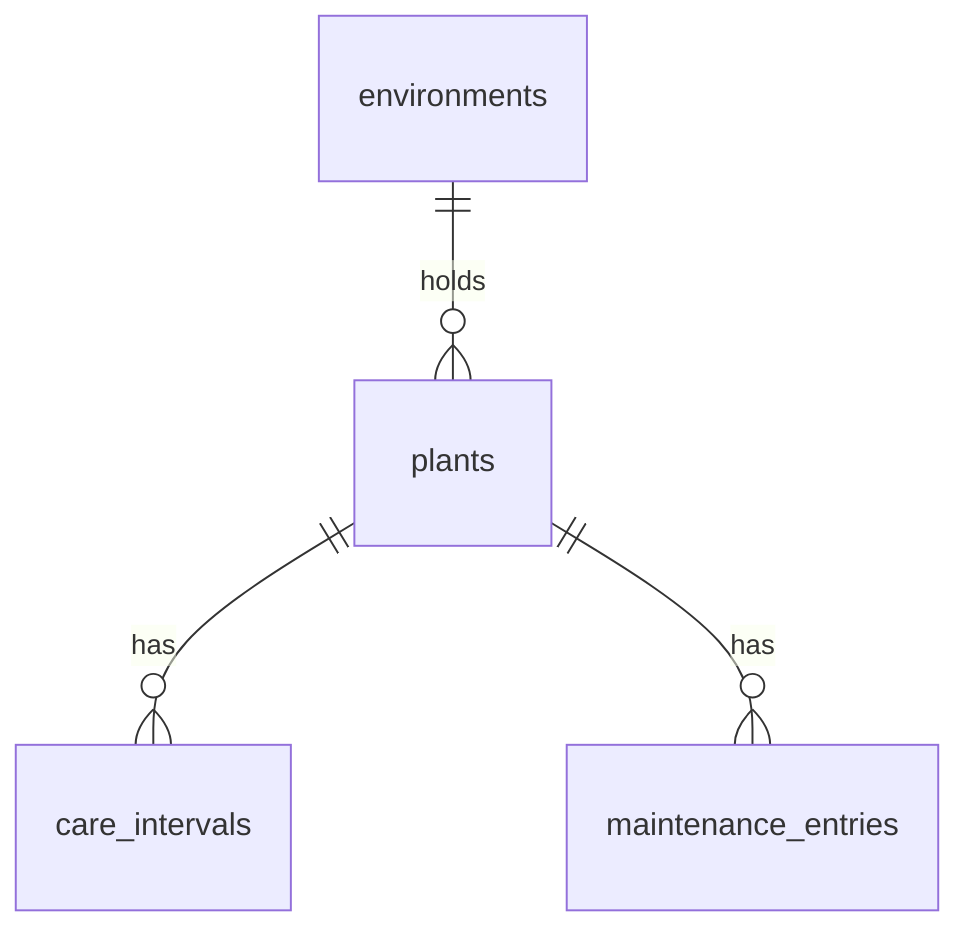
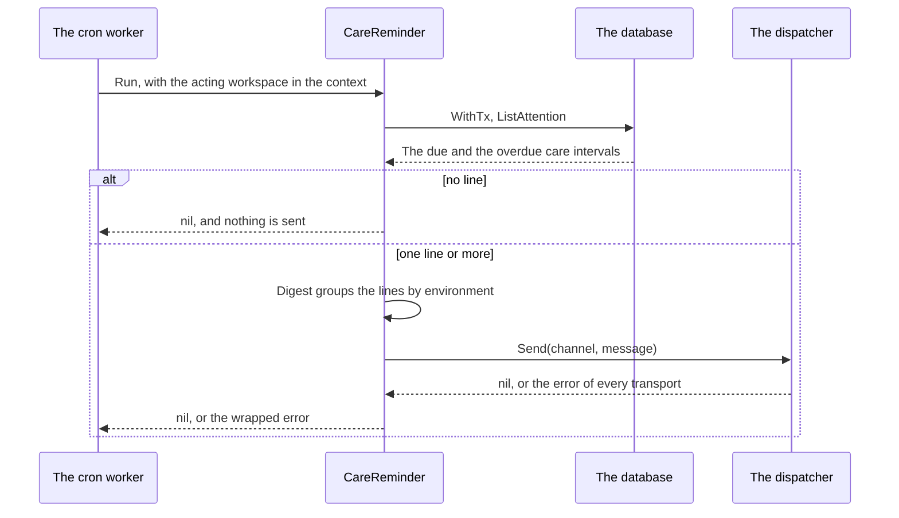

# Specification: The plants of a workspace, their environments, and their care

`spec-scenarios.md` holds the scenarios. `api.yaml` holds the bodies and the status
codes of every route.

## 1. Summary

The jasmine plugin drops its two tables and creates four scoped tables: the
environments, the plants, the care intervals, and the maintenance entries. A fifth
table holds the counter of the display identifiers. A cron job for each workspace
sends one reminder to one channel of the installation. The remote gets four pages.

## 2. Coverage

| Requirement       | Where this specification realizes it                      |
| ----------------- | --------------------------------------------------------- |
| `GARDEN-FR-001`   | Section 4.3, `GARDEN-SC-001`                              |
| `GARDEN-FR-002`   | Section 4.2, 4.5, `GARDEN-DD-004`, `GARDEN-SC-002`        |
| `GARDEN-FR-003`   | Section 4.3, `GARDEN-DD-007`, `GARDEN-SC-003`, `GARDEN-SC-004` |
| `GARDEN-FR-004`   | Section 4.3, `GARDEN-SC-005`                              |
| `GARDEN-FR-005`   | Section 4.2, `GARDEN-SC-006`                              |
| `GARDEN-FR-006`   | Section 4.2, `GARDEN-SC-007`                              |
| `GARDEN-FR-007`   | Section 4.2, `GARDEN-DD-002`, `GARDEN-SC-008`, `GARDEN-SC-009` |
| `GARDEN-FR-008`   | `GARDEN-DD-002`, `GARDEN-SC-010`                          |
| `GARDEN-FR-009`   | `GARDEN-DD-003`, `GARDEN-SC-011`                          |
| `GARDEN-FR-010`   | Section 4.3, 4.6, `GARDEN-SC-031`                         |
| `GARDEN-FR-011`   | Section 4.2, `GARDEN-SC-012`                              |
| `GARDEN-FR-012`   | Section 4.3, `GARDEN-DD-006`, `GARDEN-SC-013`, `GARDEN-SC-014` |
| `GARDEN-FR-013`   | `GARDEN-DD-006`, `GARDEN-SC-015`, `GARDEN-SC-016`         |
| `GARDEN-FR-014`   | Section 4.6, `GARDEN-SC-017`                              |
| `GARDEN-FR-015`   | Section 4.3, `GARDEN-SC-018`                              |
| `GARDEN-FR-016`   | Section 4.3, `GARDEN-SC-018`                              |
| `GARDEN-FR-017`   | `GARDEN-SC-019`                                           |
| `GARDEN-FR-018`   | Section 4.3, `GARDEN-SC-020`                              |
| `GARDEN-FR-019`   | `GARDEN-DD-005`, `GARDEN-SC-021`                          |
| `GARDEN-FR-020`   | `GARDEN-DD-005`, `GARDEN-SC-022`                          |
| `GARDEN-FR-021`   | `GARDEN-DD-005`, `GARDEN-SC-023`, `GARDEN-SC-024`         |
| `GARDEN-FR-022`   | Section 4.3, 4.6, `GARDEN-DD-008`, `GARDEN-SC-025`, `GARDEN-SC-031` |
| `GARDEN-FR-023`   | Section 4.3, `GARDEN-SC-026`                              |
| `GARDEN-FR-024`   | Section 4.6, `GARDEN-SC-031`                              |
| `GARDEN-FR-025`   | Section 4.3, `GARDEN-DD-009`                              |
| `GARDEN-FR-026`   | Section 4.3, 4.4, `GARDEN-SC-027`, `GARDEN-SC-028`        |
| `GARDEN-FR-028`   | Section 4.4, `GARDEN-SC-029`                              |
| `GARDEN-FR-031`   | Section 4.2, `GARDEN-DD-001`                              |
| `GARDEN-FR-032`   | Section 4.4, `GARDEN-SC-027`                              |
| `GARDEN-NFR-001`  | Section 4.2, `GARDEN-SC-032`                              |
| `GARDEN-NFR-002`  | `GARDEN-SC-033`                                           |
| `GARDEN-INV-001`  | Section 4.2, `GARDEN-DD-002`, `GARDEN-SC-010`             |
| `GARDEN-INV-002`  | Section 4.2, `GARDEN-DD-004`, `GARDEN-SC-030`             |
| `GARDEN-INV-003`  | Section 4.2, `GARDEN-SC-020`                              |

## 3. Guideline compliance

| Rule                 | Guideline     | How this specification obeys it |
| -------------------- | ------------- | ------------------------------- |
| `OWN-004`, `OWN-005`, `OWN-006` | Ownership | Every new table carries `workspace_id` and a forced policy. Section 4.2. |
| `OWN-008`            | Ownership     | No repository filters on `workspace_id` or sets it. |
| `OWN-009`            | Ownership     | The reminder declares `CronScopePerWorkspace`. Section 4.3. |
| `DAT-005`, `DAT-006` | Data          | One migration pair in `plugins/jasmine/db/migrations/`. |
| `DAT-009`            | Data          | Every table has `id UUID DEFAULT uuidv7()`. No insert names `id`. |
| `DAT-010`            | Data          | `performed_at`, `set_at`, and every `updated_at` are `TIMESTAMPTZ`. |
| `REP-002`, `REP-003`, `REP-004` | Repository | One repository for each entity. Each takes `*sqlx.Tx`. |
| `SEC-013`            | Security      | Every route names one of six permissions. Section 4.3. |
| `RES-005`, `RES-006` | REST          | Every collection answers a page. `GARDEN-DD-008`. |
| `API-007`            | HTTP API      | A record answers `ETag`. A write reads `If-Match`. A create reads `Idempotency-Key` through the hub. |
| `ERR-002`            | Errors        | `/problems/dev.maroid.jasmine/environment-occupied`. Section 4.5. |
| `NTF-002`            | Notifications | The job names the channel of the configuration. |
| `CFG-006`, `CFG-007` | Configuration | `config.Config` decodes the map. Requirements question 2 accepts one channel for the installation. |
| `PKG-001`            | Package layout | `config/`, `job/` are new directories. |
| `UI-005`, `UI-007`, `UI-008` | Web UI | Four routes. The pages call `host.api` and read `host.can`. |
| `TS-002`             | Frontend style | Every component uses runes. |

## 4. Design

### 4.1 Components

Every path is under `plugins/jasmine/`.

| Path                                   | Action | Holds |
| -------------------------------------- | ------ | ----- |
| `main.go`                              | change | Decode `config.Config`. Get `Host.Notifier()`. Add `pluginapi.CronPlugin`. Add two permissions, the new routes, and the UI routes of section 4.6. |
| `config/config.go`, `config/doc.go`    | create | `Config`, `CronSchedule`, `Notification`. Section 4.3. |
| `permission/permission.go`             | change | Add `MaintenanceRead = "maintenance.read"`, `MaintenanceWrite = "maintenance.write"`. |
| `errs/errs.go`                         | change | Add `ErrEnvironmentOccupied`, `ErrPlantUnknown`, `ErrUnknownMaintenanceType`, `ErrUnknownPlantStatus`. |
| `model/display_id.go`                  | create | `FormatDisplayID(prefix rune, number int) string`. Constants `PrefixEnvironment = 'E'`, `PrefixPlant = 'P'`. |
| `model/environment.go`                 | change | `Environment{ID, Number, Name, ActivePlantCount, CreatedAt, UpdatedAt}`. |
| `model/plant.go`                       | change | `Plant{ID, Number, CommonName, ScientificName, EnvironmentID, EnvironmentNumber, EnvironmentName, AcquiredOn, CareNotes, Status, CreatedAt, UpdatedAt}`. |
| `model/plant_status.go`                | create | `PlantStatus` with `active`, `inactive`, and `ParsePlantStatus`. |
| `model/maintenance_type.go`            | create | `MaintenanceType` with the eight values of `GARDEN-FR-011` in that order, `MaintenanceTypes()`, and `ParseMaintenanceType`. |
| `model/maintenance_entry.go`           | create | `MaintenanceEntry{ID, PlantID, PlantNumber, PlantCommonName, Type, PerformedAt, Note, CreatedAt, UpdatedAt}`. |
| `model/care_interval.go`               | create | `CareInterval` with the columns of section 4.2 and the read values `LastPerformedAt`, `CountedFrom`, `DaysSince`, `State`. `CareState` with `on_schedule`, `due`, `overdue`. |
| `repository/counter.go`                | create | `CounterRepository.Next(ctx, kind CounterKind) (int, error)`. |
| `repository/environment.go`            | change | Insert takes the number. List and `GetByID` read `active_plant_count`. Delete maps `23503` to `errs.ErrEnvironmentOccupied`. |
| `repository/plant.go`                  | change | The new columns. `List(ctx, seek, filter PlantFilter)`. `Lock(ctx, ids []string) ([]string, error)` for `GARDEN-DD-006`. |
| `repository/care_interval.go`          | create | `Put`, `Delete`, `ListForPlant`, `List(ctx, seek, filter CareIntervalFilter)`, `ListAttention(ctx)`. Section 4.2 gives the state query. |
| `repository/maintenance_entry.go`      | create | `InsertMany`, `GetByID`, `List(ctx, seek, order, filter)`, `Update`, `Delete`. |
| `dto/*.go`                             | change, create | One request and one response for each resource of `api.yaml`. |
| `handler/body.go`                      | create | `decodeBody` that refuses an unknown member with `member-unknown`. It replaces `render.Bind`. |
| `handler/environment.go`, `handler/plant.go` | change | The new members and filters. |
| `handler/care_interval.go`, `handler/maintenance_entry.go` | create | The routes of section 4.3. |
| `handler/problem.go`                   | change | `writeEnvironmentOccupied`, and the details for `oneof`, `unique`, `lte`, and `dive`. |
| `job/care_reminder.go`, `job/digest.go`, `job/doc.go` | create | `CareReminder` and the text of the reminder. Section 4.4. |
| `db/migrations/20261010120000_tables_garden_scope_to_workspace.{up,down}.sql` | create | Section 4.2. |
| `ui/src/api/*.ts`                      | change, create | A client for each resource. |
| `ui/src/pages/**`                      | change, create | Section 4.6. |
| `mqtt/subscriber/measurement.go`, `repository/measurement.go`, `model/source_type.go` | no change | Section 8. |

### 4.2 Data model

| Table                  | Schema               | Scope  | Migration                                              | Realizes |
| ---------------------- | -------------------- | ------ | ------------------------------------------------------ | -------- |
| `display_counters`     | `dev_maroid_jasmine` | scoped | `20261010120000_tables_garden_scope_to_workspace.up.sql` | `GARDEN-FR-007`, `GARDEN-FR-008`, `GARDEN-INV-001` |
| `environments`         | `dev_maroid_jasmine` | scoped | same                                                   | `GARDEN-FR-001`, `GARDEN-FR-002`, `GARDEN-FR-031` |
| `plants`               | `dev_maroid_jasmine` | scoped | same                                                   | `GARDEN-FR-003` to `GARDEN-FR-006`, `GARDEN-INV-002` |
| `care_intervals`       | `dev_maroid_jasmine` | scoped | same                                                   | `GARDEN-FR-018` to `GARDEN-FR-021`, `GARDEN-INV-003` |
| `maintenance_entries`  | `dev_maroid_jasmine` | scoped | same                                                   | `GARDEN-FR-011` to `GARDEN-FR-017` |

The migration drops `plants`, then `environments`, and creates the five tables. It
does not touch `measurements` or the type `source_type`. The down migration drops
the five tables and creates the two old tables again, empty.

Every table carries `id UUID NOT NULL PRIMARY KEY DEFAULT uuidv7()`, the column of
`OWN-005`, the two statements and the policy `<table>_workspace_isolation` of
`OWN-006`. Every table except `display_counters` carries `created_at` and
`updated_at`, both `TIMESTAMPTZ NOT NULL DEFAULT now()`, and the trigger
`set_updated_at`.

| Table                 | Column            | Type          | Rule |
| --------------------- | ----------------- | ------------- | ---- |
| `display_counters`    | `kind`            | `TEXT`        | `CHECK (kind IN ('environment', 'plant'))` |
|                       | `last_number`     | `INTEGER`     | `NOT NULL CHECK (last_number > 0)` |
| `environments`        | `number`          | `INTEGER`     | `NOT NULL CHECK (number > 0)` |
|                       | `name`            | `TEXT`        | `NOT NULL CHECK (char_length(name) BETWEEN 1 AND 100)` |
| `plants`              | `number`          | `INTEGER`     | `NOT NULL CHECK (number > 0)` |
|                       | `environment_id`  | `UUID`        | `NOT NULL` |
|                       | `common_name`     | `TEXT`        | `NOT NULL`, 1 to 100 characters |
|                       | `scientific_name` | `TEXT`        | Null, or 1 to 150 characters |
|                       | `acquired_on`     | `DATE`        | Null |
|                       | `care_notes`      | `TEXT`        | Null, or 1 to 10000 characters |
|                       | `status`          | `TEXT`        | `NOT NULL DEFAULT 'active' CHECK (status IN ('active', 'inactive'))` |
| `care_intervals`      | `plant_id`        | `UUID`        | `NOT NULL` |
|                       | `type`            | `TEXT`        | `NOT NULL`, one of the eight values of `MaintenanceType` |
|                       | `days`            | `SMALLINT`    | `NOT NULL CHECK (days BETWEEN 1 AND 365)` |
|                       | `set_at`          | `TIMESTAMPTZ` | `NOT NULL DEFAULT now()` |
| `maintenance_entries` | `plant_id`        | `UUID`        | `NOT NULL` |
|                       | `type`            | `TEXT`        | `NOT NULL`, one of the eight values |
|                       | `performed_at`    | `TIMESTAMPTZ` | `NOT NULL` |
|                       | `note`            | `TEXT`        | Null, or 1 to 1000 characters |

The wire and the column hold the type as `watering`, `fertilizing`, `pruning`,
`repotting`, `pest_treatment`, `cleaning`, `misting`, `other`.

| Constraint or index                                                         | Enforces |
| --------------------------------------------------------------------------- | -------- |
| `display_counters UNIQUE (workspace_id, kind)`                              | One counter for each kind. |
| `environments UNIQUE (workspace_id, number)`, `plants UNIQUE (workspace_id, number)` | `GARDEN-INV-001` |
| `environments UNIQUE (workspace_id, id)`, `plants UNIQUE (workspace_id, id)` | The target of the keys below. |
| `plants FOREIGN KEY (workspace_id, environment_id) REFERENCES environments (workspace_id, id) ON DELETE RESTRICT` | `GARDEN-FR-002`, `GARDEN-INV-002` |
| `care_intervals FOREIGN KEY (workspace_id, plant_id) REFERENCES plants (workspace_id, id) ON DELETE CASCADE` | `GARDEN-FR-006`, `GARDEN-INV-002` |
| `maintenance_entries FOREIGN KEY (workspace_id, plant_id) REFERENCES plants (workspace_id, id) ON DELETE CASCADE` | `GARDEN-FR-006`, `GARDEN-INV-002` |
| `care_intervals UNIQUE (workspace_id, plant_id, type)`                      | `GARDEN-INV-003` |
| `plants INDEX (workspace_id, environment_id)`                               | The filter of the plant list. |
| `maintenance_entries INDEX (workspace_id, plant_id, type, performed_at DESC)` | The latest entry of a care interval. `GARDEN-NFR-001`. |
| `maintenance_entries INDEX (workspace_id, performed_at DESC, id DESC)`      | The maintenance log. |



**The state query.** `CareInterval` reads every care interval with this projection.
The pagination and the filters wrap it.

```sql
SELECT ci.id, ci.plant_id, ci.type, ci.days, ci.set_at, ci.updated_at,
       p.number AS plant_number, p.common_name, p.status AS plant_status,
       e.id AS environment_id, e.number AS environment_number, e.name AS environment_name,
       latest.performed_at AS last_performed_at,
       (COALESCE(latest.performed_at, ci.set_at) AT TIME ZONE 'UTC')::date AS counted_from,
       (now() AT TIME ZONE 'UTC')::date
         - (COALESCE(latest.performed_at, ci.set_at) AT TIME ZONE 'UTC')::date AS days_since
FROM care_intervals ci
JOIN plants p ON p.id = ci.plant_id
JOIN environments e ON e.id = p.environment_id
LEFT JOIN LATERAL (
    SELECT m.performed_at FROM maintenance_entries m
    WHERE m.plant_id = ci.plant_id AND m.type = ci.type
    ORDER BY m.performed_at DESC LIMIT 1
) latest ON true
```

The state follows from `days_since` and `days`, in this order:

| Condition                         | `state`       |
| --------------------------------- | ------------- |
| `plant_status <> 'active'`        | null          |
| `2 * days_since > 3 * days`       | `overdue`     |
| `days_since >= days`              | `due`         |
| otherwise                         | `on_schedule` |

The query computes the state in a `CASE`, so a filter on it runs in the database.

### 4.3 Declarations

**HTTP routes.** Every path is under `/workspaces/{workspaceId}/plugins/dev.maroid.jasmine/api`.
The access of every route is "Member, enabled". `api.yaml` holds the bodies.

| Method   | Path                                     | Permission           | Realizes |
| -------- | ---------------------------------------- | -------------------- | -------- |
| `GET`    | `/environments`                          | `environments.read`  | `GARDEN-FR-010`, `GARDEN-FR-022` |
| `POST`   | `/environments`                          | `environments.write` | `GARDEN-FR-001`, `GARDEN-FR-007` |
| `GET`    | `/environments/{id}`                     | `environments.read`  | `GARDEN-FR-010` |
| `PUT`    | `/environments/{id}`                     | `environments.write` | `GARDEN-FR-001`, `GARDEN-FR-009` |
| `DELETE` | `/environments/{id}`                     | `environments.write` | `GARDEN-FR-001`, `GARDEN-FR-002` |
| `GET`    | `/plants`                                | `plants.read`        | `GARDEN-FR-022` |
| `POST`   | `/plants`                                | `plants.write`       | `GARDEN-FR-003`, `GARDEN-FR-005`, `GARDEN-FR-007` |
| `GET`    | `/plants/{id}`                           | `plants.read`        | `GARDEN-FR-022` |
| `PUT`    | `/plants/{id}`                           | `plants.write`       | `GARDEN-FR-004`, `GARDEN-FR-005`, `GARDEN-FR-009` |
| `DELETE` | `/plants/{id}`                           | `plants.write`       | `GARDEN-FR-006` |
| `GET`    | `/plants/{plantId}/care-intervals`       | `plants.read`        | `GARDEN-FR-022` |
| `PUT`    | `/plants/{plantId}/care-intervals/{type}` | `plants.write`      | `GARDEN-FR-018` |
| `DELETE` | `/plants/{plantId}/care-intervals/{type}` | `plants.write`      | `GARDEN-FR-018` |
| `GET`    | `/care-intervals`                        | `plants.read`        | `GARDEN-FR-021`, `GARDEN-FR-022`, `GARDEN-FR-023` |
| `GET`    | `/maintenance-entries`                   | `maintenance.read`   | `GARDEN-FR-022` |
| `POST`   | `/maintenance-entries`                   | `maintenance.write`  | `GARDEN-FR-012`, `GARDEN-FR-013`, `GARDEN-FR-014`, `GARDEN-FR-017` |
| `GET`    | `/maintenance-entries/{id}`              | `maintenance.read`   | `GARDEN-FR-015` |
| `PUT`    | `/maintenance-entries/{id}`              | `maintenance.write`  | `GARDEN-FR-015` |
| `DELETE` | `/maintenance-entries/{id}`              | `maintenance.write`  | `GARDEN-FR-016` |

`main.go` declares `maintenance.read` with the lowest role viewer, and
`maintenance.write` with the lowest role editor. The four existing permissions stay.

**Cron jobs.**

| Identifier      | Schedule                              | Runs in        | Behavior | Realizes |
| --------------- | ------------------------------------- | -------------- | -------- | -------- |
| `care_reminder` | `cron_schedule.care_reminder`, in UTC | Each workspace | Section 4.4 | `GARDEN-FR-026`, `GARDEN-FR-028`, `GARDEN-FR-032` |

**Notification channel.**

| Channel                                       | Sent when | Realizes |
| --------------------------------------------- | --------- | -------- |
| The value of `notification.care_reminder_channel` | A run finds a due or overdue care interval. | `GARDEN-FR-026` |

**Configuration scheme.** The keys are under `plugins[].config` of the jasmine entry.

| Key                                  | Type   | Default     | Secret | Realizes |
| ------------------------------------ | ------ | ----------- | ------ | -------- |
| `cron_schedule.care_reminder`        | string, `validate:"cron"` | `0 9 * * *` | No | `GARDEN-FR-025` |
| `notification.care_reminder_channel` | string | empty       | No     | `GARDEN-FR-025`, `GARDEN-DD-009` |

### 4.4 Flow

The reminder:



`ListAttention` answers every care interval whose state is `due` or `overdue`. The
order is the environment number, then `overdue` before `due`, then the plant number,
then the order of `MaintenanceTypes()`.

The title of the message is `Plant care due`. The body holds one block for each
environment. A block starts with `E001 Office`. Each line has the form
`P003 Gardenia: watering, 9 days, every 7 days, overdue`. The message has no
attachment.

A failed send returns `fmt.Errorf("sending the care reminder: %w", err)`. `JOB-007`
logs it, and the next run computes the lines again. The job keeps no record of a
send. `GARDEN-FR-028`.

### 4.5 Errors

| Condition | Behavior | Problem type |
| --------- | -------- | ------------ |
| A body names a member that the schema does not declare, `display_id` among them. | 400 | `/problems/http/member-unknown` |
| A body breaks a rule of `api.yaml`. | 422, one item for each field | `/problems/http/validation-failed` |
| `performed_at` is after the current time of the hub. | 422, pointer `#/performed_at` | `/problems/http/validation-failed` |
| `acquired_on` is after the UTC date of tomorrow. | 422, pointer `#/acquired_on` | `/problems/http/validation-failed` |
| `environment_id` names no environment of the workspace. | 422, pointer `#/environment_id` | `/problems/http/validation-failed` |
| An item of `plant_ids` names no plant of the workspace. | 422, pointer `#/plant_ids/<index>`. No entry lands. | `/problems/http/validation-failed` |
| `{type}` of a path is not a maintenance type. | 404 | `/problems/http/not-found` |
| The environment holds a plant. | 409, the detail names the count of plants | `/problems/dev.maroid.jasmine/environment-occupied` |
| The record changed after the read. | 412 | `/problems/http/precondition-failed` |
| The record is absent, or of another workspace. | 404 | `/problems/http/not-found` |
| The boundary row of a cursor of the maintenance log is gone. | 200, an empty page with `first` | none |

### 4.6 The pages of the remote

| Route         | Label            | Shows | Realizes |
| ------------- | ---------------- | ----- | -------- |
| `/attention`  | Needs attention  | Every page of `GET /care-intervals?state=due,overdue`, grouped by environment, overdue first. Each line has a "Done" button that posts one entry with no `performed_at`. | `GARDEN-FR-014`, `GARDEN-FR-022`, `GARDEN-FR-023` |
| `/plants`     | Plants           | The plant list with the two filters and a checkbox on each line. A form for the selection posts one entry for each plant. A form adds a plant. A line opens the plant view in the same page: the values, the form to change them, the care intervals with their state, and the entries of the plant. | `GARDEN-FR-003` to `GARDEN-FR-006`, `GARDEN-FR-013`, `GARDEN-FR-018`, `GARDEN-FR-022` |
| `/environments` | Environments   | The list with the count of active plants. A form adds, renames, and deletes. | `GARDEN-FR-001`, `GARDEN-FR-022` |
| `/maintenance` | Maintenance log | The entries, newest first, with a filter by plant and by type. A line changes or deletes the entry. | `GARDEN-FR-015`, `GARDEN-FR-016`, `GARDEN-FR-022` |

The route `/environments/add` goes. Every page shows `display_id` before each name.
A page renders a `date-time` value with `toLocaleString()` in the zone of the
browser. It renders `acquired_on` as the date it holds, with no conversion. A page
shows a control that writes only when `host.can` holds its permission.

## 5. Design decisions

### `GARDEN-DD-001`

**Realizes:** `GARDEN-FR-031`
**Decision:** One migration drops `plants` and `environments` and creates every new table. It leaves `measurements` untouched.
**Rationale:** The two tables hold test data with no workspace. The owner keeps the measurements out of this feature.
**Alternatives:** Keep the rows in one workspace. The owner refused it.

### `GARDEN-DD-002`

**Realizes:** `GARDEN-FR-007`, `GARDEN-FR-008`, `GARDEN-INV-001`
**Decision:** The row stores the integer `number`. `display_counters` holds the last number of each kind. A create runs `INSERT INTO display_counters (kind, last_number) VALUES ($1, 1) ON CONFLICT (workspace_id, kind) DO UPDATE SET last_number = display_counters.last_number + 1 RETURNING last_number` in the transaction of the insert. `FormatDisplayID` renders `%c%03d`.
**Rationale:** The counter row lock orders two creates in one workspace. A delete never lowers the counter. The unique constraint on `(workspace_id, number)` catches a defect in the counter.
**Alternatives:** The highest number plus one. It gives `P015` again after the delete of `P015`. A database sequence for each workspace. It needs DDL at each workspace create, which the plugin cannot see.

### `GARDEN-DD-003`

**Realizes:** `GARDEN-FR-009`
**Decision:** A response carries `display_id`. No request schema declares it, and `decodeBody` refuses an unknown member.
**Rationale:** A client learns that the value is not writable. A silent drop hides it.
**Alternatives:** Ignore the member. `render.Bind` does that today, and a client never learns.

### `GARDEN-DD-004`

**Realizes:** `GARDEN-FR-002`, `GARDEN-INV-002`
**Decision:** Each reference is a composite foreign key on `(workspace_id, <id>)`.
**Rationale:** A foreign key check ignores the row level policy, so a key on `id` alone accepts the identifier of another workspace. The composite key refuses it in the database.
**Alternatives:** A check in the handler. A second writer can skip it.

### `GARDEN-DD-005`

**Realizes:** `GARDEN-FR-019`, `GARDEN-FR-020`, `GARDEN-FR-021`
**Decision:** The query of section 4.2 counts the days. `set_at` changes only when `days` changes: the upsert writes `set_at = now()` under `WHERE care_intervals.days IS DISTINCT FROM EXCLUDED.days`. The state compares whole numbers.
**Rationale:** `2 * days_since > 3 * days` holds the 1.5 bound with no fraction. A save with the same days does not restart the count.
**Alternatives:** `updated_at` as the start. Every save restarts it. A state that Go computes. A filter on the state then reads every row.

### `GARDEN-DD-006`

**Realizes:** `GARDEN-FR-012`, `GARDEN-FR-013`, `GARDEN-FR-014`
**Decision:** One route takes `plant_ids` with 1 to 100 unique items. The handler runs `Plant.Lock` (`SELECT id FROM plants WHERE id = ANY($1) FOR SHARE`) and `InsertMany` in one transaction. An absent `performed_at` takes `now()` of the hub. The answer is 201 with `{"items": [...]}` in the order of `plant_ids`.
**Rationale:** One form, one button, and one plant are the same call. The lock stops a delete between the check and the insert, so the batch is whole or absent.
**Alternatives:** One request for each plant. A failure in the middle leaves half the batch. A batch resource of its own. It adds a path for no new behavior.

### `GARDEN-DD-007`

**Realizes:** `GARDEN-FR-003`
**Decision:** `acquired_on` is a `date` with no zone. The hub refuses a date after the UTC date of tomorrow.
**Rationale:** The browser of the owner runs at UTC+4. Between 00:00 and 04:00 local time, its date is one day after the UTC date. One day of margin accepts it.
**Alternatives:** A strict UTC check. It refuses today in that window.

### `GARDEN-DD-008`

**Realizes:** `GARDEN-FR-022`
**Decision:** `GET /care-intervals` is a page sorted by `id`, with the filters `state` (a comma list) and `environment_id`. The page `/attention` reads every page and groups the lines. `GET /maintenance-entries` declares the sort field `performed_at`, and `-performed_at` is its default. The repository reads the boundary row by `id` and compares `(performed_at, id)`. `GET /plants/{plantId}/care-intervals` is bounded.
**Rationale:** `libs/rest/page` seeks by `id` alone, and the subquery gives the second sort with no change to the library. A plant holds at most eight care intervals.
**Alternatives:** A singular resource for the attention list. `RES-002` holds no deviation for it. A change to `libs/rest/page`. It changes every plugin.

### `GARDEN-DD-009`

**Realizes:** `GARDEN-FR-025`
**Decision:** `CronJobs()` returns no job when `care_reminder_channel` is empty.
**Rationale:** An installation with no channel loads the plugin and sends nothing. A run that cannot send never starts.
**Alternatives:** Make the channel required. Every installation must then name a channel before the plugin loads.

### `GARDEN-DD-010`

**Realizes:** `GARDEN-FR-022`
**Decision:** The plant view lives in the page `/plants`, and the page holds the selected plant in its state.
**Rationale:** `loadPluginMount` matches a route by its exact path, so a remote has no route with a parameter. A deep link to one plant needs a change to the deck and to `UI-005`.
**Alternatives:** A route with a parameter. It needs an ADR and a change to the deck.

## 6. Scenarios

`spec-scenarios.md` holds every scenario. `SPC-001`.

## 7. Build plan

| #   | Step | Realizes | Done |
| --- | ---- | -------- | ---- |
| 1   | The migration pair, and the integration test of every constraint. | `GARDEN-FR-031`, `GARDEN-INV-001` to `GARDEN-INV-003` | [ ] |
| 2   | `model/`, `errs/`, `permission/`, `config/`. | `GARDEN-FR-011`, `GARDEN-FR-025` | [ ] |
| 3   | `repository/counter.go`, `environment.go`, `plant.go`, with their tests. | `GARDEN-FR-001` to `GARDEN-FR-009` | [ ] |
| 4   | `repository/care_interval.go`, `maintenance_entry.go`, with the state tests. | `GARDEN-FR-012` to `GARDEN-FR-021` | [ ] |
| 5   | `handler/body.go`, the DTOs, and the handlers. `api.yaml` matches. | `GARDEN-FR-001` to `GARDEN-FR-023` | [ ] |
| 6   | `job/`, and the wiring in `main.go`. | `GARDEN-FR-025`, `GARDEN-FR-026`, `GARDEN-FR-028`, `GARDEN-FR-032` | [ ] |
| 7   | The remote: the API clients and the four pages. Build it before the `.so`. `BLD-003`. | `GARDEN-FR-010`, `GARDEN-FR-014`, `GARDEN-FR-022` to `GARDEN-FR-024` | [ ] |
| 8   | The two measurements of `GARDEN-NFR-001` and `GARDEN-NFR-002`. | `GARDEN-NFR-001`, `GARDEN-NFR-002` | [ ] |

## 8. Out of scope for this specification

- The measurements. The subscriber and its table stay as they are. After the
  migration, `GetByID` runs with no acting workspace and finds no plant, so the
  subscriber refuses every reading. A later feature gives a device message an
  acting workspace.
- A link to one plant. `GARDEN-DD-010` gives the reason.

## Retired identifiers

This file has no retired identifier.
