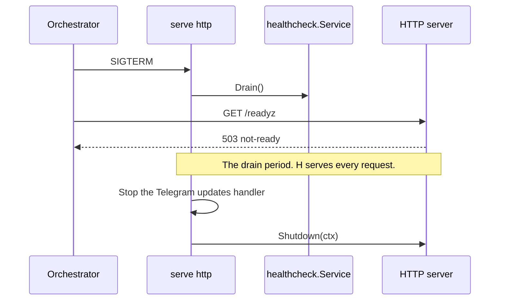

# Specification: The health of the hub

## 1. Summary

The hub answers `GET /livez` and `GET /readyz`. `hellofresh/health-go` measures
the liveness and the readiness, and the handler maps each measurement to an
answer: the body of the library on a success, and the problem `not-ready` with
the names of the failed dependencies on a failure. At the start of a shutdown
the readiness answers 503, and the listener stays open for the drain period.

## 2. Coverage

| Requirement       | Where this specification realizes it                              |
| ----------------- | ----------------------------------------------------------------- |
| `HEALTH-FR-001`   | Section 4.3, `HEALTH-DD-002`, `HEALTH-SC-001`                      |
| `HEALTH-FR-002`   | `HEALTH-DD-002`, `HEALTH-SC-002`                                   |
| `HEALTH-FR-003`   | Section 4.3, `HEALTH-DD-003`, `HEALTH-SC-003`                      |
| `HEALTH-FR-004`   | Section 4.5, `HEALTH-DD-004`, `HEALTH-SC-004`, `HEALTH-SC-005`     |
| `HEALTH-FR-005`   | `HEALTH-DD-005`, `HEALTH-SC-006`                                   |
| `HEALTH-FR-006`   | `HEALTH-DD-005`, `HEALTH-SC-007`                                   |
| `HEALTH-FR-007`   | Section 4.5, `HEALTH-DD-004`, `HEALTH-DD-006`, `HEALTH-DD-010`, `HEALTH-SC-008`, `HEALTH-SC-016`, `HEALTH-SC-019` |
| `HEALTH-FR-008`   | `HEALTH-DD-004`, `HEALTH-DD-011`, `HEALTH-SC-009`, `HEALTH-SC-018` |
| `HEALTH-FR-009`   | Section 4.3, `HEALTH-DD-001`, `HEALTH-SC-010`                      |
| `HEALTH-FR-010`   | Section 4.4, `HEALTH-DD-007`, `HEALTH-SC-011`                      |
| `HEALTH-FR-011`   | Section 4.4, `HEALTH-DD-007`, `HEALTH-SC-012`                      |
| `HEALTH-FR-012`   | `HEALTH-DD-009`, `HEALTH-SC-013`                                   |
| `HEALTH-NFR-001`  | `HEALTH-DD-008`, `HEALTH-SC-005`                                   |
| `HEALTH-NFR-002`  | `HEALTH-DD-002`, `HEALTH-SC-014`                                   |
| `HEALTH-NFR-003`  | Section 4.3, `HEALTH-DD-007`, `HEALTH-SC-012`, `HEALTH-SC-015`     |
| `HEALTH-INV-001`  | `HEALTH-DD-002`, `HEALTH-SC-002`                                   |

## 3. Guideline compliance

| Rule      | Guideline     | How this specification obeys it                                                   |
| --------- | ------------- | --------------------------------------------------------------------------------- |
| `API-002` | HTTP API      | The probe routes pass the full chain. `HEALTH-DD-009` changes one option of the access log. |
| `API-003` | HTTP API      | Section 4.3 gives the two routes that the table holds, both public.               |
| `API-005` | HTTP API      | `handler.Health` implements `handler.Handler`.                                    |
| `API-007` | HTTP API      | The chain sets `X-Flow-ID` and `Cache-Control`. No route overrides either.        |
| `ERR-001` | Errors        | `HEALTH-DD-004`. A failed readiness is a problem with the media type of the rule. |
| `ERR-003` | Errors        | `HEALTH-DD-006`. `not-ready` lives in `apps/hub/internal/domain/problems`.        |
| `ERR-004` | Errors        | `HEALTH-DD-010`. `dependencies` and `errors` are two extensions of one mechanism. |
| `ERR-005` | Errors        | The `detail` of a drain is one constant sentence.                                 |
| `RES-001` | REST          | `HEALTH-DD-003`. The handler writes the timestamp in UTC with the `Z` suffix.     |
| `RES-002` | REST          | The `Z-134` and `Z-104` rows name `livez` and `readyz`.                           |
| `RES-007` | REST          | `api.yaml` feeds `hub.yaml`.                                                      |
| `LOG-005` | Logging       | `HEALTH-DD-011`. The text of a failure is the attribute `error`, never the message. |
| `LOG-006` | Logging       | `HEALTH-DD-011`. The record takes the context of the request, so it carries `flow_id`. |
| `LOG-007` | Logging       | `HEALTH-DD-011`. The message is the constant `dependency check failed`.           |
| `LOG-008` | Logging       | The log of a failure holds the error of the check, which carries no password.     |
| `LOG-010` | Logging       | `HEALTH-DD-009` sets `Skip` as the rule gives it.                                 |
| `LIF-005` | Lifecycle     | Section 4.4. The drain is the first step of the reverse order.                    |
| `LIF-006` | Lifecycle     | The drain runs inside a shutdown step. `HEALTH-DD-007` bounds it at 10 seconds.   |
| `CFG-003` | Configuration | Section 4.3. `server.drain_period` carries a `default` and a `validate` tag.      |
| `DEP-005` | Dependencies  | `HealthService` exists. Its build can fail, so it holds `mu` and resets `once`.   |
| `GO-007`  | Go style      | `var _ Checker = (*Service)(nil)`.                                                |
| `GO-009`  | Go style      | `healthcheck.New` returns `*Service`.                                             |
| `TST-004` | Testing       | Section 6 gives a layer for each scenario.                                        |
| `BLD-004` | Build         | `HEALTH-DD-010` changes `libs/rest`. Step 1 of section 7 builds and loads every plugin. |

## 4. Design

### 4.1 Components

| Path                                              | Action | Holds                                                           |
| ------------------------------------------------- | ------ | --------------------------------------------------------------- |
| `apps/hub/internal/healthcheck/doc.go`            | keep   | The package comment.                                            |
| `apps/hub/internal/healthcheck/service.go`        | change | `Checker`, `Service`, `New`, `Drain`, the path constants, the name and the version of the component. |
| `apps/hub/internal/healthcheck/postgres.go`       | change | The check `database`. It wraps the error as `pinging the database: %w`. |
| `apps/hub/internal/healthcheck/idp.go`            | keep   | The check `idp`.                                                |
| `apps/hub/internal/healthcheck/openbao.go`        | change | The check `secret-store`.                                       |
| `apps/hub/internal/handler/health.go`             | change | The two routes and the map from a measurement to an answer.     |
| `libs/rest/problem/`                              | change | `Body`, `ValidationProblem`, and pointer constructors. `Errors` leaves `Problem`. |
| `apps/hub/internal/domain/problems/problems.go`   | change | `TypeNotReady`, `NotReadyProblem`, `NewNotReady`, and pointer constructors. |
| Every caller of a constructor or of `Fill`        | change | The hub, `libs/rest`, and `plugins/jasmine` take `*Problem`.    |
| `apps/hub/internal/server/access.go`              | change | `Skip` of the access log.                                       |
| `apps/hub/internal/config/config.go`              | change | `Server.DrainPeriod`.                                           |
| `apps/hub/internal/depresolver/health.go`         | keep   | `HealthService`.                                                |
| `apps/hub/internal/command/serve/http.go`         | change | The drain step at the start of the shutdown.                    |

`healthcheck` declares:

```go
const (
    LivenessPath  = "/livez"
    ReadinessPath = "/readyz"
)

type Checker interface {
    Liveness(ctx context.Context) health.Check
    Readiness(ctx context.Context) health.Check
    Draining() bool
}

func New(cfg *config.Config, db *sqlx.DB, openBao *api.Client, httpClient *http.Client) (*Service, error)
func (s *Service) Drain()
```

`Service` holds the two `*health.Health` values and one `atomic.Bool` for the drain.
`handler` and `server` read the path constants, so the route and the filter of
the access log cannot differ.

### 4.3 Declarations

**HTTP routes.** `api.yaml` holds the bodies and the status codes.

| Method | Path      | Access | Realizes                                            |
| ------ | --------- | ------ | --------------------------------------------------- |
| `GET`  | `/livez`  | Public | `HEALTH-FR-001`, `HEALTH-FR-009`                    |
| `GET`  | `/readyz` | Public | `HEALTH-FR-003`, `HEALTH-FR-004`, `HEALTH-FR-009`   |

**Configuration scheme.**

| Key                   | Type       | Default | Secret | Realizes         |
| --------------------- | ---------- | ------- | ------ | ---------------- |
| `server.drain_period` | `duration` | `5s`    | No     | `HEALTH-NFR-003` |

The tag is `validate:"gte=0s,lte=10s"`. A value of `0s` closes the listener at once.

### 4.4 Flow

The shutdown of `serve http`:



`HTTPCommand.startServices` calls `shutdownStep` with the title
`draining the HTTP server` before its two present steps. The step calls
`Drain`, then waits `server.drain_period` or the end of the context of the step,
whichever comes first.

### 4.5 Errors

| Condition                          | Status | Body                                              | Log                                      |
| ---------------------------------- | ------ | ------------------------------------------------- | ---------------------------------------- |
| One dependency or more fails       | 503    | `not-ready`, `dependencies` holds each name       | One record for each failed check. `HEALTH-DD-011` |
| A check passes its time limit      | 503    | The same. The name of the check is in the list.   | The same. `error` holds the timeout text of the library |
| The hub drains                     | 503    | `not-ready` with a `detail`, and no `dependencies` | None                                    |

The `detail` of a drain is `The hub is shutting down.`

## 5. Design decisions

### `HEALTH-DD-001`

**Realizes:** `HEALTH-FR-009`
**Decision:** The routes are `GET /livez` and `GET /readyz`, at the root, outside
every group that mounts an access middleware.
**Rationale:** Kubernetes names its own probes so, and an orchestrator reads the
names without a configuration. `RES-002` records the singular names.
**Alternatives:** `/health/live` and `/health/ready`. `/health` would answer nothing,
which `Z-143` forbids, and the names match no convention of an orchestrator.

### `HEALTH-DD-002`

**Realizes:** `HEALTH-FR-001`, `HEALTH-FR-002`, `HEALTH-NFR-002`, `HEALTH-INV-001`
**Decision:** The liveness is a `*health.Health` with no check. `Liveness` returns its
`Measure`, which is always `OK`.
**Rationale:** An instance with no check cannot read a dependency. A measurement of
no check costs one allocation.
**Alternatives:** An answer that the handler writes with no call to `Checker`. It
gives the two routes two body shapes.

### `HEALTH-DD-003`

**Realizes:** `HEALTH-FR-003`
**Decision:** A measurement with the status `OK` answers 200 with the `health.Check`
of the library. The handler sets `Timestamp` to UTC before it writes the body.
`component` carries the name `maroid-hub` and the version of the hub. The version
is the constant `0.1.0`, the value that `mcpserver` reports. When the build stamps
a version, both read that one value.
**Rationale:** The owner keeps the representation of the library. `RES-001` asks
for UTC with the `Z` suffix, and the library writes the local zone of the process.
**Alternatives:** A body of Maroid, `{"status": "up"}`. The owner declined it.

### `HEALTH-DD-004`

**Realizes:** `HEALTH-FR-004`, `HEALTH-FR-007`, `HEALTH-FR-008`
**Decision:** A measurement with the status `Unavailable` answers 503 with the
problem `not-ready`. The member `dependencies` holds the keys of `Failures`, sorted.
The log holds each value of `Failures`, and no answer carries one. `HEALTH-DD-011`.
**Rationale:** `ERR-001` gives every failure a problem. RFC 9457 allows an
extension member, and `ERR-004` adds `errors` in the same way. A client reads an
array, not a sentence. A value of `Failures` holds the text of a driver, with a
host and a port.
**Alternatives:** The names inside `detail`. A client parses a sentence, which
`ERR-001` gives as the reason for a type.

The handler writes `problems.NewNotReady(names...)` with `problem.Write`.
`HEALTH-DD-010` gives the extension that carries `dependencies`.

### `HEALTH-DD-005`

**Realizes:** `HEALTH-FR-005`, `HEALTH-FR-006`
**Decision:** `idp` fails on any status except 200 from
`<issuer>/.well-known/openid-configuration`. `secret-store` calls `sys/health` and
fails when `Initialized` is false or `Sealed` is true.
**Rationale:** The checks of the library accept a status below 500, so a 404 of a
proxy counts as up. `HealthWithContext` of the OpenBao client forces a code below
400 for a sealed store, so the body decides.
**Alternatives:** `checks/http` of the library. It accepts 401, 403, and 404.

### `HEALTH-DD-006`

**Realizes:** `HEALTH-FR-007`
**Decision:** The checks carry the names `database`, `idp`, and `secret-store`.
`problems.NewNotReady` returns the type `/problems/hub/not-ready` with the status
503 and the title `The hub cannot serve a request.`
**Rationale:** The name reaches a reader outside the repository, so it is the term
of `GLO`, not the name of a product. `ERR-003` gives the row of the type.
**Alternatives:** `postgres` and `openbao`. A change of the product changes the
contract.

### `HEALTH-DD-007`

**Realizes:** `HEALTH-FR-010`, `HEALTH-FR-011`, `HEALTH-NFR-003`
**Decision:** `Drain` sets the flag. When `Draining` is true, the handler answers
503 and does not call `Readiness`. The serve command waits the drain period before
the two present steps. The tag bounds the period at 10 seconds.
**Rationale:** A measurement during a drain costs three calls and changes no
answer. The step runs under the 10 seconds of `LIF-006`, so a longer period ends
at the timeout of the step.
**Alternatives:** A check of the library that fails during a drain. It puts a name
that is no dependency into `dependencies`.

### `HEALTH-DD-008`

**Realizes:** `HEALTH-NFR-001`
**Decision:** Each check carries a time limit of 2 seconds. The readiness instance
takes `health.WithMaxConcurrent(3)`, one slot for each check. Each check also runs
its call under a context that ends at the same limit.
**Rationale:** The default of the library is `runtime.NumCPU()`. A pod with one CPU
runs the three checks one after the other, so the answer takes up to 6 seconds.
The library stops the wait at the limit and does not cancel the check, so a call to
a dependency that hangs would stay open past every probe.
**Alternatives:** A shorter limit of 1 second. A cold connection to the database
through TLS takes more than that.

### `HEALTH-DD-009`

**Realizes:** `HEALTH-FR-012`
**Decision:** `accessLog` sets `Skip` to a function that returns true when the path
is `LivenessPath` or `ReadinessPath` and the status is 200.
**Rationale:** `httplog` offers the option, and `LOG-010` names it.
**Alternatives:** A route group that mounts no access log. It moves the probe
routes out of the order that `API-002` gives.

### `HEALTH-DD-010`

**Realizes:** `HEALTH-FR-007`, `ERR-004`
**Decision:** A problem type that adds members is a struct that embeds
`problem.Problem`. `Write` takes any type that reaches its embedded `Problem`
through `Base`, so one writer answers every type.

```go
// libs/rest/problem
type Body interface {
    Base() *Problem
}

func (p *Problem) Base() *Problem
func (p *Problem) WithDetail(detail string) *Problem
func (p *Problem) WithStatus(status int) *Problem

type ValidationProblem struct {
    Problem
    Errors []FieldFailure `json:"errors"`
}

func NewValidationFailed(failures ...FieldFailure) *ValidationProblem

func Fill(r *http.Request, body Body)
func Write(w http.ResponseWriter, r *http.Request, body Body)

// apps/hub/internal/domain/problems
type NotReadyProblem struct {
    problem.Problem
    Dependencies []string `json:"dependencies,omitempty"`
}

func NewNotReady(dependencies ...string) *NotReadyProblem
func NewSettingsInvalid(failures ...problem.FieldFailure) *problem.ValidationProblem
```

A constructor returns the type of its problem: `*Problem`, or the struct that
embeds it, built whole from its arguments. A `With` method changes the problem that
it receives and returns it. `Fill` sets `instance` and drops the `detail` of
`internal` on the embedded `Problem`. `encoding/json` puts the members of an
embedded struct at the top level, so no type writes an encoder of its own.
A `NotReadyProblem` with no name omits `dependencies`, so the answer of a drain is
the base problem and its `detail`.
**Rationale:** Each type declares its members as fields, and the compiler checks
them. The next type adds one struct and changes no code of `libs/rest`. A call such
as `problem.Write(w, r, problem.NewNotFound())` reads as before.
**Alternatives:** One `Extension` field of type `any` that a custom encoder merges
into the body. It checks the type of a member at no point, and it builds the body
by a splice of bytes. A second writer for an embedding type next to a `Write` that
takes a value. It gives one job two functions.

### `HEALTH-DD-011`

**Realizes:** `HEALTH-FR-008`
**Decision:** For each entry of `Failures`, the handler calls `WarnContext` with the
context of the request, the message `dependency check failed`, and two attributes:
`dependency` holds the name of the check, and `error` holds the text of the
failure, with no change. The logger of the handler adds `component` and `handler`,
and the context adds `flow_id`.
Each check wraps its error with the step that failed, so the text names the step
and the cause: `requesting the discovery document: dial tcp 10.0.3.9:5556:
connect: connection refused`. A check that passes its time limit carries the text
`Timeout during health check`. A drain writes no record, because it runs no check.
**Rationale:** `Failures` is the one place that holds the timeout, because the
library abandons a check that passes its limit and never reads its error. The
`flow_id` joins the record to the access record of the same failed probe, which
`LOG-010` still writes. `WARN` fits a dependency that fails: the hub itself works,
and the orchestrator acts on the 503.
**Alternatives:** A record inside each check, with the error value. It misses a
check that passes its limit, and a check then logs a failure that no answer
reports. `ERROR` for each record. A down dependency writes one record for each
probe, every 10 seconds, and an alert on `ERROR` then fires for a fault outside
the hub.

## 6. Scenarios

`spec-scenarios.md` holds `HEALTH-SC-001` through `HEALTH-SC-019`.

## 7. Build plan

| #   | Step                                                                          | Realizes                                   | Done |
| --- | ----------------------------------------------------------------------------- | ------------------------------------------ | ---- |
| 1   | Add `Body` and `ValidationProblem` to `libs/rest/problem`. Build every plugin and load each one. `BLD-004`. | `HEALTH-FR-007`                  | [x]  |
| 2   | Add `TypeNotReady`, `NotReadyProblem`, and `NewNotReady`.                            | `HEALTH-FR-007`                            | [x]  |
| 3   | Rename the checks, set `WithMaxConcurrent`, add `Drain`, `Draining`, the paths. | `HEALTH-FR-005`, `HEALTH-FR-006`, `HEALTH-NFR-001` | [x]  |
| 4   | Map a measurement to an answer in `handler.Health`.                           | `HEALTH-FR-001` to `HEALTH-FR-004`, `HEALTH-FR-007` to `HEALTH-FR-009` | [ ]  |
| 5   | Set `Skip` in `accessLog`.                                                    | `HEALTH-FR-012`                            | [ ]  |
| 6   | Add `Server.DrainPeriod`, and the drain step in `serve http`.                 | `HEALTH-FR-010`, `HEALTH-FR-011`, `HEALTH-NFR-003` | [ ]  |
| 7   | Build `hub.yaml` and lint it, when step 13 of the APIFMT build plan adds the commands of `RES-008`. | `HEALTH-FR-009`                            | [ ]  |
| 8   | Run `HEALTH-SC-012` by hand.                                                  | `HEALTH-FR-011`                            | [ ]  |

## Retired identifiers

This file has no retired identifier.
