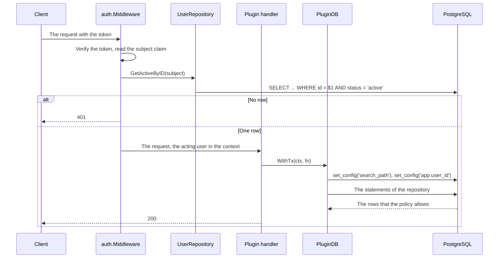
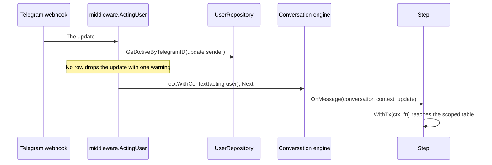

# Specification: The user record and the ownership of a row

## 1. Summary

The hub gains the table `public.users` and resolves one acting user for every
request, every Telegram update, and every cron run. `pluginapi.PluginDB` puts that
user into the transaction as `app.user_id`, and the row level security policy of a
scoped table reads it. The configuration loses its list of Telegram identifiers,
and the user record becomes the only allowlist.

## 2. Coverage

| Requirement      | Where this specification realizes it                   |
| ---------------- | ------------------------------------------------------ |
| `IDENT-FR-001`   | Section 4.2, `IDENT-SC-011`                            |
| `IDENT-FR-002`   | Section 4.3, Section 4.5, `IDENT-SC-006`, `IDENT-SC-007` |
| `IDENT-FR-003`   | Section 4.2, `IDENT-DD-001`, `IDENT-SC-002`            |
| `IDENT-FR-004`   | Section 4.2, `IDENT-SC-001`                            |
| `IDENT-FR-005`   | Section 4.2, `IDENT-SC-003`                            |
| `IDENT-FR-006`   | Section 4.5, `IDENT-SC-004`                            |
| `IDENT-FR-007`   | Section 4.3, `IDENT-DD-007`, `IDENT-SC-009`            |
| `IDENT-FR-008`   | Section 4.2, `IDENT-SC-010`                            |
| `IDENT-FR-009`   | Section 4.2, `IDENT-SC-007`                            |
| `IDENT-FR-010`   | `IDENT-DD-003`, `IDENT-SC-008`                         |
| `IDENT-FR-011`   | Section 4.2, `IDENT-SC-007`                            |
| `IDENT-NFR-001`  | `IDENT-SC-001`                                         |
| `IDENT-NFR-002`  | `IDENT-DD-003`, `IDENT-SC-012`                         |
| `IDENT-INV-001`  | Section 4.2                                            |
| `IDENT-INV-002`  | `IDENT-DD-002`, `IDENT-DD-006`, `IDENT-SC-005`         |
| `IDENT-INV-003`  | Section 4.2, `IDENT-SC-011`                            |

## 3. Guideline compliance

| Rule       | Guideline        | How this specification obeys it                                                  |
| ---------- | ---------------- | -------------------------------------------------------------------------------- |
| `OWN-001`  | Record ownership | Section 4.2 creates `public.users` with the Telegram identifier as natural key.  |
| `OWN-003`  | Record ownership | Section 4.4 resolves the acting user at each of the three entry points.          |
| `OWN-005`  | Record ownership | Section 4.2 gives the `user_id` column that every scoped table carries.          |
| `OWN-006`  | Record ownership | Section 4.2 gives the policy. `IDENT-DD-006` makes the policy apply to the hub.  |
| `OWN-007`  | Record ownership | `IDENT-DD-002`. `PluginDB.WithTx` is the only place that sets `app.user_id`.     |
| `DAT-004`  | Data             | `IDENT-DD-002` keeps the search path on the same statement.                      |
| `DAT-009`  | Data             | `public.users.id` declares `DEFAULT uuidv7()`, and no Go code names it.          |
| `SEC-003`  | Security         | `IDENT-DD-004`. The subject claim carries the record identifier.                 |
| `SEC-004`  | Security         | `IDENT-DD-003`. The hub reads the record on each request, and the configuration loses its list. |
| `TG-006`   | Telegram         | The conversation store keeps the Telegram identifier as its key.                |
| `JOB-005`  | Jobs             | Section 4.3 adds `Scope` to `CronJobMeta`.                                        |
| `JOB-007`  | Jobs             | Section 4.5. One user that fails does not stop the run for the next user.        |
| `PLG-007`  | Plugin model     | `IDENT-DD-001` puts the context helpers in `libs/pluginapi`, not in the hub.     |
| `ARC-008`  | Architecture     | No rule in this design names a plugin.                                            |
| `REP-003`  | Repository       | The rule binds `plugins/*/repository/`. The hub repository holds the pool, because each operation is one statement on the request path. `IDENT-DD-003` gives the reason. |

`ADR-0001` amended `DAT-008` and `DAT-009` for this specification.

## 4. Design

### 4.1 Components

| Path                                                        | Action | Holds                                                              |
| ----------------------------------------------------------- | ------ | ------------------------------------------------------------------ |
| `apps/hub/db/migrations/20260912143000_table_users_create.*` | create | `public.users`                                                     |
| `apps/hub/db/migrations/20251107142304_extension_uuid_ossp_create.*` | delete | `ADR-0001` drops the extension                             |
| `apps/hub/internal/model/user.go`                           | create | `model.User`, `model.Status`, `model.Profile`, `model.ParseStatus` |
| `apps/hub/internal/repository/user.go`                      | create | `repository.UserRepository`, `repository.User`                     |
| `apps/hub/internal/auth/middleware.go`                      | change | `Middleware(logger, jwtService, users UserResolver)`               |
| `apps/hub/internal/handler/auth.go`                         | change | The callback resolves the record and signs its identifier          |
| `apps/hub/internal/handler/{plugin,plugin_wrapper}.go`      | change | The new middleware argument                                        |
| `apps/hub/internal/config/config.go`                        | change | `Telegram.AllowedUsers` goes                                       |
| `apps/hub/internal/telegram/middleware/acting_user.go`      | create | `middleware.ActingUser`                                            |
| `apps/hub/internal/telegram/middleware/allowed_users.go`    | delete | `ActingUser` replaces it                                           |
| `apps/hub/internal/telegram/handler.go`                     | change | The new middleware, and the context reaches the engine             |
| `apps/hub/internal/telegram/conversation/engine.go`         | change | `HandleMessage(ctx, update)`, `Start(ctx, update, id)`             |
| `apps/hub/internal/worker/cron.go`                          | change | `ActiveUserLister`, and the run for each user                      |
| `apps/hub/internal/command/worker.go`                       | change | Resolves the repository for the cron worker                        |
| `apps/hub/internal/depresolver/{resolver,database,server,telegram,plugin}.go` | change | `UserRepository()` joins the `Resolver` interface, and each consumer receives it |
| `libs/pluginapi/actinguser.go`                              | create | `ContextWithActingUser`, `ActingUserFromContext`                   |
| `libs/pluginapi/database.go`                                | change | `WithTx` sets `app.user_id`                                        |
| `libs/pluginapi/cron.go`                                    | change | `CronScope`, `CronJobMeta.Scope`                                   |
| `libs/pluginapi/telegram/conversation/conversation.go`      | change | `Context` embeds `context.Context`. `Engine` takes a context.      |
| `libs/testdb/`                                              | create | `testdb.Start`, a new Go module. `IDENT-DD-009`                    |
| `plugins/parking/telegram/command/start.go`                 | change | Passes `ctx.Context()` to `Start`                                  |
| `.docker/postgres/init.sh`                                  | create | The role that the hub connects as. `IDENT-DD-006`                  |
| `docker-compose.yaml`                                       | change | The PostgreSQL 18 image, and the init script                       |
| `chart/values.yaml`                                         | change | The PostgreSQL 18 image, and the database user                     |

The signatures:

```go
// libs/pluginapi/actinguser.go
func ContextWithActingUser(ctx context.Context, userID string) context.Context
func ActingUserFromContext(ctx context.Context) string

// apps/hub/internal/repository/user.go
type UserRepository interface {
    GetActiveByID(ctx context.Context, id string) (*model.User, error)
    GetActiveByTelegramID(ctx context.Context, telegramID int64) (*model.User, error)
    ListActive(ctx context.Context) ([]model.User, error)
    SyncProfileByTelegramID(
        ctx context.Context, telegramID int64, profile model.Profile,
    ) (*model.User, error)
}
```

Each consumer declares the narrow interface that it needs: `auth.UserResolver`
holds `GetActiveByID`, `middleware.UserResolver` holds `GetActiveByTelegramID`,
and `worker.ActiveUserLister` holds `ListActive`. A fake satisfies each one in a
unit test.

### 4.2 Data model

| Table   | Schema   | Scope  | Migration                               | Realizes                                            |
| ------- | -------- | ------ | --------------------------------------- | --------------------------------------------------- |
| `users` | `public` | shared | `20260912143000_table_users_create.up.sql` | `IDENT-FR-001`, `IDENT-FR-011`, `IDENT-INV-003`  |

`users` is shared because it holds the owners themselves. `OWN-004` names it.

```sql
CREATE TABLE public.users
(
    id           UUID        NOT NULL PRIMARY KEY DEFAULT uuidv7(),
    telegram_id  BIGINT      NOT NULL UNIQUE,
    username     TEXT,
    display_name TEXT,
    picture_url  TEXT,
    status       TEXT        NOT NULL DEFAULT 'active'
        CHECK (status IN ('active', 'blocked')),
    created_at   TIMESTAMPTZ NOT NULL DEFAULT NOW(),
    updated_at   TIMESTAMPTZ NOT NULL DEFAULT NOW()
);

CREATE TRIGGER set_updated_at
    BEFORE UPDATE ON public.users
    FOR EACH ROW
EXECUTE FUNCTION set_updated_at();
```

The `UNIQUE` constraint on `telegram_id` realizes `IDENT-INV-003`. The `CHECK`
constraint gives the two states that `OWN-002` allows. The three profile columns
hold nothing at the insert, and the login fills them. See `IDENT-DD-005`.

The owner creates a record with one statement, and blocks a person with one
statement. The block keeps every record of that person, which realizes
`IDENT-FR-009` and `IDENT-FR-011`.

```sql
INSERT INTO public.users (telegram_id) VALUES (123456789);
UPDATE public.users SET status = 'blocked' WHERE telegram_id = 123456789;
```

**A scoped table.** This feature adds none, because `IDENT-FR-008` keeps every
record that exists today shared, and the requirements put the plugins of today out
of scope. A scoped table that a later feature adds takes the shape that `OWN-005`
and `OWN-006` give. The scenarios build that table in the test schema `test_scope`
and measure the policy against it.

The column and the policy realize `IDENT-INV-001`, `IDENT-FR-003`, `IDENT-FR-004`,
and `IDENT-FR-005`: `NOT NULL` with the reference gives each row exactly one owner,
`USING` filters every read, and `WITH CHECK` refuses every write of a row that
names another user.

**The connection role.** `IDENT-DD-006` gives it. The hub connects as a role that
is not a superuser and does not hold `BYPASSRLS`, and that role owns the tables.

### 4.3 Declarations

**The plugin contract.** These symbols change in `libs/pluginapi`.

| Symbol                        | Change                                                            | Realizes       |
| ----------------------------- | ----------------------------------------------------------------- | -------------- |
| `ContextWithActingUser`       | New. The hub puts the acting user into the context.               | `IDENT-FR-003` |
| `ActingUserFromContext`       | New. `PluginDB` reads it.                                          | `IDENT-FR-003` |
| `PluginDB.WithTx`             | Sets `app.user_id` with the search path, in one statement.        | `IDENT-INV-002` |
| `CronJobMeta.Scope`           | New. `CronScopeShared` or `CronScopePerUser`.                     | `IDENT-FR-007` |
| `conversation.Context`        | Embeds `context.Context`, so a step reaches `WithTx`.             | `IDENT-FR-003` |
| `conversation.Engine`         | `Start` and `HandleMessage` take a `context.Context`.             | `IDENT-FR-003` |

**Cron jobs.** This feature adds no job. It adds the declaration that a job makes.

| Scope              | Acts for                    | The scheduler                                                     | Realizes       |
| ------------------ | --------------------------- | ------------------------------------------------------------------ | -------------- |
| `CronScopeShared`  | Nobody. The default value.  | Runs `Run` one time with no acting user.                           | `IDENT-FR-007` |
| `CronScopePerUser` | Each active user            | Reads `ListActive`, then runs `Run` one time for each user, with that user in the context. | `IDENT-FR-007` |

**Configuration.**

| Key                      | Type      | Default | Secret | Realizes       |
| ------------------------ | --------- | ------- | ------ | -------------- |
| `telegram.allowed_users` | Removed   | None    | No     | `IDENT-FR-002` |

`SEC-004` gives the reason: the record is the allowlist, so the configuration holds
no second list. The key leaves `config.yaml` and `chart/values.yaml`.

### 4.4 Flow

The HTTP request. The same order serves `/plugins`, `/auth/me`, and every route of
a plugin.



The Telegram update. `TG-006` keeps the Telegram identifier as the store key, and
the acting user travels in the context beside it.



The cron run of a job that declares `CronScopePerUser`:

1. The scheduler fires the entry. `JOB-006` skips the fire while the previous run
   is active.
2. The worker calls `ListActive`.
3. For each user, the worker builds a context with that user and calls `Run`.
4. The worker logs an error and continues with the next user. See `JOB-007`.

### 4.5 Errors

| Condition                                              | Behavior                                          | Message                            |
| ------------------------------------------------------ | ------------------------------------------------- | ---------------------------------- |
| The request carries no token                           | Status 401                                        | `access denied`                    |
| The subject claim is not a UUID                        | Status 401, one error line in the log             | `invalid subject claim in token`   |
| No active record holds that identifier                 | Status 401, one info line in the log              | `access denied`                    |
| The login finds no active record for the Telegram identifier | Redirect with `error=auth_failed`           | `user is not allowed`              |
| The update sender holds no active record               | The update is dropped, one warning in the log     | `sender holds no active user record` |
| A read names a row of another user                     | The row does not reach the handler. The handler answers as it answers a missing row: status 404. Realizes `IDENT-FR-006`. | `not found`  |
| A write names a row of another user                    | The policy refuses it. `UPDATE` and `DELETE` change no row, and `INSERT` fails with `new row violates row-level security policy`. | The plugin answers 404. |
| A transaction carries no acting user                   | `app.user_id` is set to the empty string. Every scoped table returns no row, and a write fails. The work on a shared table continues. | None |
| One user of a per-user cron run fails                  | One error line, and the run continues with the next user | `cron job execution failed`  |

## 5. Design decisions

### `IDENT-DD-001`

**Realizes:** `IDENT-FR-003`, `IDENT-INV-002`
**Decision:** The acting user travels in the `context.Context`.
`libs/pluginapi` exports `ContextWithActingUser` and `ActingUserFromContext`, the
hub sets the value at each entry point, and `PluginDB.WithTx` reads it.
**Rationale:** `OWN-007` makes `WithTx` the only place that sets `app.user_id`, and
`WithTx(ctx, fn)` already takes a context. A plugin passes the request context
today, so 0 call sites change. A conversation step has no argument to hold a second
value, so the context is the only place that reaches every entry point.
**Alternatives:** An argument, as `WithTxAs(ctx, userID, fn)`. It names the user at
the call site, and it changes every existing call. A step would still need a path
for the value, because `Step.OnMessage` takes no context today.

### `IDENT-DD-002`

**Realizes:** `IDENT-INV-002`
**Decision:** `WithTx` sets the search path and the acting user in one statement,
with both values as bind parameters:

```go
_, err = tx.ExecContext(
    ctx,
    "SELECT set_config('search_path', $1, true), set_config('app.user_id', $2, true)",
    p.pluginID.ToSafeName("_")+", public",
    pluginapi.ActingUserFromContext(ctx),
)
```

**Rationale:** One round trip instead of two, which serves `IDENT-NFR-002`. The
third argument of `set_config` keeps both values inside the transaction, so the
pool cannot carry a value to the next caller. The bind parameter also removes the
`fmt.Sprintf` that builds the search path today.
**Alternatives:** Two statements, one `SET LOCAL search_path` and one `set_config`.
It costs a second round trip and gives nothing.

### `IDENT-DD-003`

**Realizes:** `IDENT-FR-010`, `IDENT-NFR-002`, `SEC-004`
**Decision:** The hub reads the user record from PostgreSQL on every request and
every update. It holds no cache.
**Rationale:** `IDENT-FR-010` demands that a record created outside the product
serves the next interaction, and `SEC-004` demands that a block ends a live token.
A cache with any lifetime breaks both. The read is one index scan on a unique
`UUID` column against a household sized table, under 1 millisecond, inside the
10 millisecond budget of `IDENT-NFR-002`.
**Alternatives:** A cache with a short lifetime. It holds a blocked person inside
for the length of the lifetime, and it gives no measurable time back.

### `IDENT-DD-004`

**Realizes:** `SEC-003`, `IDENT-FR-002`
**Decision:** The subject claim of the JWT carries the record identifier, not the
Telegram identifier. Every token that exists today stops working.
**Rationale:** `SEC-003` gives the rule. The middleware then reads the owner of the
data straight from the token with no second lookup by Telegram identifier.
A subject that does not parse as a UUID gets status 401, so an old token sends its
holder to the login and one login replaces it.
**Alternatives:** Keep the Telegram identifier in the subject and map it on each
request. It contradicts `SEC-003` and adds nothing.

### `IDENT-DD-005`

**Realizes:** `IDENT-FR-001`
**Decision:** `public.users` holds `username`, `display_name`, and `picture_url`.
The login callback writes the three from the ID token claims `preferred_username`,
`name`, and `picture`, in the same statement that resolves the record.
**Rationale:** The owner reads a row and sees the person. The write costs one
statement for each login, not one for each request, and it never touches `id` or
`telegram_id`, so the record stays permanent as `IDENT-FR-001` demands.
A person who only uses the bot keeps three empty columns, because the bot carries
no login.
**Alternatives:** A label that only the owner writes. Nothing keeps it correct.
Identity columns alone. The owner then reads a bare number.

### `IDENT-DD-006`

**Realizes:** `IDENT-INV-002`, `OWN-006`
**Decision:** The hub connects as the role `maroid`, which carries
`NOSUPERUSER NOCREATEROLE NOBYPASSRLS` and owns the database of the same name.
The superuser `postgres` bootstraps the cluster and creates that role.

| Database | Creates the role                                                          |
| -------- | -------------------------------------------------------------------------- |
| Local    | `.docker/postgres/init.sh`, which the entrypoint runs from `/docker-entrypoint-initdb.d/` |
| Deployed | A secret that `chart/values.yaml` projects into `timescaledb.postInit`     |

Each mechanism runs one time, when the cluster initializes. Neither reaches a
cluster that already exists, so both databases are recreated.

The script also creates the TimescaleDB extension in the new database, because
`CREATE EXTENSION timescaledb` needs a superuser and the core migration
`20260228093422_extension_timescaledb_create` runs as `maroid`. The `IF NOT EXISTS`
clause in that migration then finds the extension and skips it.

**Rationale:** PostgreSQL never applies a policy to a superuser, and `FORCE ROW
LEVEL SECURITY` does not change that. It forces the policy on the owner of the
table only. Both databases connect as a superuser today: the entrypoint of the
image makes `POSTGRES_USER` the bootstrap superuser, and `chart/values.yaml` sets
`user: postgres`. Under those roles every policy in this design is silent and every
isolation scenario passes with no isolation.
The script is `init.sh` and not `init.sql`, because a plain SQL file cannot read
the password from the environment, and `CFG-004` keeps a secret out of the
repository.
**Alternatives:** A second role beside a superuser `maroid`. It keeps two roles for
one database and moves the DSN to the second name. Nothing else works: the policy
does nothing without a role of this shape.

### `IDENT-DD-007`

**Realizes:** `IDENT-FR-007`
**Decision:** `CronJobMeta` gains `Scope`, and the cron worker runs a job that
declares `CronScopePerUser` one time for each active user, with that user in the
context of the run.
**Rationale:** `IDENT-FR-007` demands that a scheduled task state the user that it
acts for. A declaration with no scheduler behind it leaves the requirement half
built and moves the work into a later feature. The fan-out is about 40 lines in
`apps/hub/internal/worker/cron.go`. No job declares `CronScopePerUser` today,
because open question 1 keeps every current job on shared records.
**Alternatives:** The declaration alone, with the worker refusing a per-user job.
It is smaller, and `IDENT-FR-007` then waits for the feature that moves plugin
configuration to the user.

### `IDENT-DD-008`

**Realizes:** `IDENT-FR-003`
**Decision:** `conversation.Context` embeds `context.Context`, so a step passes
itself to `WithTx`. `Engine.Start` and `Engine.HandleMessage` take a
`context.Context` as their first argument.
**Rationale:** The conversation path drops the context today: the bot handler
discards `*th.Context` and the engine builds a `conversation.Context` with three
fields. A step therefore has no acting user and no cancellation. The embedded
interface changes no step signature, and `db.WithTx(ctx, fn)` inside a step reads
as it reads inside a handler. The struct field needs `//nolint:containedctx` with
the reason, because `.golangci.yaml` enables every linter.
**Alternatives:** A named field, as `ctx.Ctx`. It stores the context in a struct
just the same and reads worse at the call site. A fourth argument on `OnEnter` and
`OnMessage` changes every step of every plugin.

### `IDENT-DD-009`

**Realizes:** `IDENT-NFR-001`, `TST-004`
**Decision:** Unit tests use `testing` with `testify/require`. An integration test
starts PostgreSQL 18 with `testcontainers-go` through the helper `testdb.Start(t)`,
and `testdb.Migrate` applies a migration filesystem to a schema. The helper skips
the test when `testing.Short()` reports true. The helper lives in the new module
`libs/testdb`, so the hub and a plugin can both use it.

The handle that `Start` returns connects as a role of the shape that
`IDENT-DD-006` gives, and that role owns every object the test creates. A handle
that connects as a superuser reads every row of every user, so each isolation
scenario would pass and measure nothing.

The caller passes the migration filesystem. `libs/testdb` imports no package from
`apps/hub`, because `ARC-005` points the dependency from the hub to a library and
never back.
**Rationale:** This feature is the first through the full lane, so it builds the
test setup that `TST` describes. A policy proves itself only against a real
PostgreSQL, and `IDENT-NFR-001` names a row count that no fake can produce.
`go test ./...` then needs Docker and no environment variable.
**Alternatives:** A build tag over the database from `docker-compose.yaml`. It
needs no Docker library, and it needs a running stack and a variable that a fresh
clone does not have. Manual scenarios. The one behavior that this feature exists
for would then carry no automated proof.

## 6. Scenarios

`spec-scenarios.md` holds `IDENT-SC-001` through `IDENT-SC-012`.

## 7. Build plan

| #   | Step                                                                                                         | Realizes                          | Done |
| --- | ------------------------------------------------------------------------------------------------------------ | --------------------------------- | ---- |
| 1   | Bump both images to PostgreSQL 18. Delete the `uuid-ossp` migration. `ADR-0001` is accepted and `DAT-008` and `DAT-009` carry it. | `DAT-009`    | [x]  |
| 2   | Add `.docker/postgres/init.sh` with the role. Point `docker-compose.yaml` and `chart/values.yaml` at it. The owner recreates both databases. | `IDENT-DD-006`  | [x]  |
| 3   | Build `libs/testdb` with `testcontainers-go`. Add `testify` to `apps/hub`.                                   | `IDENT-DD-009`                    | [x]  |
| 4   | Write the migration for `public.users`.                                                                       | `IDENT-FR-001`, `IDENT-INV-003`   | [x]  |
| 5   | Write `IDENT-SC-011`, then `model.User` and `repository.User`.                                                | `IDENT-FR-001`                    | [x]  |
| 6   | Write `IDENT-SC-001` to `IDENT-SC-005` and `IDENT-SC-010`, then the change in `PluginDB.WithTx` and `libs/pluginapi/actinguser.go`. | `IDENT-FR-003` to `IDENT-FR-006`, `IDENT-FR-008`, `IDENT-INV-001`, `IDENT-INV-002` | [x]  |
| 7   | Write `IDENT-SC-006`, then the HTTP middleware and the three call sites that build it.                        | `IDENT-FR-002`                    | [x]  |
| 8   | Change the login callback: resolve the record, sync the profile, sign the record identifier.                  | `IDENT-FR-002`, `SEC-003`         | [x]  |
| 9   | Replace the Telegram allowlist middleware. Pass the context through the conversation engine and the steps.     | `IDENT-FR-002`, `IDENT-FR-003`    | [x]  |
| 10  | Write `IDENT-SC-009`, then `CronJobMeta.Scope` and the fan-out in the cron worker.                            | `IDENT-FR-007`                    | [x]  |
| 11  | Remove `telegram.allowed_users` from the configuration struct, `config.yaml`, and `chart/values.yaml`.        | `IDENT-FR-002`, `SEC-004`         | [x]  |
| 12  | Run `IDENT-SC-007`, `IDENT-SC-008`, and `IDENT-SC-012` against the running hub.                               | `IDENT-FR-009` to `IDENT-FR-011`, `IDENT-NFR-002` | [x]  |

Step 2 comes before every other database step, because a policy written under a
superuser passes every test and isolates nothing.

## 8. Out of scope for this specification

| Postponed                                                                | Reason and the condition that brings it back                                                                       |
| ------------------------------------------------------------------------ | ------------------------------------------------------------------------------------------------------------------- |
| Scoping the tables of the plugins that exist today.                      | `IDENT-FR-008` keeps them shared. One feature for each plugin adds the column, the policy, and the migration.       |
| The shape of `/auth/me`.                                                 | No requirement names it. The record now holds the profile, so a later feature can serve it from the record.         |
| A command that creates or blocks a user record.                          | Open question 2 answers it: a SQL statement does the work.                                                           |
| A cron job that declares `CronScopePerUser`.                             | Open question 1 answers it: the feature that moves plugin configuration to the user declares the first one.         |
| Converting the identifier column of the existing plugin tables to `UUID`. | `ADR-0001` records the contradiction. One feature for each plugin converts it.                                      |

## Retired identifiers

This file has no retired identifier.
