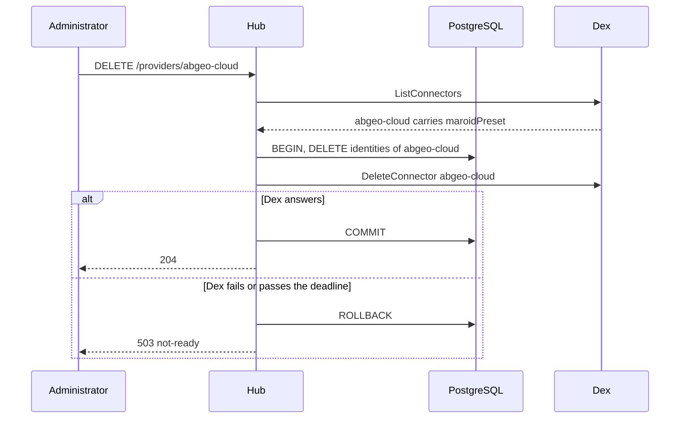

# Specification: The providers of the instance and the local account

This file holds the design. [`spec-scenarios.md`](spec-scenarios.md) holds the
scenarios. `SPC-001` divides them.

## 1. Summary

The hub reads and writes the connectors of Dex over its gRPC API, behind mutual TLS.
Routes under `/providers` add, change, and remove a provider of one of three presets,
and routes under `/users/{userId}/identities` give, reset, and remove a local account.
`maroid user password` gives the first administrator a local account. No table changes.

## 2. Coverage

| Requirement      | Where this specification realizes it                    |
| ---------------- | -------------------------------------------------------- |
| `IDPROV-FR-001`  | Section 4.3, `IDPROV-DD-002`, `IDPROV-SC-001`             |
| `IDPROV-FR-002`  | Section 4.3, `IDPROV-DD-004`, `IDPROV-SC-002`, `IDPROV-SC-003` |
| `IDPROV-FR-003`  | Section 4.4, `IDPROV-SC-002`                              |
| `IDPROV-FR-004`  | Section 4.4, `IDPROV-SC-004`                              |
| `IDPROV-FR-005`  | `IDPROV-DD-008`, `IDPROV-SC-004`                          |
| `IDPROV-FR-006`  | Section 4.4, `IDPROV-SC-006`                              |
| `IDPROV-FR-007`  | Section 4.3, `IDPROV-SC-007`                              |
| `IDPROV-FR-008`  | `IDPROV-DD-005`, `IDPROV-SC-008`                          |
| `IDPROV-FR-009`  | Section 4.3, `IDPROV-SC-009`                              |
| `IDPROV-FR-010`  | Section 4.3, `IDPROV-SC-010`                              |
| `IDPROV-FR-011`  | `IDPROV-DD-006`, `IDPROV-SC-011`                          |
| `IDPROV-FR-012`  | `IDPROV-DD-007`, `IDPROV-SC-012`                          |
| `IDPROV-FR-013`  | Section 4.3, `IDPROV-SC-013`                              |
| `IDPROV-FR-014`  | `IDPROV-DD-003`, `IDPROV-SC-013`                          |
| `IDPROV-FR-015`  | Section 4.5, `IDPROV-SC-014`                              |
| `IDPROV-FR-016`  | `IDPROV-DD-002`, `IDPROV-SC-015`                          |
| `IDPROV-FR-017`  | Section 4.1, `IDPROV-SC-016`                              |
| `IDPROV-FR-018`  | Section 4.3, `IDPROV-DD-009`, `IDPROV-SC-017`             |
| `IDPROV-FR-019`  | Section 4.3, `IDPROV-SC-018`                              |
| `IDPROV-FR-020`  | Section 4.3, `IDPROV-SC-019`                              |
| `IDPROV-FR-021`  | Section 4.5, `IDPROV-SC-020`                              |
| `IDPROV-FR-022`  | Section 4.6, `IDPROV-SC-021`                              |
| `IDPROV-FR-023`  | Section 4.6, `IDPROV-SC-022`                              |
| `IDPROV-FR-024`  | Section 4.3, `IDPROV-SC-010`, `IDPROV-SC-023`             |
| `IDPROV-FR-025`  | Section 4.3, `IDPROV-SC-024`, `IDPROV-SC-025`             |
| `IDPROV-FR-026`  | Section 4.3, `IDPROV-SC-024`                              |
| `IDPROV-FR-027`  | Section 4.3, `IDPROV-SC-026`                              |
| `IDPROV-FR-028`  | Section 4.3, `IDPROV-DD-012`, `IDPROV-SC-027`             |
| `IDPROV-NFR-001` | `IDPROV-DD-001`, `IDPROV-SC-028`                          |
| `IDPROV-NFR-002` | `IDPROV-DD-003`, `IDPROV-SC-029`                          |
| `IDPROV-INV-001` | Section 4.6, `IDPROV-SC-009`                              |
| `IDPROV-INV-002` | Section 4.4, `IDPROV-SC-004`                              |
| `IDPROV-INV-003` | Section 4.4, `IDPROV-SC-005`                              |
| `IDPROV-INV-004` | `IDPROV-DD-009`, `IDPROV-SC-017`                          |
| `IDPROV-INV-005` | `IDPROV-DD-009`, `IDPROV-SC-030`                          |

## 3. Guideline compliance

| Rule      | Guideline     | How this specification obeys it                                                   |
| --------- | ------------- | ----------------------------------------------------------------------------------- |
| `SEC-001` | Security      | Section 4.5 hashes a password in memory. No row, log, or answer holds it.          |
| `SEC-003` | Security      | Section 4.6 refuses a change to the identifier, the issuer, or the claim.          |
| `SEC-004` | Security      | A block touches no local account. The resolver still refuses the record.           |
| `SEC-011` | Security      | Every route of section 4.3 runs `auth.RequireAdministrator`.                       |
| `OWN-002` | Ownership     | No route creates a user record. The command reaches an existing one.               |
| `OWN-004` | Ownership     | `public.identities` stays shared. No table is added.                               |
| `ERR-003` | Errors        | Section 4.6 adds four types of the hub. The owner approves them with this specification. |
| `API-003` | HTTP API      | The routes sit under `/providers` and `/users`.                                    |
| `API-007` | HTTP API      | A provider carries `ETag`, and its change reads `If-Match`. A `POST` reads `Idempotency-Key`. |
| `RES-005` | REST          | Each collection answers one bounded page.                                          |
| `Z-134`   | REST          | Every path segment of a resource is plural. The local account is an identity.      |
| `Z-148`   | REST          | A change uses `PATCH` with merge patch.                                            |
| `CLI-001` | CLI           | `maroid user password` joins the tree. `CLI-004` validates in `PreRunE`.           |
| `CFG-003` | Configuration | The `dex` block declares its defaults and its validation in tags.                  |
| `CFG-004` | Configuration | The certificate and the key live in files outside the repository.                  |
| `DEP-005` | Dependencies  | `DexClient` can fail to build, so it holds `mu` and resets `once`.                 |
| `DEP-008` | Dependencies  | `CloseDexClient` closes the gRPC connection.                                       |
| `LOG-008` | Logging       | No log line carries a password, a hash, a connector config, or a client secret.    |

## 4. Design

### 4.1 Components

| Path                                                        | Action | Holds                                                               |
| ----------------------------------------------------------- | ------ | ------------------------------------------------------------------- |
| `apps/hub/internal/config/config.go`                        | change | `Dex` block. `Auth.Providers` and `Provider` go.                    |
| `apps/hub/internal/dex/{doc,client}.go`                     | create | `dex.Client`, the gRPC client of Dex with mutual TLS and a deadline |
| `apps/hub/internal/provider/{doc,preset,options,build,discovery}.go` | create | `provider.Preset`, the fixed fields, `oidcOptions`, the checks of a preset, `provider.OIDCDiscovery` |
| `apps/hub/internal/provider/service.go`                     | create | `provider.Service`: list, read, add, change, remove                 |
| `apps/hub/internal/provider/local.go`                       | create | `provider.LocalAccounts`: give, reset, remove                       |
| `apps/hub/internal/repository/identity.go`                  | change | `CountByProvider`, `AdministratorsBySoleProvider`, `DeleteByProvider` and `Detach` take a hook |
| `apps/hub/internal/auth/resolver.go`                        | change | `ProviderLocal`                                                     |
| `apps/hub/internal/auth/service.go`                         | change | `Detach` of `local` runs `LocalAccounts.Remove`                     |
| `apps/hub/internal/handler/provider.go`                     | create | `handler.Provider`, the routes under `/providers`                   |
| `apps/hub/internal/handler/user.go`                         | change | The routes under `/users/{userId}/identities`                       |
| `apps/hub/internal/handler/auth.go`                         | change | `Identities` reads `provider.Service.List`. `Link` refuses `local`. |
| `apps/hub/internal/domain/problems/problems.go`             | change | The four types of section 4.6                                       |
| `apps/hub/internal/domain/errs/errs.go`                     | change | The sentinels of section 4.6                                        |
| `apps/hub/internal/depresolver/{dex,provider,server}.go`    | create, change | `DexClient`, `CloseDexClient`, `ProviderService`, `LocalAccounts`, the handler |
| `apps/hub/internal/command/user/password.go`                | create | `PasswordCommand`                                                   |
| `apps/hub/internal/command/user/{user,invite}.go`           | change | Registers `password`. `invite` prints the record identifier.        |
| `apps/deck/src/lib/api/{providers,users,types}.ts`          | create, change | The client of section 4.3                                    |
| `apps/deck/src/routes/(dashboard)/admin/providers/+page.svelte` | create | The list, and the menu that adds a provider                     |
| `apps/deck/src/routes/(dashboard)/admin/providers/[provider]/+page.svelte` | create | The form, the redirect address, the removal dialog   |
| `apps/deck/src/routes/(dashboard)/admin/users/[user]/+page.svelte` | change | The local account section                                    |
| `apps/deck/src/lib/components/layout/Sidebar.svelte`        | change | The entry `/admin/providers`                                        |
| `config.example.yaml`, `docker-compose.yaml`, `.docker/dex/config.yaml`, `chart/` | change | The `dex` block, the certificates, no published port |
| `specs/features/idprov/api.yaml`                            | create | The routes of section 4.3                                           |
| `specs/features/extid/api.yaml`                             | change | `startAttach` answers 400 for `local`                               |

```go
// apps/hub/internal/dex/client.go
type Client interface {
    ListConnectors(ctx context.Context) ([]Connector, error)
    CreateConnector(ctx context.Context, connector Connector) error
    UpdateConnector(ctx context.Context, connector Connector) error
    DeleteConnector(ctx context.Context, id string) error
    ListPasswords(ctx context.Context) ([]Password, error)
    CreatePassword(ctx context.Context, password Password) error
    UpdatePassword(ctx context.Context, email string, hash []byte) error
    DeletePassword(ctx context.Context, email string) error
}

type Connector struct {
    ID     string
    Type   string
    Name   string
    Config json.RawMessage
}

type Password struct {
    Email  string
    Hash   []byte
    Name   string
    UserID string
}

// apps/hub/internal/provider/service.go
type Service interface {
    List(ctx context.Context) ([]Provider, error)
    Get(ctx context.Context, id string) (*Provider, error)
    Create(ctx context.Context, input Input) (*Provider, error)
    Change(ctx context.Context, id string, change Change, etag string) (*Provider, error)
    Remove(ctx context.Context, id string) error
}

// apps/hub/internal/provider/local.go
type LocalAccounts interface {
    Give(ctx context.Context, userID string, email string, password []byte) error
    Reset(ctx context.Context, userID string, password []byte) error
    Remove(ctx context.Context, userID string) error
    EnsureProvider(ctx context.Context) error
}

// apps/hub/internal/repository/identity.go
CountByProvider(ctx context.Context) (map[string]int, error)
// The key is the one provider at which each active administrator holds identities.
AdministratorsBySoleProvider(ctx context.Context) (map[string][]model.User, error)
DeleteByProvider(ctx context.Context, provider string, beforeCommit func(context.Context) error) error
Detach(ctx context.Context, userID string, provider string, beforeCommit func(context.Context) error) error
```

`dex.Client` wraps `api.DexClient` of `github.com/dexidp/dex/api/v2` v2.4.0, which
holds every call above. Each call takes the deadline of `dex.timeout`, and maps
`codes.DeadlineExceeded` and `codes.Unavailable` to `errs.ErrIDPUnavailable`.

Dex reports a conflict in a successful answer, not as an error. The client maps
`already_exists` of a connector to `errs.ErrProviderExists` and of a password to
`errs.ErrLocalAccountExists`, and `not_found` to `errs.ErrProviderNotFound` or
`errs.ErrLocalAccountNotFound`. `GO-005` keeps every sentinel in `domain/errs`. Dex answers a refused value, such as a hash cost outside 10 to 16 or
a write to a static connector, with `codes.Unknown`, and the client returns it wrapped.

`UpdateConnector` keeps a field that the request leaves empty. The hub still sends the
name and the whole config on each change, so the stored config is exactly what the hub
built. `UpdatePassword` keeps the name when `new_username` is empty.

### 4.2 Data model

No table changes. `public.identities` keeps its shape. `identities_provider_user_key`
serves `CountByProvider` and `DeleteByProvider`, because `provider` leads it.

The local account lives in Dex. Its fields map as follows.

| Field of Dex     | Value                                         |
| ---------------- | --------------------------------------------- |
| `email`          | The email address that the administrator gave, in lower case |
| `hash`           | bcrypt of the password, cost 12               |
| `username`       | The email address                             |
| `user_id`        | The identifier of the user record             |

The identity of a local account is `(local, <user record identifier>)`.

### 4.3 Declarations

**HTTP routes.** `api.yaml` holds the bodies and the status codes.

| Method   | Path                                     | Access        | Permission | Realizes                              |
| -------- | ---------------------------------------- | ------------- | ---------- | ------------------------------------- |
| `GET`    | `/providers`                             | Administrator | none       | `IDPROV-FR-001`, `IDPROV-FR-012`      |
| `POST`   | `/providers`                             | Administrator | none       | `IDPROV-FR-002` to `IDPROV-FR-008`, `IDPROV-FR-011` |
| `GET`    | `/providers/{providerId}`                | Administrator | none       | `IDPROV-FR-001`, `IDPROV-FR-007`, `IDPROV-FR-012` |
| `PATCH`  | `/providers/{providerId}`                | Administrator | none       | `IDPROV-FR-008` to `IDPROV-FR-010`, `IDPROV-FR-016` |
| `DELETE` | `/providers/{providerId}`                | Administrator | none       | `IDPROV-FR-013` to `IDPROV-FR-016`    |
| `GET`    | `/users/{userId}/identities`             | Administrator | none       | `IDPROV-FR-018` to `IDPROV-FR-020`    |
| `POST`   | `/users/{userId}/identities`             | Administrator | none       | `IDPROV-FR-018`, `IDPROV-FR-023`      |
| `PATCH`  | `/users/{userId}/identities/{provider}`  | Administrator | none       | `IDPROV-FR-019`, `IDPROV-FR-023`      |
| `DELETE` | `/users/{userId}/identities/{provider}`  | Administrator | none       | `IDPROV-FR-020`                       |

The three routes under `/users/{userId}/identities` that write accept the provider
`local` alone. `IDPROV-DD-011`.

A provider in an answer carries `id`, `name`, `preset`, `static`, `identity_count`, and
`administrators_without_sign_in`. A provider of a preset other than `local` also
carries `issuer`, `client_id`, `user_id_key`, `options`, `client_secret_set`, and
`redirect_uri`. A generic OIDC provider also carries `scopes`. No answer carries a
secret, a password, or a hash.

`redirect_uri` is `oidc.issuer` with `/callback` appended. The `ETag` of a provider is
an integer from the SHA-256 of its name and its stored config, so a change in Dex
moves it too. `IDPROV-DD-013`.

**CLI commands.**

| Command                | Flags                                   | Does                                                         | Realizes |
| ---------------------- | --------------------------------------- | ------------------------------------------------------------ | -------- |
| `maroid user password` | `--user` (required), `--email`          | Adds the local provider when absent, then gives the record a local account, or resets the one it holds. Reads the password from a prompt or from the standard input. | `IDPROV-FR-025` to `IDPROV-FR-027` |
| `maroid user invite`   | unchanged                               | Prints the record identifier on line one, the address on line two. | `IDPROV-FR-028` |

`--email` is required when the record holds no local account, and refused when it
holds one. The command offers no flag for the password. On a terminal it prompts
twice and refuses two different values. Otherwise it reads the first line of the
standard input.

**Configuration scheme.**

| Key           | Type     | Default | Secret | Realizes                          |
| ------------- | -------- | ------- | ------ | --------------------------------- |
| `dex.address` | string   | None    | No     | `IDPROV-FR-001`                   |
| `dex.ca_file` | path     | None    | No     | `IDPROV-FR-001`                   |
| `dex.cert_file` | path   | None    | No     | `IDPROV-FR-001`                   |
| `dex.key_file` | path    | None    | Yes    | `IDPROV-FR-001`                   |
| `dex.timeout` | duration | `5s`    | No     | `IDPROV-NFR-002`                  |
| `auth.providers` | removed | None  | No     | `IDPROV-FR-017`                   |

Every key of `dex` but `timeout` is required. The hub stops at the start when one is
absent, as `CFG-003` gives.

### 4.4 The presets

The hub writes the key `maroidPreset` into every connector config that it stores.
`IDPROV-DD-002`.

| Preset     | Identifier            | Type of Dex | Name at creation | Fixed config                                                         | Default config                                          |
| ---------- | --------------------- | ----------- | ---------------- | -------------------------------------------------------------------- | ------------------------------------------------------- |
| `local`    | `local`               | `local`     | `Maroid`         | `maroidPreset`                                                       | None                                                    |
| `telegram` | `telegram`            | `oidc`      | `Telegram`       | `issuer: https://oauth.telegram.org`, `userIDKey: id`, `scopes: [openid, profile]`, `redirectURI`, `maroidPreset` | `clientID`: the prefix of `telegram.token` before `:` |
| `oidc`     | Chosen, then fixed    | `oidc`      | Chosen           | `redirectURI`, `maroidPreset`                                        | `userIDKey: sub`, `scopes: [openid, profile, email]`    |

The identifier of a generic OIDC provider matches `^[a-z][a-z0-9-]{1,31}$`, and is
neither `local` nor `telegram`. The issuer is an `https` address.

### 4.5 Flow

Every write reaches Dex inside the database transaction, before the commit.
`IDPROV-DD-003`.



A removal of `local` also lists the passwords and deletes each one before the commit.

`LocalAccounts.Give` hashes the password, calls `CreatePassword`, then inserts the
identity. `Reset` finds the password whose `user_id` is the record, then calls
`UpdatePassword`. `Remove` runs `IdentityRepository.Detach` with a hook that calls
`DeletePassword`, so the last identity check of `EXTID-FR-008` runs first.

`auth.Service.Detach` sends a detach of `local` to `LocalAccounts.Remove`.

### 4.6 Errors

| Condition                                             | Behavior | Type                                  |
| ----------------------------------------------------- | -------- | ------------------------------------- |
| The identifier names a provider that exists           | 409      | `/problems/hub/provider-exists`       |
| A change or a removal of a static provider            | 409      | `/problems/hub/provider-static`       |
| A local account for an email that another one holds   | 409      | `/problems/hub/local-account-exists`  |
| A local account while no local provider exists        | 409      | `/problems/hub/local-provider-absent` |
| An identifier, an issuer, or a claim that a change names | 422   | `validation-failed`, pointer of the field |
| An option key that the preset fixes or that Dex lacks | 422      | `validation-failed`, `/options/<key>` |
| An option value of the wrong type                     | 422      | `validation-failed`, `/options/<key>` |
| An issuer with no discovery document                  | 422      | `validation-failed`, `/issuer`        |
| A password under 12 characters or over 72 bytes       | 422      | `validation-failed`, `/password`      |
| An attach through `local` at `POST /auth/identities`  | 400      | `request-invalid`, names `provider`   |
| A change or a removal of an identity of a provider other than `local` | 404 | `not-found` |
| A new identity of a provider other than `local`       | 422      | `validation-failed`, `/provider`      |
| Dex refuses the connection, or passes `dex.timeout`   | 503      | `not-ready`, dependency `dex`         |
| The removal of the last identity of a record          | 409      | `identity-last`                       |

`ERR-003` gains the four types of the hub in the first rows, each with the title
of its condition. `errs` gains `ErrProviderExists`, `ErrProviderStatic`,
`ErrProviderNotFound`, `ErrLocalAccountExists`, `ErrLocalAccountNotFound`,
`ErrLocalProviderAbsent`, and `ErrIDPUnavailable`.

## 5. Design decisions

### `IDPROV-DD-001`

**Realizes:** `IDPROV-NFR-001`
**Decision:** The hub reads the connectors from Dex at each request and caches none. It
reaches Dex over gRPC with mutual TLS. Dex sets `tlsCert`, `tlsKey`, and
`tlsClientCA`, and the deployment publishes port 5557 to no network outside it.
**Rationale:** Dex reopens a connector when it changes, so no cache keeps a sign in in
step. An administrator reads the list rarely, and one call stays on the network of the
deployment. The API writes a password, so a caller of it signs in as
any person.
**Alternatives:** A cache in the hub, which only adds a second place that goes stale.
The plain port inside the network, which lets any process there set a password.
Certificates that OpenBao issues, which add a second service to the path of a write.

### `IDPROV-DD-002`

**Realizes:** `IDPROV-FR-001`, `IDPROV-FR-016`
**Decision:** The key `maroidPreset` in the stored config names the preset. A connector
without it is static. The hub refuses a change and a removal of a static connector.
**Rationale:** Dex marks no connector as static and ignores a key that it does not know.
On 2026-10-08 a stored `oidc` connector with `maroidPreset` redirected to its issuer,
and a stored `local` connector with it served its form. The key also records the
preset, so no table of the hub holds it.
**Alternatives:** A write that probes for `read-only`, which costs a write for each
connector at each listing and reopens each one. A comparison of the shape of the
config, which breaks when Dex changes how it serializes one.

### `IDPROV-DD-003`

**Realizes:** `IDPROV-FR-014`, `IDPROV-NFR-002`
**Decision:** A write opens the database transaction, writes its rows, calls Dex, and
commits only after Dex answers. A failure of Dex rolls the rows back and answers
`not-ready`. When `CreatePassword` answers `already_exists`, `Give` lists the passwords.
A password of that email with the same `user_id` counts as success, and any other
answers `local-account-exists`.
**Rationale:** A failure then leaves the database as it was. The one gap is a commit
that fails after Dex answered. A removed connector then leaves identities that sign in
to nothing, and a retry of the removal deletes them. A password that a timed out call
wrote lets the retry of `Give` succeed.
**Alternatives:** Dex first, then the database, which leaves a connector or a password
with no identity on each failure of the database. A table of pending writes, which
costs a worker for a rare failure.

### `IDPROV-DD-004`

**Realizes:** `IDPROV-FR-002`, `IDPROV-FR-008`
**Decision:** The API takes `options` as a JSON object. The deck shows it as YAML in a
text area and converts it with the `yaml` package.
**Rationale:** A client of the API that is not the deck sends JSON, and a failed key
gets a JSON Pointer. YAML is what the owner copies from the documentation of Dex.
**Alternatives:** A YAML string in the API, which puts a second format inside a JSON
body and gives no pointer to a failed key.

### `IDPROV-DD-005`

**Realizes:** `IDPROV-FR-008`
**Decision:** `provider.oidcOptions` mirrors each field of the OIDC config of Dex
v2.46.0 that no preset fixes. The hub decodes `options` into it and refuses an unknown
field. A test compares its fields with the key list that the spike recorded.
**Rationale:** The mirror refuses an unknown key and a value of the wrong type in one
decode. A typo such as `getUserinfo` otherwise does nothing, and a wrong type fails
each sign in. An upgrade of Dex reviews one struct.
**Alternatives:** An import of the config of Dex, which brings the whole module of Dex
into the hub. A key list without types, which lets a wrong type through.

### `IDPROV-DD-006`

**Realizes:** `IDPROV-FR-011`
**Decision:** On an add, the hub runs `oidc.NewProvider` of `go-oidc` against the issuer,
under `dex.timeout`. A failure answers 422 at `/issuer`.
**Rationale:** The hub already depends on `go-oidc`. It reads the discovery document and
checks that its issuer matches.
**Alternatives:** A plain `GET` of the document, which checks less and adds code.

### `IDPROV-DD-007`

**Realizes:** `IDPROV-FR-012`
**Decision:** A provider in an answer carries `identity_count` and
`administrators_without_sign_in`. The deck reads `GET /providers/{providerId}` before
it shows the dialog of a removal.
**Rationale:** The report is a fact about the provider, so it is a member of it.
`administrators_without_sign_in` names each active administrator who holds an
identity of the provider and no other. One grouped query serves the list.
**Alternatives:** A path that names the report, which is a singleton and breaks
`Z-134`. A `DELETE` that answers 409 until a second call confirms, which makes an
expected answer an error.

### `IDPROV-DD-008`

**Realizes:** `IDPROV-FR-005`
**Decision:** The client identifier of the Telegram preset is optional. An absent one
takes the prefix of `telegram.token`, and the answer shows it. The deck shows the
field empty, with the hint "Leave empty to use the bot of this hub".
**Rationale:** `telegram.token` is required by the configuration, so the default always
exists. A route that only serves a default is a surface with no other use.
**Alternatives:** A collection of presets with their defaults, which adds a route.

### `IDPROV-DD-009`

**Realizes:** `IDPROV-FR-018`, `IDPROV-INV-004`, `IDPROV-INV-005`
**Decision:** The `user_id` of a password in Dex is the identifier of the user record,
and the identity is `(local, <that identifier>)`.
**Rationale:** The unique key of the identity then allows one local account for each
record, and Dex refuses a second password for one email. Dex does not refuse a second
password with the same `user_id`, so `Give` refuses a record that already holds one.
`Reset` finds the password by `user_id`, so the identity needs no email address. Dex
compares an email address without regard to case, so the hub stores it in lower case.
The hash uses cost 12, the cost that Dex recommends inside its accepted range of 10 to 16.
**Alternatives:** A new identifier for each account, which adds a value to keep and
lets a record hold a second account after a failed removal.

### `IDPROV-DD-010`

**Realizes:** `IDPROV-FR-018`, `IDPROV-FR-026`
**Decision:** The command calls `EnsureProvider` before `Give` or `Reset`. The route
calls neither, and answers `local-provider-absent`.
**Rationale:** The command is the way back in after a lockout. The deck adds a sign in
method only when an administrator asks for it.
**Alternatives:** The route also adds the provider, which the owner refused.

### `IDPROV-DD-011`

**Realizes:** `IDPROV-FR-018` to `IDPROV-FR-020`
**Decision:** A local account is an identity under `/users/{userId}/identities`. A write
to any other provider answers `not-found`. The `GET` lists every identity of the record.
**Rationale:** A path segment for one account per record is a singleton, which `Z-134`
forbids. The deck needs the list to tell whether the record holds a local account.
**Alternatives:** `/users/{userId}/local-account`, which breaks `Z-134`.

### `IDPROV-DD-012`

**Realizes:** `IDPROV-FR-028`
**Decision:** `maroid user invite` prints the record identifier on the first line and the
address on the second.
**Rationale:** `maroid user password --user` takes the identifier, and a script reads one
value for each line.
**Alternatives:** A flag that switches the output, which adds a flag for one use.

### `IDPROV-DD-013`

**Realizes:** `IDPROV-FR-009`, `IDPROV-FR-010`
**Decision:** The version of a provider is the first 8 bytes of the SHA-256 of its name
and its stored config, as a positive integer. `precondition.ETag` writes it as the
nanoseconds of a moment, and the handler of a change compares the moment of
`If-Match` with the current version.
**Rationale:** Dex keeps no time of a change. The middleware of `precondition` accepts
an integer validator alone, so this tag passes it with no change to `libs/rest`, which
every plugin builds against. A client reads the tag as opaque, as RFC 9110 asks.
**Alternatives:** A validator of any shape in `libs/rest`, which changes the contract
of every plugin and rebuilds each one. No tag on a provider, which lets the last of two
administrators overwrite the first with no warning.

## 6. Scenarios

[`spec-scenarios.md`](spec-scenarios.md) holds `IDPROV-SC-001` to `IDPROV-SC-031`.

## 7. Build plan

| #   | Step                                                                          | Realizes                              | Done |
| --- | ----------------------------------------------------------------------------- | ------------------------------------- | ---- |
| 1   | Development certificates, the TLS block of Dex, no published port. The owner edits `.docker/dex/config.yaml`. | `IDPROV-FR-001` | [ ] |
| 2   | `config.Dex`, `dex.Client`, `DexClient` and `CloseDexClient`                  | `IDPROV-FR-001`, `IDPROV-NFR-002`     | [x]  |
| 3   | `provider` presets, `oidcOptions`, and the validation                         | `IDPROV-FR-002` to `IDPROV-FR-011`, `IDPROV-INV-001` to `IDPROV-INV-003` | [x] |
| 4   | The identity repository: count, delete, report, the hook of `Detach`          | `IDPROV-FR-012`, `IDPROV-FR-014`      | [x]  |
| 5   | `provider.Service` and the routes under `/providers`, the problem types       | `IDPROV-FR-001` to `IDPROV-FR-016`    | [x]  |
| 6   | `GET /auth/identities` reads Dex. `auth.providers` goes. `Link` refuses `local`. | `IDPROV-FR-017`, `IDPROV-FR-022`    | [x]  |
| 7   | `LocalAccounts`, the routes under `/users/{userId}/identities`, the detach    | `IDPROV-FR-018` to `IDPROV-FR-024`    | [ ]  |
| 8   | `maroid user password`, and the output of `maroid user invite`                | `IDPROV-FR-025` to `IDPROV-FR-028`    | [ ]  |
| 9   | The deck: the providers pages, the local account section, the sidebar entry   | `IDPROV-FR-001` to `IDPROV-FR-020`    | [ ]  |
| 10  | `config.example.yaml`, `docker-compose.yaml`, `chart/`, and the manual scenarios | `IDPROV-NFR-001`                   | [ ]  |

## 8. Out of scope for this specification

- The readiness of `HEALTH` does not check Dex. Add it when a request other than an
  administrator write depends on the API.

## Retired identifiers

This file has no retired identifier.
