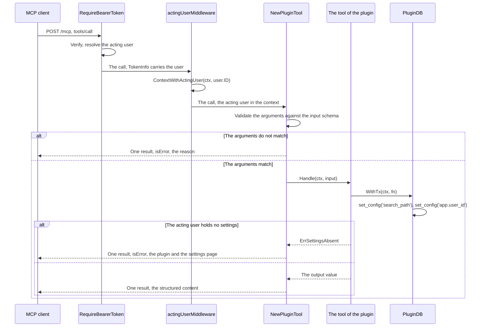

# Specification: The tools that a plugin declares

`spec.md` holds the Model Context Protocol server, the transport, the discovery,
and the verification. This file holds the capability that lets a plugin declare
a tool. `SPC-001` divides the two, because `spec.md` reached the size that
`LNG-013` gives.

## 1. Summary

A plugin declares its tools through one interface in `libs/pluginapi` that names
no type of the Model Context Protocol SDK. A registrar reads them at the load,
prefixes each name with the plugin identifier, and puts each one into the
`MCPToolRegistry` that `MCPHUB-DD-008` already built. The hub infers the input
schema from the model that the plugin declares, validates each call against it,
and hands the tool a context that carries the acting user.

## 2. Coverage

| Requirement       | Where this specification realizes it                          |
| ----------------- | ------------------------------------------------------------- |
| `MCPHUB-FR-007`   | Section 4.1, `MCPHUB-DD-009`, `MCPHUB-SC-008`                 |
| `MCPHUB-FR-008`   | `MCPHUB-DD-011`, `MCPHUB-SC-009`                              |
| `MCPHUB-FR-009`   | `MCPHUB-DD-011`, `MCPHUB-SC-010`                              |
| `MCPHUB-FR-010`   | Section 4.4, `MCPHUB-DD-012`, `MCPHUB-SC-011`                 |
| `MCPHUB-FR-011`   | `MCPHUB-DD-012`, `MCPHUB-SC-012`                              |
| `MCPHUB-FR-012`   | `MCPHUB-DD-014`, `MCPHUB-SC-013`                              |
| `MCPHUB-FR-013`   | Section 4.5, `MCPHUB-DD-013`, `MCPHUB-SC-014`                 |
| `MCPHUB-FR-014`   | `MCPHUB-DD-013`, `MCPHUB-SC-015`                              |
| `MCPHUB-NFR-002`  | `MCPHUB-DD-015`, `MCPHUB-SC-016`                              |
| `MCPHUB-INV-002`  | `MCPHUB-DD-011`, `MCPHUB-SC-009`                              |

## 3. Guideline compliance

| Rule      | Guideline      | How this specification obeys it                                                                 |
| --------- | -------------- | ----------------------------------------------------------------------------------------------- |
| `PLG-006` | Plugin model   | The interface is `pluginapi.MCPToolPlugin`, the registry is `registry.MCPToolRegistry`, and the registrar is `registrar.MCPToolRegistrar`. The loader holds the registrar. |
| `PLG-007` | Plugin model   | `MCPHUB-DD-009` keeps the SDK inside `apps/hub`. A plugin imports `libs/pluginapi` and nothing of the hub. |
| `PLG-011` | Plugin model   | `MCPToolRegistry.Register` already refuses a second tool under one name. `MCPHUB-DD-011` makes a collision between two plugins impossible. |
| `ARC-008` | Architecture   | The registrar reads every plugin through `Supports`. It names no plugin.                        |
| `OWN-003` | Record ownership | `MCPHUB-DD-012` resolves the acting user once, at the entry point, and every tool reads it from the context. |
| `OWN-007` | Record ownership | The acting user reaches the context before the tool runs, so `PluginDB.WithTx` sets `app.user_id`. |
| `OWN-008` | Record ownership | A repository of a plugin writes no filter on `user_id`. The policy does it. This design adds no path around it. |
| `DAT-004` | Data           | A plugin reaches the database through `pluginapi.PluginDB`. A tool adds no other path.          |
| `PKG-003` | Package layout | `mcpserver` already holds `doc.go`.                                                             |
| `BLD-004` | Build          | `libs/pluginapi` changes, so every plugin is rebuilt. Step 8 of the build plan.                 |
| `LOG-003` | Logging        | The registrar logs through the logger of the loader. It adds no component of its own.           |

The plugin API version stays `v1`. `MCPToolPlugin` is a further optional
interface, and a plugin that does not implement it loads unchanged, because
`Registrar.Supports` answers false for it.

## 4. Design

### 4.1 Components

| Path                                                 | Change | Holds                                                                    |
| ---------------------------------------------------- | ------ | ------------------------------------------------------------------------ |
| `libs/pluginapi/mcp.go`                              | Create | `MCPToolPlugin`, `MCPTool`, `MCPToolMeta`, `MCPToolAnnotations`, `NewTypedTool`. |
| `apps/hub/internal/mcpserver/schema.go`              | Create | `inferSchema`, the input schema and its compiled form.                   |
| `apps/hub/internal/mcpserver/plugintool.go`          | Create | `NewPluginTool`, the adapter from `pluginapi.MCPTool` to `registry.MCPTool`. |
| `apps/hub/internal/mcpserver/acting_user.go`         | Create | `actingUserMiddleware`.                                                  |
| `apps/hub/internal/mcpserver/server.go`              | Change | `NewServer` adds `actingUserMiddleware`.                                 |
| `apps/hub/internal/plugin/registrar/mcp_tool.go`     | Create | `MCPToolRegistrar`.                                                      |
| `apps/hub/internal/plugin/loader/loader.go`          | Change | The registrar joins the list.                                            |
| `apps/hub/internal/depresolver/plugin.go`            | Change | `PluginLoader` resolves `MCPToolRegistry()` and passes it to the loader. |
| `apps/hub/internal/handler/mcp.go`                   | Change | The `mcp.Server` is built in `Register`. `MCPHUB-DD-015`.              |
| `apps/hub/internal/domain/errs/errs.go`              | Change | Adds `ErrInvalidMCPToolModel`.                                           |

The contract names no type of the SDK. `MCPHUB-DD-009` gives the reason.

```go
// libs/pluginapi/mcp.go

// MCPToolPlugin is a plugin that exposes a function over the Model Context Protocol.
type MCPToolPlugin interface {
    Plugin
    MCPTools() ([]MCPTool, error)
}

// MCPTool is one function that a plugin exposes over the Model Context Protocol.
// The hub validates input against the schema of Meta().InputModel before it calls
// Handle, so Handle receives a document that the schema accepts.
type MCPTool interface {
    Meta() MCPToolMeta
    Handle(ctx context.Context, input json.RawMessage) (any, error)
}

// MCPToolMeta describes one tool to an MCP client. InputModel and OutputModel are
// each a struct value, and the hub reflects the JSON schema of each one.
type MCPToolMeta struct {
    Name        string
    Title       string
    Description string
    Writes      bool
    InputModel  any
    OutputModel any
}

// NewTypedTool builds an MCPTool whose handler takes and returns its own Go
// types. It fills InputModel and OutputModel from the type arguments, so a
// caller declares each shape once.
func NewTypedTool[In, Out any](
    meta MCPToolMeta,
    handle func(ctx context.Context, input In) (Out, error),
) MCPTool
```

```go
// apps/hub/internal/mcpserver/plugintool.go

// NewPluginTool adapts one tool of a plugin to the registry of the hub. The name
// of the result carries the plugin identifier, so two plugins never collide.
func NewPluginTool(
    pluginID *pluginapi.PluginID,
    tool pluginapi.MCPTool,
) (registry.MCPTool, error)
```

```go
// apps/hub/internal/mcpserver/schema.go

// inferSchema reflects the JSON schema of one model, and compiles it so that a
// call is validated before the tool runs.
func inferSchema(model any) (json.RawMessage, *jsonvalidate.Schema, error)
```

```go
// apps/hub/internal/mcpserver/acting_user.go

// actingUserMiddleware puts the acting user of the verified token into the
// context that every tool handler receives.
func actingUserMiddleware() mcp.Middleware
```

### 4.2 Data model

This feature adds no table. A tool of a plugin reads and writes the schema that
the plugin already owns, through `pluginapi.PluginDB`. `DAT` and `OWN-004`
through `OWN-008` govern no new surface.

### 4.3 Declarations

**MCP tools.** `SPC-003` gives the columns.

| Tool                      | Declared by         | Annotations                        | Realizes                                          |
| ------------------------- | ------------------- | ---------------------------------- | ------------------------------------------------- |
| `<plugin id>_<tool name>` | Any `MCPToolPlugin` | The plugin declares each hint      | `MCPHUB-FR-007`, `MCPHUB-FR-008`, `MCPHUB-FR-012` |

This feature adds no route, no table, no job, and no configuration key. The
tools of the hub keep the names that `spec.md` gives them.

### 4.4 Flow



### 4.5 Errors

| Condition                                                   | Behavior                          | Message                                                           |
| ----------------------------------------------------------- | --------------------------------- | ------------------------------------------------------------------ |
| A plugin declares a model that the hub cannot reflect       | The load of that plugin fails     | `ErrInvalidMCPToolModel`, with the plugin and the tool             |
| Two tools of one plugin carry one name                      | The load of that plugin fails     | `ErrMCPToolAlreadyRegistered`, with the name                       |
| A tool name collides with a tool of the hub                 | The load of that plugin fails     | `ErrMCPToolAlreadyRegistered`, with the name                       |
| The arguments do not match the input schema                 | One result, `isError`             | The field and the reason, from the SDK. `MCPHUB-DD-010`.           |
| The acting user holds no complete settings for the plugin   | One result, `isError`             | The plugin identifier and the path of its settings page            |
| The tool returns any other error                            | One result, `isError`             | The text of the error of the plugin                                |

A failure of a tool is a result with `isError`, never a protocol error, so an
agent reads the reason and continues the conversation.

## 5. Design decisions

### `MCPHUB-DD-009`

**Realizes:** `MCPHUB-FR-007`, `PLG-007`

**Decision:** `libs/pluginapi` names no type of the Model Context Protocol SDK.
A plugin declares a tool as a name, a description, a model for the input, a
model for the output, and a handler that takes `json.RawMessage` and returns
`any`. The hub adapts each one to the SDK.

**Rationale:** Go builds a plugin with `-buildmode=plugin`, and the host and the
plugin must hold the identical version of every shared package. An SDK in the
contract pins all six plugins to one version of it, and a bump rebuilds every
one. The SDK reached v1.8.0 through eight minor releases, a faster pace than
`telego`, `cobra`, and `sqlx`, the packages that `libs/pluginapi` names today.
`NewTypedTool` returns the type safety to the plugin author with generics, and
it needs no SDK.

**Alternatives:** The SDK types in the contract. `mcp.AddTool` is generic, and an
interface carries no type parameter, so the contract would fall back to
`mcp.ToolHandler`. The documentation of the SDK states that this handler
validates no input, infers no schema, and packs no result. That path takes the
dependency and loses the ergonomics that justify it.

### `MCPHUB-DD-010`

**Realizes:** `MCPHUB-FR-007`

**Decision:** `mcpserver.inferSchema` reflects the model of a tool with its own
reflector, and it does not call `settings.Infer`. The reflector runs anonymous,
so the document carries no `$id`. The hub compiles no validator of its own: it
installs each tool with the generic `mcp.AddTool`, instantiated for
`map[string]any`, and hands it the reflected document as `Tool.InputSchema`. The
SDK then validates each call against that document and packs every result.

**Rationale:** `settings.Infer` returns a `settings.Schema` that carries the kind
of each field, the required set, the secret marking, and a 4096 character limit
on every value. Each of those exists for a settings form. A tool input inherits
none of them, and a 4096 character limit on a tool argument would refuse a long
note that a person dictates to an agent. Both functions configure the same
reflector with `ExpandedStruct`, `DoNotReference`, and
`RequiredFromJSONSchemaTags`, so a plugin author writes one kind of struct tag
for both surfaces.

**Alternatives:** Calling `settings.Infer` and discarding the members that a tool
does not use. Fewer lines, and it carries the value limit into a surface that
did not ask for one. Reflecting with the schema library that the SDK carries,
`google/jsonschema-go`. It needs no dependency that the hub lacks, and its
struct tag holds a description and nothing else, so a settings model could never
move to it: `settings.kindOf` reads `WriteOnly` and `Format` to decide which
field the hub encrypts, and `Enum` to decide which field is a choice. One
library for both surfaces is worth more than the tag it saves. Compiling a
validator in the hub and installing with the plain `Server.AddTool`. It repeats
the validation, the error packing, and the structured content that the SDK
already performs, in code that the hub then owns.

### `MCPHUB-DD-011`

**Realizes:** `MCPHUB-FR-008`, `MCPHUB-FR-009`, `MCPHUB-INV-002`

**Decision:** The name of a tool of a plugin is `ToSafeName("_")` of the plugin
identifier, an underscore, and the name that the plugin declared. The
description gains the suffix `(plugin <id>)`.

**Rationale:** `telegram/command/wrapper.go` already rewrites a command name this
way, so `LNG-002` holds: one treatment for one problem, in the one place where a
flat namespace meets a plugin. A plugin identifier is unique, so two plugins
cannot collide, and `MCPHUB-INV-002` holds by construction rather than by a
check that a reader must find.

**Alternatives:** The `Name` of the plugin identifier alone, without the
namespace. It reads better to a model, and two plugins that share a name in two
namespaces then collide. The collision fails the load with a clear error, so it
is safe, and the owner chose the full identifier for consistency with the bot.

### `MCPHUB-DD-012`

**Realizes:** `MCPHUB-FR-010`, `MCPHUB-FR-011`, `OWN-007`

**Decision:** One receiving middleware of the MCP server reads
`req.GetExtra().TokenInfo`, and puts the acting user into the context with
`pluginapi.ContextWithActingUser`. Every tool reads it from the context, and no
tool reads the token.

**Rationale:** `auth.Middleware` and `telegram/middleware.ActingUser` already do
this for the two other entry points, and `OWN-003` names one acting user for
each unit of work. A plugin cannot read `TokenInfo` itself, because
`mcpserver.UserFromTokenInfo` lives in `apps/hub` and `PLG-007` forbids the
import. Without this middleware `PluginDB.WithTx` sets an empty `app.user_id`,
and `OWN-006` then returns zero rows, which an agent reports as an answer.

**Alternatives:** Each adapter reading the token info and building the context
itself. It repeats the step for every tool, and a tool that a later iteration
adds would forget it, with a silent empty result as the only sign.

### `MCPHUB-DD-013`

**Realizes:** `MCPHUB-FR-013`, `MCPHUB-FR-014`

**Decision:** The adapter recognizes `pluginapi.ErrSettingsAbsent` from the
handler of a tool, and answers with a result that names the plugin identifier
and the path of its settings page. The hub reads no setting before the call.

**Rationale:** `settings.Manager.Settings` already returns that error when a
required field holds no value, and a plugin reaches its settings through
`PluginSettings.Get`, which wraps it. So the hub needs no list of the plugins
that require settings, and the tool list costs no read, which is what
`MCPHUB-NFR-002` measures.

**Alternatives:** The hub reading the settings of every plugin before it answers
a tool list, and hiding a tool whose settings are absent. It reads once for each
plugin on each listing, it makes the list differ by person, and an MCP client
that keeps the list holds a stale one.

### `MCPHUB-DD-014`

**Realizes:** `MCPHUB-FR-012`

**Decision:** `MCPToolMeta.Annotations` mirrors the annotation set of the
protocol: the read only hint, the destructive hint, the idempotent hint, and the
open world hint. The hub carries each one to the tool and verifies none of them.
`pluginapi` declares its own struct for them, so a plugin still names no type of
the SDK.

**Rationale:** The hub cannot know what a handler does without running it. Every
member is a hint that an agent reads before it asks a person, and the Model
Context Protocol defines them as hints for that reason. One boolean answered
`MCPHUB-FR-012` and nothing else, and a tool that destroys reads the same as a
tool that appends. The zero value of the struct describes the tool that needs
the most care, so a plugin that declares nothing gets the answer that makes an
agent ask first. A single `Writes` boolean had the opposite default: a plugin
that forgot it advertised a writing tool as one that changes nothing.

**Alternatives:** One boolean for the read only hint. It answers
`MCPHUB-FR-012` and leaves an agent unable to tell a tool that appends from one
that destroys. Naming `mcp.ToolAnnotations` in the contract. It reads the same
and puts the SDK in `libs/pluginapi`, which `MCPHUB-DD-009` refused. The hub
refusing a write from a tool that declares the read only hint. It needs the hub
to detect a write inside the transaction of a plugin, which reaches into
`PluginDB` and turns a hint into a guarantee that this iteration did not ask
for. `MCPHUB-FR-012` states the hint, and the unwanted case of that statement
records the limit.

### `MCPHUB-DD-015`

**Realizes:** `MCPHUB-NFR-002`, `MCPHUB-FR-007`

**Decision:** A tool of a plugin is read once, at the load. `handler.MCP` builds
its `mcp.Server` in `Register`, not in `NewMCP`, and it keeps that one server
for the life of the process. The hub calls `MCPTools()` no second time.

**Rationale:** `depresolver.buildPluginRegistries` resolves `HandlerRegistry()`,
which builds `handler.NewMCP`, and `app.New` resolves the plugin loader before
`app.Run` calls `loadPlugins`. So the handler exists before any plugin registers
a tool, and a server that installed the registry inside `NewMCP` would hold the
three tools of the hub and no tool of any plugin. `HTTPRouter` calls `Register`
on every handler that the registry holds, and `serve http` is the only caller of
`HTTPRouter`, so `Register` runs after the load. `handler.PluginWrapper` reaches
the router in that same pass, so the MCP server reads its registry exactly where
every route of a plugin already reaches its own.

**Alternatives:** Building the server on the first request. It survives a change
to the order in which the resolver builds, and it pays for that with a
construction that no other handler carries, against an order that every route of
a plugin already depends on. Registering the MCP handler after the load, outside
the handler registry. It takes the route out of the one registry that `API-005`
gives every route. Building a server for each request. It gives a tool list that
differs by person, at the cost that `MCPHUB-DD-013` already rejected, and it
reflects every schema again on every call.

## 6. Scenarios

### `MCPHUB-SC-008` (verifies `MCPHUB-FR-007`)

**Layer:** integration

**Given** a loaded plugin declares two tools.
**When** an MCP client lists the tools.
**Then** the list holds both, beside the three tools of the hub.

### `MCPHUB-SC-009` (verifies `MCPHUB-FR-008`, `MCPHUB-INV-002`)

**Layer:** integration

**Given** two loaded plugins each declare a tool named `list`.
**When** the hub loads both.
**Then** an MCP client reaches both tools, under two names, and neither load
fails.

### `MCPHUB-SC-010` (verifies `MCPHUB-FR-009`)

**Layer:** unit

**Given** a plugin with the identifier `dev.maroid.probe` declares a tool.
**When** an MCP client reads the tool list.
**Then** the entry names `dev.maroid.probe`.

### `MCPHUB-SC-011` (verifies `MCPHUB-FR-010`)

**Layer:** integration

**Given** two active user records, and one plugin tool that reads a scoped table.
**When** each record calls that tool with its own token.
**Then** each reads only the rows that its own record owns, and neither reads a
row of the other.

### `MCPHUB-SC-012` (verifies `MCPHUB-FR-011`)

**Layer:** integration

**Given** a plugin tool that inserts one row into a scoped table.
**When** an MCP client calls it.
**Then** the row exists, and its `user_id` names the acting user of the call.

### `MCPHUB-SC-013` (verifies `MCPHUB-FR-012`)

**Layer:** unit

**Given** one tool declares the read only hint, another declares the idempotent
hint and the open world hint, and a third declares none.
**When** an MCP client lists the tools.
**Then** each entry carries the hints that its plugin declared, and the third
reads as a tool that writes and may destroy.

### `MCPHUB-SC-014` (verifies `MCPHUB-FR-013`)

**Layer:** integration

**Given** a plugin that requires a setting, and an acting user who filled none.
**When** an MCP client calls a tool of that plugin.
**Then** the result carries `isError`, and the text names the plugin identifier
and the path of its settings page.

### `MCPHUB-SC-015` (verifies `MCPHUB-FR-014`)

**Layer:** integration

**Given** the same plugin and the same acting user as `MCPHUB-SC-014`.
**When** that MCP client lists the tools.
**Then** the tool of that plugin is in the list.

### `MCPHUB-SC-016` (measures `MCPHUB-NFR-002`)

**Layer:** integration

**Given** two loaded plugins, one of which requires a setting.
**When** an MCP client lists the tools.
**Then** the hub runs zero database statements to answer the listing.

## 7. Build plan

| #   | Step                                                                                      | Realizes                          | Done |
| --- | ----------------------------------------------------------------------------------------- | --------------------------------- | ---- |
| 1   | Create `pluginapi.MCPToolPlugin`, `MCPTool`, `MCPToolMeta`, and `NewTypedTool`.           | `MCPHUB-FR-007`, `MCPHUB-DD-009`  | [x]  |
| 2   | Create `mcpserver.inferSchema`, anonymous, with no validator of its own. Add `errs.ErrInvalidMCPToolModel`. | `MCPHUB-DD-010`                   | [x]  |
| 3   | Create `mcpserver.actingUserMiddleware`, and add it in `NewServer`.                       | `MCPHUB-FR-010`, `MCPHUB-DD-012`  | [x]  |
| 4   | Create `mcpserver.NewPluginTool`: the name, the schema, the validation, the result.       | `MCPHUB-FR-008`, `MCPHUB-FR-009`, `MCPHUB-FR-012`, `MCPHUB-DD-011`, `MCPHUB-DD-014` | [x]  |
| 5   | Map `pluginapi.ErrSettingsAbsent` in the adapter.                                         | `MCPHUB-FR-013`, `MCPHUB-DD-013`  | [x]  |
| 6   | Create `registrar.MCPToolRegistrar`, and add it to the list in the loader.                | `MCPHUB-FR-007`, `MCPHUB-INV-002` | [x]  |
| 7   | Change `depresolver.PluginLoader` to resolve `MCPToolRegistry()` and pass it. Build the server of `handler.MCP` in `Register`. | `MCPHUB-DD-015`                   | [x]  |
| 8   | Build every plugin. `libs/pluginapi` changed.                                             | `BLD-004`                         | [x]  |
| 9   | Declare one tool in one plugin, as the first caller of the contract.                      | `MCPHUB-FR-011`, `MCPHUB-SC-012`  | [x]  |

## 8. Out of scope for this specification

- A guarantee that a tool which declares `Writes: false` writes nothing.
  `MCPHUB-DD-014` gives the reason.
- A tool of a plugin that streams progress. `MCPHUB-DD-003` holds for every tool.
- A prompt and a resource of the Model Context Protocol.

## Retired identifiers

This file has no retired identifier.
