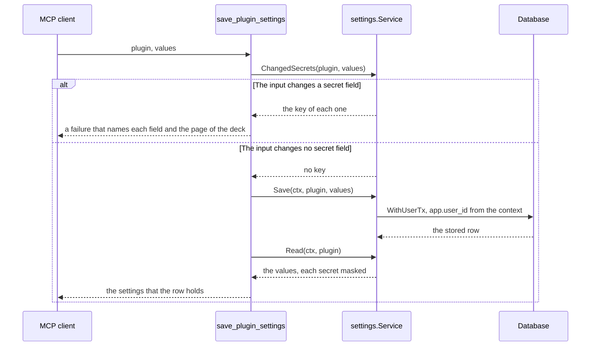

# Specification: The settings tools of the hub

`spec.md` holds the Model Context Protocol server, the transport, the discovery,
and the verification. `spec-plugin-tools.md` holds the capability that lets a
plugin declare a tool. This file holds the two tools that read and write the
settings of a plugin. `SPC-001` divides them.

## 1. Summary

The hub declares two more tools of its own: `get_plugin_settings` reports the
settings schema of one plugin, the key of each secret field, and the stored
values of the acting user; `save_plugin_settings` stores the values that the
call names and answers with the row that the save left. Both call the
`settings.Service` that the deck already calls, so the mask, the merge, and the
validation of `PSET` hold with no second copy. The save refuses a call that
changes a secret field, and it names the page of the deck that fills one.

## 2. Coverage

| Requirement     | Where this specification realizes it                            |
| --------------- | --------------------------------------------------------------- |
| `MCPHUB-FR-015` | Section 4.3, `MCPHUB-DD-016`, `MCPHUB-DD-017`, `MCPHUB-SC-017`, `MCPHUB-SC-018` |
| `MCPHUB-FR-016` | Section 4.3, `MCPHUB-DD-016`, `MCPHUB-SC-017`, `MCPHUB-SC-025`  |
| `MCPHUB-FR-017` | Section 4.3, `MCPHUB-DD-019`, `MCPHUB-SC-019`                   |
| `MCPHUB-FR-018` | Section 4.5, `MCPHUB-DD-020`, `MCPHUB-SC-020`                   |
| `MCPHUB-FR-019` | Section 4.4, `MCPHUB-DD-018`, `MCPHUB-SC-021`, `MCPHUB-SC-022`, `MCPHUB-SC-023`, `MCPHUB-SC-024` |

## 3. Guideline compliance

| Rule      | Guideline        | How this specification obeys it                                                      |
| --------- | ---------------- | -------------------------------------------------------------------------------------- |
| `ARC-008` | Architecture     | Both tools take a plugin identifier from the call and read `settings.Service`. Neither names a plugin. |
| `PLG-011` | Plugin model     | `MCPToolRegistry.Register` refuses a second tool under one name. The two names are bare, and a tool of a plugin carries its plugin identifier, so neither can collide. |
| `OWN-006` | Record ownership | `database.WithUserTx` sets `app.user_id` before the first statement of a read and of a save. The policy filters the row. |
| `OWN-007` | Record ownership | `actingUserMiddleware` already puts the acting user into the context of every tool call. Both tools pass that context to the service. |
| `OWN-005` | Record ownership | `repository.PluginSettings` names no user in a statement. The policy sets the owner. |
| `LOG-008` | Logging          | `MCPHUB-DD-020` maps every failure to a text that names a field and never a value. |
| `GO-005`  | Go style         | The design adds no sentinel error. It reuses `errs.ErrSettingsSchemaNotFound` and `settings.InvalidError`. |
| `TST-004` | Testing          | Section 6 gives the layer of each scenario.                                          |

## 4. Design

### 4.1 Components

| Path                                              | Change | Holds                                                                |
| -------------------------------------------------- | ------ | ---------------------------------------------------------------------- |
| `apps/hub/internal/settings/service.go`           | Change | `Service` gains `SecretFields` and `ChangedSecrets`. `Manager` implements both. |
| `apps/hub/internal/mcpserver/settings_page.go`    | Create | `SettingsPath`. One definition of the page that fills the settings of a plugin. |
| `apps/hub/internal/mcpserver/plugintool.go`       | Change | `reasonOf` calls `SettingsPath`. Deletes `settingsPathFormat`.       |
| `apps/hub/internal/mcpserver/tools/settings.go`   | Create | `settingsAccess`, which both tools embed. It reads the stored settings and maps each failure. |
| `apps/hub/internal/mcpserver/tools/settings_get.go` | Create | `NewGetPluginSettings`.                                            |
| `apps/hub/internal/mcpserver/tools/settings_save.go` | Create | `NewSavePluginSettings`.                                          |
| `apps/hub/internal/mcpserver/tools/doc.go`        | Change | The package comment names the file that carries no tool.             |
| `apps/hub/internal/depresolver/mcp.go`            | Change | `MCPToolRegistry` resolves `SettingsService` and registers both tools. |
| `apps/hub/internal/handler/mcp_test.go`           | Change | `stubSettings` gains the two methods that `Service` gained.          |

Each constructor takes a `*slog.Logger`, because `MCPHUB-DD-020` gives the tool
the one line that reports a failure which names no field.

```go
// apps/hub/internal/mcpserver/tools/settings.go

// settingsAccess holds what both settings tools read.
type settingsAccess struct {
    logger      *slog.Logger
    settingsSvc settings.Service
}

// stored reads the key of each secret field and the values of the acting user.
func (a *settingsAccess) stored(
    ctx context.Context,
    pluginID string,
) ([]string, map[string]any, error)

// failure turns a failure of the settings service into the text that an agent reads.
func (a *settingsAccess) failure(ctx context.Context, pluginID string, err error) error
```

```go
// apps/hub/internal/settings/service.go

// SecretFields names each secret field that the plugin declares, in one order.
func (m *Manager) SecretFields(pluginID string) ([]string, error)

// ChangedSecrets names each secret field that the input changes, in one order.
// A value that is the mask changes nothing. A value that is null or empty
// removes the stored secret, and that is a change.
func (m *Manager) ChangedSecrets(pluginID string, input map[string]any) ([]string, error)
```

```go
// apps/hub/internal/mcpserver/settings_page.go

// SettingsPath names the page where a person fills the settings of a plugin.
func SettingsPath(pluginID string) string
```

```go
// apps/hub/internal/mcpserver/tools/settings_get.go

// GetPluginSettingsInput names the plugin to report.
type GetPluginSettingsInput struct {
    Plugin string `json:"plugin" jsonschema:"the plugin identifier"`
}

// GetPluginSettingsOutput reports the settings schema and the stored values.
type GetPluginSettingsOutput struct {
    Plugin       string         `json:"plugin"`
    Schema       map[string]any `json:"schema"`
    SecretFields []string       `json:"secret_fields"`
    Values       map[string]any `json:"values"`
}

// NewGetPluginSettings builds the tool that reports the settings of a plugin.
func NewGetPluginSettings(logger *slog.Logger, settingsSvc settings.Service) registry.MCPTool
```

```go
// apps/hub/internal/mcpserver/tools/settings_save.go

// SavePluginSettingsInput carries the values to store.
type SavePluginSettingsInput struct {
    Plugin string         `json:"plugin" jsonschema:"the plugin identifier"`
    Values map[string]any `json:"values" jsonschema:"one member for each field to store"`
}

// SavePluginSettingsOutput reports the settings that the row holds after the save.
type SavePluginSettingsOutput struct {
    Plugin       string         `json:"plugin"`
    SecretFields []string       `json:"secret_fields"`
    Values       map[string]any `json:"values"`
}

// NewSavePluginSettings builds the tool that stores the settings of a plugin.
func NewSavePluginSettings(logger *slog.Logger, settingsSvc settings.Service) registry.MCPTool
```

`github.com/google/jsonschema-go` infers the input schema from the struct, and it
marks a field required when the field carries no `omitempty` tag. Both members of
each input are required.

### 4.2 Data model

This feature adds no table. It reads and writes `public.plugin_settings` through
the service that `PSET` built. `DAT` and `OWN-004` govern no new surface.

### 4.3 Declarations

| Tool                   | Declared by | Annotations                          | Realizes                                          |
| ---------------------- | ----------- | ------------------------------------ | ------------------------------------------------- |
| `get_plugin_settings`  | The hub     | `ReadOnlyHint: true`                 | `MCPHUB-FR-015`, `MCPHUB-FR-016`                  |
| `save_plugin_settings` | The hub     | `IdempotentHint: true`               | `MCPHUB-FR-017`, `MCPHUB-FR-018`, `MCPHUB-FR-019` |

`save_plugin_settings` leaves `DestructiveHint` at the default that the protocol
gives it, which is true. A save overwrites a value that a person stored, so the
hub asserts nothing smaller. `MCPHUB-FR-012` reads the two annotations.

This feature adds no HTTP route, so it carries no change to `api.yaml`.

### 4.4 Flow



### 4.5 Errors

| Condition                                       | The text that the agent reads                                      |
| ----------------------------------------------- | -------------------------------------------------------------------- |
| The plugin declares no settings schema          | "the plugin `<id>` declares no settings"                            |
| The input changes a secret field                | "a secret field changes in the deck only: `<keys>`. Fill it at `<path>`" |
| A value does not match the settings schema      | "the settings do not match the schema: `<key>`: `<reason>`", one pair for each field |
| Anything else                                   | "the settings request failed"                                       |

Each text names a field and never a value. The tool sorts the keys, so two
identical calls read one text.

## 5. Design decisions

### `MCPHUB-DD-016`

**Realizes:** `MCPHUB-FR-015`, `MCPHUB-FR-016`

**Decision:** Two tools carry this feature. `get_plugin_settings` answers the
settings schema, the key of each secret field, and the stored values of the
acting user in one result.

**Rationale:** An agent that changes one field needs all three facts: the fields
that exist, the field it must not touch, and the values that the row holds. One
call gives them, and an agent that keeps the result holds a consistent set.
`MCPHUB-NFR-002` measures the tool listing, not a call, so a tool that reads the
database on a call breaks no statement.

**Alternatives:** Three tools, one for each of the two HTTP routes plus the
values. Mirrors the routes, and costs a second call before any write, for a
result that no agent uses on its own.

### `MCPHUB-DD-017`

**Realizes:** `MCPHUB-FR-015`, `MCPHUB-FR-019`

**Decision:** The result carries the JSON Schema document that
`GET /plugins/{id}/settings/schema` serves, decoded into a `map[string]any`, and
beside it `secret_fields`, the key of each secret field.

**Rationale:** `PSET-DD-001` made the document the one contract of a settings
schema, and a second shape of one fact drifts from it. The document already
marks a secret with `"format": "password"` and `"writeOnly": true`, and an agent
that reads those two keywords wrongly loses a call to the rejection that
`MCPHUB-FR-019` gives. `secret_fields` names that fact outright, and it comes
from `settings.Schema.Kinds`, the same source the document comes from.

**Alternatives:** A field list with an explicit kind for each field. Reads well,
and it gives one fact two shapes and a new member on `settings.Schema`. The
document alone, with no secret list. One member smaller, and it moves the cost
of a wrong reading to the agent.

### `MCPHUB-DD-018`

**Realizes:** `MCPHUB-FR-019`

**Decision:** `settings.Service` gains `ChangedSecrets`, which names each secret
field that an input changes. The save tool calls it first, and it refuses the
call when the answer holds a key. The `Save` path of the service changes by zero
lines, so the deck keeps every field it had.

**Rationale:** The settings package owns the mask rule that `keepsSecret` holds,
and that rule decides which input changes a secret. A second copy of it at the
entry point goes stale the day the mask changes. The refusal stays at the entry
point, because the rule is about the MCP client, not about the settings.

**Alternatives:** A `Kinds` method, and the comparison against
`settings.SecretMask` inside the tool. One method instead of two, and it copies
the mask rule into a second package. A flag on `Save`. Puts an entry point
policy into the one path that the deck also calls.

### `MCPHUB-DD-019`

**Realizes:** `MCPHUB-FR-017`

**Decision:** `save_plugin_settings` reads the settings after it stores them, and
it answers with the values and the secret keys, in the shape that
`get_plugin_settings` gives.

**Rationale:** An agent reports to a person what it changed. The read that
follows the save costs one statement, and it answers from the row, not from the
input, so a merge that kept a field shows as it is. See `PSET-FR-006`.

**Alternatives:** An empty answer, the way the HTTP route answers 204. Smaller,
and every agent that reports the new state then calls the read tool.

### `MCPHUB-DD-020`

**Realizes:** `MCPHUB-FR-018`, `LOG-008`

**Decision:** `settingsAccess.failure` maps each failure of the service to the
text of section 4.5. It names each field of a `*settings.InvalidError` with its
reason, sorted by key, and it answers anything else with one fixed text.

**Rationale:** `InvalidError.Error()` names the fields and no reason, and an
agent that reads "the field is required" corrects the call without a question to
the person. The fixed text for anything else keeps a wrapped failure out of the
result, because a wrapped failure is the one path that can carry a value that
the call sent. The SDK packs the error that a tool returns into the result, with
`IsError` set, and the method itself succeeds, so no middleware writes that
error to a log. The tool logs the cause of a failure that names no field,
because nothing else does, and `handler.Plugin.failSettings` logs the same cause
for the deck. Neither the line nor the result holds a value that the call sent.

**Alternatives:** The error of the service, wrapped and returned as it is. One
line, and it sends the text of a validation library to an agent and to a log.

## 6. Scenarios

### `MCPHUB-SC-017` (verifies `MCPHUB-FR-015`, `MCPHUB-FR-016`)

**Layer:** unit

**Given** a plugin declares a text field and a secret field, and the acting user
stored a value for each.
**When** an MCP client calls `get_plugin_settings` with that plugin.
**Then** the result carries the schema document, `secret_fields` names the secret
field, and the values name the text and the mask.

### `MCPHUB-SC-018` (verifies `MCPHUB-FR-015`)

**Layer:** unit

**Given** the hub loaded no plugin with the identifier that the call names.
**When** an MCP client calls `get_plugin_settings`.
**Then** the call fails with a text that names that identifier, and the result
carries no schema.

### `MCPHUB-SC-019` (verifies `MCPHUB-FR-017`)

**Layer:** integration

**Given** the acting user stored two fields of a plugin.
**When** an MCP client calls `save_plugin_settings` with one of them changed.
**Then** the row holds the new value and the value of the other field, and the
result reports both.

### `MCPHUB-SC-020` (verifies `MCPHUB-FR-018`)

**Layer:** unit

**Given** a save that leaves a required field empty and names a field that the
settings schema does not declare.
**When** the hub rejects it.
**Then** the text names both fields, each with its reason.

### `MCPHUB-SC-021` (verifies `MCPHUB-FR-019`)

**Layer:** integration

**Given** the acting user stored a secret for a plugin.
**When** an MCP client calls `save_plugin_settings` with a new value for that
secret field and a new value for a text field.
**Then** the call fails, the row holds the secret that it held, and the row holds
the text value that it held.

### `MCPHUB-SC-022` (verifies `MCPHUB-FR-019`)

**Layer:** integration

**Given** the acting user stored a secret for a plugin.
**When** an MCP client calls `save_plugin_settings` with the mask for that secret
field and a new value for a text field.
**Then** the hub stores the text value, and the row holds the secret that it
held.

### `MCPHUB-SC-023` (verifies `MCPHUB-FR-019`)

**Layer:** unit

**Given** a settings schema that declares one secret field.
**When** `ChangedSecrets` reads an input that names that field with null.
**Then** it names that field, because a removal changes the stored secret.

### `MCPHUB-SC-024` (verifies `MCPHUB-FR-019`, `LOG-008`)

**Layer:** integration

**Given** a logger that records every line of the Model Context Protocol server.
**When** an MCP client calls `save_plugin_settings` with a credential for a
secret field.
**Then** no recorded line holds that credential, and the text that the client
reads holds no part of it.

### `MCPHUB-SC-025` (verifies `MCPHUB-FR-016`, `OWN-006`)

**Layer:** integration

**Given** two users each stored a value for one field of one plugin.
**When** each calls `get_plugin_settings` for that plugin.
**Then** each reads the value that they stored, and neither reads the value of
the other.

## 7. Build plan

| #   | Step                                                                                              | Realizes                        | Done |
| --- | --------------------------------------------------------------------------------------------------- | ----------------------------------- | ---- |
| 1   | Add `SecretFields` and `ChangedSecrets` to `settings.Service` and to `Manager`. Extend `stubSettings`. | `MCPHUB-DD-018`                 | [x]  |
| 2   | Create `mcpserver.SettingsPath`. Change `reasonOf` to call it.                                    | `MCPHUB-DD-020`                 | [x]  |
| 3   | Create `tools/settings.go` with `settingsAccess`. Change `tools/doc.go`.                          | `MCPHUB-FR-018`, `MCPHUB-DD-020` | [x]  |
| 4   | Create `tools/settings_get.go`.                                                                   | `MCPHUB-FR-015`, `MCPHUB-FR-016`, `MCPHUB-DD-016`, `MCPHUB-DD-017` | [x]  |
| 5   | Create `tools/settings_save.go`.                                                                  | `MCPHUB-FR-017`, `MCPHUB-FR-019`, `MCPHUB-DD-018`, `MCPHUB-DD-019` | [x]  |
| 6   | Register both tools in `depresolver.MCPToolRegistry`, which resolves `SettingsService` and passes `Logger`. | `MCPHUB-DD-016`        | [x]  |
| 7   | Check the item off in `specs/work/todo.md`.                                                       | None                            | [x]  |

`TST-002` puts the test of each step before the code of that step.

## 8. Out of scope for this specification

- A tool that reports the settings of every plugin in one call. Section 3 of the
  requirements holds it.
- A change to the two HTTP routes of `PSET`. The deck keeps every field it had,
  the secret field included.

## Retired identifiers

This file has no retired identifier.
