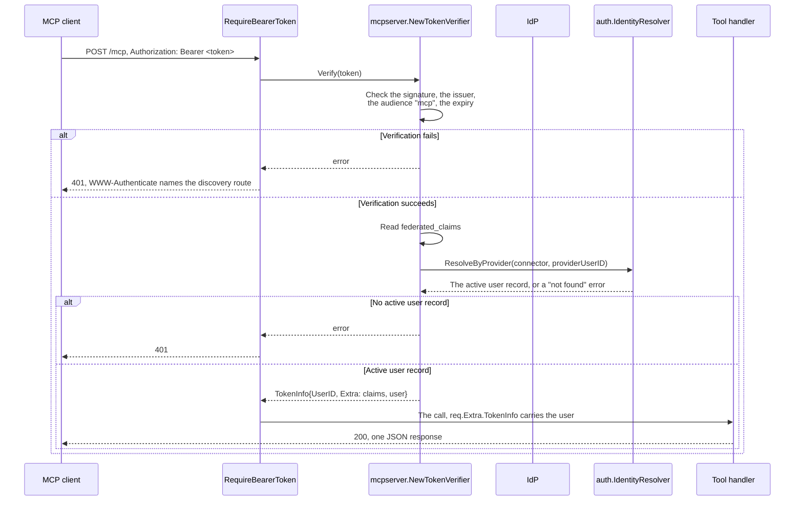

# Specification: The hub as a Model Context Protocol server

This file holds the server, the transport, the discovery, and the verification.
[`spec-plugin-tools.md`](spec-plugin-tools.md) holds the capability that lets a
plugin declare a tool. [`spec-settings-tools.md`](spec-settings-tools.md) holds
the two tools that read and write the settings of a plugin. `SPC-001` divides
them.

## 1. Summary

The hub becomes a Model Context Protocol server. It serves discovery metadata
so an MCP client finds the IdP with no client secret, verifies the bearer
token that the IdP mints for the "mcp" client against the key set of the IdP,
resolves the acting user the same way an HTTP request does, and answers three
tools: identity, plugin list, and connectivity.

## 2. Coverage

| Requirement       | Where this specification realizes it     |
| ------------------ | ----------------------------------------- |
| `MCPHUB-FR-001`   | Section 4.3, `MCPHUB-DD-004`, `MCPHUB-SC-001` |
| `MCPHUB-FR-002`   | Section 4.4, `MCPHUB-DD-001`, `MCPHUB-SC-002` |
| `MCPHUB-FR-003`   | Section 4.4, `MCPHUB-DD-002`, `MCPHUB-SC-003` |
| `MCPHUB-FR-004`   | Section 4.4, `MCPHUB-DD-006`, `MCPHUB-DD-008`, `MCPHUB-SC-004` |
| `MCPHUB-FR-005`   | Section 4.3, `MCPHUB-DD-007`, `MCPHUB-DD-008`, `MCPHUB-SC-005` |
| `MCPHUB-FR-006`   | Section 4.4, `MCPHUB-DD-008`, `MCPHUB-SC-006` |
| `MCPHUB-NFR-001`  | `MCPHUB-DD-001`, `MCPHUB-SC-007`          |
| `MCPHUB-INV-001`  | `MCPHUB-DD-002`, `MCPHUB-SC-003`          |

## 3. Guideline compliance

| Rule      | Guideline    | How this specification obeys it                                            |
| --------- | ------------ | ---------------------------------------------------------------------------- |
| `ARC-010` | Architecture | The MCP server mounts on the router of `maroid serve http` only. `worker` loads no HTTP route. |
| `ARC-008` | Architecture | The plugin list tool reads `registry.PluginRegistry`, the same source `GET /plugins` reads. It names no plugin. |
| `API-002` | HTTP API     | `/mcp` and the discovery routes register on the same router, so every middleware that `API-002` names still applies. `API-002` names no authentication step, so it asks nothing more: `MCPHUB-DD-001` is the authentication of `/mcp`, not `auth.Middleware`. |
| `API-003` | HTTP API     | Adds `/.well-known/oauth-protected-resource*` and `/mcp` to the fixed prefix list. |
| `API-005` | HTTP API     | `handler.MCP` implements `handler.Handler`. |
| `API-006` | HTTP API     | `MCPHUB-DD-003` answers every call with one JSON response. |
| `SEC-002` | Security     | `MCPHUB-DD-001` verifies against the key set of the IdP, with the audience of the "mcp" client. |
| `SEC-004` | Security     | `MCPHUB-DD-002` rejects a call whose identity holds no active user record. |
| `OWN-003` | Record ownership | `MCPHUB-DD-002` resolves the acting user through the same `auth.IdentityResolver` an HTTP request uses. |
| `OWN-007` | Record ownership | A tool that reaches a scoped table sets `app.user_id` through `pluginapi.ContextWithActingUser` before its first statement. No tool of this iteration does. |
| `LOG-003` | Logging      | The logging middleware of the MCP server adds `component=middleware`, `middleware=mcp`, both already in use. |
| `PLG-006` | Plugin model | `MCPHUB-DD-008` builds the registry. `spec-plugin-tools.md` adds the interface and the registrar. |
| `PKG-001` | Package layout | `mcpserver/tools/` holds one file for each tool, the layout the table already gives `telegram/command/`. |
| `CFG-003` | Configuration | `mcp.client_id` declares its default in a `default` tag and its check in a `validate` tag. `MCPHUB-DD-001` gives the field. |

## 4. Design

### 4.1 Components

| Path                                          | Change | Holds                                                                 |
| ---------------------------------------------- | ------ | ---------------------------------------------------------------------- |
| `apps/hub/internal/config/config.go`          | Change | The `MCP` section, the key `mcp.client_id`, default `mcp`.            |
| `apps/hub/internal/registry/plugin_entry.go`  | Create | `PluginEntry`, `PluginEntries`                                        |
| `apps/hub/internal/registry/mcp_tool.go`      | Create | `MCPTool`, `MCPToolRegistry`                                          |
| `apps/hub/internal/domain/errs/errs.go`       | Change | Adds `ErrMCPToolAlreadyRegistered`.                                    |
| `apps/hub/internal/handler/plugin.go`         | Change | `List` calls `registry.PluginEntries`. Deletes the local `pluginEntry` type. |
| `apps/hub/internal/mcpserver/verifier.go`     | Create | `NewTokenVerifier`, `ClaimsFromTokenInfo`. Verifies against the IdP, then resolves and rejects. |
| `apps/hub/internal/mcpserver/server.go`       | Create | `NewServer` installs every tool of a `*registry.MCPToolRegistry`. It names no tool itself. |
| `apps/hub/internal/mcpserver/logging.go`      | Create | `loggingMiddleware`, `component=middleware`, `middleware=mcp`.        |
| `apps/hub/internal/mcpserver/tools/doc.go`    | Create | The package comment. `PKG-003`.                                       |
| `apps/hub/internal/mcpserver/tools/whoami.go` | Create | `NewWhoAmI`, the identity tool.                                        |
| `apps/hub/internal/mcpserver/tools/plugins.go` | Create | `NewListPlugins`, the plugin list tool.                               |
| `apps/hub/internal/mcpserver/tools/ping.go`   | Create | `NewPing`, the connectivity tool.                                      |
| `apps/hub/internal/handler/mcp.go`            | Create | `MCP`, `NewMCP`. Takes `cfg`, `logger`, `oidcSvc`, a `resolver auth.IdentityResolver`, and a `toolRegistry *registry.MCPToolRegistry`. `StreamableHTTPOptions` sets `Stateless`, `JSONResponse`, `Logger`. |
| `apps/hub/internal/depresolver/mcp.go`        | Create | `MCPToolRegistry()`. Builds the registry and registers each tool of `mcpserver/tools`, one constructor at a time. |
| `apps/hub/internal/depresolver/server.go`     | Change | `buildMCPHandler` resolves `IdentityResolver` and `MCPToolRegistry()`, and passes both to `handler.NewMCP`. |
| `specs/features/mcphub/api.yaml`              | Create | The OpenAPI description of the two routes.                            |

`apps/hub/internal/mcpserver/tools/` mirrors
`apps/hub/internal/telegram/command/`: one file for each tool, and no file
that lists every tool. `apps/hub/internal/depresolver/telegram.go` calls
`tgcommand.NewHelp(...)` and `tgcommand.NewStart(...)` by name, one at a
time; `depresolver/mcp.go` calls `tools.NewWhoAmI()`,
`tools.NewListPlugins(...)`, and `tools.NewPing()` the same way.

`registry.PluginEntry` replaces `handler.pluginEntry`. The two handlers that
report a loaded plugin, `GET /plugins` and the plugin list tool, read one
function, so `MCPHUB-FR-005`'s "same shape" invariant holds by construction,
not by two structs that a reader keeps in sync by hand.

```go
// apps/hub/internal/registry/plugin_entry.go

// PluginEntry is the report of one loaded plugin.
type PluginEntry struct {
    ID       string                `json:"id"`
    Version  string                `json:"version"`
    Settings bool                  `json:"settings"`
    UI       *pluginapi.UIManifest `json:"ui,omitempty"`
}

// PluginEntries reports every loaded plugin.
func PluginEntries(
    pluginRegistry *PluginRegistry,
    uiRegistry *UIRegistry,
    settingsSvc settings.Service,
) []PluginEntry
```

```go
// apps/hub/internal/registry/mcp_tool.go

// MCPTool is one function that Maroid exposes over the Model Context
// Protocol. Install adds it to a server, with its own input and output
// types. Two MCPTool values do not share a Name.
type MCPTool struct {
    Name    string
    Install func(server *mcp.Server)
}

// MCPToolRegistry is a registry for MCP tools. PLG-011 governs Register.
type MCPToolRegistry struct { /* ... */ }

func NewMCPToolRegistry() *MCPToolRegistry
func (r *MCPToolRegistry) Register(tools ...MCPTool) error
func (r *MCPToolRegistry) All() []MCPTool
```

`Install` keeps each tool's own input and output type inside its own closure,
so the registry stores one uniform value while `mcp.AddTool[In, Out]` still
infers the JSON schema of each tool from its own Go types, with no loss of
that check. `MCPHUB-DD-008` gives the reason a registry exists this iteration.

```go
// apps/hub/internal/mcpserver/verifier.go

// NewTokenVerifier builds a TokenVerifier that checks a bearer token against
// the key set of the IdP, with clientID as the audience, then resolves the
// acting user of the identity it names.
func NewTokenVerifier(
    oidcSvc *auth.OIDCService,
    resolver auth.IdentityResolver,
    clientID string,
) mcpauth.TokenVerifier
```

The `mcpauth.TokenInfo` that the verifier returns carries `TokenInfo.UserID`,
the Maroid user identifier, and `TokenInfo.Extra` holds two entries: `"claims"`
(`*auth.Claims`) and `"user"` (`*model.User`). `ClaimsFromTokenInfo` in
`verifier.go` reads the first. A tool in `mcpserver/tools` imports
`mcpserver` for both.

```go
// apps/hub/internal/mcpserver/server.go

// NewServer builds the Model Context Protocol server of the hub, with every
// tool of toolRegistry installed.
func NewServer(logger *slog.Logger, toolRegistry *registry.MCPToolRegistry) *mcp.Server
```

```go
// apps/hub/internal/mcpserver/tools/whoami.go

// NewWhoAmI builds the identity tool: the name and the provider of the
// acting user.
func NewWhoAmI() registry.MCPTool
```

```go
// apps/hub/internal/mcpserver/tools/plugins.go

// NewListPlugins builds the plugin list tool.
func NewListPlugins(
    pluginRegistry *registry.PluginRegistry,
    uiRegistry *registry.UIRegistry,
    settingsSvc settings.Service,
) registry.MCPTool
```

```go
// apps/hub/internal/mcpserver/tools/ping.go

// NewPing builds the connectivity tool.
func NewPing() registry.MCPTool
```

### 4.2 Data model

This feature adds no table. It reads `public.identities` and `public.users`
through the `auth.IdentityResolver` that `EXTID-DD-012` already built. `DAT`
and `OWN-004` through `OWN-008` govern no new surface.

### 4.3 Declarations

**HTTP routes.** `api.yaml` holds the bodies. See `SPC-002`.

| Method    | Path                                          | Access                | Realizes                        |
| --------- | ---------------------------------------------- | ---------------------- | -------------------------------- |
| `GET`     | `/.well-known/oauth-protected-resource`       | Public                 | `MCPHUB-FR-001`                  |
| `GET`     | `/.well-known/oauth-protected-resource/mcp`   | Public                 | `MCPHUB-FR-001`                  |
| `POST`    | `/mcp`                                        | Bearer, MCP audience   | `MCPHUB-FR-002` through `MCPHUB-FR-006` |
| `GET`, `DELETE` | `/mcp`                                   | Bearer, MCP audience   | Rejected. See section 4.5.       |

### 4.4 Flow



The discovery flow: an MCP client with no token requests
`/.well-known/oauth-protected-resource/mcp` first, per RFC 9728 section 3.1,
falls back to the bare path when a server holds no route for the first one,
reads `authorization_servers`, and continues with the IdP from there. `D`
(the IdP) takes no further part until the token exchange, which stays
between the MCP client and the IdP.

### 4.5 Errors

Every failure of the transport answers with a problem, and a JSON-RPC error inside a
tool call does not. `ERR-001` gives both.

| Condition                                                 | Status | Type                 |
| --------------------------------------------------------- | ------ | ---------------------- |
| No bearer token                                           | 401    | `access-denied`      |
| The token fails verification                              | 401    | `access-denied`      |
| The identity behind the token holds no active user record | 401    | `access-denied`      |
| A `GET` or a `DELETE` reaches `/mcp`                      | 405    | `method-not-allowed` |

The three conditions of a 401 answer with one type and one title, so a caller learns
nothing about which account exists. None carries a `detail`. The reason from the
verifier reaches the log, because `ERR-005` keeps the text of an error out of a body.
The 401 keeps its `WWW-Authenticate` header, which names the discovery route.

## 5. Design decisions

### `MCPHUB-DD-001`

**Realizes:** `MCPHUB-FR-002`, `MCPHUB-NFR-001`

**Decision:** The verifier checks the token as a JWT against the key set of
the IdP, with a verifier scoped to the client identifier that `mcp.client_id`
holds (`oidcSvc.VerifierForClient(clientID)`), the same mechanism `SEC-002`
already gives an ID token. The field defaults to `mcp`. It takes its own
section, not a member of `oidc`, because `oidc` holds the client secret and
the redirect address of the hub itself, and the MCP client is a public client
that holds neither.

**Rationale:** The IdP mints its access token the same way it mints an ID
token, one signed JWT with the client as the audience. A local check against
the key set that the hub already holds in memory costs one signature check,
not one network call, so `MCPHUB-NFR-001` holds without a cache.

**Alternatives:** Calling the userinfo endpoint of the IdP on each call.
Works, and it is closer to the general OAuth pattern of an opaque token, but
it calls the IdP on every verification and does not carry the true expiry of
the token, only what the hub decides to grant it. Introspection (`RFC 7662`,
which the IdP exposes) gives the true expiry, but it needs the hub to hold
its own client credentials with the IdP for the introspection call, a second
secret this feature does not otherwise need.

The client identifier as a literal in the code. One line shorter, and it forces
a code change on a deployment whose IdP names that client anything else.
`CFG-007` puts a value of the installation in the configuration, and section 3
of the requirements already calls provisioning that client a deployment
concern.

### `MCPHUB-DD-002`

**Realizes:** `MCPHUB-FR-003`, `MCPHUB-INV-001`, `OWN-003`

**Decision:** The token verifier resolves the acting user in the same call
that verifies the token, through `auth.IdentityResolver.ResolveByProvider`,
and returns an error when no active user record answers. `MCPHUB-DD-001`'s
verifier and this resolution share one function, `mcpserver.NewTokenVerifier`.

**Rationale:** `auth.Middleware` already combines the two steps for an HTTP
request in one function, `resolve()`. An MCP tool call gains the same
guarantee with the same shape: one function, one failure path, one 401. A
tool that reaches a scoped table later calls
`pluginapi.ContextWithActingUser(ctx, user.ID)` with the `*model.User` that
`TokenInfo.Extra["user"]` already carries, and inherits `OWN-005` through
`OWN-008` with no further change to this design.

**Alternatives:** A second `mcp.Middleware` (`AddReceivingMiddleware`) that
resolves after verification. Two failure paths instead of one, and the
`mcp.Middleware` runs for every JSON-RPC method, including the
unauthenticated part of discovery, which carries no token yet. The verifier
already runs once per request and already holds the claims, so it is the one
place this check belongs.

### `MCPHUB-DD-003`

**Realizes:** The "no streaming" boundary of section 3 of the requirements, `API-006`

**Decision:** The streamable HTTP transport runs with `Stateless: true` and
`JSONResponse: true`.

**Rationale:** This iteration answers every tool call with one JSON response
and holds no long-lived connection. A stateless transport tracks no session
map, so it carries no cleanup for an abandoned session, a gap the SDK itself
names as open. `GET` and `DELETE` on `/mcp` answer 405 in this mode, which
this specification accepts, because no tool of this iteration streams and no
client of this iteration reconnects to a session.

**Alternatives:** The stateful default. Gives a session identifier and the
hijacking check the SDK carries for one, at the cost of the session map and
its cleanup, for a reconnect benefit this iteration does not use.

### `MCPHUB-DD-004`

**Realizes:** `MCPHUB-FR-001`

**Decision:** The hub serves the protected resource metadata at
`/.well-known/oauth-protected-resource` and at
`/.well-known/oauth-protected-resource/mcp`, the same document at both paths.

**Rationale:** RFC 9728 section 3.1 builds the discovery path of a resource
that is not the root by inserting the resource's own path after the
well-known segment. An MCP client that follows the standard requests the
second path first. The bare path stays for a client that does not.

**Alternatives:** The bare path only. A compliant client still finds the
resource through a second request and a 404, which this specification found
in a real connection log. Serving both removes the extra round trip and the
404 with no cost, since both routes answer from the same handler.

### `MCPHUB-DD-005`

**Realizes:** `MCPHUB-FR-002` through `MCPHUB-FR-006` (every route needs to answer at all)

**Decision:** `StreamableHTTPOptions.DisableLocalhostProtection` is `true`.

**Rationale:** The SDK enables a DNS rebinding check by default for a server
whose local address is loopback, and rejects a `Host` header that is not
itself a loopback literal. The hub sits behind a fixed hostname through
Traefik, and every request to `/mcp` already carries a bearer token that
`MCPHUB-DD-001` and `MCPHUB-DD-002` verify, the protection this check exists
to add when a server carries none. Leaving the check enabled rejects every
request the hub is meant to serve.

**Alternatives:** None. A hub that keeps the check enabled answers no request
that Traefik can forward to it, because the check demands a `Host` header
that this deployment never sends.

### `MCPHUB-DD-006`

**Realizes:** `MCPHUB-FR-004`

**Decision:** The identity tool reports two fields: the name from the
resolved `model.User` (the first name and the last name, joined with a
space, and trimmed when one half is empty), and the provider from
`claims.Federated.ConnectorID`.

**Rationale:** `MCPHUB-FR-004` asks for the name and the provider, and no
statement asks for the raw subject of the IdP or the preferred username. `GET
/auth/me` already reads the name from the user record, not from the claims of
the token, because the owner chose that name and a provider does not
overwrite it. The identity tool reads the same source, for the same reason.

**Alternatives:** Reporting the raw `claims.Name` of the IdP. Cheaper, one
field from the token, but two providers give two different names for one
person, and `EXTID-FR-015` already settled that Maroid keeps the one the
owner chose.

### `MCPHUB-DD-007`

**Realizes:** `MCPHUB-FR-005`

**Decision:** The plugin list tool calls `registry.PluginEntries`, the
function that section 4.1 extracts from `handler.Plugin.List`, and returns
its result as the structured content of the tool call.

**Rationale:** The owner asked for the same shape `GET /plugins` gives. One
function that both callers read is the only way two callers give the same
answer without a second copy to keep in sync.

`PCAP` later changed the members of that entry: the settings flag and the user
interface manifest moved into a map of the capabilities. Both callers still read
`registry.PluginEntries`, so `MCPHUB-FR-005` holds with no change here. See
`PCAP-DD-006`.

**Alternatives:** A second, MCP specific struct with the same fields.
Compiles, reads fine on its own, and drifts the first time someone adds a
field to one struct and not the other.

### `MCPHUB-DD-008`

**Realizes:** `PLG-006` (prepares for it), `MCPHUB-FR-004`, `MCPHUB-FR-005`, `MCPHUB-FR-006`

**Decision:** `mcpserver.NewServer` installs every tool of a
`registry.MCPToolRegistry`. It holds no tool by name itself. Each tool of
this iteration lives in its own file under `mcpserver/tools`, one exported
`New<Tool>` constructor per file, mirroring `apps/hub/internal/telegram/command`.
`depresolver` calls each constructor by name and registers the result, not
through a plugin.

**Rationale:** `PLG-006` gives three parts for a new capability: an
interface, a registry, and a registrar. This iteration owns no plugin
capable of a tool, so the interface and the registrar wait. The registry
does not wait on either: `mcpserver.NewServer` never names "whoami",
"list_plugins", or "ping" itself, it only reads what the registry holds. The
iteration that adds `pluginapi.MCPToolProvider` and its registrar then calls
the same `MCPToolRegistry.Register` this specification builds, and
`mcpserver.NewServer` changes by zero lines. One file for each tool keeps a
future tool a new file, not a longer one, the layout `PKG-001` already gives
`telegram/command/`.

**Alternatives:** `mcp.AddTool` called three times inside
`mcpserver.NewServer`, naming each tool directly. Fewer lines this iteration,
and every line of it moves or deletes the day a plugin's tool needs the same
install path, because the server constructor would then hold both a fixed
list and a registry read.

## 6. Scenarios

### `MCPHUB-SC-001` (verifies `MCPHUB-FR-001`)

**Layer:** integration

**Given** an MCP client holds no token.
**When** it requests `/.well-known/oauth-protected-resource/mcp`.
**Then** the hub answers 200 with a body whose `resource` names `/mcp` and
whose `authorization_servers` names the IdP.

### `MCPHUB-SC-002` (verifies `MCPHUB-FR-002`)

**Layer:** integration

**Given** a request to `/mcp` carries an expired token.
**When** the hub verifies it.
**Then** the hub answers 401, and the call reaches no tool.

### `MCPHUB-SC-003` (verifies `MCPHUB-FR-003`, `MCPHUB-INV-001`)

**Layer:** integration

**Given** a token whose identity holds no row in `public.identities`.
**When** an MCP client calls any tool with it.
**Then** the hub answers 401, and no tool handler runs.

### `MCPHUB-SC-004` (verifies `MCPHUB-FR-004`)

**Layer:** integration

**Given** an active user record with a first name, a last name, and one
attached provider.
**When** an MCP client calls the identity tool.
**Then** the result names the first name, the last name, and the provider of
the current sign in.

### `MCPHUB-SC-005` (verifies `MCPHUB-FR-005`)

**Layer:** integration

**Given** two plugins are loaded, one of which declares a settings schema.
**When** an MCP client calls the plugin list tool.
**Then** the result names both, and the settings flag of each matches what
`GET /plugins` would answer for the same two plugins.

### `MCPHUB-SC-006` (verifies `MCPHUB-FR-006`)

**Layer:** unit

**Given** an authenticated MCP client.
**When** it calls the connectivity tool.
**Then** the result confirms the call reached the hub.

### `MCPHUB-SC-007` (measures `MCPHUB-NFR-001`)

**Layer:** integration

**Given** 1000 consecutive calls to the identity tool, each with a token that
`MCPHUB-DD-001`'s verifier already holds the key to check.
**When** the calls run.
**Then** the hub calls the IdP zero times to answer them. The count of the
calls to the JWKS endpoint of the IdP during the run is zero or one, only for
a key that was not yet in memory.

## 7. Build plan

| #   | Step                                                                 | Realizes                         | Done |
| --- | ----------------------------------------------------------------------- | ------------------------------------ | ---- |
| 1   | Create `registry.PluginEntry` and `registry.PluginEntries`.         | `MCPHUB-FR-005`, `MCPHUB-DD-007`  | [x]  |
| 2   | Change `handler.Plugin.List` to call `registry.PluginEntries`. Delete the local `pluginEntry` type. | `MCPHUB-FR-005` | [x]  |
| 3   | Create `registry.MCPTool` and `registry.MCPToolRegistry`. Add `errs.ErrMCPToolAlreadyRegistered`. | `MCPHUB-DD-008` | [x]  |
| 4   | Add `github.com/modelcontextprotocol/go-sdk` to `apps/hub/go.mod`. Add `auth.OIDCService.VerifierForClient` and the `MCP` configuration section. | `MCPHUB-DD-001` | [x]  |
| 5   | Create `mcpserver.NewTokenVerifier`: verifies against the IdP, resolves the acting user, rejects an inactive one. | `MCPHUB-FR-002`, `MCPHUB-FR-003`, `MCPHUB-DD-001`, `MCPHUB-DD-002` | [x]  |
| 6   | Create `loggingMiddleware` in `mcpserver/logging.go`, with `component=middleware`, `middleware=mcp`. | `LOG-003` | [x]  |
| 7   | Create `mcpserver/tools/whoami.go`, `plugins.go`, and `ping.go`, each with its own `New<Tool>` constructor, and `tools/doc.go`. | `MCPHUB-FR-004`, `MCPHUB-FR-005`, `MCPHUB-FR-006`, `MCPHUB-DD-006`, `MCPHUB-DD-008` | [x]  |
| 8   | Create `mcpserver.NewServer`, installing every tool of a `*registry.MCPToolRegistry`. | `MCPHUB-DD-008` | [x]  |
| 9   | Create `handler.MCP`: the discovery route at both paths, and `/mcp` with `Stateless`, `JSONResponse`, and `Logger` set. | `MCPHUB-FR-001`, `MCPHUB-DD-003`, `MCPHUB-DD-004`, `MCPHUB-DD-005` | [x]  |
| 10  | Create `depresolver.MCPToolRegistry()`. Change `depresolver.buildMCPHandler` to resolve `IdentityResolver` and `MCPToolRegistry()`, and pass both to `handler.NewMCP`. | `MCPHUB-DD-002`, `MCPHUB-DD-008` | [x]  |
| 11  | Write `api.yaml`.                                                    | `SPC-002`                        | [x]  |
| 12  | Add the MCP flow to `ident/spec.md` section 4.4, and raise the entry point counts in `ident/spec.md` and `extid/spec.md`. | `ADR-0003` | [x]  |

## 8. Out of scope for this specification

- A plugin's own tool. `MCPHUB-DD-008` builds the registry that `PLG-006`
  needs. [`spec-plugin-tools.md`](spec-plugin-tools.md) adds the interface in
  `libs/pluginapi` and the registrar in `apps/hub/internal/plugin/registrar`.
- Streaming a tool call. `MCPHUB-DD-003` postpones it. Returns when a tool
  needs to report progress, and the requirements name that tool.
- A cache of the resolved user across calls. Each call resolves it fresh,
  the same cost `MCPHUB-SC-007` already measures at zero network calls.

## Retired identifiers

This file has no retired identifier.
