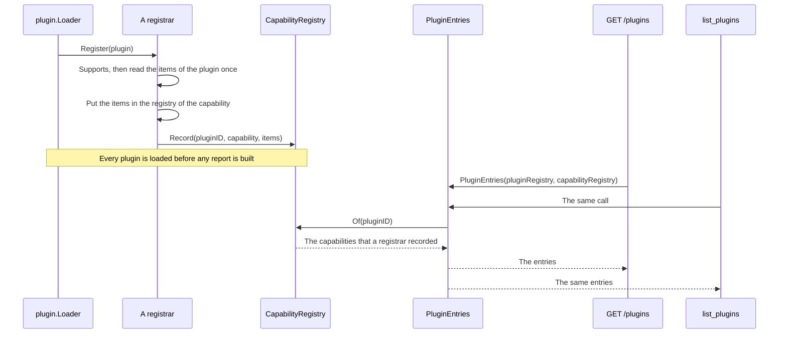

# Specification: The capabilities that a plugin declares

## 1. Summary

The report of a loaded plugin carries one member for its capabilities, a map
keyed by the name of each capability. The value of a capability is what that
capability holds: the manifest of a user interface, the routes of an API, the
commands of a bot. A capability that holds nothing carries `true`. A registrar
records the entry at the load, from the items it already read, so the report
names what the hub loaded and never what a plugin merely implements.

## 2. Coverage

| Requirement      | Where this specification realizes it                      |
| ---------------- | ---------------------------------------------------------- |
| `PCAP-FR-001`    | `PCAP-DD-003`, section 4.3, `PCAP-SC-001`                  |
| `PCAP-FR-002`    | `PCAP-DD-006`, `PCAP-SC-002`                               |
| `PCAP-FR-003`    | `PCAP-DD-002`, section 4.3, `PCAP-SC-003`                  |
| `PCAP-FR-004`    | Section 4.3, `PCAP-DD-003`, `PCAP-SC-004`                  |
| `PCAP-FR-005`    | `PCAP-DD-005`, `PCAP-SC-005`                               |
| `PCAP-FR-006`    | `PCAP-DD-007`, `PCAP-SC-006`                               |
| `PCAP-FR-007`    | `PCAP-DD-004`, `PCAP-SC-007`                               |
| `PCAP-NFR-001`   | `PCAP-DD-003`, `PCAP-SC-008`                               |
| `PCAP-INV-001`   | `PCAP-DD-001`, `PCAP-DD-006`, `PCAP-SC-002`                |
| `PCAP-INV-002`   | `PCAP-DD-003`, `PCAP-SC-001`                               |

## 3. Guideline compliance

| Rule      | Guideline          | How this specification obeys it                                                                          |
| --------- | ------------------ | ---------------------------------------------------------------------------------------------------------- |
| `PLG-006` | Plugin model       | Each capability keeps its interface, its registry, and its registrar. This feature adds no capability and changes no registrar contract. |
| `ARC-008` | Architecture       | A registrar records for every plugin it supports. No rule names one plugin.                               |
| `API-003` | HTTP API           | `/plugins` keeps its prefix and its access. Only the body of the answer changes.                          |
| `API-006` | HTTP API           | The body stays JSON. `PCAP-DD-001` gives its shape.                                                       |
| `UI-001`  | Web user interface | The deck renders the capabilities. It holds no list of its own.                                           |
| `TS-002`  | Frontend style     | The page of the plugins uses runes, as it does today.                                                     |
| `DEP-003` | Dependency resolution | `CapabilityRegistry` joins `Container` as one more registry that a registrar writes into.              |
| `PKG-004` | Package layout     | The registry lives under `apps/hub/internal`. Nothing new is exported from the hub.                       |

`.golangci.yaml` keeps `tagliatelle` at `json: camel`. `PCAP-DD-002` names each
capability as a key of a Go map, which carries no struct tag, and section 4.3
gives every item a single word field name, so no declaration of this feature
meets that rule at all.

## 4. Design

### 4.1 Components

| Path                                                       | Change | Holds                                                                     |
| ----------------------------------------------------------- | ------ | --------------------------------------------------------------------------- |
| `apps/hub/internal/registry/capability.go`                 | Create | `Capability`, the ten names, `CapabilityRegistry`, `Record`, `Of`.         |
| `apps/hub/internal/registry/capability_item.go`            | Create | The item of each capability. Section 4.3 gives the shapes.                |
| `apps/hub/internal/registry/plugin_entry.go`               | Change | `PluginEntry` becomes the identifier, the version, and the capabilities.  |
| `apps/hub/internal/plugin/registrar/registrar.go`          | Change | Nothing. The interface holds.                                             |
| `apps/hub/internal/plugin/registrar/*.go` (ten registrars) | Change | Each records its capability. Section 4.4 gives the order.                 |
| `apps/hub/internal/plugin/loader/loader.go`                | Change | `New` takes the capability registry and hands it to each registrar.       |
| `apps/hub/internal/depresolver/registry.go`                | Change | `CapabilityRegistry()`.                                                   |
| `apps/hub/internal/depresolver/plugin.go`                  | Change | `pluginRegistries` carries it, and `buildPluginLoader` passes it.         |
| `apps/hub/internal/depresolver/resolver.go`                | Change | `Resolver` names `CapabilityRegistry()`. `DEP-002`.                       |
| `apps/hub/internal/handler/plugin.go`                      | Change | `List` calls the new `registry.PluginEntries`.                            |
| `apps/hub/internal/mcpserver/tools/plugins.go`             | Change | The tool calls the same function, so it needs the new arguments only.     |
| `apps/deck/src/lib/api/types.ts`                           | Change | `Plugin` carries `capabilities`. `settings` and `ui` go.                  |
| `apps/deck/src/lib/plugins/capabilities.ts`                | Create | `uiOf`, `hasCapability`, and the label of each capability.                |
| `apps/deck/src/lib/components/layout/Sidebar.svelte`       | Change | Reads the manifest through `uiOf`.                                        |
| `apps/deck/src/routes/(dashboard)/plugins/+page.svelte`    | Change | Renders one chip for each capability. `PCAP-FR-006`.                      |
| `apps/deck/src/routes/(dashboard)/plugins/[plugin]/settings/+page.svelte` | Change | Reads the name through `uiOf`.                        |
| `specs/features/pcap/api.yaml`                             | Create | The OpenAPI description of `GET /plugins`.                                |

```go
// apps/hub/internal/registry/capability.go

// Capability names one kind of function that a plugin adds to the hub.
// PCAP-FR-003: The value is the name that the report carries, and it survives a
// release. It names the domain, never the component of the hub that loads it.
type Capability string

const (
    CapSettings              Capability = "settings"
    CapUI                    Capability = "ui"
    CapMigrations            Capability = "migrations"
    CapAPI                   Capability = "api"
    CapCLI                   Capability = "cli"
    CapCron                  Capability = "cron"
    CapMQTT                  Capability = "mqtt"
    CapTelegramCommands      Capability = "telegramCommands"
    CapTelegramConversations Capability = "telegramConversations"
    CapMCPTools              Capability = "mcpTools"
)

// CapabilityRegistry holds the capabilities that the hub loaded for each plugin.
type CapabilityRegistry struct { /* ... */ }

func NewCapabilityRegistry() *CapabilityRegistry

// Record stores what one registrar loaded for one plugin. A capability that
// holds no item records Present. PCAP-FR-007.
func (r *CapabilityRegistry) Record(pluginID *pluginapi.PluginID, name Capability, items any)

// Of returns the capabilities of one plugin, and an empty map for a plugin that
// declares none.
func (r *CapabilityRegistry) Of(pluginID string) map[Capability]any
```

```go
// apps/hub/internal/registry/plugin_entry.go

// PluginEntry is the report of one loaded plugin.
type PluginEntry struct {
    ID           string             `json:"id"`
    Version      string             `json:"version"`
    Capabilities map[Capability]any `json:"capabilities"`
}

// PluginEntries reports every loaded plugin.
func PluginEntries(
    pluginRegistry *PluginRegistry,
    capabilityRegistry *CapabilityRegistry,
) []PluginEntry
```

`Present` is the value of a capability that holds no item:

```go
// Present marks a capability that the plugin declares and that holds no item.
// PCAP-FR-007: A client tests the value, and every present capability is
// therefore true to a client that tests it.
const Present = true
```

### 4.2 Data model

This feature adds no table and reads none. Every capability is in memory from
the load. `PCAP-NFR-001` measures that.

### 4.3 Declarations

**MCP tool.** `list_plugins` keeps its name and its shape. Its entry gains the
capabilities, because it reads `registry.PluginEntries`. `MCPHUB-FR-005`.

**HTTP route.** `api.yaml` holds the body. The method, the path, and the access
of `/plugins` do not change.

**Capabilities.** The name, the value, and the registrar that records it.

| Capability               | Value                                        | Recorded by                        | Realizes                     |
| ------------------------ | -------------------------------------------- | ---------------------------------- | ---------------------------- |
| `settings`               | `true`                                       | `SettingsRegistrar`                | `PCAP-FR-007`                |
| `migrations`             | `true`                                       | `MigrationRegistrar`               | `PCAP-FR-007`                |
| `ui`                     | The `UIManifest`                             | `UIRegistrar`                      | `PCAP-FR-004`                |
| `api`                    | `[{ method, path }]`                         | `HandlerRegistrar`                 | `PCAP-FR-004`                |
| `cli`                    | `[{ command }]`                              | `CommandRegistrar`                 | `PCAP-FR-004`                |
| `cron`                   | `[{ id, schedule }]`                         | `CronRegistrar`                    | `PCAP-FR-004`                |
| `mqtt`                   | `[{ id, topic }]`                            | `MQTTSubscriberRegistrar`          | `PCAP-FR-004`                |
| `telegramCommands`       | `[{ command, description }]`                 | `TelegramCommandRegistrar`         | `PCAP-FR-004`                |
| `telegramConversations`  | `[{ id, entry }]`                            | `TelegramConversationRegistrar`    | `PCAP-FR-004`                |
| `mcpTools`               | `[{ name, description }]`                    | `MCPToolRegistrar`                 | `PCAP-FR-004`                |

Every field name above is one word, so `tagliatelle` reads each of them as camel
case already. See section 3.

`api` carries the path that a client calls, which is the pattern of the plugin
under the prefix that `API-004` gives it, not the bare pattern.

### 4.4 Flow



### 4.5 Errors

| Condition                                                | Behavior                        | Message                          |
| -------------------------------------------------------- | ------------------------------- | -------------------------------- |
| A registrar fails for a plugin                           | The load of that plugin fails   | The failure that the registrar gives. The report then names no capability of that plugin, because the plugin is not loaded. |
| A plugin declares a capability and holds no item for it   | The capability records `true`   | None. `PCAP-FR-007`.             |
| A plugin is in the plugin registry and no registrar recorded a capability | The report holds an empty map | None. `PCAP-FR-001` limit case. |

## 5. Design decisions

### `PCAP-DD-001`

**Realizes:** `PCAP-INV-001`, `PCAP-FR-004`

**Decision:** The report carries one member, `capabilities`, a map from the name
of a capability to what that capability holds.

**Rationale:** A name and its data are one fact. A map states them in one place,
so `PCAP-INV-002` holds by the shape rather than by a check that a reader must
find. A client reads `capabilities.ui` to act and the keys of the map to list,
with no second member to keep in step.

**Alternatives:** A list of names beside one member for each capability. It
reads close to the report of today, and the list and the members can then
disagree, which is the drift that `PCAP-INV-001` exists to prevent. A list of
objects, each with a name and its items. It keeps one member and costs a scan to
answer whether one capability is present.

### `PCAP-DD-002`

**Realizes:** `PCAP-FR-003`

**Decision:** A capability name is camel case, and it names the domain. The names
are the ten that section 4.3 gives.

**Rationale:** The owner chose camel case for a key that a browser reads. The
name is a key of a Go map, so `tagliatelle` never reads it. The rule of
`.golangci.yaml` now gives every struct tag the same camel case, so one shape
holds for a capability name, for a member of a response, and for the key of a
schema property. A name that followed a component of the hub would put `handler`
in the report for the routes, and a rename of that registrar would then change
the API with no sign.

**Alternatives:** Snake case, which every other key of the API carried when the
owner made this decision. The name of the interface of the contract, such as
`route` and `configurable`. A plugin author knows those names, and
`ConfigurablePlugin` gives a poor key for the settings.

### `PCAP-DD-003`

**Realizes:** `PCAP-FR-001`, `PCAP-FR-004`, `PCAP-INV-002`, `PCAP-NFR-001`

**Decision:** Each registrar records its capability into `CapabilityRegistry`,
inside `Register`, from the items it already read. `PluginEntries` reads that
registry and nothing else.

**Rationale:** A registrar already calls the method of the plugin and holds the
items, so it records them with no second call, and a plugin with a side effect in
that method keeps one call. Presence then means that the hub loaded the
capability, which is what `PCAP-INV-002` states, so presence and items come from
one source. No registry is keyed by plugin, so reading the items back per plugin
would need a naming convention and a scan. The record happens at the load, so a
report reads memory and touches no database.

**Alternatives:** One detector that asserts each interface and calls each method
again. It is one file instead of ten small changes, and it calls `Routes` and
`MCPTools` a second time at the load, which rebuilds every handler and every
tool, and the contract forbids no side effect there. Presence from a type
assertion alone. It answers what a plugin implements, and `PCAP-INV-002` asks
what the hub loaded.

### `PCAP-DD-004`

**Realizes:** `PCAP-FR-007`

**Decision:** A capability that holds no item records the value `true`.

**Rationale:** A client tests the value of a capability to decide an action. With
`true`, every present capability is true to that test, because a manifest and a
list of items are true as well. With a null value the settings capability and the
migrations capability would read as absent to the same test, and the deck would
hide the action that configures a plugin, which is the action that a person
reaches this page for.

**Alternatives:** A null value, meaning that the capability holds no item. It
reads as "no items" rather than "present", and it makes the two capabilities that
a client acts on most the two that a naive test gets wrong. An empty list. It is
true to a test, and it says that the capability holds items and has none, which
is not the case.

### `PCAP-DD-005`

**Realizes:** `PCAP-FR-005`

**Decision:** A registrar records the items in the order that the plugin declared
them, and no step reorders them.

**Rationale:** The method of a plugin returns a slice, so its order is already
fixed and meaningful: the routes of a user interface read in the order that the
plugin listed them. A registry keyed by item would lose that order, because the
hub reads a Go map to answer, and the order of a Go map changes between two runs.
Recording the slice keeps the order at no cost. The map of the capabilities
themselves marshals with its keys sorted, so it is fixed too.

**Alternatives:** Sorting each list by its identifier. It gives one order and
throws away the order that the plugin chose, which a person reads in the sidebar.

### `PCAP-DD-006`

**Realizes:** `PCAP-FR-002`, `PCAP-INV-001`

**Decision:** `PluginEntry` drops the settings flag and the user interface
manifest. Both move into the capabilities map. `GET /plugins` and `list_plugins`
keep reading the one `PluginEntries`.

**Rationale:** `MCPHUB-DD-007` already gives both callers one function, so one
change serves the person and the agent, which is `PCAP-FR-002`. Leaving the flag
beside the capability would state one fact twice, which `PCAP-INV-001` forbids,
and `MCPHUB-FR-005` asks only that the report say whether a plugin declares
settings, not that a member be named `settings`.

**Alternatives:** Keeping both members and adding the map beside them. Nothing in
the deck changes on the day, and the report then holds three statements of two
facts, and a client picks one of them by guess.

### `PCAP-DD-007`

**Realizes:** `PCAP-FR-006`

**Decision:** The deck reads the map through `capabilities.ts`, which gives
`uiOf`, `hasCapability`, and the label of each capability. The page of the
plugins renders one chip for each capability of a plugin.

**Rationale:** Eleven places read `plugin.ui` today, in three files. One helper
keeps the shape of the report in one module, so the next capability changes one
label table and no component. `UI-001` keeps the rendering in the deck.

**Alternatives:** Each component reading the map itself. It spreads the shape of
the report across three files, and the chip of a capability would name itself in
each of them.

## 6. Scenarios

### `PCAP-SC-001` (verifies `PCAP-FR-001`, `PCAP-INV-002`)

**Layer:** integration

**Given** a loaded plugin that declares settings, a bot command, and a function
for an agent.
**When** a client reads the plugin list.
**Then** the capabilities of that plugin name those three and no other.

### `PCAP-SC-002` (verifies `PCAP-FR-002`, `PCAP-INV-001`)

**Layer:** integration

**Given** one loaded plugin.
**When** a browser reads `GET /plugins` and an agent calls `list_plugins`.
**Then** the entry of that plugin is the same in both, and neither carries a
settings flag or a user interface member beside the capabilities.

### `PCAP-SC-003` (verifies `PCAP-FR-003`)

**Layer:** unit

**Given** the ten capabilities that the hub loads.
**When** a test reads the name of each.
**Then** each name is the one that section 4.3 gives, and no name follows the
name of a registrar.

### `PCAP-SC-004` (verifies `PCAP-FR-004`)

**Layer:** integration

**Given** a loaded plugin that serves two routes and answers one bot command.
**When** a client reads the plugin list.
**Then** the `api` capability carries the method and the path of both routes, and
the `telegramCommands` capability carries the command and the description of the
one command.

### `PCAP-SC-005` (verifies `PCAP-FR-005`)

**Layer:** integration

**Given** a loaded plugin that serves four routes in one order.
**When** a client reads the plugin list twice.
**Then** the routes read in the order that the plugin declared, both times.

### `PCAP-SC-006` (verifies `PCAP-FR-006`)

**Layer:** manual

**Given** a plugin with four capabilities and a plugin with none.
**When** the owner opens the page that lists the plugins.
**Then** the first shows four capabilities and the second shows none, with no
empty frame.

### `PCAP-SC-007` (verifies `PCAP-FR-007`)

**Layer:** integration

**Given** a loaded plugin that declares settings and no bot command.
**When** a client reads the plugin list and tests each capability for a value.
**Then** the settings capability is true to that test, and the bot command
capability is absent from the map.

### `PCAP-SC-008` (measures `PCAP-NFR-001`)

**Layer:** integration

**Given** two loaded plugins, one of which declares settings.
**When** a client reads the plugin list.
**Then** the hub runs zero database statements to answer it.

## 7. Build plan

| #   | Step                                                                                    | Realizes                        | Done |
| --- | ----------------------------------------------------------------------------------------- | ------------------------------- | ---- |
| 1   | Create `registry.Capability`, the ten names, `Present`, and the item of each capability. | `PCAP-FR-003`, `PCAP-DD-002`    | [x]  |
| 2   | Create `registry.CapabilityRegistry` with `Record` and `Of`.                            | `PCAP-DD-003`                   | [x]  |
| 3   | Change `PluginEntry` and `PluginEntries` to carry the capabilities.                     | `PCAP-FR-001`, `PCAP-DD-006`    | [x]  |
| 4   | Record in the two registrars that hold no item: settings and migrations.                | `PCAP-FR-007`, `PCAP-DD-004`    | [x]  |
| 5   | Record in the eight registrars that hold items.                                         | `PCAP-FR-004`, `PCAP-DD-005`    | [x]  |
| 6   | Add `CapabilityRegistry()` to `depresolver`, and pass it through the loader.             | `DEP-002`, `DEP-003`            | [x]  |
| 7   | Change `handler.Plugin.List` and the plugin list tool to the new call.                  | `PCAP-FR-002`                   | [x]  |
| 8   | Write `api.yaml`.                                                                        | `SPC-002`                       | [x]  |
| 9   | Create `capabilities.ts` in the deck, and move the eleven readers of `plugin.ui` onto it. | `PCAP-DD-007`                 | [x]  |
| 10  | Render one chip for each capability on the page that lists the plugins.                 | `PCAP-FR-006`                   | [x]  |
| 11  | Add the capabilities to the coverage of `MCPHUB-FR-005` in `mcphub/spec.md`.             | `TRC-007`                       | [x]  |

## 8. Out of scope for this specification

- A capability of the hub itself. The report describes a plugin.
- The conversion of every other JSON key of the hub to camel case. The owner
  made it after this specification, and it renamed the key of a stored settings
  field. `PCAP-DD-002` now matches every other key.
- A second request that returns the items of one capability. The report carries
  them.

## Retired identifiers

This file has no retired identifier.
