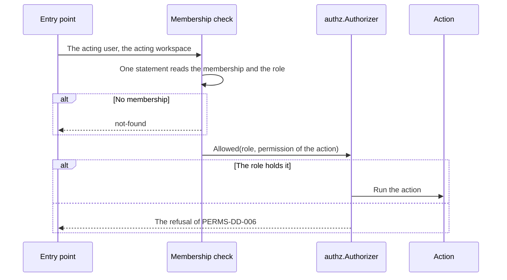

# Specification: The workspace roles, and the permission that every action needs

[`spec-scenarios.md`](spec-scenarios.md) holds the scenarios. `SPC-001` divides them.

## 1. Summary

A membership gains one of three roles. The hub declares its own permissions, and a
plugin declares its permissions through a new capability. Every route, MCP tool, and
command of the bot that acts in a workspace names one permission, and a plugin that
names none fails to load. One check, `authz.Authorizer`, compares the role of the
member with the lowest role of the permission at all three entry points. No policy
engine runs behind it. The section 4.3 inventory gives the permission of every
action that exists today.

## 2. Coverage

| Requirement     | Where this specification realizes it                       |
| --------------- | ------------------------------------------------------------ |
| `PERMS-FR-001`  | Section 4.2, `PERMS-DD-001`, `PERMS-SC-001`                  |
| `PERMS-FR-002`  | `PERMS-DD-001`, `PERMS-SC-002`                               |
| `PERMS-FR-003`  | Section 4.2, `PERMS-SC-003`                                  |
| `PERMS-FR-004`  | Section 4.2, `PERMS-DD-009`, `PERMS-SC-004`                  |
| `PERMS-FR-005`  | Section 4.3, `PERMS-SC-005`                                  |
| `PERMS-FR-006`  | Section 4.3, `PERMS-SC-006`                                  |
| `PERMS-FR-007`  | Section 4.3, `PERMS-SC-007`                                  |
| `PERMS-FR-008`  | Section 4.5, `PERMS-DD-008`, `PERMS-SC-008`                  |
| `PERMS-FR-009`  | Section 4.3, `PERMS-SC-009`                                  |
| `PERMS-FR-010`  | Section 4.3, `PERMS-SC-009`                                  |
| `PERMS-FR-011`  | Section 4.1, `PERMS-DD-002`, `PERMS-SC-010`                  |
| `PERMS-FR-012`  | Section 4.3, `PERMS-DD-003`, `PERMS-SC-011`                  |
| `PERMS-FR-013`  | Section 4.5, `PERMS-DD-003`, `PERMS-SC-011`                  |
| `PERMS-FR-014`  | `PERMS-DD-002`, `PERMS-SC-012`                               |
| `PERMS-FR-015`  | Section 4.4, `PERMS-DD-005`, `PERMS-SC-013`                  |
| `PERMS-FR-016`  | Section 4.5, `PERMS-DD-006`, `PERMS-SC-013`                  |
| `PERMS-FR-017`  | Section 4.3, `PERMS-DD-007`, `PERMS-SC-014`                  |
| `PERMS-FR-018`  | Section 4.6, `PERMS-DD-007`, `PERMS-SC-015`                  |
| `PERMS-FR-019`  | Section 4.6, `PERMS-SC-016`                                  |
| `PERMS-FR-020`  | Section 4.6, `PERMS-SC-016`                                  |
| `PERMS-NFR-001` | `PERMS-DD-005`, `PERMS-SC-017`                               |
| `PERMS-NFR-002` | `PERMS-DD-004`, `PERMS-SC-018`                               |
| `PERMS-INV-001` | `PERMS-DD-008`, `PERMS-SC-008`                               |

## 3. Guideline compliance

| Rule      | Guideline        | How this specification obeys it                                                 |
| --------- | ---------------- | --------------------------------------------------------------------------------- |
| `OWN-011` | Record ownership | Section 4.2 adds the role. `PERMS-DD-008` keeps a manager.                       |
| `SEC-013` | Security         | Section 4.3 names one permission for every action. `PERMS-DD-003` fails the load of a gap. |
| `ERR-003` | Errors           | A refusal answers `permission-denied`. The last manager answers `manager-last`.   |
| `ERR-004` | Errors           | `libs/rest` gains `NewPermissionDenied`.                                          |
| `PLG-006` | Plugin model     | `PermissionPlugin`, `registry.PermissionRegistry`, `registrar.PermissionRegistrar`. |
| `PLG-007` | Plugin model     | `pluginapi.Role` and `pluginapi.Permission` live in `libs/pluginapi`.             |
| `PLG-011` | Plugin model     | The registry refuses a second permission under one name.                          |
| `ARC-008` | Architecture     | The hub reads every permission of a plugin from the registry. It names none.      |
| `TG-003`  | Telegram         | `TelegramCommandMeta` gains `Permission`.                                         |
| `UI-008`  | Web UI           | `PluginHost` gains `can`. `PERMS-DD-007` names the change of the rule.             |
| `DAT-009` | Data             | The migration adds a column and writes no `id`.                                   |
| `BLD-004` | Build            | `libs/pluginapi` changes, so every plugin is rebuilt. Step 9 of the build plan.  |

`ERR-003` gains the type `manager-last`. `UI-008` gains the member `can`. Both change
a guideline, and both follow `ADR-0008` at the approval of this specification.

## 4. Design

### 4.1 Components

| Path                                                               | Action | Holds                                                         |
| ------------------------------------------------------------------ | ------ | ------------------------------------------------------------- |
| `libs/pluginapi/permission.go`                                     | create | `Role`, the three roles, `Role.Holds`, `Permission`, `PermissionPlugin` |
| `libs/pluginapi/route.go`                                          | change | `Route.Permission`                                            |
| `libs/pluginapi/mcp.go`                                            | change | `MCPToolMeta.Permission`                                      |
| `libs/pluginapi/telegram.go`                                       | change | `TelegramCommandMeta.Permission`                              |
| `apps/hub/internal/registry/permission.go`                         | create | `registry.PermissionRegistry`                                 |
| `apps/hub/internal/plugin/registrar/permission.go`                 | create | `registrar.PermissionRegistrar`                               |
| `apps/hub/internal/plugin/registrar/{handler,mcp_tool,telegram_command}.go` | change | Each refuses an entry whose permission the registry does not hold |
| `apps/hub/internal/plugin/loader/loader.go`                        | change | `PermissionRegistrar` runs right after `PluginRegistrar`      |
| `apps/hub/internal/authz/{doc,authorizer,hub}.go`                  | create | `authz.Authorizer`, `authz.RoleAuthorizer`, the permissions of the hub |
| `apps/hub/internal/workspace/middleware.go`                        | change | Reads the role with the membership, and puts it into the context |
| `apps/hub/internal/workspace/require.go`                           | create | `workspace.Require`, the check of one route                   |
| `apps/hub/internal/workspace/service.go`                           | change | `ChangeRole`, the role of `AddMember`, the lock of `PERMS-DD-008` |
| `apps/hub/internal/handler/{workspace,plugin,plugin_wrapper}.go`   | change | Each route passes its permission to `workspace.Require`       |
| `apps/hub/internal/mcpserver/workspace.go`                         | change | `workspaceTool` checks the permission of `MCPHUB-DD-023`      |
| `apps/hub/internal/telegram/command/wrapper.go`                    | change | `Wrapper.Handle` checks the permission before the command     |
| `apps/hub/internal/telegram/middleware/acting_workspace.go`        | change | Puts the role into the context beside the workspace           |
| `apps/hub/db/migrations/20261002100000_table_workspace_members_alter.*` | create | The column `role`. `PERMS-DD-009`                        |
| `apps/hub/internal/domain/problems/problems.go`                    | change | `NewManagerLast`                                              |
| `libs/rest/problem/registry.go`                                    | change | `NewPermissionDenied`                                         |
| `libs/plugin-sdk/src/types.ts`                                     | change | `PluginHost.can`                                              |
| `apps/deck/src/lib/state/workspaces.svelte.ts`                     | change | The role and the permissions of the acting workspace          |
| `apps/deck/src/routes/(dashboard)/w/[workspace]/members/+page.svelte` | change | The role of each member, the select of a manager, the add form on viewer |
| `plugins/jasmine/{main.go,handler/*.go}`                           | change | Declares its permissions. Each route names one                |
| `plugins/parking/{main.go,telegram/command/*.go}`                  | change | Declares its permissions. Each command names one              |
| `specs/features/perms/api.yaml`                                    | create | `PATCH /workspaces/{workspaceId}/members/{userId}`. `PERMS-DD-010` |

```go
// libs/pluginapi/permission.go
type Role string

const (
    RoleManager Role = "manager"
    RoleEditor  Role = "editor"
    RoleViewer  Role = "viewer"
)

// Holds reports whether r reaches lowest, in the order manager, editor, viewer.
func (r Role) Holds(lowest Role) bool

// Permission is one action that a plugin checks, with the lowest role that holds it.
// Name is local to the plugin. The hub prefixes it. See PERMS-DD-002.
type Permission struct {
    Name        string
    Description string
    Lowest      Role
}

// PermissionPlugin is a plugin that declares the permissions that its actions name.
type PermissionPlugin interface {
    Plugin
    Permissions() ([]Permission, error)
}

// apps/hub/internal/authz/authorizer.go

// Authorizer decides whether a role reaches a permission. It is the one seam that a
// policy engine would take. See PERMS-DD-004.
type Authorizer interface {
    Allowed(role pluginapi.Role, permission string) (allowed bool, lowest pluginapi.Role, err error)
}

// apps/hub/internal/workspace/require.go

// Require answers permission-denied unless the role of the acting user reaches the
// permission.
func Require(authorizer authz.Authorizer, permission string) func(http.Handler) http.Handler
```

### 4.2 Data model

| Table               | Schema   | Scope  | Migration                                             | Realizes                       |
| ------------------- | -------- | ------ | ----------------------------------------------------- | ------------------------------ |
| `workspace_members` | `public` | shared | `20261002100000_table_workspace_members_alter.up.sql` | `PERMS-FR-001`, `PERMS-FR-004` |

```sql
ALTER TABLE public.workspace_members
    ADD COLUMN role TEXT NOT NULL DEFAULT 'manager'
        CONSTRAINT workspace_members_role_check CHECK (role IN ('manager', 'editor', 'viewer'));

ALTER TABLE public.workspace_members
    ALTER COLUMN role DROP DEFAULT;
```

The default writes `manager` into every row that exists, which realizes
`PERMS-FR-004`, and the second statement drops it, so every later insert names a role.
`POST /workspaces` and `maroid user invite` insert `manager`, which realizes
`PERMS-FR-003` and `EXTID-FR-018`.

### 4.3 Declarations

**The routes of the hub.** `WSPACE` and `PSET` hold the routes. This feature adds one
route and the permission of each.

| Method   | Path                                                     | Permission         | Lowest role | Realizes                       |
| -------- | -------------------------------------------------------- | ------------------ | ----------- | ------------------------------ |
| `GET`    | `/workspaces/{workspaceId}`                              | `workspace.read`   | viewer      | `PERMS-FR-005`, `PERMS-FR-009`, `PERMS-FR-017` |
| `PATCH`  | `/workspaces/{workspaceId}`                              | `workspace.write`  | manager     | `PERMS-FR-005`                 |
| `GET`    | `/workspaces/{workspaceId}/members`                      | `workspace.read`   | viewer      | `PERMS-FR-010`                 |
| `GET`    | `/workspaces/{workspaceId}/members/{userId}`             | `workspace.read`   | viewer      | `PERMS-FR-010`                 |
| `POST`   | `/workspaces/{workspaceId}/members`                      | `members.write`    | manager     | `PERMS-FR-005`, `PERMS-FR-006` |
| `PATCH`  | `/workspaces/{workspaceId}/members/{userId}`             | `members.write`    | manager     | `PERMS-FR-007`. New            |
| `DELETE` | `/workspaces/{workspaceId}/members/{userId}`, another member | `members.write` | manager    | `PERMS-FR-005`                 |
| `DELETE` | `/workspaces/{workspaceId}/members/{userId}`, the acting user | `membership.leave` | viewer | `PERMS-FR-005`               |
| `GET`    | `/workspaces/{workspaceId}/member-candidates`            | `members.write`    | manager     | `PERMS-FR-005`                 |
| `GET`    | `/workspaces/{workspaceId}/plugins/{id}/settings/schema` | `settings.read`    | viewer      | `PERMS-FR-005`                 |
| `GET`    | `/workspaces/{workspaceId}/plugins/{id}/settings`        | `settings.read`    | viewer      | `PERMS-FR-005`                 |
| `PUT`    | `/workspaces/{workspaceId}/plugins/{id}/settings`        | `settings.write`   | editor      | `PERMS-FR-005`                 |

`DELETE` on a membership checks `membership.leave` when `{userId}` names the acting
user, and `members.write` otherwise. `PERMS-DD-005` gives the reason.

`GET /workspaces` and `GET /workspaces/{workspaceId}/members` answer the role of each
row. `GET /workspaces/{workspaceId}` also answers `permissions`: the name of every
permission that the role of the acting user holds in the workspace. `POST` on the
members takes `role`, and the request fails with the pointer `/role` when it names
none.

**The MCP tools of the hub.**

| Tool                   | Permission       | Lowest role |
| ---------------------- | ---------------- | ----------- |
| `get_plugin_settings`  | `settings.read`  | viewer      |
| `save_plugin_settings` | `settings.write` | editor      |

`whoami`, `list_plugins`, `ping`, and `list_workspaces` act in no workspace, and
declare none. `list_workspaces` answers the role in each workspace, as
`MCPHUB-FR-020` gives. `/start`, `/help`, and `/workspace` of the bot act in no
workspace either.

**The permissions of the plugins.** `PERMS-DD-011` gives the choice of each.

| Plugin       | Permission           | Lowest role | Named by                                                   |
| ------------ | -------------------- | ----------- | ---------------------------------------------------------- |
| `jasmine`    | `environments.read`  | viewer      | `GET /environments`, `GET /environments/{id}`              |
| `jasmine`    | `environments.write` | editor      | `POST /environments`, `PUT` and `DELETE /environments/{id}` |
| `jasmine`    | `plants.read`        | viewer      | `GET /plants`, `GET /plants/{id}`                          |
| `jasmine`    | `plants.write`       | editor      | `POST /plants`, `PUT` and `DELETE /plants/{id}`            |
| `parking`    | `sessions.read`      | viewer      | The commands `status` and `balance`                        |
| `parking`    | `sessions.write`     | editor      | The commands `start` and `stop`, and the conversation that `start` opens |

The hub prefixes each name with the plugin identifier: `dev.maroid.jasmine:plants.write`.
`gwp`, `pensions`, `tbilisi-energy`, and `telasi` hold no action with an acting user, so
they declare no permission. No plugin declares an MCP tool today.

### 4.4 Flow



The entry point is `workspace.Require` for a route, `workspaceTool` for an MCP tool,
and `command.Wrapper` for a command of the bot. Each reads the role that the check of
the membership put into the context.

### 4.5 Errors

| Condition                                                   | Answer                                                                |
| ----------------------------------------------------------- | --------------------------------------------------------------------- |
| A route: the role does not hold the permission              | 403, `/problems/http/permission-denied`, with `permission` and `required_role` |
| An MCP tool: the role does not hold the permission          | A result with `isError` that names the permission and the role        |
| A command of the bot: the role does not hold the permission | "This needs the role `<role>` (`<permission>`)", and the command runs no step |
| A change leaves the workspace with no manager               | 409, `/problems/hub/manager-last`                                     |
| `POST` on the members names no role, or an unknown one      | 422, `/problems/http/validation-failed`, pointer `/role`              |
| A plugin entry names no permission, or one it does not declare | The load of the plugin fails, and the log names the plugin and the entry |
| A plugin declares one permission name twice                 | The load of the plugin fails. `PLG-011`                               |

### 4.6 The deck

`GET /workspaces/{workspaceId}` gives the deck the role and `permissions` of the
acting workspace, and `workspaces.svelte.ts` holds both. A control of the deck that
needs a permission renders when `permissions` holds it, which realizes
`PERMS-FR-018`. `PluginHost.can(name)` answers the same question for the page of a
plugin, with the local name of the plugin. The members page shows the role of each
member. A manager reads a select for the role, and the add form starts on viewer,
which realizes `PERMS-FR-019` and `PERMS-FR-020`.

## 5. Design decisions

### `PERMS-DD-001`

**Realizes:** `PERMS-FR-001`, `PERMS-FR-002`
**Decision:** `pluginapi.Role` holds the three roles, and `Role.Holds` compares their
rank: manager 3, editor 2, viewer 1. The hub and every plugin share the type.
**Rationale:** A plugin declares a lowest role, so the type must live where a plugin
reaches it. `PLG-007` denies a plugin the hub. A rank makes `PERMS-FR-002` hold by
construction.
**Alternatives:** A set of permissions for each role. Three lists to keep in step, and a
higher role that misses a line loses an action.

### `PERMS-DD-002`

**Realizes:** `PERMS-FR-011`, `PERMS-FR-014`
**Decision:** A plugin implements `PermissionPlugin`. The registrar stores each
permission as `<plugin identifier>:<name>` in `PermissionRegistry`. The permissions of
the hub carry no prefix and sit in the same registry, written at the start.
**Rationale:** The prefix comes from the identifier, the way `API-004` builds the
prefix of a route, so two plugins never collide, and `PERMS-FR-014` holds by
construction. One registry serves the hub and the plugins, so one check reads one
source.
**Alternatives:** A permission inside the metadata of each route. A plugin then repeats
one permission on five routes, and nothing lists the permissions of a plugin.

### `PERMS-DD-003`

**Realizes:** `PERMS-FR-012`, `PERMS-FR-013`
**Decision:** `Route`, `MCPToolMeta`, and `TelegramCommandMeta` each gain
`Permission`, the local name. `PermissionRegistrar` runs before every other registrar
of an entry. Each of those refuses an entry whose permission is empty or absent from
the registry, and the load of the plugin fails.
**Rationale:** The loader runs the registrars in the order of its list, so the
permissions exist when the first route reads them. A plugin that forgets one fails at
the start, which is the reason `PERMS-FR-013` gives.
**Alternatives:** A check at the call. A forgotten permission then waits for the first
person who meets it.

### `PERMS-DD-004`

**Realizes:** `PERMS-NFR-002`
**Decision:** `authz.Authorizer` is the one seam of the decision. `RoleAuthorizer` reads
the lowest role from `PermissionRegistry` and calls `Role.Holds`. No policy engine runs.
**Rationale:** The decision is one map read and one comparison, under 1 microsecond,
far inside the 2 milliseconds of `PERMS-NFR-002`. Casbin would hold a second copy of
the roles in memory, kept in step with the memberships, for the same comparison. An
embedded OPA adds about 20 to 30 megabytes to the binary and a policy language for the
same comparison. The interface keeps a later engine to one package. The condition that
brings an engine back: a requirement for a permission that depends on the record, a
role that a workspace defines, or a policy that changes without a release.

The lowest role of a permission is a default grant, and a later list of grants for
each role can sit beside it in the same seam. The condition that brings such a list
back: a member who needs one permission above their role, or a workspace whose role
needs less than the ladder gives.
**Alternatives:** Casbin. OPA. Each is named above with its cost.

### `PERMS-DD-005`

**Realizes:** `PERMS-FR-015`, `PERMS-NFR-001`
**Decision:** The check of the membership reads the role in the same statement, with no
cache, and puts it into the context. `workspace.Require` guards one route.
`DELETE` on a membership picks its permission from the target: `membership.leave` for
the acting user, `members.write` for another member.
**Rationale:** One statement keeps `IDENT-NFR-002`, and no cache means a lowered role
takes effect on the next request. The method and the path of a leave and of a removal
are one, so the target is the only thing that tells them apart.
**Alternatives:** The `self` route that `WSPACE` dropped. A second address for one
resource.

### `PERMS-DD-006`

**Realizes:** `PERMS-FR-016`
**Decision:** A refused route answers `permission-denied` with two extension members:
`permission`, the full name, and `required_role`. The `detail` says the same in a
sentence. An MCP tool and a command of the bot name both in their text.
**Rationale:** `ERR-004` lets a type carry extension members, and a client ignores one
that it does not know. A client then shows "Ask a manager" without parsing a sentence.
**Alternatives:** The `detail` alone. A client then parses prose.

### `PERMS-DD-007`

**Realizes:** `PERMS-FR-017`, `PERMS-FR-018`
**Decision:** `GET /workspaces/{workspaceId}` answers `permissions`, every permission
that the role holds. `PluginHost` gains `can(name: string): boolean`, which reads that
list with the prefix of its plugin. `UI-008` gains the member.
**Rationale:** The deck reads the workspace on every switch, so the list arrives with
no second request. A page of a plugin cannot call the hub outside its prefix,
`UI-007`, so the host carries the answer.
**Alternatives:** A route `/workspaces/{workspaceId}/permissions`. A second request on
every switch for a list that changes only with the role.

### `PERMS-DD-008`

**Realizes:** `PERMS-FR-008`, `PERMS-INV-001`
**Decision:** Each change of a role and each removal or leave runs in one transaction
that first locks the row of the workspace with `SELECT ... FOR UPDATE`, then counts the
managers that the change leaves. A count of zero rolls back and answers `manager-last`.
**Rationale:** Two managers that demote each other at the same moment each read two
managers without the lock, and both commits leave none. The lock orders them.
**Alternatives:** A constraint trigger. It needs the same lock, in a place that a reader
of the Go code does not see.

### `PERMS-DD-009`

**Realizes:** `PERMS-FR-004`
**Decision:** The migration adds `role` with the default `manager`, then drops the
default.
**Rationale:** One statement fills every existing row, and no later insert inherits a
role that its writer did not choose.
**Alternatives:** A default of `viewer`. Every member then loses every write that they
held before.

### `PERMS-DD-010`

**Realizes:** `PERMS-FR-007`
**Decision:** `specs/features/perms/api.yaml` holds the one new operation, `PATCH` on a
membership. It answers `Member` of `specs/api/components.yaml`, which `WSPACE` answers
too. At the approval of this specification these change with it:

- `Member` and `Workspace` gain `role`, and `Workspace` gains `permissions`.
- `POST` on the members takes `role`.
- Every route of section 4.3 answers 403 in the fragments of `WSPACE` and `PSET`.
- The route table of `features/wspace/spec.md` section 4.3 takes the permission of
  each route from section 4.3 of this file.
**Rationale:** `WSPACE-DD-005` releases the two features together, and a route keeps one
description. `RES-008` holds no merge of two operations of one path yet, so a second
copy of a changed operation has no defined result.
**Alternatives:** A full copy of every changed path in this fragment. Two descriptions of
one route then drift.

### `PERMS-DD-011`

**Realizes:** `PERMS-FR-011`, `PERMS-FR-012`
**Decision:** Each plugin declares one read and one write for each kind of record, as
the table of section 4.3 gives. A read needs viewer, and a write, a delete included,
needs editor.
**Rationale:** Two permissions for each kind let a household split readers from writers,
which is what `PERMS-FR-005` asks of the hub. No requirement asks a delete to need more
than an edit.
**Alternatives:** One permission for each route. Ten names for jasmine, and a role
still decides them in two groups. A delete at manager. A gardener then cannot remove a
plant that died.

## 6. Scenarios

`spec-scenarios.md` holds `PERMS-SC-001` through `PERMS-SC-018`.

## 7. Build plan

| #   | Step                                                                                          | Realizes                          | Done |
| --- | --------------------------------------------------------------------------------------------- | --------------------------------- | ---- |
| 1   | Add `NewPermissionDenied` to `libs/rest` and `NewManagerLast` to the hub. `ERR-003` and `UI-008` hold their rows. | `ERR-003`, `UI-008` | [x]  |
| 2   | Write `PERMS-SC-004`, then the migration.                                                     | `PERMS-FR-001`, `PERMS-FR-004`    | [ ]  |
| 3   | Write `PERMS-SC-002`, then `libs/pluginapi/permission.go` and the three `Permission` fields.  | `PERMS-FR-002`, `PERMS-FR-012`    | [ ]  |
| 4   | Write `PERMS-SC-010` to `PERMS-SC-012`, then the registry, the registrar, and the checks of the three registrars. | `PERMS-FR-011` to `PERMS-FR-014` | [ ] |
| 5   | Write `PERMS-SC-018`, then `authz.RoleAuthorizer` and the permissions of the hub.             | `PERMS-NFR-002`                   | [ ]  |
| 6   | Write `PERMS-SC-005`, `PERMS-SC-013`, and `PERMS-SC-017`, then the role in the membership check, `workspace.Require`, and each route of section 4.3. | `PERMS-FR-005`, `PERMS-FR-015`, `PERMS-NFR-001` | [ ] |
| 7   | Write `PERMS-SC-006` to `PERMS-SC-009`, then the role in the service, `PATCH` on a membership, and the lock. | `PERMS-FR-003`, `PERMS-FR-006` to `PERMS-FR-010` | [ ] |
| 8   | The check in `workspaceTool` and in `command.Wrapper`, and the refusal of `PERMS-DD-006`.      | `PERMS-FR-015`, `PERMS-FR-016`    | [ ]  |
| 9   | Declare the permissions of `jasmine` and `parking`, and name one on each entry. Build every plugin. | `PERMS-FR-012`, `BLD-004`   | [ ]  |
| 10  | Write `PERMS-SC-014`, then `permissions` on the workspace and `PluginHost.can`.               | `PERMS-FR-017`                    | [ ]  |
| 11  | The deck: the role in each list, the select of a manager, and the hidden controls.             | `PERMS-FR-018` to `PERMS-FR-020`  | [ ]  |
| 12  | Record the `permissions` capability of `PCAP`, step 12 of `features/pcap/spec.md`.             | `PCAP-FR-004`                     | [ ]  |

## 8. Out of scope for this specification

| Postponed                                   | Reason and the condition that brings it back                      |
| ------------------------------------------- | ------------------------------------------------------------------- |
| A policy engine.                            | `PERMS-DD-004` names the three conditions that bring one back.     |
| A list of grants for each role.             | `PERMS-DD-004` names the two conditions that bring one back.       |
| The check of the enablement of a plugin.    | `PLUGACC`.                                                          |
| A menu of the bot that follows the role.    | The requirements put it out of scope.                               |

## Retired identifiers

This file has no retired identifier.
