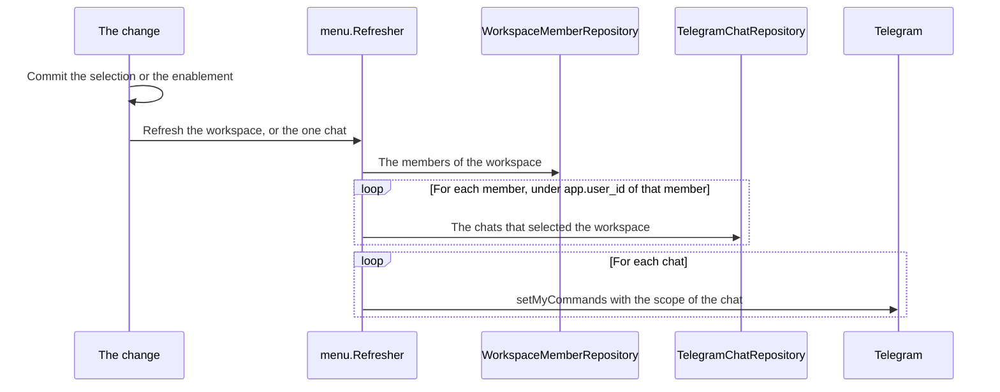

# Specification: The administrator and the enablement in the command line, the bot, the scheduler, and the deck

`spec.md` holds the data model, the routes, and the checks of the hub. This file holds
the four clients that read them. `SPC-001` divides them.

## 1. The command line

| Command              | Flags                                                        | Does                                                      | Realizes         |
| -------------------- | ------------------------------------------------------------ | --------------------------------------------------------- | ---------------- |
| `maroid user invite` | `--first-name`, `--last-name`, `--user`, `--ttl`, `--admin`  | `--admin` marks the record as an administrator, for a new record and for one that `--user` names | `PLUGACC-FR-001` |

`InviteRequest` gains `Administrator bool`, and `auth.Service.Invite` writes the mark
in the transaction that writes the record or the invitation. `CLI-001` keeps its tree,
because the command exists.

## 2. The bot

| Path                                                       | Action | Holds                                                        |
| ---------------------------------------------------------- | ------ | ------------------------------------------------------------ |
| `apps/hub/internal/telegram/command/wrapper.go`            | change | `Wrapper.Handle` drops a command of a disabled plugin before the permission |
| `apps/hub/internal/telegram/menu/{doc,menu}.go`            | create | `menu.Builder`, `menu.Refresher`                             |
| `apps/hub/internal/telegram/handler.go`                    | change | `setCommands` keeps the default scope. The refresher takes each chat |
| `apps/hub/internal/telegram/command/workspace.go`          | change | A new selection refreshes the menu of its chat               |
| `apps/hub/internal/workspace/enablement.go`                | change | An enable and a disable refresh the menus of the workspace   |

**The drop.** `Wrapper.Handle` reads the acting workspace from the context and asks
`EnablementService.IsEnabled`. For a plugin that the workspace does not enable it
returns `nil`, writes one line at the level `info`, and sends nothing, which realizes
`PLUGACC-FR-019`. The check runs before the permission of `PERMS`, so a disabled plugin
answers nothing and never names a role.

**The menu.** The default scope of `TG-004` holds the commands of the hub alone. Each
chat with a selected workspace gets its own scope, `tu.ScopeChat(chatID)`, that holds
the commands of the hub and the commands of each plugin that the workspace enables,
which realizes `PLUGACC-FR-031`. A chat with no selection takes the default scope.

### `PLUGACC-DD-007`

**Realizes:** `PLUGACC-FR-031`
**Decision:** The refresher reads the members of the workspace from the shared table,
then reads the chats of each member in a transaction that sets `app.user_id` to that
member, and keeps the chats that selected the workspace.
**Rationale:** `public.telegram_chats` is scoped to a user, and the policy of
`OWN-006` shows a row to its user alone. A transaction for each member reads its rows
under the policy, with no path around it. A household holds a few members, so the loop
costs a few statements.
**Alternatives:** A function of the database that reads every chat with no policy. The
role of the hub carries no `BYPASSRLS`, as `IDENT-DD-006` gives, so the function would
need a second role. A shared table of the chats. It changes `WSPACE-DD-009`.

### `PLUGACC-DD-008`

**Realizes:** `PLUGACC-NFR-002`
**Decision:** The refresher runs after the commit of the change, outside the request,
with a deadline of 10 seconds. A failure of Telegram writes one line at the level
`error`, and the request already answered.
**Rationale:** A call to Telegram costs a round trip for each chat. Inside the request
it would slow the answer of an enable by that count, and a failure of Telegram would
fail a change that the database already holds. The next selection or enablement
refreshes the menu again.
**Alternatives:** The refresh inside the request. The answer then waits for Telegram.
A refresh of every menu on a schedule. The menu lags by the period of the schedule.

## 3. The scheduler

`CronScopePerWorkspace` of `IDENT-DD-007` reads its workspaces from
`EnablementService.WorkspacesEnabling`, which answers every workspace that enables the
plugin of the job, so a job runs for those and for no other, which realizes
`PLUGACC-FR-020`. This feature carries out step 15 of `features/ident/spec.md`.

| Path                                  | Action | Holds                                                     |
| ------------------------------------- | ------ | --------------------------------------------------------- |
| `libs/pluginapi/cron.go`              | change | `CronScopePerWorkspace`                                   |
| `apps/hub/internal/worker/cron.go`    | change | `runForEachWorkspace`, from `WorkspacesEnabling`          |

## 4. The deck

| Path                                                                   | Action | Holds                                                        |
| ---------------------------------------------------------------------- | ------ | ------------------------------------------------------------ |
| `apps/deck/src/routes/(dashboard)/admin/users/+page.svelte`            | create | The users: create, invite, block, unblock, mark, and the link to an allowlist |
| `apps/deck/src/routes/(dashboard)/admin/users/[user]/+page.svelte`     | create | One user and their allowlist                                 |
| `apps/deck/src/routes/(dashboard)/admin/workspaces/+page.svelte`       | create | Every workspace, with links to its members and its plugins   |
| `apps/deck/src/routes/(dashboard)/w/[workspace]/plugins/+page.svelte`  | create | The plugins of the workspace, and the switch of each         |
| `apps/deck/src/lib/api/{users,enablements}.ts`                         | create | The routes of `spec.md` section 4.3                          |
| `apps/deck/src/lib/state/plugins.svelte.ts`                            | change | The plugins of the acting workspace, from `/workspaces/{id}/plugins` |
| `apps/deck/src/lib/components/layout/Sidebar.svelte`                   | change | Names the plugins of the acting workspace alone, and links an administrator to the pages of `/admin` |

The pages under `/admin` render for an administrator alone. `GET /auth/sessions/self`
already answers the person of the session, and gains `is_administrator` for that test.
The hub still guards each route, so a hidden link is a convenience.

The page of the plugins of a workspace lists the catalog of `GET /plugins` and marks
each plugin that the workspace enables. A manager switches a plugin of their allowlist
on or off, and an administrator switches any plugin, which realizes `PLUGACC-FR-024`.
The sidebar reads the enablements of the acting workspace, which realizes
`PLUGACC-FR-025`.

An administrator reaches every action of `PLUGACC-FR-023` from the pages of `/admin`,
and the members and the plugins of any workspace through the pages of `/w/{id}`, which
admit an administrator for those two pages as `PLUGACC-DD-003` gives. The address of
an invitation shows one time, with a control that copies it.

## Retired identifiers

This file has no retired identifier.
