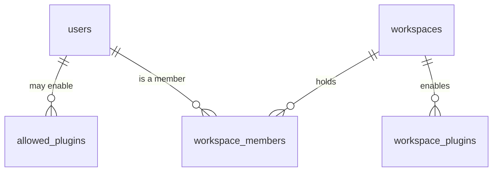
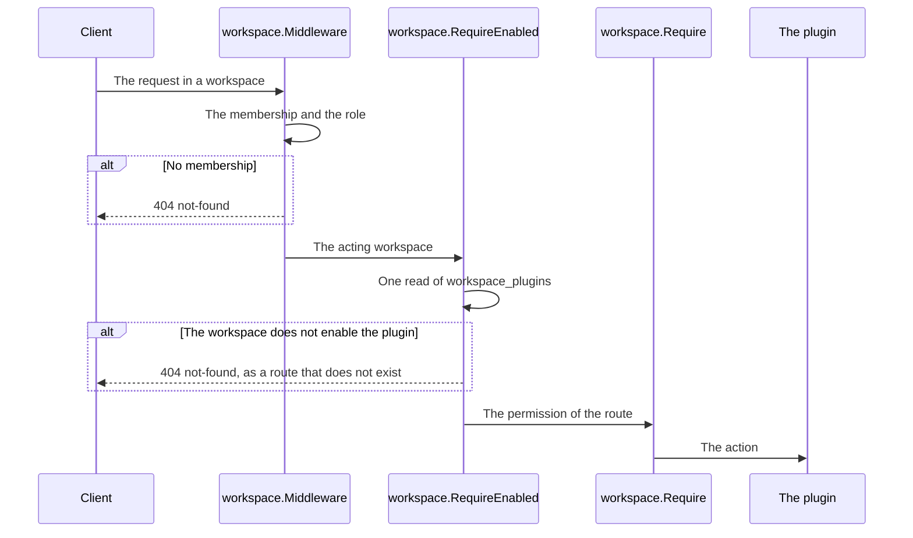

# Specification: The administrator, the plugin allowlist, and the enablement of a plugin

This file holds the data model, the routes, and the checks of the hub.
[`spec-clients.md`](spec-clients.md) holds the command line, the bot, the scheduler,
and the deck. [`spec-scenarios.md`](spec-scenarios.md) holds the scenarios.
`SPC-001` divides them.

## 1. Summary

A user record gains the mark of an administrator. Two shared tables hold the plugin
allowlist of each user and the plugins that each workspace enables. Routes under
`/users` let an administrator create, invite, block, and mark a user, and edit an
allowlist. Routes under `/workspaces/{workspaceId}/plugins` enable and disable a
plugin. Every entry point of a plugin checks the enablement after the membership, and
answers a disabled plugin as absent.

## 2. Coverage

| Requirement       | Where this specification realizes it                           |
| ----------------- | ---------------------------------------------------------------- |
| `PLUGACC-FR-001`  | `spec-clients.md` section 1, `PLUGACC-SC-001`                    |
| `PLUGACC-FR-002`  | Section 4.3, `PLUGACC-SC-002`                                    |
| `PLUGACC-FR-003`  | Section 4.3, `PLUGACC-DD-004`, `PLUGACC-SC-003`                  |
| `PLUGACC-FR-004`  | Section 4.3, `PLUGACC-DD-004`, `PLUGACC-SC-003`                  |
| `PLUGACC-FR-005`  | Section 4.3, `PLUGACC-SC-004`                                    |
| `PLUGACC-FR-006`  | Section 4.3, `PLUGACC-SC-004`                                    |
| `PLUGACC-FR-007`  | Section 4.5, `PLUGACC-DD-005`, `PLUGACC-SC-005`                  |
| `PLUGACC-FR-008`  | Section 4.3, `PLUGACC-SC-006`                                    |
| `PLUGACC-FR-009`  | Section 4.3, `PLUGACC-DD-006`, `PLUGACC-SC-007`                  |
| `PLUGACC-FR-010`  | Section 4.4, `PLUGACC-DD-003`, `PLUGACC-SC-008`                  |
| `PLUGACC-FR-011`  | Section 4.2, `PLUGACC-SC-009`                                    |
| `PLUGACC-FR-012`  | Section 4.3, `PLUGACC-SC-009`                                    |
| `PLUGACC-FR-013`  | Section 4.3, `PLUGACC-SC-010`                                    |
| `PLUGACC-FR-014`  | Section 4.3, `PLUGACC-SC-011`                                    |
| `PLUGACC-FR-015`  | Section 4.2, `PLUGACC-DD-002`, `PLUGACC-SC-011`                  |
| `PLUGACC-FR-016`  | Section 4.2, `PLUGACC-SC-012`                                    |
| `PLUGACC-FR-017`  | Section 4.3, `PLUGACC-SC-009`                                    |
| `PLUGACC-FR-018`  | Section 4.4, `PLUGACC-DD-001`, `PLUGACC-SC-013`                  |
| `PLUGACC-FR-019`  | `spec-clients.md` section 2, `PLUGACC-SC-014`                    |
| `PLUGACC-FR-020`  | `spec-clients.md` section 3, `PLUGACC-SC-016`                    |
| `PLUGACC-FR-021`  | Section 4.3, `PLUGACC-SC-017`                                    |
| `PLUGACC-FR-022`  | Section 4.5, `PLUGACC-DD-003`, `PLUGACC-SC-018`                  |
| `PLUGACC-FR-023`  | `spec-clients.md` section 4, `PLUGACC-SC-022`                    |
| `PLUGACC-FR-024`  | `spec-clients.md` section 4, `PLUGACC-SC-022`                    |
| `PLUGACC-FR-025`  | `spec-clients.md` section 4, `PLUGACC-SC-021`                    |
| `PLUGACC-FR-026`  | Section 4.2, `PLUGACC-SC-019`                                    |
| `PLUGACC-FR-027`  | Section 4.3, `PLUGACC-SC-011`                                    |
| `PLUGACC-FR-028`  | Section 4.3, `PLUGACC-SC-017`                                    |
| `PLUGACC-FR-029`  | Section 4.3, `PLUGACC-SC-005`                                    |
| `PLUGACC-FR-030`  | Section 4.3, `PLUGACC-SC-005`                                    |
| `PLUGACC-FR-031`  | `spec-clients.md` section 2, `PLUGACC-DD-007`, `PLUGACC-SC-015`  |
| `PLUGACC-NFR-001` | `PLUGACC-DD-001`, `PLUGACC-SC-020`                               |
| `PLUGACC-NFR-002` | `spec-clients.md` section 2, `PLUGACC-DD-008`, `PLUGACC-SC-015`  |
| `PLUGACC-INV-001` | Section 4.4, `PLUGACC-DD-001`, `PLUGACC-SC-013`                  |
| `PLUGACC-INV-002` | `PLUGACC-DD-003`, `PLUGACC-SC-008`                               |
| `PLUGACC-INV-003` | `PLUGACC-DD-005`, `PLUGACC-SC-005`                               |

## 3. Guideline compliance

| Rule      | Guideline        | How this specification obeys it                                                  |
| --------- | ---------------- | ---------------------------------------------------------------------------------- |
| `SEC-011` | Security         | Section 4.2 gives the mark. `PLUGACC-DD-003` reaches every workspace and no record. |
| `SEC-012` | Security         | Section 4.4 checks the enablement at every entry point. `spec-clients.md` gives the menu. |
| `SEC-013` | Security         | Each route of a workspace names a permission. The hub gains `plugins.write`.       |
| `SEC-004` | Security         | A block sets the status that the resolver reads on each request.                 |
| `OWN-002` | Record ownership | No route deletes a user record. A block keeps every record.                       |
| `OWN-004` | Record ownership | Section 4.2 gives the scope and the reason of each table.                         |
| `ERR-003` | Errors           | A disabled plugin answers `not-found`. A non-administrator answers `permission-denied`. The last administrator answers `administrator-last`. |
| `API-003` | HTTP API         | The routes sit under `/users` and `/workspaces`.                                   |
| `API-007` | HTTP API         | A user record carries `ETag`, and its change reads `If-Match`. A `POST` reads `Idempotency-Key`. |
| `RES-005` | REST             | Every collection of this feature is bounded and answers one page.                 |
| `Z-148`   | REST             | A change of a user uses `PATCH` with merge patch. An enablement uses `PUT`, because the client names the plugin. |
| `DAT-009` | Data             | Both new tables relate records, so each takes the pair as its primary key and no `id`. |
| `ARC-008` | Architecture     | The hub reads every plugin identifier from the plugin registry. It names none.    |

`ERR-003` gains the type `administrator-last`. The owner approves it with this
specification.

## 4. Design

### 4.1 Components

| Path                                                                  | Action | Holds                                                         |
| --------------------------------------------------------------------- | ------ | ------------------------------------------------------------- |
| `apps/hub/db/migrations/20261002110000_table_users_alter.*`           | create | `public.users.is_administrator`                               |
| `apps/hub/db/migrations/20261002110100_table_allowed_plugins_create.*` | create | `public.allowed_plugins`                                     |
| `apps/hub/db/migrations/20261002110200_table_workspace_plugins_create.*` | create | `public.workspace_plugins`                                 |
| `apps/hub/internal/model/user.go`                                     | change | `User.IsAdministrator`                                        |
| `apps/hub/internal/model/enablement.go`                               | create | `model.Enablement`, `model.AllowedPlugin`                     |
| `apps/hub/internal/repository/user.go`                                | change | `List`, `SetStatus`, `SetAdministrator`, the column in every query |
| `apps/hub/internal/repository/allowed_plugin.go`                      | create | `repository.AllowedPluginRepository`, `repository.AllowedPlugin` |
| `apps/hub/internal/repository/workspace_plugin.go`                    | create | `repository.WorkspacePluginRepository`, `repository.WorkspacePlugin` |
| `apps/hub/internal/administration/{doc,service}.go`                   | create | `administration.Service`: the users, the mark, the allowlists |
| `apps/hub/internal/workspace/enablement.go`                           | create | `workspace.EnablementService`, `workspace.RequireEnabled`     |
| `apps/hub/internal/workspace/middleware.go`                           | change | An administrator passes a route that admits one, as `manager` |
| `apps/hub/internal/auth/middleware.go`                                | change | `auth.IsAdministratorFromContext`, `auth.RequireAdministrator` |
| `apps/hub/internal/handler/administration.go`                         | create | `handler.Administration`, the routes under `/users`           |
| `apps/hub/internal/handler/workspace.go`                              | change | The routes of the enablements, and `scope=all`                |
| `apps/hub/internal/handler/plugin.go`                                 | change | `List` filters the catalog by the allowlist                   |
| `apps/hub/internal/handler/plugin_wrapper.go`                         | change | `workspace.RequireEnabled` after the membership               |
| `apps/hub/internal/authz/hub.go`                                      | change | The permission `plugins.write`                                |
| `apps/hub/internal/domain/problems/problems.go`                       | change | `NewAdministratorLast`                                        |
| `specs/features/plugacc/api.yaml`                                     | create | The routes of section 4.3                                     |

```go
// apps/hub/internal/administration/service.go
type Service interface {
    Users(ctx context.Context) ([]model.User, error)
    User(ctx context.Context, userID string) (*model.User, error)
    CreateUser(ctx context.Context, request auth.InviteRequest, administrator bool) (*auth.InviteResult, error)
    Invite(ctx context.Context, userID string) (*auth.InviteResult, error)
    ChangeUser(ctx context.Context, userID string, change UserChange, version time.Time) (*model.User, error)
    AllowedPlugins(ctx context.Context, userID string) ([]model.AllowedPlugin, error)
    AllowPlugin(ctx context.Context, userID string, pluginID string) (*model.AllowedPlugin, error)
    DisallowPlugin(ctx context.Context, userID string, pluginID string) error
}

// UserChange holds the members of a merge patch. A nil member changes nothing.
type UserChange struct {
    Status        *model.Status
    Administrator *bool
}

// apps/hub/internal/workspace/enablement.go
type EnablementService interface {
    Enabled(ctx context.Context) ([]model.Enablement, error)
    Enable(ctx context.Context, pluginID string) (*model.Enablement, bool, error)
    Disable(ctx context.Context, pluginID string) error
    IsEnabled(ctx context.Context, workspaceID string, pluginID string) (bool, error)
    WorkspacesEnabling(ctx context.Context, pluginID string) ([]string, error)
}

// RequireEnabled answers not-found unless the acting workspace enables the plugin.
func RequireEnabled(enablements EnablementService, pluginID *pluginapi.PluginID) func(http.Handler) http.Handler
```

`Enable` answers `true` in its second result when it created the row, so the handler
answers 201, and `false` for a plugin that the workspace already enables, so it
answers 200.

### 4.2 Data model

| Table               | Schema   | Scope  | Migration                                                  | Realizes                                         |
| ------------------- | -------- | ------ | ---------------------------------------------------------- | ------------------------------------------------ |
| `users`             | `public` | shared | `20261002110000_table_users_alter.up.sql`                  | `PLUGACC-FR-001`, `PLUGACC-FR-029`, `PLUGACC-FR-030` |
| `allowed_plugins`   | `public` | shared | `20261002110100_table_allowed_plugins_create.up.sql`       | `PLUGACC-FR-008`, `PLUGACC-FR-021`, `PLUGACC-FR-026` |
| `workspace_plugins` | `public` | shared | `20261002110200_table_workspace_plugins_create.up.sql`     | `PLUGACC-FR-011` to `PLUGACC-FR-017`, `PLUGACC-FR-026` |

```sql
ALTER TABLE public.users
    ADD COLUMN is_administrator BOOLEAN NOT NULL DEFAULT false;

CREATE TABLE public.allowed_plugins
(
    user_id    UUID        NOT NULL REFERENCES public.users (id),
    plugin_id  TEXT        NOT NULL,
    created_at TIMESTAMPTZ NOT NULL DEFAULT NOW(),
    updated_at TIMESTAMPTZ NOT NULL DEFAULT NOW(),
    PRIMARY KEY (user_id, plugin_id)
);

CREATE TABLE public.workspace_plugins
(
    workspace_id UUID        NOT NULL REFERENCES public.workspaces (id),
    plugin_id    TEXT        NOT NULL,
    created_at   TIMESTAMPTZ NOT NULL DEFAULT NOW(),
    updated_at   TIMESTAMPTZ NOT NULL DEFAULT NOW(),
    PRIMARY KEY (workspace_id, plugin_id)
);

CREATE INDEX workspace_plugins_plugin_id_idx ON public.workspace_plugins (plugin_id);
```

Each new table takes the `set_updated_at` trigger. Each relates a record to a plugin
and no table references it, so the pair is its primary key and it carries no `id`, as
`DAT-009` gives. The index on `plugin_id` serves `WorkspacesEnabling`, which the primary
key cannot. Both are shared. The checks of
section 4.4 read an enablement before the plugin reaches its own schema, and the
scheduler and the menu of the bot read the enablements of every workspace at once.
An administrator edits the allowlist of another user, so no policy on `app.user_id`
fits it. Each migration states that reason in a comment, as `OWN-004` demands.

A row of `workspace_plugins` means "enabled". A disable deletes the row and touches no
table of the plugin and no settings, so an enable returns everything, which realizes
`PLUGACC-FR-015`. No table holds which manager enabled a plugin, so a later change of
an allowlist reaches no enablement, which realizes `PLUGACC-FR-016`.

The migration writes no row into either new table, and the default writes `false` into
every user record. Every workspace that exists then enables nothing, and every
allowlist is empty, which realizes `PLUGACC-FR-011` and `PLUGACC-FR-026`.



### 4.3 Declarations

**HTTP routes.** `api.yaml` holds the bodies and the status codes.

| Method   | Path                                            | Access        | Permission        | Realizes                          |
| -------- | ----------------------------------------------- | ------------- | ----------------- | --------------------------------- |
| `GET`    | `/users`                                        | Administrator | None              | `PLUGACC-FR-002`                  |
| `POST`   | `/users`                                        | Administrator | None              | `PLUGACC-FR-003`, `PLUGACC-FR-029` |
| `GET`    | `/users/{userId}`                               | Administrator | None              | `PLUGACC-FR-002`                  |
| `PATCH`  | `/users/{userId}`                               | Administrator | None              | `PLUGACC-FR-005`, `PLUGACC-FR-006`, `PLUGACC-FR-007`, `PLUGACC-FR-029`, `PLUGACC-FR-030` |
| `POST`   | `/users/{userId}/invitations`                   | Administrator | None              | `PLUGACC-FR-004`                  |
| `GET`    | `/users/{userId}/allowed-plugins`               | Administrator | None              | `PLUGACC-FR-008`                  |
| `POST`   | `/users/{userId}/allowed-plugins`               | Administrator | None              | `PLUGACC-FR-008`                  |
| `DELETE` | `/users/{userId}/allowed-plugins/{pluginId}`    | Administrator | None              | `PLUGACC-FR-008`                  |
| `GET`    | `/workspaces?scope=all`                         | Administrator | None              | `PLUGACC-FR-009`                  |
| `GET`    | `/workspaces/{workspaceId}/plugins`             | Member        | `workspace.read`  | `PLUGACC-FR-017`                  |
| `GET`    | `/workspaces/{workspaceId}/plugins/{pluginId}`  | Member        | `workspace.read`  | `PLUGACC-FR-017`                  |
| `PUT`    | `/workspaces/{workspaceId}/plugins/{pluginId}`  | Member        | `plugins.write`   | `PLUGACC-FR-012`, `PLUGACC-FR-013` |
| `DELETE` | `/workspaces/{workspaceId}/plugins/{pluginId}`  | Member        | `plugins.write`   | `PLUGACC-FR-014`, `PLUGACC-FR-027` |
| `GET`    | `/plugins`                                      | Authenticated | None              | `PLUGACC-FR-021`, `PLUGACC-FR-028` |

A route under `/users` acts in no workspace, so it declares no permission. It passes
`auth.RequireAdministrator` instead. `plugins.write` holds the lowest role `manager`,
and `authz` declares it beside the permissions of `PERMS`.

An allowlist and the enablements of a workspace answer in the order of the plugin
identifier, because neither table carries an `id` to sort by. `DAT-009`.

`PUT` on an enablement checks the plugin allowlist of the acting user, unless the
acting user is an administrator. A plugin that the hub did not load answers 422 with
the pointer `/plugin_id`, for an enablement and for an allowlist alike.

`GET /plugins` answers every loaded plugin to an administrator, and the plugins of the
allowlist of the acting user to any other user. `GET /workspaces?scope=all` answers
every workspace of the instance, each with the count of its members and the
identifiers of the plugins that it enables. Without `scope`, the route answers as
`WSPACE` gives.

`specs/features/plugacc/api.yaml` holds the routes that this feature adds. Three
routes that other features describe change at the approval of this specification,
as `PERMS-DD-010` did for its own: `GET /workspaces` gains `scope` in the fragment of
`WSPACE`, `GET /plugins` gains the filter in the fragment of `PCAP`, and
`GET /auth/sessions/self` gains `is_administrator` in the fragment of `EXTID`.

### 4.4 Flow

A route of a plugin, a route of its settings, and an MCP tool of a plugin pass the
same three checks, in this order:



An administrator who is no member passes `workspace.Middleware` only on a route that
admits one: the routes of the members, of the enablements, and `GET` on the workspace.
The middleware then acts with the role `manager`. A route of a plugin and a route of
its settings admit no administrator, so they answer `not-found`, which realizes
`PLUGACC-INV-002`.

### 4.5 Errors

| Condition                                                    | Status | Type                                    |
| ------------------------------------------------------------ | ------ | --------------------------------------- |
| A user who is no administrator calls a route of `/users`, or `scope=all` | 403 | `/problems/http/permission-denied`, `permission` set to `administration` |
| The change leaves the instance with no active administrator  | 409    | `/problems/hub/administrator-last`      |
| A plugin that the hub did not load                           | 422    | `/problems/http/validation-failed`, pointer `/plugin_id` |
| A manager enables a plugin that their allowlist does not hold | 403   | `/problems/http/permission-denied`, `permission` set to `plugin-allowlist` |
| The plugin is already on the allowlist                       | 200    | The row that holds it                   |
| A disabled plugin, at a route of it or of its settings       | 404    | `/problems/http/not-found`              |
| A disabled plugin, at an MCP tool of it                      | The protocol error of an unknown tool | `MCPHUB-DD-023`  |
| `If-Match` names a version that moved                        | 412    | `/problems/http/precondition-failed`    |

## 5. Design decisions

### `PLUGACC-DD-001`

**Realizes:** `PLUGACC-FR-018`, `PLUGACC-NFR-001`, `PLUGACC-INV-001`
**Decision:** `workspace.RequireEnabled` reads one row of `workspace_plugins` on each
request, with no cache, after the membership and before the permission.
`workspaceTool` of `MCPHUB-DD-023` reads the same row.
**Rationale:** The read is one probe of the unique index, under 1 millisecond. With no
cache, a disable reaches the next request, which `PLUGACC-NFR-001` asks. The
permission comes last, so a viewer of a workspace that does not enable the plugin reads
`not-found`, and no answer tells that the plugin exists.
**Alternatives:** The enablements of the workspace in memory, refreshed on each change.
It needs a broadcast to every process of the hub, for a saving of 1 millisecond.

### `PLUGACC-DD-002`

**Realizes:** `PLUGACC-FR-015`
**Decision:** A disable deletes the row of the enablement, and nothing else.
**Rationale:** The records of the plugin and its settings carry the workspace, not the
enablement, so they stay. A deleted row needs no state column and no filter in every
read.
**Alternatives:** A column `enabled` that a disable sets to false. Every read then
filters on it, and the table holds a row for every plugin that was ever tried.

### `PLUGACC-DD-003`

**Realizes:** `PLUGACC-FR-010`, `PLUGACC-FR-022`, `PLUGACC-INV-002`
**Decision:** `auth.Middleware` puts the mark of the administrator into the context.
`auth.RequireAdministrator` guards the routes of `/users` and `scope=all`. A route of a
workspace declares whether it admits an administrator, and `workspace.Middleware`
then lets an administrator with no membership pass as `manager`.
**Rationale:** An administrator reaches the membership and the enablement of every
workspace, which `SEC-011` gives, and a route of a plugin never admits one, so no
record is read. The admission is a property of the route, so a new route of a plugin
cannot admit an administrator by accident.
**Alternatives:** An administrator as a member of every workspace. The administrator
then reads every record, which `SEC-011` forbids.

### `PLUGACC-DD-004`

**Realizes:** `PLUGACC-FR-003`, `PLUGACC-FR-004`
**Decision:** `POST /users` and `POST /users/{userId}/invitations` call
`auth.Service.Invite`, the function that `maroid user invite` calls, and answer the
address of the invitation one time, in the body.
**Rationale:** One function serves the command line and the web shell, so the first
workspace of `EXTID-FR-018` and the expiry come with no second copy. The hub stores the
digest of the token alone, so the answer is the only moment that the address exists.
**Alternatives:** A route that sends the invitation by mail. Maroid delivers nothing,
as `EXTID` answered.

### `PLUGACC-DD-005`

**Realizes:** `PLUGACC-FR-007`, `PLUGACC-INV-003`
**Decision:** A change of the status or of the mark runs in one transaction that first
locks every active administrator with `SELECT ... FOR UPDATE`, then counts the active
administrators that the change leaves. A count of zero rolls back and answers
`administrator-last`. The command line runs no such check, because it only adds the
mark.
**Rationale:** Two administrators that remove the mark of each other at the same moment
each read two without the lock. The lock orders them. `PERMS-DD-008` keeps the last
manager the same way.
**Alternatives:** A constraint trigger. The same lock, in a place that a reader of the
Go code does not see.

### `PLUGACC-DD-006`

**Realizes:** `PLUGACC-FR-009`
**Decision:** `GET /workspaces?scope=all` answers every workspace to an administrator,
with the count of its members and the plugins that it enables. Its members come from
the route of the members, which admits an administrator.
**Rationale:** `Z-137` filters a collection with a query parameter. One route of the
workspaces keeps one shape of a workspace, and the page of the administrator reads the
members of one workspace when the person opens it.
**Alternatives:** A route under `/users` that answers the workspaces. `API-003` gives
`/workspaces*` the workspaces.

`PLUGACC-DD-007` and `PLUGACC-DD-008` sit in `spec-clients.md`.

## 6. Scenarios

`spec-scenarios.md` holds `PLUGACC-SC-001` through `PLUGACC-SC-022`.

## 7. Build plan

| #   | Step                                                                                     | Realizes                                       | Done |
| --- | ---------------------------------------------------------------------------------------- | ---------------------------------------------- | ---- |
| 1   | Add `NewAdministratorLast` to the hub. `ERR-003` holds its row.                          | `ERR-003`                                      | [x]  |
| 2   | Write `PLUGACC-SC-019`, then the three migrations.                                       | `PLUGACC-FR-011`, `PLUGACC-FR-026`             | [ ]  |
| 3   | Write the models and the three repositories, and the mark in every query of a user.     | `PLUGACC-FR-002`, `PLUGACC-FR-008`             | [ ]  |
| 4   | Write `PLUGACC-SC-005` and `PLUGACC-SC-018`, then the mark in the context, `RequireAdministrator`, and the lock. | `PLUGACC-FR-007`, `PLUGACC-FR-022` | [ ]  |
| 5   | Write `PLUGACC-SC-002` to `PLUGACC-SC-007`, then `administration.Service`, the routes of `/users`, and `scope=all`. | `PLUGACC-FR-002` to `PLUGACC-FR-009`, `PLUGACC-FR-029`, `PLUGACC-FR-030` | [ ] |
| 6   | Write `PLUGACC-SC-008` to `PLUGACC-SC-013` and `PLUGACC-SC-020`, then the enablement service, its routes, `RequireEnabled`, and the admission of an administrator. | `PLUGACC-FR-010` to `PLUGACC-FR-018`, `PLUGACC-FR-027`, `PLUGACC-NFR-001` | [ ] |
| 7   | Write `PLUGACC-SC-017`, then the filter of `GET /plugins`.                               | `PLUGACC-FR-021`, `PLUGACC-FR-028`             | [ ]  |
| 8   | Carry out `spec-clients.md`: the command line, the bot, the scheduler, and the deck.    | `PLUGACC-FR-001`, `PLUGACC-FR-019`, `PLUGACC-FR-020`, `PLUGACC-FR-023` to `PLUGACC-FR-025`, `PLUGACC-FR-031`, `PLUGACC-NFR-002` | [ ] |

## 8. Out of scope for this specification

| Postponed                                                  | Reason and the condition that brings it back                           |
| ---------------------------------------------------------- | ---------------------------------------------------------------------- |
| A job of a plugin that still declares `CronScopeShared`.   | Its plugin reads shared tables today, as `OWN-009` lets it. The feature that moves the plugin to the workspace moves the job to `CronScopePerWorkspace`, and `PLUGACC-FR-020` then reaches it. |
| A history of the changes to an allowlist or an enablement. | The requirements put it out of scope.                                  |

## Retired identifiers

This file has no retired identifier.
