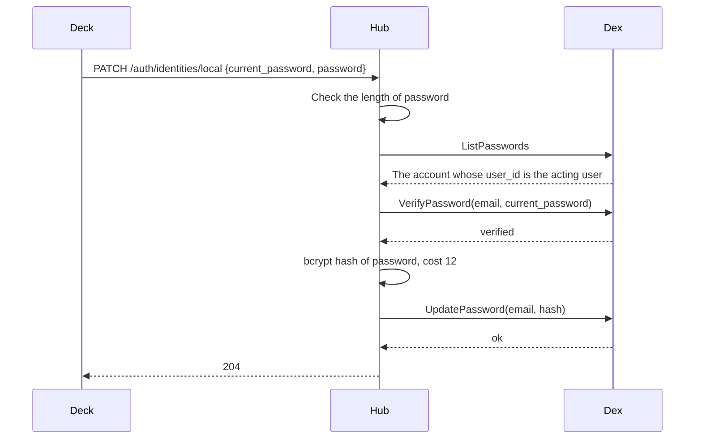

# Specification: The profile that a person changes on their own record

## 1. Summary

`GET` and `PATCH /users/self` read and rename the record of the acting user.
`PATCH /auth/identities/local` sets a new password on their own local account, after
Dex verifies the current one. The profile page of the deck turns its name section on
and gains a password section. No table changes.

## 2. Coverage

| Requirement       | Where this specification realizes it            |
| ----------------- | ----------------------------------------------- |
| `PROFILE-FR-001`  | Section 4.2, `PROFILE-DD-001`, `PROFILE-SC-001` |
| `PROFILE-FR-002`  | Section 4.2, `PROFILE-SC-002`, `PROFILE-SC-003` |
| `PROFILE-FR-003`  | `PROFILE-DD-001`, `PROFILE-SC-004`              |
| `PROFILE-FR-004`  | `PROFILE-DD-004`, `PROFILE-SC-005`              |
| `PROFILE-FR-005`  | `PROFILE-DD-004`, `PROFILE-SC-005`              |
| `PROFILE-FR-006`  | Section 4.2, `PROFILE-SC-006`, `PROFILE-SC-007` |
| `PROFILE-FR-007`  | `PROFILE-DD-003`, `PROFILE-SC-008`              |
| `PROFILE-FR-008`  | Section 4.1, `PROFILE-SC-009`                   |
| `PROFILE-FR-009`  | Section 4.3, `PROFILE-SC-010`                   |
| `PROFILE-FR-010`  | Section 4.3, `PROFILE-SC-006`                   |
| `PROFILE-NFR-001` | Section 4.4, `PROFILE-SC-011`                   |
| `PROFILE-INV-001` | `PROFILE-DD-001`, `PROFILE-DD-002`, `PROFILE-SC-003` |

## 3. Guideline compliance

| Rule      | Guideline | How this specification obeys it                                                |
| --------- | --------- | ------------------------------------------------------------------------------ |
| `SEC-001` | Security  | Section 4.3 hashes the new password in memory. No row, log, or answer holds either password. |
| `SEC-004` | Security  | The resolver refuses a blocked record before either route runs.                |
| `SEC-011` | Security  | `PATCH /users/self` decodes the names alone. The other fields stay with an administrator. |
| `API-003` | HTTP API  | `/users/self` is an Authenticated exception under `/users*`. `PROFILE-DD-001`. The table of `API-003` holds the row. |
| `API-007` | HTTP API  | `/users/self` answers `ETag`, and its change reads `If-Match`.                 |
| `Z-143`   | REST      | `self` names the record that the session gives, as `/auth/sessions/self` does. |
| `ERR-001` | Errors    | Every refusal answers a problem of section 4.4. No new problem type.          |
| `LOG-008` | Logging   | No log line carries `current_password` or `password`.                          |
| `OWN-002` | Ownership | No route creates a user record.                                                |
| `SPC-002` | Spec artifacts | `User`, `Password`, and `IdPUnavailable` move to `specs/api/components.yaml`, because a second fragment needs them. |

## 4. Design

### 4.1 Components

| Path                                                          | Action | Holds                                                         |
| ------------------------------------------------------------- | ------ | ------------------------------------------------------------- |
| `apps/hub/internal/dex/client.go`                             | change | `VerifyPassword` on `dex.Client` and `GRPC`                   |
| `apps/hub/internal/dex/dextest/memory.go`                     | change | `VerifyPassword` compares with the stored hash                |
| `apps/hub/internal/provider/local.go`                         | change | `ChangeOwn` on `LocalAccounts` and `Accounts`                 |
| `apps/hub/internal/domain/errs/errs.go`                       | change | `ErrPasswordMismatch`                                         |
| `apps/hub/internal/handler/user.go`                           | change | The route group of `/users/self`. `GetSelf`, `ChangeSelf`     |
| `apps/hub/internal/handler/auth.go`                           | change | `PATCH /identities/{provider}`, `ChangeOwnPassword`           |
| `apps/hub/internal/depresolver/server.go`                     | change | `LocalAccounts` reaches `handler.Auth`, if it does not yet    |
| `apps/deck/src/lib/api/{users,identities}.ts`                 | change | `users.self`, `users.changeSelf`, `identities.changePassword` |
| `apps/deck/src/routes/(dashboard)/profile/+page.svelte`       | change | The name form saves. The password section.                    |
| `specs/api/components.yaml`                                   | change | `User`, `Password`, `IdPUnavailable`                          |
| `specs/features/{plugacc,idprov}/api.yaml`                    | change | Reference the three moved components                          |
| `specs/guidelines/http-api.md`                                | change | `API-003` gains the row of `/users/self`                      |
| `specs/features/profile/api.yaml`                             | create | The routes of section 4.2                                     |

```go
// apps/hub/internal/dex/client.go
// VerifyPassword answers whether the password matches the local account of the
// address. errs.ErrLocalAccountNotFound when Dex holds no account for it.
VerifyPassword(ctx context.Context, email string, password []byte) (bool, error)

// apps/hub/internal/provider/local.go
// ChangeOwn sets a new password after Dex verifies the current one.
ChangeOwn(ctx context.Context, userID string, current []byte, password []byte) error

// apps/hub/internal/handler/user.go
type selfChangeInput struct {
    FirstName *string `json:"first_name"`
    LastName  *string `json:"last_name"`
}

// apps/hub/internal/handler/auth.go
type ownPasswordInput struct {
    CurrentPassword *string `json:"current_password"`
    Password        *string `json:"password"`
}
```

`GRPC.VerifyPassword` sends `api.VerifyPasswordReq{Email, Password}` under the deadline
of `dex.timeout`, and passes a failure through `failure`. `not_found` maps to
`errs.ErrLocalAccountNotFound`.

`User.Register` keeps one `router.Route("/users")`, because chi refuses a second mount
of one prefix. `auth.Middleware` and `idempotency.Middleware` stay on the route. A
group with no `auth.RequireAdministrator` holds `GET` and `PATCH /self`. A second group
with `auth.RequireAdministrator` holds every route that exists today. chi matches the
static segment `self` before `{userId}`.

`GetSelf` and `ChangeSelf` read the record from `auth.UserIDFromContext`. `ChangeSelf`
passes `user.Change{FirstName, LastName}` with `trimmed` to `user.Service.Change`, with
the version of `If-Match`. It answers the `userBody` and the `ETag` that `Change` answers.

The deck reads `users.self` with `client.getTagged`, sends the `ETag` back on
`users.changeSelf`, and refreshes `userState` after a change, so the sidebar shows the
new name. The password form holds the current password, the new one, and the new one
again. Save stays disabled until the two new entries match.

### 4.2 Declarations

**HTTP routes.** `api.yaml` holds the bodies and the status codes.

| Method  | Path                          | Access        | Permission | Realizes                                         |
| ------- | ----------------------------- | ------------- | ---------- | ------------------------------------------------ |
| `GET`   | `/users/self`                 | Authenticated | none       | `PROFILE-FR-001`, `PROFILE-INV-001`              |
| `PATCH` | `/users/self`                 | Authenticated | none       | `PROFILE-FR-002`, `PROFILE-FR-003`, `PROFILE-INV-001` |
| `PATCH` | `/auth/identities/{provider}` | Authenticated | none       | `PROFILE-FR-006`, `PROFILE-FR-007`, `PROFILE-FR-009`, `PROFILE-FR-010`, `PROFILE-INV-001` |

`PATCH /auth/identities/{provider}` accepts `local` alone. `GET /auth/identities` and
`GET /auth/sessions/self` do not change.

### 4.3 Flow



`ChangeOwn` checks the new password with `hashPassword` before it calls Dex, so a short
password costs no call. `passwordOf` finds the account by the identifier of the record,
as `Reset` does. A record with no account stops there with
`errs.ErrLocalAccountNotFound`. The hub ends no session and revokes no token.

### 4.4 Errors

| Condition                                                | Behavior | Type                                       |
| -------------------------------------------------------- | -------- | ------------------------------------------ |
| A member other than the names on `PATCH /users/self`     | 400      | `member-unknown`, names the member         |
| `If-Match` names a version that moved                    | 412      | `precondition-failed`                      |
| `current_password` or `password` absent                  | 422      | `validation-failed`, pointer of the member |
| `current_password` does not match                        | 422      | `validation-failed`, `/current_password`   |
| `password` under 12 characters or over 72 bytes          | 422      | `validation-failed`, `/password`           |
| A provider other than `local`, or no local account       | 404      | `not-found`                                |
| Dex refuses the connection, or passes `dex.timeout`      | 503      | `not-ready`, dependency `dex`              |

`errs` gains `ErrPasswordMismatch`. `ChangeOwnPassword` maps it to the fourth row.
`dex.timeout` defaults to 5 seconds, which `PROFILE-NFR-001` asks. Dex holds the
password until `UpdatePassword` succeeds, so a timeout before it changes nothing.

## 5. Design decisions

### `PROFILE-DD-001`

**Realizes:** `PROFILE-FR-001`, `PROFILE-FR-002`, `PROFILE-FR-003`, `PROFILE-INV-001`
**Decision:** `GET` and `PATCH /users/self` serve the record of the acting user. The
input of `PATCH` declares the two names alone, so the decoder refuses every other member.
**Rationale:** The session names the record, so no request can name another one. The
body and the `ETag` match `/users/{userId}`, so the deck reuses `UserRecord`. A field
that the input does not declare cannot reach `user.Service.Change`.
**Alternatives:** `PATCH /users/{userId}` for the own identifier needs a check on each
field inside a route of an administrator, and one missed check grants a field.
`PATCH /auth/sessions/self` patches a session, not a record.

### `PROFILE-DD-002`

**Realizes:** `PROFILE-FR-006`, `PROFILE-INV-001`
**Decision:** `PATCH /auth/identities/local` changes the password of the acting user.
**Rationale:** `/auth/identities` already holds the identities of the acting user, and
`DELETE` there already branches on `local`. `API-003` needs no second exception.
**Alternatives:** `PATCH /users/self/identities/local` mirrors the route of an
administrator, but adds a second exception under `/users*`.

### `PROFILE-DD-003`

**Realizes:** `PROFILE-FR-007`
**Decision:** Dex verifies the current password through `VerifyPassword` before the hub
sends `UpdatePassword`. The two calls are not atomic.
**Rationale:** Dex holds the hash, and `SEC-001` keeps it out of the hub. Two changes
that race need the same current password, and the last one wins, which the person sees
at the next sign in. Dex compares at cost 12, near 250 ms, which slows a guess.
**Alternatives:** The hub reads the hash and compares it. `ListPasswords` answers no
hash, and holding one breaks `SEC-001`.

### `PROFILE-DD-004`

**Realizes:** `PROFILE-FR-004`, `PROFILE-FR-005`
**Decision:** The deck shows the password section when `GET /auth/identities` lists
`local` with `attached: true`. The `username` of that identity is the email address.
**Rationale:** `IDPROV` writes the address as the `username` of the local identity, and
the list names only the providers that Dex holds. No new route answers what one already
answers.
**Alternatives:** A field on `/users/self` duplicates the list and ties a record to a
provider.

## 6. Scenarios

A unit scenario runs against `dextest.Memory`. Nina holds a local account
`nina@home.example` with the password `correct-horse-1`, and a Telegram identity. Beka
holds a Telegram identity only. Zura is an administrator.

### `PROFILE-SC-001`

**Verifies:** `PROFILE-FR-001`
**Layer:** unit

**Given** Nina signed in.
**When** she sends `GET /users/self`.
**Then** the answer is
200 with her record and an `ETag`.

### `PROFILE-SC-002`

**Verifies:** `PROFILE-FR-002`
**Layer:** unit

**Given** Nina's first name is "Nnia".
**When** she sends `PATCH /users/self` with
`first_name` "Nina", then with `last_name` "".
**Then** both answer 200. The record
holds "Nina", no last name, and the same identities, workspaces, and allowlist.

### `PROFILE-SC-003`

**Verifies:** `PROFILE-FR-002`, `PROFILE-INV-001`
**Layer:** unit

**Given** Nina is no administrator.
**When** she sends `PATCH /users/{Beka}` with
`first_name` "X".
**Then** the answer is 403, and the record of Beka does not change.

### `PROFILE-SC-004`

**Verifies:** `PROFILE-FR-003`
**Layer:** unit

**Given** Nina is no administrator.
**When** she sends `PATCH /users/self` with
`first_name` "Nina" and `is_administrator` true, then with `status` "active".
**Then** both answer 400 `member-unknown`, and no field of the record changes.

### `PROFILE-SC-005`

**Verifies:** `PROFILE-FR-004`, `PROFILE-FR-005`
**Layer:** manual

**Given** the compose deployment.
**When** Nina opens the profile page signed in with
Telegram, then Beka opens it, then Zura removes the local provider and Nina opens it
again.
**Then** Nina first sees the section with `nina@home.example` read only. Beka
sees no section. Nina last sees no section.

### `PROFILE-SC-006`

**Verifies:** `PROFILE-FR-006`, `PROFILE-FR-010`
**Layer:** unit

**When** Nina sends `PATCH /auth/identities/local` with `current_password`
"correct-horse-1" and `password` "battery-staple-2".
**Then** the answer is 204. Dex
verifies "battery-staple-2" and refuses "correct-horse-1". Her session still answers
`GET /users/self`.

### `PROFILE-SC-007`

**Verifies:** `PROFILE-FR-006`
**Layer:** unit

**When** Beka sends the request of `PROFILE-SC-006`, and Nina sends it with the provider
`telegram`.
**Then** both answer 404, and Dex calls no `UpdatePassword`.

### `PROFILE-SC-008`

**Verifies:** `PROFILE-FR-007`
**Layer:** unit

**When** Nina sends a wrong `current_password`, then no `current_password`.
**Then** both answer 422 at `/current_password`, and Dex still verifies
"correct-horse-1".

### `PROFILE-SC-009`

**Verifies:** `PROFILE-FR-008`
**Layer:** manual

**When** Nina types "battery-staple-2" and then "battery-staple-3".
**Then** Save stays
disabled, and the deck sends no request.

### `PROFILE-SC-010`

**Verifies:** `PROFILE-FR-009`
**Layer:** unit

**When** Nina sends a correct `current_password` with a `password` of 11 characters,
then one of 73 bytes.
**Then** both answer 422 at `/password`, and Dex receives no call.

### `PROFILE-SC-011`

**Verifies:** `PROFILE-NFR-001`
**Layer:** unit

**Given** `dex.timeout` is 5 seconds, and the fake Dex answers `codes.DeadlineExceeded`
to `UpdatePassword`.
**When** Nina sends the request of `PROFILE-SC-006`.
**Then** the
answer is 503 `not-ready` with the dependency `dex`, and Dex still verifies
"correct-horse-1".

## 7. Build plan

| #   | Step                                                                                     | Realizes                                         | Done |
| --- | ---------------------------------------------------------------------------------------- | ------------------------------------------------ | ---- |
| 1   | The row of `API-003`. The three components move to `components.yaml`.                    | `PROFILE-FR-001`                                 | [x]  |
| 2   | `GET` and `PATCH /users/self`, and the two groups of `User.Register`                     | `PROFILE-FR-001` to `PROFILE-FR-003`, `PROFILE-INV-001` | [ ] |
| 3   | `dex.Client.VerifyPassword`, the fake, `ErrPasswordMismatch`, `LocalAccounts.ChangeOwn`  | `PROFILE-FR-007`, `PROFILE-NFR-001`              | [ ]  |
| 4   | `PATCH /auth/identities/{provider}`                                                      | `PROFILE-FR-006` to `PROFILE-FR-010`             | [ ]  |
| 5   | The deck: the name form saves, the password section                                      | `PROFILE-FR-001`, `PROFILE-FR-002`, `PROFILE-FR-004` to `PROFILE-FR-008` | [ ] |

## 8. Out of scope for this specification

This specification postpones no requirement.

## Retired identifiers

This file has no retired identifier.
