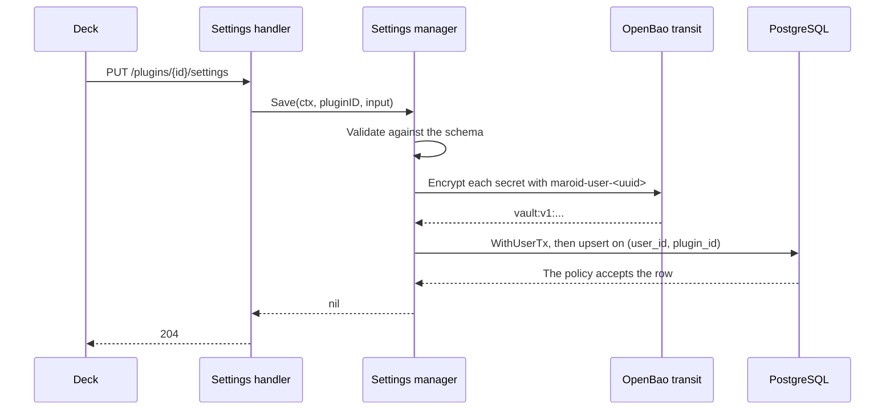
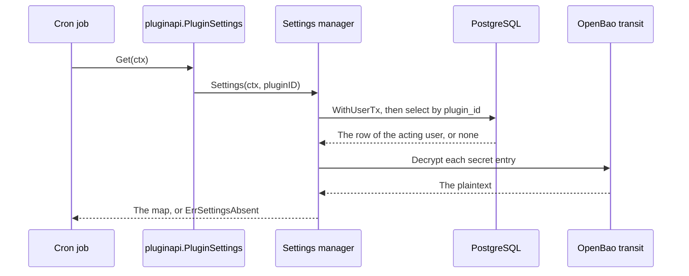

# Specification: The settings of a user for a plugin

## 1. Summary

A plugin declares a settings schema as one tagged Go struct, and the hub infers a JSON
Schema document from it.
The table `public.plugin_settings` holds one scoped row for each pair of a user and a
plugin, in one JSONB column where every entry carries the kind of its field. The hub
encrypts the entry of a secret field through the transit engine of OpenBao, with one
named key for each user. Three routes under `/plugins/{id}/settings` serve the deck,
and a plugin reads the values of the acting user through `Host.Settings()`.

## 2. Coverage

| Requirement     | Where this specification realizes it            |
| --------------- | ----------------------------------------------- |
| `PSET-FR-001`   | `PSET-DD-001`, Section 4.1, `PSET-SC-001`       |
| `PSET-FR-002`   | `PSET-DD-001`, `PSET-SC-002`                    |
| `PSET-FR-003`   | `PSET-DD-010`, Section 4.3, `PSET-SC-003`       |
| `PSET-FR-004`   | `PSET-DD-010`, `PSET-SC-004`                    |
| `PSET-FR-005`   | `PSET-DD-010`, `PSET-SC-004`                    |
| `PSET-FR-006`   | `PSET-DD-010`, `PSET-SC-005`, `PSET-SC-021`     |
| `PSET-FR-007`   | `PSET-DD-010`, `PSET-SC-006`, `PSET-SC-022`     |
| `PSET-FR-008`   | Section 4.5, `PSET-SC-007`                      |
| `PSET-FR-009`   | Section 4.5, `PSET-SC-007`                      |
| `PSET-FR-010`   | `PSET-DD-008`, `PSET-SC-008`                    |
| `PSET-FR-011`   | `PSET-DD-008`, `PSET-SC-009`                    |
| `PSET-FR-012`   | `PSET-DD-006`, Section 4.4, `PSET-SC-010`       |
| `PSET-FR-013`   | `PSET-DD-007`, `PSET-SC-011`                    |
| `PSET-FR-014`   | `PSET-DD-007`, `PSET-SC-012`                    |
| `PSET-FR-015`   | `PSET-DD-002`, `PSET-DD-004`, `PSET-SC-013`     |
| `PSET-FR-016`   | `PSET-DD-004`, `PSET-SC-014`                    |
| `PSET-FR-017`   | `PSET-DD-004`, `PSET-SC-015`                    |
| `PSET-FR-018`   | `PSET-DD-005`, `PSET-SC-016`                    |
| `PSET-FR-019`   | Section 4.5, `PSET-SC-017`                      |
| `PSET-FR-020`   | `PSET-DD-009`, `PSET-SC-018`                    |
| `PSET-NFR-001`  | `PSET-DD-011`, `PSET-SC-019`                    |
| `PSET-NFR-002`  | `PSET-DD-011`, `PSET-SC-020`                    |
| `PSET-INV-001`  | `PSET-DD-003`, Section 4.2, `PSET-SC-010`       |
| `PSET-INV-002`  | `PSET-DD-002`, `PSET-SC-013`                    |

## 3. Guideline compliance

| Rule      | Guideline        | How this specification obeys it                                                    |
| --------- | ---------------- | ----------------------------------------------------------------------------------- |
| `PLG-006` | Plugin model     | `PSET-DD-001` gives the interface, the registry, and the registrar.                |
| `PLG-007` | Plugin model     | `PSET-DD-006`. The plugin reaches the settings through `pluginapi.Host`.           |
| `PLG-011` | Plugin model     | `SettingsRegistry.Register` returns `ErrSettingsSchemaAlreadyRegistered`.          |
| `ARC-008` | Architecture     | Every rule in this design reads the schema of a plugin. No rule names a plugin.    |
| `DAT-002` | Data             | The table lives in `public`, which the hub owns.                                   |
| `DAT-009` | Data             | `id` declares `DEFAULT uuidv7()`. No Go code names it.                             |
| `OWN-004` | Record ownership | The table is scoped. Section 4.2 states it.                                        |
| `OWN-005` | Record ownership | `user_id` takes its value from `app.user_id`. No insert names it.                  |
| `OWN-006` | Record ownership | Section 4.2 gives the policy, and it forces it on the owner of the table.          |
| `OWN-007` | Record ownership | `PSET-DD-003` amends the rule. Two functions set `app.user_id`, and no other does. |
| `REP-003` | Repository       | The repository takes `*sqlx.Tx`. `database.WithUserTx` creates it.                 |
| `REP-006` | Repository       | The save is one `INSERT ... ON CONFLICT (user_id, plugin_id) DO UPDATE`.           |
| `API-003` | The HTTP API     | The rule gains the row `/plugins/{id}/settings`, and `handler.Plugin` is the one owner of the prefix. |
| `API-006` | The HTTP API     | Section 4.5. A rejected save answers with a body that names each field.            |
| `CFG-003` | Configuration    | Section 4.3 gives the configuration scheme with a `default` and a `validate` tag.  |
| `CFG-007` | Configuration    | The credential of one person leaves the file and reaches the scoped row.           |
| `EXT-005` | External         | A status that is not a success from the protection service is an error.            |
| `DEP-005` | Dependencies     | `PSET-DD-005`. The login fails the build of the provider, and that stops the process. |
| `LOG-005` | Logging          | `PSET-DD-009`. An error is an attribute, and it carries no secret.                 |
| `JOB-007` | Jobs             | `PSET-DD-007`. A skip is not an error, and it does not stop the scheduler.         |
| `PKG-004` | Package layout   | Every new hub package lives under `apps/hub/internal`.                             |

## 4. Design

### 4.1 Components

| Path                                                                | Action | Holds                                                                    |
| ------------------------------------------------------------------- | ------ | ------------------------------------------------------------------------ |
| `libs/pluginapi/settings.go`                                        | create | `ConfigurablePlugin`, `SettingsProvider`, `PluginSettings`, `ErrSettingsAbsent` |
| `libs/pluginconfig/config.go`                                       | change | `DecodeAndValidateSettings`, which reads the `json` tag                  |
| `libs/pluginapi/host.go`                                            | change | `Settings() (SettingsProvider, error)` joins `Host`                      |
| `apps/hub/db/migrations/20260914090000_table_plugin_settings_create.*` | create | `public.plugin_settings`, its policy, its trigger                     |
| `apps/hub/internal/model/plugin_settings.go`                        | create | `model.PluginSettings`, `model.Fields`, `model.SettingEntry`, `model.FieldKind`, `LogValue` |
| `apps/hub/internal/repository/plugin_settings.go`                   | create | `repository.PluginSettingsRepository`, `repository.PluginSettings`       |
| `apps/hub/internal/database/tx.go`                                  | create | `database.WithUserTx`                                                    |
| `apps/hub/internal/openbao/{doc,client}.go`                         | create | `openbao.New`, which builds the client and logs in                       |
| `apps/hub/internal/secret/{doc,cipher,transit}.go`                  | create | `secret.Cipher`, `secret.Transit`, `secret.Key`, `secret.UserKey`, `secret.UserKeyPrefix` |
| `apps/hub/internal/settings/{doc,service,schema,validate}.go`       | create | `settings.Service`, `settings.Manager`, `settings.SchemaSource`, `settings.Schema`, `settings.Infer`, `settings.Validate`, `settings.InvalidError`, `settings.MaxValueLength`, `settings.SecretMask` |
| `apps/hub/internal/registry/settings.go`                            | create | `registry.SettingsRegistry`, `registry.SettingsEntry`                    |
| `apps/hub/internal/plugin/registrar/settings.go`                    | create | `registrar.SettingsRegistrar`                                            |
| `apps/hub/internal/handler/plugin.go`                               | change | `handler.Plugin` takes the settings service, and it owns every route under `/plugins` |
| `apps/hub/internal/depresolver/{secret,settings}.go`                | create | `OpenBaoClient`, `SecretCipher`, `SettingsRegistry`, `SettingsService`   |
| `apps/hub/internal/config/config.go`                                | change | `OpenBao`, and the `OpenBao` field of `Config`                           |
| `apps/hub/internal/depresolver/resolver.go`                         | change | The four providers join `Resolver`, and four fields join `Container`     |
| `apps/hub/internal/depresolver/plugin.go`                           | change | `PluginHost` takes the service. `buildPluginLoader` passes the registry. |
| `apps/hub/internal/depresolver/server.go`                           | change | `registerHandlers` passes the settings service to the plugin handler     |
| `apps/hub/internal/plugin/host/host.go`                             | change | `Settings()`                                                             |
| `apps/hub/internal/plugin/loader/loader.go`                         | change | `NewSettingsRegistrar` joins the list, and `New` takes the registry      |
| `apps/hub/internal/worker/cron.go`                                  | change | An absent settings record ends a run with no failure                     |

| `apps/hub/internal/domain/errs/errs.go`                             | change | `ErrSettingsSchemaNotFound`, `ErrSettingsSchemaAlreadyRegistered`, `ErrInvalidSettingsModel`, `ErrProtectionUnavailable`, `ErrUnsupportedFieldsSource` |
| `apps/hub/go.mod`                                                   | change | `github.com/openbao/openbao/api/v2`, `.../api/auth/approle/v2`, `github.com/invopop/jsonschema`, `github.com/santhosh-tekuri/jsonschema/v6`, and `testcontainers-go` for the tests |
| `.golangci.yaml`                                                    | change | `secret.Cipher`, `settings.Service`, and `pluginapi.SettingsProvider` join the `ireturn` allowlist. `tagliatelle` reads a `json` tag as snake case. |
| `specs/features/pset/api.yaml`                                      | create | The three routes. See `SPC-002`.                                         |
| `specs/guidelines/ownership.md`                                     | change | `OWN-007`. See `PSET-DD-003`.                                            |

| `specs/guidelines/http-api.md`                                      | change | `API-003` gains one row.                                                 |

The signatures:

```go
// libs/pluginapi/settings.go

// ConfigurablePlugin is a plugin that declares the fields a user fills for it.
// SettingsModel returns a zero value of the struct that carries those fields.
type ConfigurablePlugin interface {
    Plugin
    SettingsModel() (any, error)
}

// SettingsProvider reads the settings of the acting user. The hub implements it.
type SettingsProvider interface {
    Settings(ctx context.Context, pluginID *PluginID) (map[string]any, error)
}

type PluginSettings struct { /* provider, pluginID */ }

func NewPluginSettings(provider SettingsProvider, pluginID *PluginID) *PluginSettings
func (p *PluginSettings) Get(ctx context.Context) (map[string]any, error)

// ErrSettingsAbsent reports that the acting user holds no complete settings record.
var ErrSettingsAbsent = errors.New("settings: absent for the acting user")

// libs/pluginconfig/config.go
// It decodes with the `json` tag, so one tag names the field in the schema,
// in the stored row, and in the struct of the plugin.
func DecodeAndValidateSettings(values map[string]any, target any) error

// apps/hub/internal/registry/settings.go
type SettingsEntry struct {
    PluginID *pluginapi.PluginID
    Schema   *settings.Schema
}

// apps/hub/internal/openbao/client.go
// One client serves every engine, so a second use of OpenBao logs in no second time.
func New(ctx context.Context, cfg *config.OpenBao) (*api.Client, error)

// apps/hub/internal/secret/cipher.go

// UserKeyPrefix starts the name of the transit key that protects one user.
// The name is this prefix followed by the identifier of the user record.
const UserKeyPrefix = "maroid-user-"

// Key names a key that a Cipher uses. A variable of the type string does not satisfy
// it, so a caller cannot pass a user identifier where a key belongs.
type Key string

func UserKey(userID string) Key

// Cipher holds no rule about what a Key names. A second use of the protection adds
// its own constructor beside UserKey and reaches the same Cipher.
type Cipher interface {
    Encrypt(ctx context.Context, key Key, plaintext string) (string, error)
    Decrypt(ctx context.Context, key Key, ciphertext string) (string, error)
}

// apps/hub/internal/secret/transit.go
// The cipher takes a client that already logged in, so the connection and the
// cryptographic operation are two concerns with two owners.
func NewTransit(client *api.Client, mount string) *Transit

// apps/hub/internal/settings/schema.go
type Schema struct {
    Document json.RawMessage            // the document that the route serves
    Compiled *jsonvalidate.Schema       // the same document without its required array
    Kinds    map[string]model.FieldKind // the kind of each field
    Required map[string]struct{}        // the key of each required field
}

func Infer(settingsModel any) (*Schema, error)

// MaxValueLength is the longest value one field accepts. Infer puts it on every
// string property that declares no limit of its own, so PSET-FR-008 holds for a
// plugin that declares nothing.
const MaxValueLength = 4096

// apps/hub/internal/settings/validate.go

// InvalidError names each field that caused a rejection. See PSET-FR-009.
type InvalidError struct {
    Fields map[string]string
}

func Validate(schema *Schema, input map[string]any) error

// apps/hub/internal/settings/service.go

// SecretMask stands for a secret that the row holds. Read returns it in place of every
// stored secret, and Save reads it as the instruction to keep the stored value. It
// holds the same six characters for every secret, so it tells the length of nothing.
const SecretMask = "******"

type Service interface {
    Schema(pluginID string) (json.RawMessage, error)
    Read(ctx context.Context, pluginID string) (map[string]any, error)
    Settings(ctx context.Context, pluginID *pluginapi.PluginID) (map[string]any, error)
    Save(ctx context.Context, pluginID string, input map[string]any) error
}

// Manager satisfies pluginapi.SettingsProvider, so the host hands it to a plugin
// with no adapter. Settings is the method that the interface names.

// apps/hub/internal/repository/plugin_settings.go
// REP-003: The caller creates it inside database.WithUserTx, so it holds the
// transaction and never the pool.
type PluginSettingsRepository interface {
    Get(ctx context.Context, pluginID string) (*model.PluginSettings, error)
    Upsert(ctx context.Context, pluginID string, fields model.Fields) error
}

func NewPluginSettings(tx *sqlx.Tx) *PluginSettings

// apps/hub/internal/database/tx.go
func WithUserTx(ctx context.Context, db *sqlx.DB, fn func(*sqlx.Tx) error) error
```

`Read` serves the route and returns the mask in place of each secret. `Settings` serves a
plugin and returns the plaintext. One method cannot do both, because the caller of one
must never receive what the caller of the other needs.

A plugin writes one struct, and the tags carry every part of the form:

```go
type UserSettings struct {
    Email    string `json:"email"    jsonschema:"title=Email,description=The address you sign in with,required"`
    Password string `json:"password" jsonschema:"title=Password,format=password,writeOnly=true,required"`
    Period   string `json:"period"   jsonschema:"title=Billing period,enum=month,enum=year,default=month"`
    Notify   bool   `json:"notify"   jsonschema:"title=Send me the monthly bill"`
}
```

### 4.2 Data model

| Table                    | Schema   | Scope  | Migration                                        | Realizes                      |
| ------------------------ | -------- | ------ | ------------------------------------------------ | ----------------------------- |
| `plugin_settings`        | `public` | scoped | `20260914090000_table_plugin_settings_create.up.sql` | `PSET-FR-003`, `PSET-INV-001` |

```sql
CREATE TABLE public.plugin_settings
(
    id         UUID        NOT NULL PRIMARY KEY DEFAULT uuidv7(),
    user_id    UUID        NOT NULL
        DEFAULT NULLIF(current_setting('app.user_id', true), '')::uuid
        REFERENCES public.users (id),
    plugin_id  TEXT        NOT NULL,
    fields     JSONB       NOT NULL DEFAULT '{}'::jsonb,
    created_at TIMESTAMPTZ NOT NULL DEFAULT NOW(),
    updated_at TIMESTAMPTZ NOT NULL DEFAULT NOW(),
    CONSTRAINT plugin_settings_user_plugin_key UNIQUE (user_id, plugin_id)
);

ALTER TABLE public.plugin_settings ENABLE ROW LEVEL SECURITY;
ALTER TABLE public.plugin_settings FORCE ROW LEVEL SECURITY;

CREATE POLICY plugin_settings_user_isolation ON public.plugin_settings
    USING (user_id = NULLIF(current_setting('app.user_id', true), '')::uuid)
    WITH CHECK (user_id = NULLIF(current_setting('app.user_id', true), '')::uuid);

CREATE TRIGGER set_updated_at
    BEFORE UPDATE ON public.plugin_settings
    FOR EACH ROW EXECUTE FUNCTION set_updated_at();
```

`fields` holds one entry for each field, keyed by the field key. An entry carries the
kind and the value, so the read path finds every ciphertext without the schema:

```json
{
  "email":    { "kind": "text",   "value": "person@example.com" },
  "password": { "kind": "secret", "value": "vault:v1:R0hIbUx..." },
  "notify":   { "kind": "switch", "value": true }
}
```

### 4.3 Declarations

**HTTP routes.** `api.yaml` holds the bodies and the status codes. See `SPC-002`.

| Method | Path                           | Access        | Realizes                                      |
| ------ | ------------------------------ | ------------- | --------------------------------------------- |
| `GET`  | `/plugins/{id}/settings/schema` | Authenticated | `PSET-FR-001`, `PSET-FR-002`                 |
| `GET`  | `/plugins/{id}/settings`        | Authenticated | `PSET-FR-004`, `PSET-FR-005`, `PSET-FR-010`  |
| `PUT`  | `/plugins/{id}/settings`        | Authenticated | `PSET-FR-003`, `PSET-FR-006`, `PSET-FR-007`, `PSET-FR-008`, `PSET-FR-009`, `PSET-FR-011` |

**Configuration scheme.**

| Key                     | Type   | Default        | Secret | Realizes      |
| ----------------------- | ------ | -------------- | ------ | ------------- |
| `openbao.address`       | string | none, required | no     | `PSET-FR-018` |
| `openbao.role_id`       | string | none, required | no     | `PSET-FR-018` |
| `openbao.secret_id`     | string | none, required | yes    | `PSET-FR-018` |
| `openbao.transit_mount` | string | `transit`      | no     | `PSET-FR-015` |

`openbao` names the server, not one use of it. The name of a transit key is a naming
convention of Maroid, so `secret.UserKeyPrefix` holds it and no operator sets it.
`transit_mount` stays configurable, because an operator can mount the transit engine at
a path that is not the default. The key names the engine, so a later use of OpenBao
adds its own key beside this one.

### 4.4 Flow

The save. The route is the only writer, and the protection runs before the statement.



The read of a plugin. The acting user comes from the context of the run.



### 4.5 Errors

| Condition                                             | Behavior          | Message, and the keyword that reports it    |
| ----------------------------------------------------- | ----------------- | ------------------------------------------- |
| The request carries no active user record             | 401               | `access denied`. See `SEC-004`.             |
| The plugin declares no settings schema                | 404               | `the plugin declares no settings`           |
| The save names a field the schema declares no property for | 422, names the field | `the field is unknown`. `additionalProperties` |
| The save leaves a required field with no value        | 422, names the field | `the field is required`. `required`      |
| The save gives a value outside the list of a choice   | 422, names the field | `the value is not in the list`. `enum`   |
| The save gives a value longer than 4096 characters    | 422, names the field | `the value is too long`. `maxLength`     |
| The save gives a value whose type is not the kind     | 422, names the field | `the value has the wrong type`. `type`   |
| OpenBao holds no key for the acting user              | 500, logs the key name | `protecting the value failed`          |
| OpenBao refuses the login or answers nothing          | 500 on a request, and the process stops at the start | `reaching the protection failed` |
| A stored entry does not decrypt                       | 500, the read fails, and it returns no value | `reading the protected value failed` |
| A required field of the schema holds no stored value  | `ErrSettingsAbsent` to the plugin | The run ends. No failure. |

## 5. Design decisions

### `PSET-DD-001`

**Realizes:** `PSET-FR-001`, `PSET-FR-002`
**Decision:** A plugin implements `ConfigurablePlugin` and returns a zero value of one
tagged struct. The registrar infers a JSON Schema document from that struct with
`invopop/jsonschema`, and it compiles the document with `santhosh-tekuri/jsonschema/v6`.
The route serves the document, and the save validates against the compiled form. The
reflector sets `additionalProperties` to false. The four kinds are keywords:

| Kind                       | Keywords                                                     |
| -------------------------- | ------------------------------------------------------------ |
| A free text                | `"type": "string"`                                           |
| A secret                   | `"type": "string"`, `"format": "password"`, `"writeOnly": true` |
| A true or false value      | `"type": "boolean"`                                          |
| A choice from a fixed list | `"type": "string"` with `enum`                               |

**Rationale:** One struct is the declaration and the decode target, so the two cannot
drift. `writeOnly` states in the standard what `PSET-FR-004` and `PSET-FR-005` demand,
`maxLength` states the limit of `PSET-FR-008`, and `additionalProperties` rejects the
unknown field. The validator reports the instance location of each failure, so
`PSET-FR-009` needs a mapping and no rule of ours. Neither library reaches
`libs/pluginapi`, because the plugin returns `any` and the hub reflects it. That matters
under `PLG-001`: a shared object and its host hold the same version of every shared
dependency, and a skew fails the open with an unclear message.
**Alternatives:** A hand written list of field descriptions, with the validation in the
hub. It carries about fifty lines that a standard already defines, and the deck then
learns a shape that Maroid alone uses. A library in the style of Zod (`zog`, `gozod`).
Each one validates a map and serializes no schema, so the declaration still needs a form
that travels, and the hub would write that serializer.

### `PSET-DD-002`

**Realizes:** `PSET-FR-003`, `PSET-FR-015`, `PSET-INV-002`
**Decision:** One row holds one pair of a user and a plugin, in the single JSONB column
`fields`. Every entry carries `kind` and `value`, and the entry of a secret field holds
the ciphertext in `value`.
**Rationale:** One read and one write serve a plugin run. The kind travels with the
value, so the read path finds every ciphertext with no lookup, and a schema that drops
a field cannot leave a ciphertext that nothing recognizes.
**Alternatives:** A row for each field. It costs a multi-row read on every run and a
reassembly in Go. Two columns, one for the plaintext and one for the ciphertext. The
kind then lives in the schema alone, and a schema change orphans a stored ciphertext.

### `PSET-DD-003`

**Realizes:** `PSET-INV-001`
**Decision:** `database.WithUserTx` opens a transaction and sets `app.user_id` from the
acting user of the context. `OWN-007` changes to name two functions: this one for the
hub, and `PluginDB.WithTx` for a plugin. No other place sets the value.
**Rationale:** `plugin_settings` is the first scoped table that the hub owns, and the
hub reads and writes it from its own handler. The policy of `OWN-006` fails closed, so
a transaction with no setting reads no row. One function for the hub keeps the count of
the places at two, and a reader finds both by the name of the setting.
**Alternatives:** Reach the table through `pluginapi.PluginDB` with a plugin identifier
of the hub. `PluginDB` sets the search path to the schema of a plugin, and the hub owns
`public`. Set the value in the authentication middleware. The pool hands a different
connection to the next statement, so the setting does not reach it.

### `PSET-DD-004`

**Realizes:** `PSET-FR-015`, `PSET-FR-016`, `PSET-FR-017`
**Decision:** The protection is the transit engine of OpenBao. One named key protects
one user, and its name is the constant `secret.UserKeyPrefix` followed by the identifier
of the user record. `settings.Manager` chooses that key and the `Cipher` takes it, so
the cipher holds no rule about a user. The owner creates each key. The hub calls encrypt
and decrypt, and it creates no key.
**Rationale:** Transit returns `vault:v<n>:<payload>`, and the version prefix selects
the key version on decrypt. A rotation therefore needs no column of ours, and
`PSET-FR-017` holds with no work. A key for each user makes the destruction of one key
the destruction of the secrets of one person. A hub that creates no key needs no create
permission, so a hub that an attacker reaches cannot mint a key.
**Alternatives:** One key with `derived: true` and the user identifier as the context.
One key cannot be destroyed for one person. Store the secret in KV v2. One settings
record then spans two stores with no transaction. A data key for each record. A
password is not large enough to pay for the extra step.

### `PSET-DD-005`

**Realizes:** `PSET-FR-018`
**Decision:** `openbao.New` builds the client and logs in with AppRole.
`Container.OpenBaoClient` holds it, and `Container.SecretCipher` takes it to build
`secret.Transit`. The login is a request to the service, so a build that cannot reach
it returns an error and the process stops. `Application.New` resolves the plugin
loader, which builds the host, the settings service, and the cipher, so the login runs
before any command and before any plugin loads.
**Rationale:** The login proves more than a health check. It proves that the service
answers and that the credentials of this installation work, and a sealed service
refuses it too. `DEP-005` already stops the process when a build that can fail returns
an error, so the start needs no step of its own and `LIF-003` keeps its five steps.
One client serves every engine of OpenBao, so a later use of the key value store or
of the certificate authority logs in no second time.
**Alternatives:** A `Verify` method on the cipher, called from `Run`. The provider has
already built the cipher by then, so the call costs a second request that proves less
than the first. A step in `LIF-003`. A dependency that a provider builds is not a step
of the start, and adding one invites a step for every dependency.

### `PSET-DD-006`

**Realizes:** `PSET-FR-012`
**Decision:** `Host` gains `Settings()`, which returns a `SettingsProvider`. The plugin
binds it to itself with `pluginapi.NewPluginSettings(provider, plg.Meta().ID)` and calls
`Get(ctx)` inside a run.
**Rationale:** This is the shape that `pluginapi.NewPluginDB` already gives for the
database, so a plugin author learns one pattern. The host is one instance for every
plugin, and the identifier of the caller cannot come from the host.
**Alternatives:** `Host.Settings(pluginID)` returning a bound reader. It hides the bind
step and it reads no better. Pass the values into `CronJob.Run`. The signature then
serves no HTTP handler of a plugin, and `JOB-005` changes for every plugin.

### `PSET-DD-007`

**Realizes:** `PSET-FR-013`, `PSET-FR-014`
**Decision:** The manager returns `pluginapi.ErrSettingsAbsent` when a required field of
the current schema holds no value. `CronWorker.runForEachUser` checks the sentinel and
logs at the info level with no error attribute.
**Rationale:** A per-user job runs for every active user at every tick, and few users
hold a record for one plugin. Without the check, one configured plugin writes an error
for every other person at every tick, and `JOB-007` then fills the log with work that
nobody must act on. A record that nobody filled and a record that a new required field
made incomplete give the plugin one condition, as `PSET-FR-013` demands.
**Alternatives:** Return an empty map. A plugin then fails inside its own validation,
and the reason reaches the log as a failure. Filter the run by the users that hold a
record. The owner chose the plugin as the place that decides.

### `PSET-DD-008`

**Realizes:** `PSET-FR-010`, `PSET-FR-011`
**Decision:** The read returns only the entries whose key the current schema declares.
The save writes the full set of the declared fields, so an entry of a field that the
schema dropped leaves the row at the next save.
**Rationale:** One rule covers both directions with no scheduled cleanup and no
migration. A plugin that returns to an older version finds its value until the user
saves again.
**Alternatives:** Remove the entry as soon as the hub loads the new schema. A plugin
that fails to load looks like a schema with no field, and the values of the user go.

### `PSET-DD-009`

**Realizes:** `PSET-FR-020`
**Decision:** `model.PluginSettings` implements `slog.LogValuer`. The value it returns
holds the plugin identifier, the count of the fields, and the key of each field. It
holds no value of any field.
**Rationale:** A log statement that passes the entity is the way a secret reaches the
log. The method makes the redaction the default, so a new call site cannot leak by
forgetting. `LOG-005` puts an error in an attribute, and this keeps that attribute safe.
**Alternatives:** A review rule that forbids logging the entity. A compiler checks no
review rule.

### `PSET-DD-010`

**Realizes:** `PSET-FR-003` to `PSET-FR-007`
**Decision:** `GET /plugins/{id}/settings` returns each value that is not a secret. For
a secret field it returns the fixed mask `settings.SecretMask`, which is `******`, when
the field holds a value, and the empty string when it holds none. `PUT` takes the full
object. A secret field that the body does not name keeps its stored value, and so does
one whose body value equals the mask. The mask stands for a value and is not one, so the
save judges it against no rule of its field, and the length of the mask stays free of
every limit that a plugin declares. A field whose body value is `null` or the empty
string loses its stored value.
**Rationale:** The answer is a valid instance of the schema that the plugin declares, so
a form renders it from the schema alone and holds no rule of its own. The mask holds six
characters for every secret, so it tells the length of nothing. A client that sends back
what it read changes nothing, so the keep rule of `PSET-FR-006` holds for a client that
omits the field and for one that returns it untouched.
**Alternatives:** `{"set": true}` in place of the value. No value of a user can collide
with it, and it is not a string, so it fails the schema of its own property and every
reader needs a rule for it. The mask carries one cost in exchange: a user whose secret
is the six characters of the mask cannot store it, because the save reads that value as
the keep rule.
**Alternatives:** Return the ciphertext. A reader then holds the material that the
protection exists for. A route for each field. Four routes replace two, and a save of
two fields stops halfway.

### `PSET-DD-011`

**Realizes:** `PSET-NFR-001`, `PSET-NFR-002`
**Decision:** The hub caches no decrypted value and no row. Every read reaches the
database and the protection service.
**Rationale:** `PSET-NFR-001` gives 1 second, and no cache holds a value for less time
than it takes to build. A plugin run reads one time, and a monthly job for a household
makes the count of the calls small. A plaintext credential then lives in the process for
one run, and not between two runs.
**Alternatives:** Cache the decrypted values with a short expiry. It buys nothing that
`PSET-NFR-002` asks for, and it holds a credential in memory while nothing reads it.

## 6. Scenarios

`spec-scenarios.md` holds `PSET-SC-001` through `PSET-SC-020`.

## 7. Build plan

| #   | Step                                                                              | Realizes                      | Done |
| --- | --------------------------------------------------------------------------------- | ----------------------------- | ---- |
| 1   | Correct `OWN-007` and `API-003` first.                                            | `PSET-DD-003`                 | [x]  |
| 2   | Add the capability and the reader to `libs/pluginapi`.                            | `PSET-FR-001`, `PSET-FR-012`  | [x]  |
| 3   | Write the migration and run it.                                                   | `PSET-FR-003`, `PSET-INV-001` | [x]  |
| 4   | Write `database.WithUserTx`, `model.PluginSettings`, and the repository.          | `PSET-INV-001`, `PSET-FR-020` | [x]  |
| 5   | Write `openbao.New`, `secret.Cipher`, `secret.Transit`, and the configuration scheme. | `PSET-FR-015` to `PSET-FR-018` | [x] |
| 6   | Write the registry, the registrar that infers and compiles the schema, and add both to the loader. | `PSET-FR-001`, `PSET-FR-002` | [x] |
| 7   | Write `settings.Manager` with the save, the two reads, and the mapping of a validation error onto its field. | `PSET-FR-003` to `PSET-FR-011` | [x] |
| 8   | Write `api.yaml`, then the settings methods on `handler.Plugin`.                              | `PSET-FR-004` to `PSET-FR-009` | [x] |
| 9   | Add `Settings()` to the host, and the providers to the container.                 | `PSET-FR-012`                 | [x]  |
| 10  | Change the cron worker.                                                           | `PSET-FR-014`                 | [x]  |
| 11  | Rebuild every plugin. `BLD-004` binds a change in `libs/pluginapi`.               | `PSET-FR-012`                 | [x]  |

Write the test of each step before the code of that step. See `TST-002`.

## 8. Out of scope for this specification

| Item                                                                    | Reason                                                                  |
| ----------------------------------------------------------------------- | ----------------------------------------------------------------------- |
| The form in the deck                                                    | The requirements exclude it. The routes and `api.yaml` are its contract. |
| Moving a value of an existing plugin out of `config.yaml`               | `CFG-007` moves one value at a time. One feature for each plugin.        |
| A plugin that reads the settings of another plugin through the provider | A plugin is trusted code in the process, as `PluginDB` already is.       |
| A command that creates or destroys the protection of a user             | Open question 1 of the requirements gives the call to the service.       |

## Retired identifiers

This file has no retired identifier.
