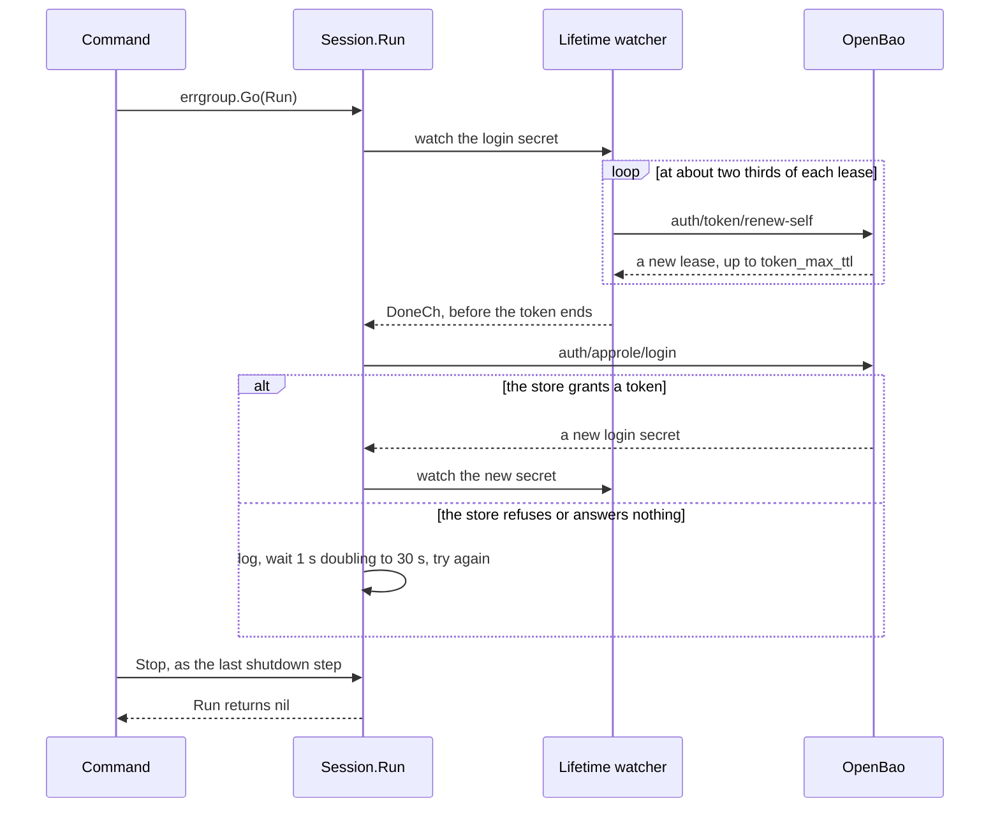

# Specification: The access of Maroid to the secret store

## 1. Summary

`openbao.Session` holds the shared OpenBao client and the AppRole login. Its `Run`
method keeps the token alive with the lifetime watcher of the OpenBao API, and it logs
in again when the token reaches its end. The commands `serve http` and `worker` run it
in their errgroup. The readiness check of the secret store also asks OpenBao whether the
token of the hub still works.

## 2. Coverage

| Requirement        | Where this specification realizes it                          |
| ------------------ | ------------------------------------------------------------- |
| `SSACCESS-FR-001`  | Section 4.1, `SSACCESS-DD-001`, `SSACCESS-DD-002`, `SSACCESS-DD-004`, `SSACCESS-SC-001`, `SSACCESS-SC-002` |
| `SSACCESS-FR-002`  | `SSACCESS-DD-002`, `SSACCESS-SC-002`                          |
| `SSACCESS-FR-003`  | `SSACCESS-DD-003`, `SSACCESS-SC-003`, `SSACCESS-SC-004`       |
| `SSACCESS-FR-004`  | `SSACCESS-DD-003`, `SSACCESS-SC-003`                          |
| `SSACCESS-FR-005`  | Section 4.5, `SSACCESS-DD-006`, `SSACCESS-SC-005`, `SSACCESS-SC-006` |
| `SSACCESS-FR-006`  | `SSACCESS-DD-005`, `SSACCESS-SC-007`, `SSACCESS-SC-008`       |
| `SSACCESS-NFR-001` | `SSACCESS-DD-003`, `SSACCESS-SC-009`                          |

## 3. Guideline compliance

| Rule      | Guideline         | How this specification obeys it                                                   |
| --------- | ----------------- | --------------------------------------------------------------------------------- |
| `LIF-003` | Lifecycle         | The first login stays inside the build of the provider. The start keeps five steps. |
| `LIF-004` | Lifecycle         | `SSACCESS-DD-004`. Each command runs `Session.Run` in its errgroup.               |
| `LIF-005` | Lifecycle         | `SSACCESS-DD-004`. The session starts first, so its stop is the last step.        |
| `LIF-006` | Lifecycle         | `Session.Stop` takes the shutdown context with its 10 seconds. `SSACCESS-SC-010`. |
| `LOG-003` | Logging           | The logger of the session carries `component` and `address`.                      |
| `LOG-005` | Logging           | Each failure goes to `slog.Any("error", err)`.                                    |
| `LOG-008` | Logging           | `SSACCESS-DD-006`. No record holds the token or the secret ID. `SSACCESS-SC-005`. |
| `DEP-003` | Dependencies      | `openBaoSession` replaces the field `openBaoClient`.                              |
| `DEP-005` | Dependencies      | The build of the session can fail, so it holds `mu` and resets `once`.            |
| `DEP-008` | Dependencies      | The session holds no resource that `Close` frees. The command stops the loop.     |
| `JOB-001` | Jobs              | `SSACCESS-DD-004`. The session is not a `worker.Worker`, so `--workers` cannot leave it out. |
| `EXT-005` | External services | A refused lookup of the token is a failed check, never an up.                     |
| `TST-004` | Testing           | Section 6 gives each scenario a layer. `SSACCESS-SC-009` measures the 60 seconds. |

## 4. Design

### 4.1 Components

| Path                                              | Action | Content                                                                 |
| ------------------------------------------------- | ------ | ----------------------------------------------------------------------- |
| `apps/hub/internal/openbao/client.go`             | delete | Its login moves into `session.go`.                                      |
| `apps/hub/internal/openbao/session.go`            | create | `Session`, `New`, `Client`, `Run`, `Stop`                               |
| `apps/hub/internal/openbao/doc.go`                | change | The package keeps the access of the hub to OpenBao.                     |
| `apps/hub/internal/openbao/session_test.go`       | create | `SSACCESS-SC-001` to `SSACCESS-SC-006`, `SSACCESS-SC-009` to `SSACCESS-SC-011` |
| `apps/hub/internal/depresolver/secret.go`         | change | `OpenBaoSession` replaces `OpenBaoClient`. `SecretCipher` takes `Client()`. |
| `apps/hub/internal/depresolver/health.go`         | change | `HealthService` takes `OpenBaoSession().Client()`.                      |
| `apps/hub/internal/depresolver/resolver.go`       | change | `Resolver` lists `OpenBaoSession`. The field `openBaoSession` replaces `openBaoClient`. |
| `apps/hub/internal/command/serve/http.go`         | change | Runs the session in the errgroup. Stops it in the last shutdown step.   |
| `apps/hub/internal/command/worker.go`             | change | Runs the session in the errgroup. Stops it after every worker.          |
| `apps/hub/internal/healthcheck/openbao.go`        | change | `secretStoreCheck` looks up the token after the health of the store.    |
| `apps/hub/internal/healthcheck/service_test.go`   | change | The fake store answers `lookup-self`. `SSACCESS-SC-007`, `SSACCESS-SC-008`. |
| `apps/hub/internal/secret/transit_test.go`        | change | Builds the cipher from `openbao.New(...).Client()`.                     |
| `apps/hub/internal/settings/manager_test.go`      | change | Builds the cipher from `openbao.New(...).Client()`.                     |
| `specs/features/pset/spec.md`                     | change | Section 4 names `openbao.New` with its new result.                      |

```go
// apps/hub/internal/openbao/session.go

// Session holds the client that every use of OpenBao shares, and keeps its token alive.
type Session struct { /* client, login, logger, stop, done */ }

// New builds the client and logs in with AppRole. A failed login returns an error,
// so the process does not start. See PSET-FR-018.
func New(ctx context.Context, cfg *config.OpenBao, logger *slog.Logger) (*Session, error)

// Client returns the shared client. A new login changes its token in place.
func (s *Session) Client() *api.Client

// Run keeps the token alive until Stop. It ignores the cancellation of ctx.
// It returns nil after Stop.
func (s *Session) Run(ctx context.Context) error

// Stop ends Run and waits for it, or returns the error of ctx at its deadline.
// It returns nil when Run never started.
func (s *Session) Stop(ctx context.Context) error
```

```go
// apps/hub/internal/depresolver/resolver.go
OpenBaoSession() (*openbao.Session, error)
```

The constants of `session.go`:

| Constant          | Value      | Use                                       |
| ----------------- | ---------- | ----------------------------------------- |
| `firstRetryDelay` | 1 second   | The wait after the first failed login.    |
| `maxRetryDelay`   | 30 seconds | The longest wait between two logins.      |
| `loginTimeout`    | 10 seconds | The limit of one login request.           |

### 4.3 Declarations

This feature adds no route, no table, no job, no worker, and no configuration key.
`openbao.address`, `openbao.role_id`, and `openbao.secret_id` from `PSET` keep their meaning.
The AppRole role must accept the secret ID at every login. `secret_id_num_uses` is `0`,
and `secret_id_ttl` is `0` or longer than the process runs.

### 4.4 Flow



### 4.5 Errors

| Condition                                        | Behavior                                         | Log record                                          |
| ------------------------------------------------ | ------------------------------------------------ | --------------------------------------------------- |
| The first login fails                            | `New` returns the error. The process stops.      | None. `PSET` gives the message.                     |
| A renewal fails                                  | The watcher tries again until the lease ends, then ends with the error | Warn, `renewing the openbao token failed`, at the end of the watch |
| A login after the start fails                    | Wait, then try again. Run keeps running.         | Error, `logging in to openbao failed`, with `retry_in` |
| A login after the start succeeds                 | Watch the new secret                             | Info, `logged in to openbao`                        |
| The token lookup of a readiness check fails      | The secret store counts as failed                | The record of `HEALTH`                              |
| `Stop` reaches the deadline of its context       | `Stop` returns the error of the context          | The shutdown step logs it. `LIF-008`.               |

## 5. Design decisions

### `SSACCESS-DD-001`

**Realizes:** `SSACCESS-FR-001`
**Decision:** `openbao.Session` holds the client, the AppRole login, and the login secret.
`openbao.New` returns it, and the provider `OpenBaoSession` replaces `OpenBaoClient`.
**Rationale:** A new login needs the login method and the role credentials, and the
client alone holds neither. One owner of the token keeps the client shared, so
`secret.Transit` and the health check see a new token with no change.
**Alternatives:** Keep `OpenBaoClient` and add a second provider for the loop. Two
providers would hold one login, and the reason for each would be unclear.

### `SSACCESS-DD-002`

**Realizes:** `SSACCESS-FR-001`, `SSACCESS-FR-002`
**Decision:** `Run` watches the login secret with `api.LifetimeWatcher` and
`RenewBehaviorIgnoreErrors`. When `DoneCh` fires, `Run` logs in again and watches the
new secret.
**Rationale:** The watcher renews at about two thirds of each lease. It fires `DoneCh`
before the token reaches `token_max_ttl`, with a grace period, so the new login lands
while the old token still works. A failed renewal does not end the watch early.
**Alternatives:** A timer that reads the TTL. It rebuilds the grace logic of the
library. A new login on the first 403. The request that meets the 403 fails, which
breaks `SSACCESS-FR-002`. A login at a fixed interval. It needs the TTL in the
configuration of Maroid, and the role owns that number.

### `SSACCESS-DD-003`

**Realizes:** `SSACCESS-FR-003`, `SSACCESS-FR-004`, `SSACCESS-NFR-001`
**Decision:** A failed login waits `firstRetryDelay`, then doubles the wait up to
`maxRetryDelay`, and never gives up. Each login runs with `loginTimeout`. A success
resets the wait.
**Rationale:** The worst case after the store answers again is one wait of 30 seconds
plus one login of at most 10 seconds: 40 seconds, inside the 60 of `SSACCESS-NFR-001`.
The owner chose to keep running over a stop. A restart meets the same refusal.
**Alternatives:** `cenkalti/backoff/v5`. It adds a direct dependency for a loop of
15 lines. A stop after a limit. Open question 1 of the requirements rejects it.

### `SSACCESS-DD-004`

**Realizes:** `SSACCESS-FR-001`
**Decision:** `serve http` and `worker` resolve the session, start `Run` in their
errgroup, and call `Stop` as their last shutdown step. `Run` ignores the cancellation
of its context.
**Rationale:** `LIF-004` puts each long-lived service in the errgroup. The session
starts before every other service, so `LIF-005` stops it last. A request in the drain
period still holds a token. A short command such as `migrate` ends long before any TTL.
**Alternatives:** A goroutine that the provider starts and `Close` stops. Every
command gets it, but it is a long-lived service outside an errgroup, and `LIF-004`
forbids it. A `worker.Worker`. The flag `--workers cron` would leave it out, and the
cron jobs read secrets.

### `SSACCESS-DD-005`

**Realizes:** `SSACCESS-FR-006`
**Decision:** `secretStoreCheck` calls `auth/token/lookup-self` after `sys/health`.
An error of the lookup fails the check with `reading the openbao token: %w`. The check
keeps the name `secret-store`.
**Rationale:** `sys/health` needs no token, so it reports up while the token is dead.
The lookup proves the token that every request carries. It also catches a token that
an administrator revoked, which the watcher never sees. One extra request for each
probe fits inside the 2 seconds of `checkLimit`.
**Alternatives:** A flag that `Run` sets. It costs no request, but it misses a revoked
token, and it reports up until the loop fails.

### `SSACCESS-DD-006`

**Realizes:** `SSACCESS-FR-005`
**Decision:** The logger of the session carries `component` `secret-store` and
`address`. Section 4.5 gives the level and the message of each record. The error
attribute is the error of the OpenBao API.
**Rationale:** The API error holds the URL and the errors that the store returned, not
the request body, so it names a refusal or an unanswered address and holds no secret ID.
**Alternatives:** A message of our own for each cause. It hides the reason of the store.

## 6. Scenarios

Each integration scenario starts OpenBao in a container, as `secret/transit_test.go`
does. A test proxy sits between the session and the container. It forwards a request,
or it closes the connection with no answer.

OpenBao reports a lease in whole seconds, and the watcher keeps a grace of 10 to 20
percent of the lease. A scenario that needs the handover before the end of a token
uses a lease of 10 seconds or more, so the rounding stays inside the grace.

### `SSACCESS-SC-001`

**Verifies:** `SSACCESS-FR-001`
**Layer:** integration

**Given** a role with `token_ttl` 5 seconds and `token_max_ttl` 60 seconds, and a running session.
**When** 12 seconds pass.
**Then** an encrypt through `Client()` succeeds. The token is the token of the first login.

### `SSACCESS-SC-002`

**Verifies:** `SSACCESS-FR-001`, `SSACCESS-FR-002`
**Layer:** integration

**Given** a role with `token_ttl` 10 seconds and `token_max_ttl` 20 seconds, and a running session.
**When** the test encrypts every 200 milliseconds for 45 seconds.
**Then** every encrypt succeeds. The log holds at least two records `logged in to openbao`.

### `SSACCESS-SC-003`

**Verifies:** `SSACCESS-FR-003`, `SSACCESS-FR-004`
**Layer:** integration

**Given** a role with `token_ttl` 2 seconds and `token_max_ttl` 2 seconds, and a running session.
**When** the proxy answers nothing for 8 seconds, then forwards again.
**Then** `Run` has not returned. An encrypt succeeds within 10 seconds of the restore.

### `SSACCESS-SC-004`

**Verifies:** `SSACCESS-FR-003`
**Layer:** integration

**Given** a running session, and a role with `token_ttl` 2 seconds and `token_max_ttl` 2 seconds.
**When** the test destroys the secret ID, and 6 seconds pass.
**Then** `Run` has not returned. An encrypt returns an error.

### `SSACCESS-SC-005`

**Verifies:** `SSACCESS-FR-005`
**Layer:** integration

**Given** the state of `SSACCESS-SC-004`.
**When** the test reads the log.
**Then** a record at the level error says `logging in to openbao failed`, and its
`error` names the refusal of the store. No record holds the secret ID or a token.

### `SSACCESS-SC-006`

**Verifies:** `SSACCESS-FR-005`
**Layer:** integration

**Given** a role with `token_ttl` 2 seconds and `token_max_ttl` 2 seconds, and a running session.
**When** the proxy answers nothing.
**Then** within 20 seconds, a record says `logging in to openbao failed`, and its
`error` names the address of the proxy. The client of the OpenBao API retries a
request two times before it fails, so one renewal and one login take about 7 seconds.

### `SSACCESS-SC-007`

**Verifies:** `SSACCESS-FR-006`
**Layer:** unit

**Given** a fake store that answers `sys/health` unsealed and `auth/token/lookup-self` with 403.
**When** the readiness runs.
**Then** the answer is 503, and the problem names `secret-store`.

### `SSACCESS-SC-008`

**Verifies:** `SSACCESS-FR-006`
**Layer:** unit

**Given** a fake store that answers `sys/health` unsealed and `auth/token/lookup-self` with 200.
**When** the readiness runs.
**Then** the secret store counts as up.

### `SSACCESS-SC-009`

**Verifies:** `SSACCESS-NFR-001`
**Layer:** integration

**Given** a role with `token_ttl` 2 seconds and `token_max_ttl` 2 seconds, and a running session.
**When** the proxy answers nothing for 70 seconds, then forwards again.
**Then** `lookup-self` through `Client()` succeeds no more than 60 seconds after the
restore. The test runs about two minutes.

### `SSACCESS-SC-010`

**Verifies:** `SSACCESS-DD-004`
**Layer:** integration

**Given** a running session, and a proxy that holds every request open.
**When** the test calls `Stop` with a context of 10 seconds.
**Then** `Stop` returns nil within 10 seconds, and `Run` returns nil.

### `SSACCESS-SC-011`

**Verifies:** `SSACCESS-DD-004`
**Layer:** integration

**Given** a session that runs with a context.
**When** the test cancels the context, and 3 seconds pass.
**Then** `Run` has not returned. It returns after `Stop`.

## 7. Build plan

| #   | Step                                                                                  | Realizes                                   | Done |
| --- | ------------------------------------------------------------------------------------- | ------------------------------------------ | ---- |
| 1   | Write the test proxy and `SSACCESS-SC-001` to `SC-006`, `SC-010`, `SC-011`. Watch them fail. | `SSACCESS-FR-001` to `SSACCESS-FR-005`     | [x]  |
| 2   | Write `openbao.Session` and delete `client.go`.                                       | `SSACCESS-FR-001` to `SSACCESS-FR-005`     | [x]  |
| 3   | Replace `OpenBaoClient` with `OpenBaoSession` in the container.                       | `SSACCESS-FR-001`                          | [x]  |
| 4   | Run and stop the session in `serve http` and in `worker`.                             | `SSACCESS-FR-001`                          | [x]  |
| 5   | Add `lookup-self` to the fake store. Write `SC-007` and `SC-008`, then the check.     | `SSACCESS-FR-006`                          | [x]  |
| 6   | Write `SSACCESS-SC-009`.                                                              | `SSACCESS-NFR-001`                         | [ ]  |
| 7   | Name the new result of `openbao.New` in section 4 of `specs/features/pset/spec.md`.   | `SSACCESS-FR-001`                          | [ ]  |

## Retired identifiers

This file has no retired identifier.
