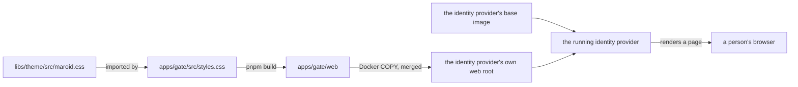

# Specification: The shared theme and the identity provider's pages

## 1. Summary

A new shared library, `libs/theme`, holds the `maroid` daisyUI theme that
`apps/deck` defines today. The identity provider (dex) gets its own web root,
`apps/gate`, built from that same library. It replaces dex's own stock `light`
theme in place, and it owns and overrides every template the identity
provider can render to a person, so no page a visitor reaches still carries
dex's own stock look.

## 2. Coverage

| Requirement       | Where this specification realizes it            |
| ------------------ | -------------------------------------------------- |
| `THEMING-FR-001`   | Section 4.1, `THEMING-DD-002`, `THEMING-DD-008`, `THEMING-SC-001` to `THEMING-SC-003`, `THEMING-SC-008` |
| `THEMING-FR-002`   | Section 4.1, `THEMING-DD-001`, `THEMING-DD-004`, `THEMING-SC-004`, `THEMING-SC-005` |
| `THEMING-FR-003`   | Section 4.1, `THEMING-DD-005`, `THEMING-SC-006`   |
| `THEMING-FR-004`   | Section 4.1, `THEMING-DD-002`, `THEMING-SC-001`   |
| `THEMING-INV-001`  | Section 4.1, `THEMING-DD-003`, `THEMING-SC-007`   |

## 3. Guideline compliance

| Rule      | Guideline      | How this specification obeys it |
| --------- | -------------- | -------------------------------- |
| `ARC-003` | Architecture   | `libs/theme` ships plain CSS. The shell's own TypeScript toolchain (Tailwind, in `apps/deck`) imports it with no extra build step, the same way it already imports `tailwindcss` itself. |
| `ARC-005` | Architecture   | `libs/theme` is a shared library, the kind `libs/*` already names. `apps/gate` joins `apps/hub` and `apps/deck` under `apps/`, a buildable package like `apps/deck`, with no server of its own. |
| `ARC-007` | Architecture   | Section 7 adds `libs/theme` and `apps/gate` to `pnpm-workspace.yaml`. |
| `ARC-009` | Architecture   | `.docker/dex/Dockerfile` builds one container image. Deploying it through `chart/` is unchanged by this specification. |
| `TS-005`  | Frontend style | `libs/theme` and the identity provider's stylesheet both compile through Tailwind CSS 4 and daisyUI, the same as `apps/deck`. `TS-001` to `TS-004` do not apply: the package holds no TypeScript and no Svelte file. |
| `BLD-001` | Build and release | Section 7 gives the lint and build command for `libs/theme` and `apps/gate`. |

## 4. Design

### 4.1 Components

**`libs/theme`**, a shared library.

| File                            | Holds                                                                  |
| --------------------------------- | ------------------------------------------------------------------------ |
| `libs/theme/package.json`       | The package manifest. Exports `maroid.css` and `maroid-dusk.css`.      |
| `libs/theme/.prettierrc`        | `useTabs`, `singleQuote`, matching `apps/deck/.prettierrc`.            |
| `libs/theme/src/maroid.css`     | The `maroid` daisyUI theme: its colors, radii, and the three font declarations. The light theme, and the only one the identity provider imports. |
| `libs/theme/src/maroid-dusk.css` | The `maroid-dusk` daisyUI theme, the dark counterpart. Only `apps/deck` imports it: `THEMING` keeps a dark theme out of scope at the identity provider. |

`libs/theme` also carries the page background texture and the font-family
rule every consumer needs, so neither `apps/deck` nor `apps/gate` repeats
them.

`apps/deck` imports both theme files; `apps/gate` imports only `maroid.css`,
and its `package.json` depends on `@maroid/theme` as a workspace package the
same way `apps/deck` does.

**`apps/gate`**, a buildable frontend under `apps/`, built to static output,
running no server process of its own.

| File                                         | Holds                                                                |
| ----------------------------------------------- | ------------------------------------------------------------------------ |
| `apps/gate/package.json`                   | The package manifest: one build script, `@maroid/theme` as a dependency. |
| `apps/gate/.prettierrc`                    | `useTabs`, `singleQuote`, matching `libs/theme/.prettierrc`.           |
| `apps/gate/src/styles.css`                 | The build entry: the shared theme, Tailwind, daisyUI, and the templates it scans. |
| `apps/gate/.gitignore`                     | `web/themes/light/styles.css`, the one generated file.                 |
| `apps/gate/web/templates/*.html`           | Every template the identity provider can render. `THEMING-DD-008` gives why all of them, not a subset. |
| `apps/gate/web/static/img/oidc-icon.svg`   | Replaces the OpenID Connect provider's icon. No other file under `static/` exists here; the rest comes from the base image, unchanged. |
| `apps/gate/web/themes/light/favicon.png`   | dex v2.45.1's own favicon, unchanged bytes.                            |
| `apps/gate/web/themes/light/logo.png`      | The shell's own logo, unchanged bytes.                                 |
| `apps/gate/web/themes/light/styles.css`    | Generated. The build script writes it directly here.                   |

`apps/gate/web/themes/light/` replaces dex's own `light` theme in place,
rather than adding a directory under a new name. `THEMING-DD-006` gives the
reason.

**The templates.** Every page keeps the data it renders and the sign-in
logic behind it exactly as the identity provider's own build gives it; this
specification changes only what a page looks like. Each page shares the same
header and footer, carrying the brand mark and the theme's colors, radii, and
font the same way the shell's own header and footer do. `THEMING-DD-002`
gives the header and footer's relationship to the shell's own layout.

The identity provider shows more than the sign-in chooser and the credential
form: a consent screen, an error page, device-code entry and confirmation,
an out-of-band code page, a two-factor code entry, a security-key screen, a
sign-out page, and a signed-in account page a person reaches once a session
exists. Every one of them carries the theme. `THEMING-DD-008` gives why this
specification owns all of them rather than a named subset.

**`.docker/dex/Dockerfile`.** A multi-stage build. The first stage installs
the workspace's dependencies and runs `apps/gate`'s own build, producing
`apps/gate/web`. The second stage starts from the identity provider's base
image, configurable through a build argument, and copies `apps/gate/web`
into it.

That copy merges into the base image's own web root; it does not replace it.
`THEMING-DD-007` gives the reason this Dockerfile leaves that alone instead
of clearing the directory first, and what it means for a file this
specification does not carry: the base image's own `robots.txt` and its own
`static/main.css` (apart from the one icon `THEMING-DD-007` replaces) still
apply, unchanged.

### 4.2 Data model

None. This feature adds no table.

### 4.3 Declarations

None. This feature adds no route, no job, no subscriber, and no command that
`SPC-003` lists.

### 4.4 Flow

### 4.5 Errors

| Condition                                                          | Behavior                                            | Message                              |
| --------------------------------------------------------------------- | ------------------------------------------------------ | ----------------------------------------- |
| `frontend.theme` names a theme other than `light` (`dark`, or a name this web root does not carry) | The identity provider serves that theme, or falls back to its own `dark` theme for a name it does not recognize | A page in the identity provider's own stock theme, with no error |
| The base image runs its process as a user other than uid 1001        | The copied files stay owned by 1001, unreadable        | The identity provider fails to start or to serve its themed assets |

## 5. Design decisions

### `THEMING-DD-001`

**Realizes:** `THEMING-FR-002`
**Decision:** The theme lives in a new shared library, `libs/theme`. It
exports the daisyUI theme tokens and the font declarations as two CSS files,
`@maroid/theme/maroid.css` and `@maroid/theme/maroid-dusk.css`, one theme
each. `apps/deck` imports both; the identity provider's build imports only
`maroid.css`.
**Rationale:** `ARC-005` already names a shared library as a kind of module.
Tailwind CSS 4 resolves a package's exported CSS the same way it resolves
`tailwindcss` itself, so nothing new joins the toolchain.
**Alternatives:** A JSON or a JavaScript token file, turned into CSS at each
side. Rejected: daisyUI's theme mechanism is CSS already, and a conversion
step out of it and back can drift from daisyUI's own token names.

### `THEMING-DD-002`

**Realizes:** `THEMING-FR-001`, `THEMING-FR-004`
**Decision:** The identity provider's header and footer mirror the shell's
own header and footer: the same brand mark, the same fixed position, the
same colors. Every page's own content sits inside a centered panel between
them, shaped like the shell's own surfaces.
**Rationale:** This is what "the shell's own page structure" demands, and it
gives every page, including ones a later change to the identity provider's
own build adds, the same shape with no second design pass.
**Alternatives:** Keep the identity provider's own page structure and only
swap colors. Tried once, in an earlier iteration of this specification, and
reversed: a color swap alone still left a page that did not feel like the
shell's, and the identity provider's own base image carries structural CSS
of its own that a color-only pass fights rather than replaces.

### `THEMING-DD-003`

**Realizes:** `THEMING-INV-001`
**Decision:** Every page marks itself with the `maroid` theme explicitly,
rather than leaving the choice to the visitor's device.
**Rationale:** daisyUI applies a default theme to a page only under a light
device preference. With no explicit mark, a visitor whose device prefers
dark gets daisyUI's own stock dark theme instead of `maroid`, confirmed by
comparing the page's actual colors before and after this decision.
**Alternatives:** Ship a dark counterpart theme instead. Rejected: `THEMING`
requirements put a dark theme at the identity provider out of scope.

### `THEMING-DD-004`

**Realizes:** `THEMING-FR-002`
**Decision:** The identity provider's build lives at `apps/gate`. It owns
its own `package.json` and imports `@maroid/theme` as a workspace dependency.
`.docker/dex/Dockerfile` builds it the same way `.docker/deck/Dockerfile`
builds `apps/deck`, then copies its output into the identity provider's own
image.
**Rationale:** Matches how every other buildable frontend in the repository
is structured, and keeps `libs/theme` limited to what is actually shared, the
tokens, rather than one consumer's whole template tree.
**Alternatives:** Fold the build into `libs/theme` as a second script.
Rejected: `libs/theme` would then hold both the reusable tokens and one
consumer's whole template tree, and the build needs its own `package.json`.

### `THEMING-DD-005`

**Realizes:** `THEMING-FR-003`
**Decision:** The favicon is dex v2.45.1's own favicon, copied unchanged.
The logo is the shell's own logo, copied unchanged.
**Rationale:** Answered as open question 1 of the requirements. Both are
temporary, and a later change replaces them.
**Alternatives:** Commission new artwork now. Rejected: out of scope for this
iteration.

### `THEMING-DD-006`

**Realizes:** `THEMING-FR-001`
**Decision:** `apps/gate/web/themes/light/` replaces the identity provider's
own `light` theme in place. Its own `dark` theme is left alone, untouched
and unreferenced.
**Rationale:** At least one build of the identity provider in use validates
its theme setting against a fixed set of names it recognizes, and falls
back to its own stock dark theme, silently, for a name outside that set,
confirmed by a running deployment. `light` is a name every build already
knows, and it is the identity provider's own default, so this theme applies
correctly even where the setting is never made explicit.
**Alternatives:** A theme under a new, custom name, selected by an explicit
setting. This was the first draft, and it is what broke: a custom name is
not guaranteed to work on every build of the identity provider this feature
might run on.

### `THEMING-DD-007`

**Realizes:** `THEMING-FR-001`
**Decision:** `apps/gate/web` carries no `robots.txt` and no copy of the
identity provider's own structural stylesheet. It carries exactly one file
under `static/`: a replacement icon for the OpenID Connect provider. The
Dockerfile's copy merges into the base image's own web root instead of
replacing it, so both the file this feature does add and every file it
does not survive together.
**Rationale:** Neither `robots.txt` nor the base image's structural
stylesheet is specific to this theme, and both apply the same way regardless
of it. The one icon this feature does replace has no other source: nothing
else in the identity provider's own build supplies it.
**Alternatives:** Copy the base image's own `static/` in full, so the web
root carries everything the identity provider serves. Rejected: a second
copy of files this feature does not change, that only grows stale against
the base image's own.

### `THEMING-DD-008`

**Realizes:** `THEMING-FR-001`
**Decision:** `apps/gate/web/templates/` holds every template the identity
provider's base image ships, not only the pages a first pass of this feature
changed the look of. The build's own copy always wins over the base image's,
for every one of them.
**Rationale:** The identity provider's own build adds pages beyond a stock
sign-in flow: a signed-in account page, a sign-out page, two-factor and
security-key screens. Leaving any of them to the base image would let that
one page keep the identity provider's stock look, breaking `THEMING-FR-001`
the moment a person reaches it, including one whose reach depends on a
feature (a session) this specification does not itself turn on.
**Alternatives:** Leave the templates a first pass did not change to the
base image, relying on the deployment's own copy merging with this build's.
Tried once, in an earlier iteration of this specification, and reversed:
a person can still reach those pages, and each one kept the identity
provider's stock look until this feature owned it too.

## 6. Scenarios

### `THEMING-SC-001`

**Verifies:** `THEMING-FR-001`, `THEMING-FR-004`
**Layer:** manual

**Given** the identity provider runs the image this specification builds.
**When** a person opens the sign-in chooser, the credential form, and the
consent screen.
**Then** each page carries the same base colors, radii, and font as the
shell, inside a header and a panel shaped like the shell's own.

### `THEMING-SC-002`

**Verifies:** `THEMING-FR-001`
**Layer:** manual

**Given** the identity provider runs the image this specification builds.
**When** a person reaches the error page.
**Then** it carries the same theme as every other page, not a stock, unstyled
page.

### `THEMING-SC-003`

**Verifies:** `THEMING-FR-001`
**Layer:** manual

**Given** a change to a page under `apps/gate/web/templates` gives it a color
or a font the theme does not define.
**When** a person opens that page.
**Then** the color or the font differs from the rest, and the review that
finds it blocks the change before it merges.

### `THEMING-SC-004`

**Verifies:** `THEMING-FR-002`
**Layer:** manual

**Given** the owner changes one color in `libs/theme/src/maroid.css`.
**When** `apps/deck` and the identity provider's image each rebuild.
**Then** both show the new color, with no second edit.

### `THEMING-SC-005`

**Verifies:** `THEMING-FR-002`
**Layer:** manual

**Given** a color exists in `apps/deck/src/app.css` and not in
`libs/theme/src/maroid.css`, or the reverse.
**When** the two are compared.
**Then** the review that finds the duplicate blocks the change before it
merges.

### `THEMING-SC-006`

**Verifies:** `THEMING-FR-003`
**Layer:** manual

**Given** the identity provider runs the image this specification builds.
**When** a person opens any page it serves.
**Then** the header shows the same logo and the same product name that the
shell's own header shows, in the same position.

### `THEMING-SC-007`

**Verifies:** `THEMING-INV-001`
**Layer:** manual

**Given** a visitor's device is set to prefer a dark color scheme.
**When** they open any page the identity provider serves.
**Then** the page still renders the theme's light values, not daisyUI's own
stock dark theme.

### `THEMING-SC-008`

**Verifies:** `THEMING-FR-001`
**Layer:** manual

**Given** the identity provider's session feature is on, and a person holds
an active session.
**When** they reach the signed-in account page, the sign-out page, or a
two-factor or security-key screen.
**Then** each carries the same theme as the sign-in chooser: the same base
colors, the same header and footer, no page left in the identity provider's
stock look.

## 7. Build plan

| #   | Step                                                                    | Realizes                          | Done |
| --- | -------------------------------------------------------------------------- | ------------------------------------ | ---- |
| 1   | Create `libs/theme`: the package manifest, `.prettierrc`, `src/maroid.css`, `src/maroid-dusk.css`. | `THEMING-FR-002` | [x]  |
| 2   | Point `apps/deck/src/app.css` and its `package.json` at `@maroid/theme`. Delete the duplicated block. | `THEMING-FR-002` | [x]  |
| 3   | Create `apps/gate`: the package manifest, `src/styles.css`, `.gitignore`, `.prettierrc`. | `THEMING-FR-002` | [x]  |
| 4   | Copy dex v2.45.1's favicon and the shell's logo into `apps/gate/web/themes/light/`. Leave `robots.txt` and the base image's own `static/` out. | `THEMING-FR-001`, `THEMING-FR-003` | [x]  |
| 5   | Own every template the identity provider's base image ships under `apps/gate/web/templates/`, matching the shell's header, footer, and panel shape. | `THEMING-FR-001`, `THEMING-FR-004` | [x]  |
| 6   | Mark every page with the `maroid` theme explicitly.                    | `THEMING-INV-001`                 | [x]  |
| 7   | Write `.docker/dex/Dockerfile`.                                        | `THEMING-FR-001`                  | [x]  |
| 8   | Add `libs/theme` and `apps/gate` to `pnpm-workspace.yaml`. Add their lint and build rows to `BLD-001`. | `ARC-007`, `BLD-001` | [x]  |
| 9   | Replace the OpenID Connect provider's icon under `apps/gate/web/static/img/`. | `THEMING-FR-001` | [x] |
| 10  | Build the image. Walk every page under `THEMING-SC-001` to `THEMING-SC-008`, once with the device set to light, once set to dark, once with the session feature on. | Every scenario | [x]  |

## 8. Out of scope for this specification

None. Every requirement in section 2 gets a full design in this document.

## Retired identifiers

This file has no retired identifier.
