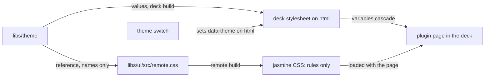
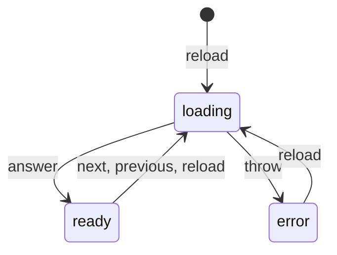

# Specification: The shared component library

## 1. Summary

A new package, `@maroid/ui` in `libs/ui`, holds the pagination and one stylesheet
that a remote imports. The remote build runs Tailwind CSS against that stylesheet,
so every style rule the remote names exists, while every theme value still comes
from the deck at runtime. The jasmine remote moves to the package and drops its own
pager and its own colors.

## 2. Coverage

| Requirement      | Where this specification realizes it                                  |
| ---------------- | --------------------------------------------------------------------- |
| `UIKIT-FR-001`   | Section 4.1, `UIKIT-DD-002`, `UIKIT-SC-001`                           |
| `UIKIT-FR-002`   | Section 4.4, `UIKIT-DD-003`, `UIKIT-SC-002`, `UIKIT-SC-003`           |
| `UIKIT-FR-003`   | Section 4.1, `UIKIT-DD-002`, `UIKIT-SC-004`                           |
| `UIKIT-FR-004`   | Section 4.4, `UIKIT-DD-003`, `UIKIT-SC-005`                           |
| `UIKIT-FR-005`   | Section 4.1, section 4.3, `UIKIT-DD-005`, `UIKIT-SC-006`              |
| `UIKIT-FR-006`   | Section 4.1, `UIKIT-SC-006`, `UIKIT-SC-007`                           |
| `UIKIT-FR-007`   | Section 4.1, `UIKIT-SC-008`                                           |
| `UIKIT-FR-008`   | Section 4.1, `UIKIT-SC-009`                                           |
| `UIKIT-FR-009`   | Section 4.1, section 4.5, `UIKIT-DD-006`, `UIKIT-SC-010`              |
| `UIKIT-FR-010`   | Section 4.1, section 4.4, `UIKIT-SC-011`                              |
| `UIKIT-FR-011`   | Section 4.1, section 4.4, `UIKIT-SC-011`                              |
| `UIKIT-FR-012`   | Section 4.1, `UIKIT-SC-012`                                           |
| `UIKIT-FR-013`   | Section 4.1, `UIKIT-SC-001`, `UIKIT-SC-013`                           |
| `UIKIT-NFR-001`  | `UIKIT-SC-003`                                                        |
| `UIKIT-NFR-002`  | `UIKIT-DD-004`, `UIKIT-SC-014`                                        |
| `UIKIT-INV-001`  | Section 4.1, `UIKIT-DD-002`, `UIKIT-SC-013`                           |
| `UIKIT-INV-002`  | `UIKIT-DD-004`, `UIKIT-SC-015`                                        |
| `UIKIT-INV-003`  | Section 4.1, `UIKIT-DD-001`, `UIKIT-DD-005`, `UIKIT-SC-016`           |

## 3. Guideline compliance

| Rule      | Guideline         | How this specification obeys it                                                                  |
| --------- | ----------------- | ------------------------------------------------------------------------------------------------ |
| `ARC-003` | Architecture      | The package is TypeScript and Svelte 5. Section 4.1.                                             |
| `ARC-005` | Architecture      | `libs/ui` is a shared module. Section 4.1.                                                       |
| `ARC-007` | Architecture      | `libs/ui` joins `pnpm-workspace.yaml`. Build plan step 1.                                        |
| `UI-002`  | Web UI            | The remote still builds with Vite. It adds the Tailwind CSS plugin. Section 4.1.                 |
| `UI-006`  | Web UI            | The remote imports `@maroid/ui`, never `apps/deck`. Section 4.1.                                 |
| `UI-007`  | Web UI            | The pager calls a reader that the page gives. The reader uses `@maroid/api-client`. Section 4.1. |
| `TS-001`  | Frontend style    | `libs/ui/tsconfig.json` sets `"strict": true`.                                                   |
| `TS-002`  | Frontend style    | `Pagination.svelte` reads its props with `$props`. The pager keeps its state in `$state`.        |
| `TS-004`  | Frontend style    | `pnpm --filter @maroid/ui check` runs `svelte-check`. Build plan step 9.                         |
| `TS-005`  | Frontend style    | Tailwind CSS 4 and daisyUI give every style. The jasmine pages drop their `<style>` blocks.      |
| `BLD-001` | Build and release | A new row for `libs/ui`. Build plan step 8.                                                       |
| `BLD-003` | Build and release | A change to `libs/ui` rebuilds each remote, then its shared object.                               |
| `RES-005` | REST              | The pager reads `next` and `prev` of a page. Section 4.1.                                         |
| `RES-006` | REST              | The pager passes a link back unchanged. It builds no cursor.                                      |
| `TST-004` | Testing           | Every scenario declares its layer. Section 6.                                                     |

## 4. Design

### 4.1 Components

| Path                                           | Action | Holds                                                           |
| ---------------------------------------------- | ------ | --------------------------------------------------------------- |
| `libs/ui/package.json`                         | Create | `@maroid/ui`. Exports in section 4.3.                           |
| `libs/ui/tsconfig.json`                        | Create | Strict. The same options as `plugins/jasmine/ui/tsconfig.json`. |
| `libs/ui/svelte.config.js`                     | Create | No option.                                                      |
| `libs/ui/src/index.ts`                         | Create | The exports of section 4.3.                                     |
| `libs/ui/src/remote.css`                       | Create | The remote stylesheet, below.                                   |
| `libs/ui/src/pagination/Pagination.svelte`     | Create | The pagination control, below.                                  |
| `libs/ui/src/pagination/pager.svelte.ts`       | Create | `createPager` and its types, below.                             |
| `pnpm-workspace.yaml`                          | Change | Add `libs/ui`.                                                  |
| `.docker/deck/Dockerfile`                      | Change | Copy `libs/ui/package.json`, as the comment in the file demands. |
| `specs/guidelines/build-release.md`            | Change | Add the `libs/ui` row to `BLD-001`.                             |
| `plugins/jasmine/ui/package.json`              | Change | Add `@maroid/ui`, `tailwindcss`, `@tailwindcss/vite`, `daisyui`. |
| `plugins/jasmine/ui/vite.config.ts`            | Change | Add `tailwindcss()` before `svelte()`.                          |
| `plugins/jasmine/ui/src/app.css`               | Create | `@import '@maroid/ui/remote.css';` and nothing else.            |
| `plugins/jasmine/ui/src/pages/**/*.svelte`     | Change | The jasmine pages, below.                                       |
| `plugins/jasmine/ui/src/lib/Pager.svelte`      | Delete | Replaced by `Pagination`.                                       |
| `plugins/jasmine/ui/src/lib/paging.svelte.ts`  | Delete | Replaced by `createPager`.                                      |

**The package.** `libs/ui` imports no TypeScript module from the workspace: nothing
from `apps/`, from `@maroid/plugin-sdk`, from `@maroid/api-client`, or from a global
of the deck. `package.json` declares `svelte ^5` and `tailwindcss ^4` as peer
dependencies, and `@maroid/theme` and `daisyui` as dependencies. `daisyui` takes the
version that `apps/deck` uses. The package exports source, like `@maroid/api-client`,
and each remote compiles it. It has a `check` script, `svelte-check --tsconfig ./tsconfig.json`,
and a `lint` script, `prettier --check .`.

**The remote stylesheet.** `libs/ui/src/remote.css` is the only stylesheet that a
remote imports.

| Emits                                                          | Does not emit                                                               |
| -------------------------------------------------------------- | --------------------------------------------------------------------------- |
| Each Tailwind utility that the remote or `libs/ui` names       | The Tailwind base reset. The deck already carries it.                       |
| Each daisyUI component rule that the remote or `libs/ui` names | Any daisyUI theme.                                                          |
|                                                                | Any daisyUI base rule. The deck already carries each one.                   |
| Each Tailwind default variable that such a utility reads       | Any variable that `libs/theme` defines.                                     |
|                                                                | The font import of `@maroid/theme`.                                         |

A Tailwind default variable, such as `--text-lg`, is not a theme value. The deck
emits only the defaults that the deck uses, so the remote emits the ones it uses.
Both builds take the same Tailwind CSS version, so a default that both emit holds
the same value.

The intended form, which stage 3 confirms against `UIKIT-SC-013`:

```css
@layer theme, base, components, utilities;
@import 'tailwindcss/theme.css' layer(theme);
@import 'tailwindcss/utilities.css' layer(utilities);
@import '@maroid/theme/maroid.css' reference;
@plugin 'daisyui' {
	themes: false;
	exclude: properties, reset, rootcolor, rootscrollgutter, rootscrolllock, scrollbar, svg;
}
@source './';
```

`@source './'` makes the remote build generate the classes of `Pagination.svelte`.
The remote's own source enters through the automatic detection of Tailwind CSS 4.
The `reference` import of the theme gives the remote the names `font-display` and
`font-mono`. It also replaces the Tailwind default of `--font-sans`, so the remote
never emits a default that overrides the font of the deck.

**The pagination.** `Pagination` renders nothing when `pager.hasPrevious` and
`pager.hasNext` are both false. Otherwise it renders a daisyUI `join` inside a `nav`
with the accessible name `Pagination`. The `class` prop joins the class list of the
`nav`, so the caller places it.

| Control  | Classes                | Disabled when                                        |
| -------- | ---------------------- | ---------------------------------------------------- |
| Previous | `join-item btn btn-sm` | `!pager.hasPrevious` or `pager.status === 'loading'` |
| Next     | `join-item btn btn-sm` | `!pager.hasNext` or `pager.status === 'loading'`     |

**The pager.** The behavior keeps the one of
`plugins/jasmine/ui/src/lib/paging.svelte.ts`, with the changes below. The pager
reads two members of a page, so it declares that shape itself and stays generic over
the page type of the caller. `Page<T>` of `@maroid/api-client` satisfies `PageLinks`
as it is, and `pager.page` keeps the full type of the caller.

```ts
export interface PageLinks {
  next?: string;
  prev?: string;
}

export type PageStatus = 'loading' | 'ready' | 'error';
export type PageReader<P extends PageLinks> = (link?: string) => Promise<P | null>;

export interface Pager<P extends PageLinks> {
  readonly page: P | null;
  readonly status: PageStatus;
  readonly hasPrevious: boolean;
  readonly hasNext: boolean;
  reload(): Promise<void>;
  next(): Promise<void>;
  previous(): Promise<void>;
}
```

| Member     | Behavior                                                                                                   | Change                        |
| ---------- | ---------------------------------------------------------------------------------------------------------- | ----------------------------- |
| `reload`   | Reads the link that the pager last requested. The first call reads with no link.                           | None                          |
| `next`     | Reads `page.next`. Does nothing when `page.next` is absent or `status` is `loading`.                       | Ignores a call during a load. |
| `previous` | Reads `page.prev`. Does nothing when `page.prev` is absent or `status` is `loading`.                       | Ignores a call during a load. |
| A load     | Sets `loading`. On an answer, sets `page` and `ready`. On a throw, sets `error` and keeps `page`.          | Discards a replaced answer.   |

**The jasmine pages.** Each page of `plugins/jasmine/ui/src/pages/` imports
`../../app.css` and deletes its `<style>` block. `Plants.svelte` and
`Environments.svelte` import `createPager` and `Pagination` from `@maroid/ui`.

| Element          | Today                           | After                                             |
| ---------------- | ------------------------------- | ------------------------------------------------- |
| Error text       | `.error { color: #f87171 }`     | `text-error`                                      |
| Table            | Hand-written borders, `#1e293b` | `table`                                           |
| Retry, add, save | Unstyled `button`, `a`          | `btn btn-sm`, `btn btn-primary btn-sm`            |
| Heading          | `h2 { margin }`                 | `text-lg font-semibold mb-4`                      |
| Pager            | `<Pager {pager} />`             | `<Pagination {pager} class="mt-4 justify-end" />` |

### 4.2 Data model

None. This feature adds no table.

### 4.3 Declarations

None. This feature adds no surface that `SPC-003` lists. It adds one package
interface:

| Export                  | Kind       | Signature                                         | Realizes                                         |
| ----------------------- | ---------- | ------------------------------------------------- | ------------------------------------------------ |
| `Pagination`            | Component  | Props `{ pager: Pager<PageLinks>; class?: string }` | `UIKIT-FR-005` to `UIKIT-FR-007`, `UIKIT-FR-009` |
| `createPager`           | Function   | `createPager<P extends PageLinks>(read: PageReader<P>): Pager<P>` | `UIKIT-FR-008` to `UIKIT-FR-011`                 |
| `Pager<P>`              | Type       | Section 4.1                                       | `UIKIT-FR-010`                                   |
| `PageReader<P>`         | Type       | Section 4.1                                       | `UIKIT-FR-008`                                   |
| `PageLinks`             | Type       | Section 4.1                                       | `UIKIT-FR-008`, `UIKIT-INV-003`                  |
| `PageStatus`            | Type       | Section 4.1                                       | `UIKIT-FR-010`                                   |
| `@maroid/ui/remote.css` | Stylesheet | Section 4.1                                       | `UIKIT-FR-001`, `UIKIT-FR-003`                   |

### 4.4 Flow

The style rules come from the remote build. The theme values come from the deck at
runtime.



The pager moves between three states. A replaced answer changes no state.



### 4.5 Errors

| Condition                                        | Behavior                                                  | Message                         |
| ------------------------------------------------ | --------------------------------------------------------- | ------------------------------- |
| The reader throws                                | `status` becomes `error`. `page` keeps the last page.     | The page shows its error state. |
| The reader answers `null` after a 401            | `status` stays `loading`. `@maroid/api-client` sends the person to sign in. | None.            |
| `next` or `previous` during a load               | The call does nothing.                                    | None.                           |
| An answer arrives after a later request started  | The pager discards it.                                    | None.                           |

## 5. Design decisions

### `UIKIT-DD-001`

**Realizes:** `UIKIT-FR-012`, `UIKIT-INV-003`
**Decision:** The package is `@maroid/ui` in `libs/ui`, apart from `@maroid/theme` and `@maroid/plugin-sdk`.
**Rationale:** The owner selected a package of its own. `@maroid/theme` stays plain
CSS that `apps/gate` reads with no Svelte. `@maroid/plugin-sdk` stays the host
contract of `UI-008`, which a catalog cannot satisfy.
**Alternatives:** Join `@maroid/theme`: brings Svelte into the build of `apps/gate`.
Join `@maroid/plugin-sdk`: ties each component to the `PluginHost` contract.

### `UIKIT-DD-002`

**Realizes:** `UIKIT-FR-001`, `UIKIT-FR-003`, `UIKIT-INV-001`
**Decision:** Each remote runs Tailwind CSS 4 and daisyUI in its own build, through `@maroid/ui/remote.css`. The stylesheet emits rules only, never a theme value.
**Rationale:** The deck build cannot see the source of a remote that ships after it
(`ARC-008`). Only the remote build knows which rules the remote names. A rule reads
`var(--color-primary)`, and the deck defines the value on `html`.
**Alternatives:** The deck ships every daisyUI component and a fixed list of
utilities. A utility outside the list has no effect, which breaks `UIKIT-FR-003`,
and the deck grows by the whole daisyUI component set.

### `UIKIT-DD-003`

**Realizes:** `UIKIT-FR-002`, `UIKIT-FR-004`
**Decision:** The remote reads the theme variant and the theme values from the `data-theme` attribute and the variables that the deck sets on `html`. `libs/ui` adds no code for either.
**Rationale:** A remote mounts into an element of the deck document, so each theme
variable cascades to it. `apps/deck/src/lib/state/theme.svelte.ts` already switches
the attribute with no reload.
**Alternatives:** Pass the variant through `PluginHost`: a contract change for a
value that the cascade already carries.

### `UIKIT-DD-004`

**Realizes:** `UIKIT-INV-002`, `UIKIT-NFR-002`
**Decision:** Each remote bundles its own copy of `@maroid/ui`. `@maroid/ui` never enters the `shared` list of Module Federation.
**Rationale:** The owner selected the built copy. A deck rebuild changes no
component of a remote. The remote already bundles Svelte the same way (`shared: []`).
**Alternatives:** Share it at runtime: one copy, but a deck release changes the
components of every built remote, and needs a version contract.

### `UIKIT-DD-005`

**Realizes:** `UIKIT-FR-005`, `UIKIT-INV-003`
**Decision:** `Pagination` takes one `pager` prop and renders the daisyUI `join` of two `btn` controls.
**Rationale:** The owner selected the pager object and the daisyUI component. A
catalog renders it with a plain object of seven members, and no deck.
**Alternatives:** Five plain props: each page wires five values by hand.

### `UIKIT-DD-006`

**Realizes:** `UIKIT-FR-009`
**Decision:** `Pagination` disables both controls during a load, and the pager also ignores `next` and `previous` during a load.
**Rationale:** The disabled control stops a click. The guard in the pager stops a
page that calls `next` twice from code.
**Alternatives:** The control alone: a direct call still races.

## 6. Scenarios

Every scenario runs against the deck with the hub and the jasmine plugin loaded,
unless it says otherwise.

### `UIKIT-SC-001`

**Verifies:** `UIKIT-FR-001`, `UIKIT-FR-013`
**Layer:** manual

**Given** the plant list holds plants.
**When** the page renders.
**Then** the Next control and a deck button show the same primary color.

### `UIKIT-SC-002`

**Verifies:** `UIKIT-FR-002`
**Layer:** manual

**Given** the person selected the dark variant, then reloaded the deck.
**When** the person opens the plant list.
**Then** the page shows the dark variant from its first display.

### `UIKIT-SC-003`

**Verifies:** `UIKIT-FR-002`, `UIKIT-NFR-001`
**Layer:** manual

**Given** the plant list is open in the light variant, and the performance recorder
of the browser runs.
**When** the person selects the dark variant.
**Then** the page turns dark with no reload, less than 100 milliseconds from the
click to the last style recalculation.

### `UIKIT-SC-004`

**Verifies:** `UIKIT-FR-003`
**Layer:** manual

**Given** a jasmine page names `badge badge-accent`, which no deck page names.
**When** the remote builds and the page renders.
**Then** the badge shows the accent color of the theme.

### `UIKIT-SC-005`

**Verifies:** `UIKIT-FR-004`
**Layer:** manual

**Given** a built jasmine remote.
**When** the owner changes `--color-primary` in `libs/theme` and rebuilds the deck only.
**Then** the jasmine controls show the new color.

### `UIKIT-SC-006`

**Verifies:** `UIKIT-FR-005`, `UIKIT-FR-006`
**Layer:** manual

**Given** 45 plants, a page limit of 20, and the first page shown.
**When** the page renders.
**Then** Previous is disabled and Next is enabled.

### `UIKIT-SC-007`

**Verifies:** `UIKIT-FR-006`
**Layer:** manual

**Given** the collection of `UIKIT-SC-006`.
**When** the person selects Next two times.
**Then** the third page shows, Next is disabled, and Previous is enabled.

### `UIKIT-SC-008`

**Verifies:** `UIKIT-FR-007`
**Layer:** manual

**Given** 4 plants, then no plant.
**When** the page renders.
**Then** no pagination control shows in either case.

### `UIKIT-SC-009`

**Verifies:** `UIKIT-FR-008`
**Layer:** manual

**Given** the network panel is open on the first page.
**When** the person selects Next.
**Then** the request URL equals the `next` link of the first answer, byte for byte.

### `UIKIT-SC-010`

**Verifies:** `UIKIT-FR-009`
**Layer:** manual

**Given** the first page, with the network throttled to Slow 3G.
**When** the person double-clicks Next.
**Then** one request leaves, and the second page shows, not the third.

### `UIKIT-SC-011`

**Verifies:** `UIKIT-FR-010`, `UIKIT-FR-011`
**Layer:** manual

**Given** the second page shows, and the hub stops.
**When** the person selects Next, sees the error state, starts the hub, and selects Retry.
**Then** the error state shows first, and the third page shows after Retry, not the first.

### `UIKIT-SC-012`

**Verifies:** `UIKIT-FR-012`
**Layer:** manual

**Given** the jasmine source.
**When** the owner searches it for `Pager.svelte` and `paging.svelte`.
**Then** neither file exists, and no import names either.

### `UIKIT-SC-013`

**Verifies:** `UIKIT-INV-001`, `UIKIT-FR-013`
**Layer:** manual

**Given** the jasmine build output and source.
**When** the owner searches every `.css` file under `dist/` for a declaration of a
variable that `libs/theme/src/*.css` defines, and `src/` for a color literal.
**Then** neither search finds a match.

### `UIKIT-SC-014`

**Verifies:** `UIKIT-NFR-002`
**Layer:** manual

**Given** the jasmine `dist/assets` before the change and after it.
**When** the owner sums the gzip size of every `.js` and `.css` file in each.
**Then** the difference is less than 15 kilobytes.

### `UIKIT-SC-015`

**Verifies:** `UIKIT-INV-002`
**Layer:** manual

**Given** a built jasmine remote.
**When** the owner changes the Next label in `libs/ui` and rebuilds the deck only.
**Then** the jasmine page still shows `Next`.

### `UIKIT-SC-016`

**Verifies:** `UIKIT-INV-003`
**Layer:** manual

**Given** the `libs/ui` source.
**When** the owner reads every import.
**Then** each import names `svelte` or a file of `libs/ui`.

## 7. Build plan

| #   | Step                                                                                                    | Realizes                                         | Done |
| --- | ------------------------------------------------------------------------------------------------------- | ------------------------------------------------ | ---- |
| 1   | Create `libs/ui` with `package.json`, `tsconfig.json`, `svelte.config.js`. Add it to `pnpm-workspace.yaml` and to `.docker/deck/Dockerfile`. | `UIKIT-FR-012` | [x]  |
| 2   | Record the gzip size of jasmine `dist/assets`. It was 20629 bytes.                                       | `UIKIT-NFR-002`                                  | [x]  |
| 3   | Write `remote.css`. Add Tailwind CSS to the jasmine build. Create `src/app.css`.                         | `UIKIT-FR-001`, `UIKIT-FR-003`, `UIKIT-INV-001`  | [x]  |
| 4   | Move the jasmine pages to the classes of section 4.1. Delete each `<style>` block.                       | `UIKIT-FR-013`                                   | [x]  |
| 5   | Write `pager.svelte.ts` from the jasmine pager, with the changes of section 4.1.                         | `UIKIT-FR-008` to `UIKIT-FR-011`                 | [ ]  |
| 6   | Write `Pagination.svelte` and `index.ts`.                                                                | `UIKIT-FR-005` to `UIKIT-FR-007`, `UIKIT-FR-009` | [ ]  |
| 7   | Move the jasmine pages to `createPager` and `Pagination`. Delete the old pager.                          | `UIKIT-FR-012`                                   | [ ]  |
| 8   | Add the `libs/ui` row to `BLD-001`.                                                                      | `BLD-001`                                        | [ ]  |
| 9   | Run `pnpm --filter @maroid/ui lint`, `pnpm --filter @maroid/ui check`, `pnpm --filter ./plugins/jasmine/ui build`, then build the jasmine shared object. | `BLD-001`, `BLD-003` | [ ]  |
| 10  | Run `UIKIT-SC-001` to `UIKIT-SC-016`.                                                                    | Every requirement                                | [ ]  |

The `BLD-001` row:

| Artifact you changed | Lint or check                                                        | Build       |
| -------------------- | -------------------------------------------------------------------- | ----------- |
| `libs/ui`            | `pnpm --filter @maroid/ui lint` and `pnpm --filter @maroid/ui check` | None today. |

## 8. Out of scope for this specification

None. Every requirement in section 2 gets a full design in this document.

## Retired identifiers

This file has no retired identifier.
