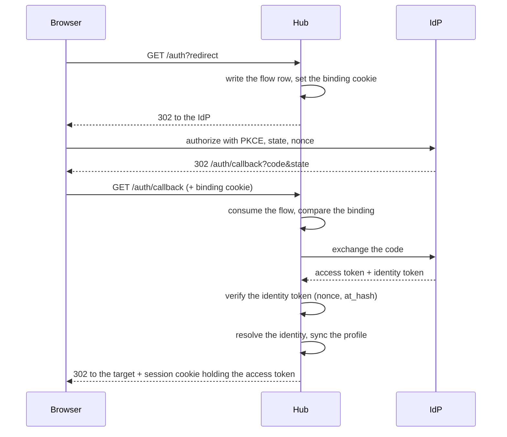

# Specification: The session of a person at the web shell

## 1. Summary

One file owns every cookie that the hub sets, and it gives each one the `__Host-`
prefix that `SEC-008` demands. The session cookie carries the access token of the
IdP in place of the identity token, and the middleware reads that cookie and no
header. `POST /auth/logout` clears the cookie and names the target that the browser
goes to.

This specification succeeds `EXTID-DD-006`, which `ADR-0004` retired.

## 2. Coverage

| Requirement       | Where this specification realizes it                        |
| ----------------- | ----------------------------------------------------------- |
| `WEBSESS-FR-001`  | Section 4.4, `WEBSESS-DD-003`, `WEBSESS-SC-001`             |
| `WEBSESS-FR-002`  | Section 4.1, `WEBSESS-DD-001`, `WEBSESS-DD-002`, `WEBSESS-SC-003`, `WEBSESS-SC-004` |
| `WEBSESS-FR-003`  | `WEBSESS-DD-001`, `WEBSESS-SC-005`                          |
| `WEBSESS-FR-004`  | `WEBSESS-DD-001`, `WEBSESS-SC-005`                          |
| `WEBSESS-FR-005`  | Section 4.1, `WEBSESS-DD-006`, `WEBSESS-SC-006`, `WEBSESS-SC-007` |
| `WEBSESS-FR-006`  | Section 4.3, Section 4.4, `WEBSESS-DD-005`, `WEBSESS-SC-008`, `WEBSESS-SC-009` |
| `WEBSESS-FR-007`  | Section 4.5, `WEBSESS-DD-005`, `WEBSESS-SC-010`             |
| `WEBSESS-FR-008`  | Section 4.1, `WEBSESS-DD-008`, `WEBSESS-SC-011`             |
| `WEBSESS-NFR-001` | `WEBSESS-DD-005`, `WEBSESS-SC-012`                          |
| `WEBSESS-NFR-002` | `WEBSESS-DD-002`, `WEBSESS-SC-013`                          |
| `WEBSESS-INV-001` | `WEBSESS-DD-002`, `WEBSESS-SC-014`                          |
| `WEBSESS-INV-002` | `WEBSESS-DD-003`, `WEBSESS-SC-015`                          |

## 3. Guideline compliance

| Rule      | Guideline              | How this specification obeys it                                                       |
| --------- | ---------------------- | --------------------------------------------------------------------------------------- |
| `SEC-002` | Security               | `WEBSESS-DD-003`. The hub verifies the access token against the key set of the IdP.    |
| `SEC-004` | Security               | Section 4.4 keeps the read of the user record on each request. A sign out changes no record. |
| `SEC-005` | Security               | `WEBSESS-DD-003`, `WEBSESS-DD-006`. The cookie is the one path, and it holds the access token. |
| `SEC-008` | Security               | `WEBSESS-DD-001`. One file sets every attribute, and the name is a constant.           |
| `API-003` | The HTTP API           | Section 4.3 gives `POST /auth/logout` as public.                                       |
| `API-005` | The HTTP API           | `Logout` returns an error, and `handler.Wrap` logs it.                                 |
| `API-006` | The HTTP API           | Section 4.6 gives a JSON body for each failure.                                        |
| `UI-001`  | The web user interface | `WEBSESS-DD-008`. The deck carries the control and the page that follows a sign out.   |
| `CFG-003` | Configuration          | Section 4.3. `Auth.SessionTTL` goes, and every key that stays keeps its tags.          |
| `TST-004` | Testing                | Section 6 gives a layer for each scenario.                                             |

## 4. Design

### 4.1 Components

| Path                                                  | Change | Holds                                                             |
| ----------------------------------------------------- | ------ | ------------------------------------------------------------------ |
| `apps/hub/internal/auth/cookie.go`                    | Create | The name and the attributes of every cookie that the hub sets.    |
| `apps/hub/internal/auth/middleware.go`                | Change | `tokenFromRequest` reads the session cookie alone.                |
| `apps/hub/internal/auth/oidc_flow.go`                 | Change | `Verify` returns the access token and binds it to the identity token. |
| `apps/hub/internal/handler/auth.go`                   | Change | The cookie helpers move to `cookie.go`. `Logout` arrives.         |
| `apps/hub/internal/config/config.go`                  | Change | `Auth.SessionTTL` goes. See `WEBSESS-DD-004`.                     |
| `apps/deck/src/lib/api/auth.ts`                       | Change | `logout()` calls the route.                                       |
| `apps/deck/src/lib/components/UserDropdown.svelte`    | Change | The control calls `logout()` and then navigates.                  |
| `apps/deck/src/routes/signed-out/+page.svelte`        | Create | The page that a sign out lands on. It loads no user.              |

`cookie.go` holds the names as constants and the functions that write them. It
carries no type and no constructor, because the file holds no value that changes:

```go
const (
    SessionCookieName = "__Host-maroid_session"
    BindingCookieName = "__Host-maroid_binding"
)

func SetSessionCookie(w http.ResponseWriter, token string, expiry time.Time)
func SessionCookie(r *http.Request) string
func ClearSessionCookie(w http.ResponseWriter)
func SetBindingCookie(w http.ResponseWriter, binding string)
func TakeBindingCookie(w http.ResponseWriter, r *http.Request) string
```

### 4.2 Data model

This feature adds no table and changes none. The browser holds the session, and
`public.auth_flows` keeps the shape that `EXTID` gave it.

### 4.3 Declarations

**HTTP routes.** `api.yaml` holds the bodies and the status codes.

| Method | Path           | Access | Realizes                            |
| ------ | -------------- | ------ | ------------------------------------- |
| `POST` | `/auth/logout` | Public | `WEBSESS-FR-006`, `WEBSESS-FR-007`  |

**Configuration scheme.**

| Key                  | Type            | Default | Secret | Realizes                         |
| -------------------- | --------------- | ------- | ------ | ---------------------------------- |
| `auth.session_ttl`   | `time.Duration` | Removed | No     | `WEBSESS-DD-004`                 |

`auth.allowed_redirects` keeps its type and its meaning. `WEBSESS-FR-007` reads it.

### 4.4 Flow

The sign in changes at one step: the callback puts the access token in the cookie,
and the identity token stays inside the hub as the proof of the flow.



**The request.** The middleware reads the session cookie, verifies the token,
reads `federated_claims`, resolves the identity, and puts the user in the context.
Section 4.4 of the `EXTID` specification keeps every other step.

**The sign out.**

1. Read the target from the request. `WEBSESS-FR-007` checks it against the list.
2. Clear the session cookie, whether one arrived or not.
3. Answer 200 with the target in the body.

### 4.5 The target of a sign out

`validateRedirect` in `apps/hub/internal/handler/auth.go` already matches an origin
against `auth.allowed_redirects`. The sign out calls the same function. A request
that names no target takes `auth.deck_url`.

### 4.6 Errors

| Condition                                     | Behavior         | Message                                  |
| --------------------------------------------- | ---------------- | ------------------------------------------ |
| The request carries no session cookie         | 401              | `access denied`                          |
| The token fails the verification              | 401              | `access denied`                          |
| The token carries no federated claims         | 401              | `access denied`                          |
| No active user record holds the identity      | 401              | `access denied`                          |
| The sign out names a target outside the list  | 400              | `missing or invalid redirect parameter`  |
| The sign out carries a dead cookie or none    | 200              | The target                               |
| A cookie name lacks the prefix at the start   | The hub stops    | The name that failed                     |

## 5. Design decisions

### `WEBSESS-DD-001`

**Realizes:** `WEBSESS-FR-002`, `WEBSESS-FR-003`, `WEBSESS-FR-004`, `SEC-008`
**Decision:** `apps/hub/internal/auth/cookie.go` holds the name of each cookie as a
constant and the functions that set, read, and clear it. The configuration holds no
name, and the hub runs no check at the start. `WEBSESS-SC-003` asserts the prefix.
**Rationale:** The attributes sit in four functions in `handler/auth.go` today, and
a fifth cookie would repeat them a fifth time. One file gives `SEC-008` one place to
hold. A name that no deployment changes cannot be wrong at run time, so a check
there would test the compiler. A test reads the constant and fails the build
instead, which is the earlier point.
**Alternatives:** The names in the configuration, with a `validate` tag. It adds a
key that no deployment changes, and a wrong value then stops the hub of a person who
never asked for the knob. A constructor that returns an error. It moves a fault that
cannot happen at run time into a path that every start pays for.

### `WEBSESS-DD-002`

**Realizes:** `WEBSESS-FR-002`, `WEBSESS-NFR-002`, `WEBSESS-INV-001`
**Decision:** The names are the constants `__Host-maroid_session` and
`__Host-maroid_binding`. The hub reads neither `maroid_token` nor
`maroid_auth_binding`, and it clears neither.
**Rationale:** The prefix cannot go on the old name without changing it, because a
browser holds `maroid_token` and `__Host-maroid_token` as two cookies. A new name
for the session cookie also states the new content: it carries the access token,
not the identity token. The hub clears no old cookie, because a cookie it never set
under the new rules is one it must not name.
**Alternatives:** `__Host-maroid_token`. It keeps the word `token` for a value that
changed, and `LNG-002` asks for one name for one thing. Delete the old cookie at
the first request that carries it. It adds a branch that lives until every browser
has called once, and nobody can say when that is.

### `WEBSESS-DD-003`

**Realizes:** `WEBSESS-FR-001`, `WEBSESS-INV-002`, `SEC-005`
**Decision:** `OIDCFlow.Verify` returns the access token beside the claims. It
verifies the identity token for the nonce, then calls `idToken.VerifyAccessToken`
to check `at_hash`. The callback puts the access token in the session cookie. The
identity token reaches no browser.
**Rationale:** The nonce lives in the identity token, so that token stays the proof
that this exchange answers this flow. `at_hash` binds the access token to the
identity token that the hub just verified, so the value in the cookie is the one
the IdP minted for this exchange and not a value that arrived another way. The
middleware then verifies the access token on each request against the same key set,
which `SEC-002` already gives and `/mcp` already runs.
**Alternatives:** Put the access token in the cookie with no `at_hash` check. The
check costs one hash and closes a substitution at the callback. Verify the access
token at the callback instead. The next request verifies it anyway, and `at_hash`
answers a question that a second verification does not.

### `WEBSESS-DD-004`

**Realizes:** `WEBSESS-FR-001`
**Decision:** The session cookie takes its lifetime from `oauth2.Token.Expiry`.
`auth.session_ttl` goes from the configuration.
**Rationale:** The two disagree today. The cookie holds 168 hours by default and
the IdP stamps 24 on the token, so a person carries a cookie for up to 144 hours
after it grants nothing. Such a request answers 401, the deck goes to `/auth`, and
the IdP signs the person in with no question, so the cost is a hidden pair of
redirects and not a failure that a person sees. One source removes it, and the IdP
becomes the one control of the lifetime, which `ADR-0002` already decided. No
statement asks for a session shorter than the one the IdP grants.
**Alternatives:** Keep `session_ttl` as a cap. A second number that can only make
the session shorter than the token, for a reason no statement gives. Keep both as
they are. The disagreement above stays.

### `WEBSESS-DD-005`

**Realizes:** `WEBSESS-FR-006`, `WEBSESS-FR-007`, `WEBSESS-NFR-001`
**Decision:** `POST /auth/logout` is public, runs behind no access check, clears
the session cookie on every call, and answers 200 with `{"redirect": "<target>"}`.
**Rationale:** A browser sends no cookie on a cross-site POST under `SameSite=Lax`,
so a page that forges a sign out fails even while the check of the origin is out of
scope. A top-level GET carries the cookie under the same attribute, so a link or an
image would sign a person out. The route sits behind no access check because
`WEBSESS-FR-006` asks a second sign out to answer as the first did, and an access
check answers 401 for a dead cookie. One call clears the cookie, so
`WEBSESS-NFR-001` holds.
**Alternatives:** `GET /auth/logout` with a 302. One line in the deck and no
JavaScript, and it opens the sign out to any page that renders a link. A POST
behind the access middleware. It answers 401 for the second call and breaks
`WEBSESS-FR-006`.

### `WEBSESS-DD-006`

**Realizes:** `WEBSESS-FR-005`, `SEC-005`
**Decision:** `tokenFromRequest` reads the session cookie and returns. The read of
the `Authorization` header goes.
**Rationale:** `ADR-0004` records the decision and its limit. `TokenFromContext`
has no caller, so no component outside the middleware reads the raw token and the
change reaches one function. `/mcp` holds its own verifier in
`apps/hub/internal/mcpserver/verifier.go` and reads no cookie, so the bearer path
of an MCP client does not pass here.
**Alternatives:** In `ADR-0004`.

### `WEBSESS-DD-007`

**Realizes:** `WEBSESS-FR-001`
**Decision:** `Auth.Me` keeps `auth.ClaimsFromContext` as its source. The handler
does not change.
**Rationale:** The handler reads the claims that the middleware put in the context,
and the middleware parses them from whichever token the cookie holds. The claims
that `Me` reads are `Picture` and `Federated.ConnectorID`. `MCPHUB-DD-001` states
that the IdP mints the access token as one signed token of the same shape, and the
MCP path already rejects a token whose `federated_claims` is empty. A change here
would add a query and a second source for a fault that no evidence shows.
**Alternatives:** Read the profile from `public.identities`, which `resolveAndSync`
already writes at each sign in. It removes the question of which claims the access
token carries, and it costs a query and a second source of one value.
`WEBSESS-SC-016` measures the fault first. This alternative is the correction when
that scenario fails.

### `WEBSESS-DD-008`

**Realizes:** `WEBSESS-FR-008`
**Decision:** The control in `UserDropdown.svelte` calls `api.auth.logout()`, then
sets `window.location.href` to the target that the body names. The target is a new
deck route, `/signed-out`, that loads no user. The label becomes `Sign out`.
**Rationale:** `client.ts:42` sets `onUnauthorized: redirectToAuth`, so any 401
sends the browser to `/auth`. A sign out that lands on a page of the dashboard
therefore calls the hub, reads 401, and goes to `/auth`, where the IdP signs the
person in with no question. The person sees no sign out at all. A landing page
outside the `(dashboard)` group calls nothing, so the loop cannot start. The label
follows `GLO-sign-out`, and `LNG-002` asks for one name for one thing.
**Alternatives:** Land on `/` and suppress the redirect with a flag. The flag lives
in the module and a reload clears it, so the loop returns. Land on the address of
the IdP. The person then sees the page of a second service after asking to leave
this one.

## 6. Scenarios

### `WEBSESS-SC-001`

**Verifies:** `WEBSESS-FR-001`
**Layer:** integration

**Given** an IdP that returns an access token `A` and an identity token `I` for one
exchange.
**When** a person finishes a sign in.
**Then** the session cookie holds `A`, and no response of the hub holds `I`.

### `WEBSESS-SC-002`

**Verifies:** `WEBSESS-FR-001`
**Layer:** unit

**Given** an exchange whose identity token carries an `at_hash` of another value.
**When** the callback verifies it.
**Then** the hub sets no session cookie and sends the person to the target with
`error=auth_failed`.

### `WEBSESS-SC-003`

**Verifies:** `WEBSESS-FR-002`
**Layer:** unit

**Given** the name constants of `auth/cookie.go`.
**When** a test reads each one.
**Then** each name starts with `__Host-`, and a name that does not fails the build
of the package.

### `WEBSESS-SC-004`

**Verifies:** `WEBSESS-FR-002`, `WEBSESS-INV-001`
**Layer:** unit

**Given** a response that a sign in wrote.
**When** a test reads its `Set-Cookie` headers.
**Then** the session cookie name starts with `__Host-`, the header names no
`Domain`, and the path is `/`.

### `WEBSESS-SC-005`

**Verifies:** `WEBSESS-FR-003`, `WEBSESS-FR-004`
**Layer:** unit

**Given** a response that a sign in wrote.
**When** a test reads the session cookie and the binding cookie.
**Then** both carry `Secure` and both carry `HttpOnly`.

### `WEBSESS-SC-006`

**Verifies:** `WEBSESS-FR-005`
**Layer:** integration

**Given** a valid token `T` and no session cookie.
**When** a request sends `Authorization: Bearer T` to `/auth/me`.
**Then** the hub answers 401.

### `WEBSESS-SC-007`

**Verifies:** `WEBSESS-FR-005`
**Layer:** integration

**Given** a session cookie for user A and a valid token for user B.
**When** a request carries the cookie and `Authorization: Bearer <token of B>`.
**Then** the hub answers with the record of A.

### `WEBSESS-SC-008`

**Verifies:** `WEBSESS-FR-006`
**Layer:** integration

**Given** a person with a live session cookie.
**When** they call `POST /auth/logout`, then call `/auth/me` with the browser jar.
**Then** the first call answers 200 and the second answers 401.

### `WEBSESS-SC-009`

**Verifies:** `WEBSESS-FR-006`
**Layer:** integration

**Given** a browser whose session cookie the hub already cleared.
**When** it calls `POST /auth/logout` a second time.
**Then** the hub answers 200 with the same body, and clears the cookie again.

### `WEBSESS-SC-010`

**Verifies:** `WEBSESS-FR-007`
**Layer:** unit

**Given** `auth.allowed_redirects` that holds one origin.
**When** a sign out names a target at another origin.
**Then** the hub answers 400 and clears no cookie.

### `WEBSESS-SC-011`

**Verifies:** `WEBSESS-FR-008`
**Layer:** manual

**Given** a signed-in person at the deck.
**When** they open the user menu and select `Sign out`.
**Then** the browser lands on `/signed-out`, the page asks them to sign in, and no
request goes to `/auth`.

### `WEBSESS-SC-012`

**Verifies:** `WEBSESS-NFR-001`
**Layer:** integration

**Given** a person with a live session cookie.
**When** they sign out.
**Then** the browser sends one request to the hub, and the answer to that request
clears the cookie.

### `WEBSESS-SC-013`

**Verifies:** `WEBSESS-NFR-002`
**Layer:** integration

**Given** a browser that holds `maroid_token` with a token that the IdP still
accepts, and no `__Host-maroid_session`.
**When** it calls `/auth/me`.
**Then** the hub answers 401.

### `WEBSESS-SC-014`

**Verifies:** `WEBSESS-INV-001`
**Layer:** integration

**Given** a person who signs in twice in one browser.
**When** a test reads the cookie jar.
**Then** it holds one `__Host-maroid_session`, and its value is the token of the
second sign in.

### `WEBSESS-SC-015`

**Verifies:** `WEBSESS-INV-002`
**Layer:** integration

**Given** a session cookie that a sign in wrote.
**When** a test verifies its value against the key set of the IdP with the hub as
the audience.
**Then** the verification succeeds.

### `WEBSESS-SC-016`

**Verifies:** `WEBSESS-FR-001`
**Layer:** manual

**Given** a person who signed in after the change.
**When** they open `/auth/me`.
**Then** the body carries the picture and the provider that the person sees in the
deck today.

This scenario measures `WEBSESS-DD-007`. A failure means the access token carries
fewer claims than the identity token, and the alternative in that decision is the
correction.

## 7. Build plan

| #   | Step                                                                                  | Realizes                            | Done |
| --- | --------------------------------------------------------------------------------------- | ------------------------------------- | ---- |
| 1   | Write `auth/cookie.go` with the name constants and the cookie functions.              | `WEBSESS-FR-002` to `-004`          | [x]  |
| 2   | Move the four cookie helpers of `handler/auth.go` into `cookie.go`.                   | `WEBSESS-FR-002` to `-004`          | [x]  |
| 3   | Return the access token from `OIDCFlow.Verify` and check `at_hash`.                   | `WEBSESS-FR-001`, `WEBSESS-INV-002` | [x]  |
| 4   | Set the session cookie from the access token and the expiry of the token.             | `WEBSESS-FR-001`                    | [x]  |
| 5   | Drop `Auth.SessionTTL` from the configuration.                                        | `WEBSESS-FR-001`                    | [x]  |
| 6   | Read the session cookie alone in `tokenFromRequest`.                                  | `WEBSESS-FR-005`                    | [x]  |
| 7   | Add `Logout` to the handler and the public route.                                     | `WEBSESS-FR-006`, `-007`            | [x]  |
| 8   | Add `logout()` to `apps/deck/src/lib/api/auth.ts`.                                    | `WEBSESS-FR-008`                    | [x]  |
| 9   | Add the `/signed-out` route and wire the control in `UserDropdown.svelte`.            | `WEBSESS-FR-008`                    | [x]  |
| 10  | Correct `features/extid/api.yaml` for the cookie name and the header.                 | `WEBSESS-FR-001`, `-005`            | [x]  |
| 11  | Run `WEBSESS-SC-011` and `WEBSESS-SC-016` against the running hub.                    | `WEBSESS-FR-008`, `WEBSESS-FR-001`  | [ ]  |

Step 6 ends every live session, so step 9 must ship with it. A person who signs
out before step 10 reaches the loop that `WEBSESS-DD-008` describes.

## 8. Out of scope for this specification

| Item                                         | Reason                                                                     |
| -------------------------------------------- | ---------------------------------------------------------------------------- |
| The check of the origin and a request header | The requirements put it out of scope. It returns as its own feature.        |
| The end of the session at the IdP            | `WEBSESS-FR-006` states that the session at the IdP survives.               |
| A store of the session in the hub            | The requirements put it out of scope. The browser holds the access token.   |
| The lifetime that the IdP stamps             | `EXTID-NFR-002` owns it, and the setting of the IdP carries it.             |

## Retired identifiers

This file has no retired identifier.
