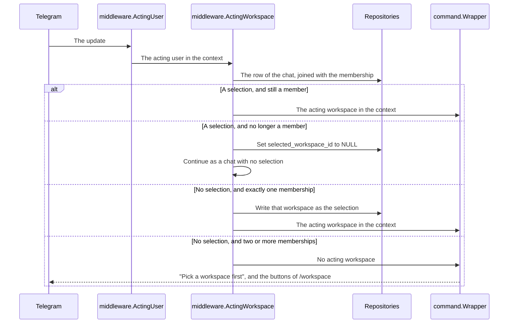

# Specification: The workspace in the bot, in the MCP server, and in the deck

`spec.md` holds the data model, the HTTP surface, and the check of a membership.
This file holds the three clients that name a workspace. `SPC-001` divides them.

## 1. The bot

### 1.1 Coverage

| Requirement     | Where this section realizes it                         |
| --------------- | ------------------------------------------------------ |
| `WSPACE-FR-015` | Section 1.3, `WSPACE-DD-007`, `WSPACE-SC-013`          |
| `WSPACE-FR-016` | Section 1.2, `WSPACE-DD-009`, `WSPACE-SC-013`          |
| `WSPACE-FR-017` | Section 1.4, `WSPACE-DD-006`, `WSPACE-SC-014`          |
| `WSPACE-FR-018` | Section 1.4, `WSPACE-DD-008`, `WSPACE-SC-015`          |
| `WSPACE-FR-019` | Section 1.4, `WSPACE-DD-006`, `WSPACE-SC-016`          |

### 1.2 Data model

| Table                      | Schema   | Scope            | Migration                                                   | Realizes                         |
| -------------------------- | -------- | ---------------- | ----------------------------------------------------------- | -------------------------------- |
| `telegram_chats` | `public` | scoped to a user | `20261003110000_table_telegram_chats_create.up.sql` | `WSPACE-FR-015`, `WSPACE-FR-016`, `WSPACE-FR-019` |

```sql
CREATE TABLE public.telegram_chats
(
    id                    UUID        NOT NULL PRIMARY KEY DEFAULT uuidv7(),
    user_id               UUID        NOT NULL
        DEFAULT NULLIF(current_setting('app.user_id', true), '')::uuid
        REFERENCES public.users (id),
    chat_id               BIGINT      NOT NULL,
    selected_workspace_id UUID        REFERENCES public.workspaces (id),
    created_at            TIMESTAMPTZ NOT NULL DEFAULT NOW(),
    updated_at            TIMESTAMPTZ NOT NULL DEFAULT NOW(),
    CONSTRAINT telegram_chats_user_chat_key UNIQUE (user_id, chat_id)
);
```

The table takes the policy of `OWN-006` on `user_id` and the `set_updated_at`
trigger. A chat belongs to the person who talks in it, so a user scopes the table,
and `OWN-004` gives such a table to the hub. One row holds the state of one chat of
one person. A selection writes `selected_workspace_id` with
`ON CONFLICT (user_id, chat_id) DO UPDATE`, as `REP-006` asks, and a cleared
selection sets it to `NULL` and keeps the row. `WSPACE-DD-009` gives the shape.

### 1.3 Declarations

| Command      | Scope   | Permission | Validates                    | Handles                                              | Realizes        |
| ------------ | ------- | ---------- | ---------------------------- | ---------------------------------------------------- | --------------- |
| `/workspace` | Default | None       | The update carries a message | Answers one inline button for each workspace of the person | `WSPACE-FR-015` |

A tap on a button sends a callback whose data is `workspace:<uuid>`. The hub handles
it with `th.CallbackDataPrefix("workspace:")`: it checks the membership, writes the
selection, answers the callback, and edits the message to name the selected
workspace. A callback for a workspace of no membership answers "That workspace is no
longer yours" and writes nothing.

| Path                                                          | Action | Holds                                               |
| ------------------------------------------------------------- | ------ | --------------------------------------------------- |
| `apps/hub/db/migrations/20261003110000_table_telegram_chats_create.*` | create | The table and its policy             |
| `apps/hub/internal/model/telegram_chat.go`                    | create | `model.TelegramChat`                                |
| `apps/hub/internal/repository/telegram_chat.go`               | create | `repository.TelegramChatRepository`, `repository.TelegramChat` |
| `apps/hub/internal/telegram/command/workspace.go`             | create | `command.Workspace`, `command.WorkspaceSelect`      |
| `apps/hub/internal/workspace/chat.go`                         | create | `workspace.ChatSelection`: the rule of `WSPACE-DD-006`, the selection of a tap, and the memberships for the buttons |
| `apps/hub/internal/telegram/middleware/acting_workspace.go`   | create | `middleware.ActingWorkspace`                        |
| `apps/hub/internal/telegram/command/wrapper.go`               | change | `Wrapper.Handle` refuses an update with no acting workspace, and asks `command.Workspace` for the buttons |
| `apps/hub/internal/telegram/update/update.go`                 | change | `ChatOf`, the chat of a message or of a callback    |
| `apps/hub/internal/telegram/handler.go`                       | change | The middleware after `ActingUser`, and the callback handler |

### 1.4 Flow



`ActingWorkspace` runs for every update. A command of the hub acts in no workspace,
so it runs with or without one. `Wrapper.Handle` wraps every command of a plugin, and
it refuses an update that carries no acting workspace.

### 1.5 Design decisions

### `WSPACE-DD-006`

**Realizes:** `WSPACE-FR-017`, `WSPACE-FR-019`
**Decision:** The middleware checks the selection against the memberships on each
update. It clears a selection that names a workspace of no membership, and writes the
only membership as the selection of a chat that holds none.
**Rationale:** The person who loses a membership is not the person who removed it, and
the policy of `OWN-006` lets only the owner of a row of a chat change it. The next
update of that person clears it instead, which is the moment `WSPACE-FR-019` reaches
them.
A selection that the middleware writes makes `WSPACE-FR-017` hold for the next update
too, with no second read of the memberships.
**Alternatives:** The removal clears every selection that names the membership. It
writes a row of another user, which the policy forbids, so it needs a path around the
policy.

### `WSPACE-DD-007`

**Realizes:** `WSPACE-FR-015`
**Decision:** `/workspace` answers one inline button for each membership, and a tap
selects it. The text of each button is the name of the workspace.
**Rationale:** The owner chose the keyboard. One tap selects, and two workspaces of
one name differ by the identifier in the callback data.
**Alternatives:** `/workspace <name>`. Two workspaces of one name cannot be told
apart.

### `WSPACE-DD-008`

**Realizes:** `WSPACE-FR-018`
**Decision:** `command.Wrapper.Handle` answers an update with no acting workspace with
the text "Pick a workspace first" and the buttons of `/workspace`, and it runs no
command of a plugin.
**Rationale:** Every command of a plugin passes the wrapper, so one check covers
them, and the answer carries the action that removes the cause.
**Alternatives:** A check in the middleware. It would block the commands of the hub,
`/workspace` among them.

### `WSPACE-DD-009`

**Realizes:** `WSPACE-FR-016`, `WSPACE-FR-019`
**Decision:** `public.telegram_chats` holds one row for each chat of each person, and
the selected workspace is the typed column `selected_workspace_id`, which a cleared
selection sets to `NULL`. A further value of a chat becomes a further typed column.
**Rationale:** The table names the chat, so a later value of a chat has a home and
needs no second table. A typed column keeps the foreign key to `public.workspaces`,
and the middleware joins it with the membership with no cast. No requirement names a
second value, so a store for an open set of values waits for one.
**Alternatives:** A table for the selection alone. A second value of a chat then needs
a second table. A JSON column of settings. It loses the foreign key and the type, and
it builds a store that no requirement asks for. A plugin that keeps a value of its own
for a chat brings that requirement, and the JSON column with it.

## 2. The MCP server

`features/mcphub/spec.md` and `features/mcphub/spec-plugin-tools.md` already design
both pieces that this feature needs: `list_workspaces` of `MCPHUB-DD-021`, and the
`workspace` argument of `MCPHUB-DD-022`. This feature carries out step 13 of the
first and step 11 of the second, with the membership check of `MCPHUB-DD-023`.
`list_workspaces` answers no role until `PERMS` adds one. The enablement and the
permission of `MCPHUB-DD-023` wait for `PLUGACC` and `PERMS`. `WSPACE-FR-013`
reaches a tool call through the argument.

## 3. The deck

### 3.1 Coverage

| Requirement     | Where this section realizes it                         |
| --------------- | ------------------------------------------------------ |
| `WSPACE-FR-020` | Section 3.2, `WSPACE-SC-017`                           |
| `WSPACE-FR-021` | Section 3.2, `WSPACE-DD-010`, `WSPACE-SC-017`          |
| `WSPACE-FR-022` | Section 3.2, `WSPACE-SC-018`                           |
| `WSPACE-FR-023` | Section 3.3, `WSPACE-DD-011`, `WSPACE-SC-019`          |
| `WSPACE-FR-024` | Section 3.3, `WSPACE-SC-020`                           |
| `WSPACE-FR-025` | Section 3.2, `WSPACE-SC-021`                           |

### 3.2 Components

Every address that reads a workspace starts with `/w/{workspaceId}`. The owner chose
the prefix.

| Path                                                                      | Action | Holds                                                     |
| ------------------------------------------------------------------------- | ------ | --------------------------------------------------------- |
| `apps/deck/src/routes/(dashboard)/w/[workspace]/+layout.ts`               | create | Loads the workspace, answers 404 for a workspace of no membership, remembers it |
| `apps/deck/src/routes/(dashboard)/w/[workspace]/+page.svelte`             | create | The overview of the workspace                             |
| `apps/deck/src/routes/(dashboard)/w/[workspace]/members/+page.svelte`     | create | The members, the candidates, the removal, and the leave action |
| `apps/deck/src/routes/(dashboard)/w/[workspace]/settings/+page.svelte`    | create | The name of the workspace                                 |
| `apps/deck/src/routes/(dashboard)/w/[workspace]/plugins/[plugin]/[...path]/*` | move | From `(dashboard)/plugins/[plugin]/[...path]/`        |
| `apps/deck/src/routes/(dashboard)/w/[workspace]/plugins/[plugin]/settings/*` | move | From `(dashboard)/plugins/[plugin]/settings/`          |
| `apps/deck/src/routes/(dashboard)/workspaces/new/+page.svelte`            | create | The form that creates a workspace                         |
| `apps/deck/src/routes/(dashboard)/+page.svelte`                           | change | Opens the remembered workspace, or offers to create one   |
| `apps/deck/src/lib/api/workspaces.ts`                                     | create | The nine routes of `spec.md` section 4.3                  |
| `apps/deck/src/lib/api/client.ts`                                         | change | `createPluginClient(workspaceId, pluginId)`               |
| `apps/deck/src/lib/state/workspaces.svelte.ts`                            | create | The memberships, the acting workspace, the remembered one |
| `apps/deck/src/lib/components/layout/WorkspaceSwitcher.svelte`            | create | The name of the acting workspace, and the menu of the others |
| `apps/deck/src/lib/components/layout/Header.svelte`                       | change | Holds the switcher                                        |
| `apps/deck/src/lib/components/layout/Sidebar.svelte`                      | change | Links under `/w/{workspaceId}`, and none with no workspace |
| `libs/api-client/src/client.ts`                                           | change | `patch`, which sends `application/merge-patch+json`       |
| `libs/plugin-sdk/src/types.ts`                                            | change | The comment of `api` names the prefix of `API-004`        |

The switcher sits in the header of every page. It shows the name of the acting
workspace, which realizes `WSPACE-FR-020`. One click opens its menu, and a second
click on a workspace navigates to `/w/{workspaceId}`, which realizes
`WSPACE-FR-021`. The menu ends with "New workspace".

`GET /auth/sessions/self` answers `id`, the identifier of the user record. The members
page sends it to leave, as `DELETE` on the membership of the acting user, and marks the
row of the person with it.

The members page and the settings page reach every action of `WSPACE-FR-025`. Every
member sees every control until `PERMS` adds the roles.

`PluginHost.api` scopes the client to `/workspaces/{workspaceId}/plugins/{id}/api`,
and `href` and `navigate` build addresses under `/w/{workspaceId}`. A plugin user
interface changes nothing, because it reaches the hub through `host.api`. `UI-007`.

### 3.3 Design decisions

### `WSPACE-DD-010`

**Realizes:** `WSPACE-FR-021`
**Decision:** A switch navigates to the overview of the other workspace, and not to
the same page in it.
**Rationale:** A page of a plugin or of a record can be absent from the other
workspace, and a 404 after a switch reads as a failure.
**Alternatives:** The same path in the other workspace. It keeps the context when the
page exists, and fails when it does not.

### `WSPACE-DD-011`

**Realizes:** `WSPACE-FR-023`
**Decision:** The layout of `/w/[workspace]` writes the identifier under the key
`maroid.workspace` of `localStorage`. The root page reads it, checks it against the
memberships, and navigates there. Every read and every write sits in `try`, and a
failure opens the first membership in the order of `WSPACE-FR-003`.
**Rationale:** The owner chose one memory for each browser, and `theme.svelte.ts`
keeps the theme the same way. A browser that refuses the storage opens the first
workspace, which is the limit case of the requirement.
**Alternatives:** A column on the user record. It follows the person to every device,
which the owner did not ask for.

`WSPACE-FR-024`: with no membership, the root page shows the form of
`/workspaces/new`, the sidebar shows no plugin, and every `/w/...` address answers
the page of `WSPACE-FR-014`.

## Retired identifiers

This file has no retired identifier.
