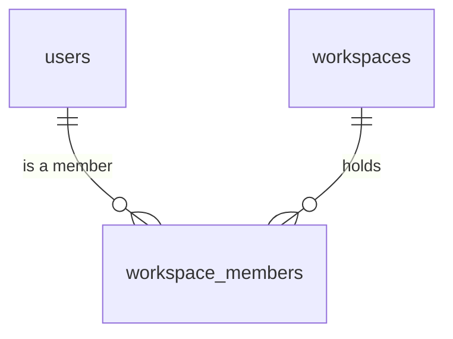
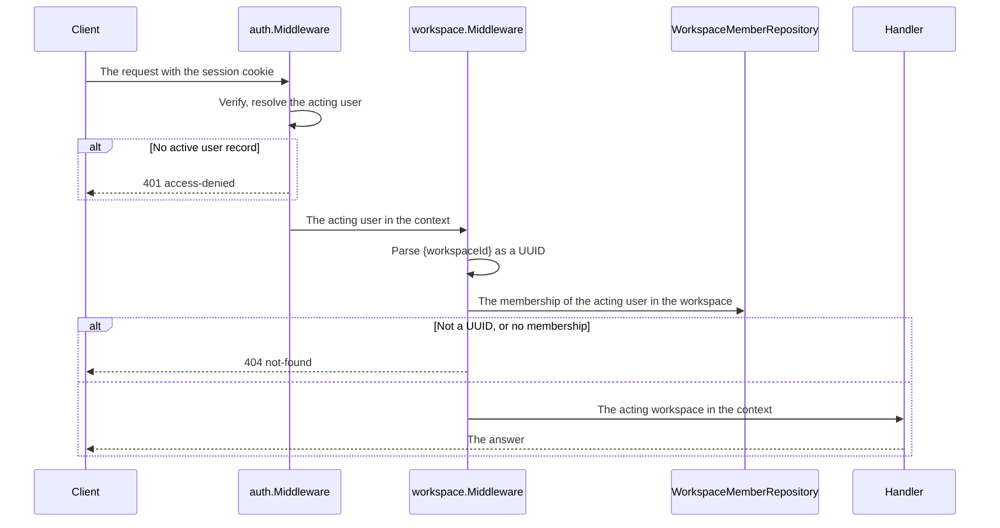

# Specification: The workspaces, their members, and the workspace that a unit of work acts in

This file holds the data model, the HTTP surface, and the check of a membership.
[`spec-clients.md`](spec-clients.md) holds the bot, the MCP server, and the deck.
[`spec-scenarios.md`](spec-scenarios.md) holds the scenarios. `SPC-001` divides them.

## 1. Summary

The hub gains the shared tables `public.workspaces` and `public.workspace_members`,
and one middleware that resolves the workspace of a request under
`/workspaces/{workspaceId}`, checks the membership, and puts the acting workspace into
the context. Nine routes create, read, and change a workspace and its members. Every
member is equal: `PERMS` adds the roles and the permissions, and the two features
release together. A migration gives every existing user record one workspace.

## 2. Coverage

| Requirement      | Where this specification realizes it                         |
| ---------------- | -------------------------------------------------------------- |
| `WSPACE-FR-001`  | Section 4.3, `WSPACE-DD-002`, `WSPACE-SC-001`                 |
| `WSPACE-FR-002`  | Section 4.4, `WSPACE-SC-001`                                   |
| `WSPACE-FR-003`  | Section 4.3, `WSPACE-SC-002`                                   |
| `WSPACE-FR-004`  | Section 4.3, `WSPACE-DD-002`, `WSPACE-SC-003`                 |
| `WSPACE-FR-005`  | Section 4.3, `WSPACE-DD-003`, `WSPACE-SC-004`                 |
| `WSPACE-FR-006`  | Section 4.3, `WSPACE-SC-005`                                   |
| `WSPACE-FR-008`  | Section 4.3, `WSPACE-SC-006`                                   |
| `WSPACE-FR-009`  | Section 4.3, `WSPACE-SC-006`                                   |
| `WSPACE-FR-011`  | Section 4.3, `WSPACE-SC-007`                                   |
| `WSPACE-FR-012`  | Section 4.2, `WSPACE-SC-006`, `WSPACE-SC-008`                 |
| `WSPACE-FR-013`  | Section 4.4, `WSPACE-DD-001`, `WSPACE-SC-009`                 |
| `WSPACE-FR-014`  | Section 4.5, `WSPACE-DD-001`, `WSPACE-SC-010`                 |
| `WSPACE-FR-015` to `WSPACE-FR-019` | `spec-clients.md` section 1                  |
| `WSPACE-FR-020` to `WSPACE-FR-025` | `spec-clients.md` section 3                  |
| `WSPACE-FR-026`  | Section 4.2, `WSPACE-DD-004`, `WSPACE-SC-011`                 |
| `WSPACE-NFR-001` | `WSPACE-DD-001`, `WSPACE-SC-012`                               |
| `WSPACE-INV-002` | Section 4.2, `WSPACE-SC-005`                                   |

## 3. Guideline compliance

| Rule      | Guideline        | How this specification obeys it                                                  |
| --------- | ---------------- | ---------------------------------------------------------------------------------- |
| `OWN-003` | Record ownership | `WSPACE-DD-001` resolves the acting workspace from the path and checks the membership. |
| `OWN-004` | Record ownership | Section 4.2 gives the scope and the reason of each table.                         |
| `OWN-007` | Record ownership | `database.WithScopeTx` and `PluginDB.WithTx` set `app.workspace_id`. Step 6 of the build plan. |
| `OWN-010` | Record ownership | `POST /workspaces`. No route deletes a workspace.                                 |
| `OWN-011` | Record ownership | A membership carries no role until `PERMS`. `WSPACE-DD-005` holds the release.    |
| `SEC-004` | Security         | Every route sits behind `auth.Middleware`, which reads the user record.           |
| `SEC-013` | Security         | No route of this feature declares a permission until `PERMS`. `WSPACE-DD-005`.     |
| `ERR-003` | Errors           | A non-member answers `not-found`. Section 4.5.                                    |
| `API-003` | HTTP API         | Every route sits under `/workspaces`.                                              |
| `API-007` | HTTP API         | A workspace carries `ETag`, and its rename reads `If-Match`. `POST` reads `Idempotency-Key`. |
| `RES-005` | REST             | Every collection of this feature is bounded and answers one page.                 |
| `Z-148`   | REST             | A rename uses `PATCH` with `application/merge-patch+json`.                         |
| `DAT-009` | Data             | `workspaces` declares `id UUID DEFAULT uuidv7()`, and `workspace_members` takes the pair as its key. The migration of `WSPACE-DD-004` names no `id`. |
| `REP-002` | Repository       | `WorkspaceRepository` and `WorkspaceMemberRepository`, each with its implementation. |
| `PKG-004` | Package layout   | `apps/hub/internal/workspace` holds the service and the middleware.               |

`ERR-003` gains one type of the hub, `member-exists`. The owner approves it with this
specification, and `ADR-0008` records the change.

## 4. Design

### 4.1 Components

| Path                                                              | Action | Holds                                                         |
| ----------------------------------------------------------------- | ------ | ------------------------------------------------------------- |
| `apps/hub/db/migrations/20261001100000_table_workspaces_create.*` | create | `public.workspaces`, `public.workspace_members`, the data of `WSPACE-DD-004` |
| `apps/hub/internal/model/workspace.go`                            | create | `model.Workspace`, `model.Member`                             |
| `apps/hub/internal/repository/workspace.go`                       | create | `repository.WorkspaceRepository`, `repository.Workspace`      |
| `apps/hub/internal/repository/workspace_member.go`                | create | `repository.WorkspaceMemberRepository`, `repository.WorkspaceMember` |
| `apps/hub/internal/workspace/{doc,service,middleware}.go`         | create | `workspace.Service`, `workspace.Middleware`                   |
| `apps/hub/internal/handler/workspace.go`                          | create | `handler.Workspace`, the nine routes of section 4.3           |
| `apps/hub/internal/handler/{plugin,plugin_wrapper}.go`            | change | The routes of a plugin and its settings move under `/workspaces/{workspaceId}` |
| `apps/hub/internal/database/tx.go`                                | change | `WithScopeTx` replaces `WithUserTx`                           |
| `libs/pluginapi/actinguser.go`                                    | change | `ContextWithActingWorkspace`, `ActingWorkspaceFromContext`    |
| `libs/pluginapi/database.go`                                      | change | `WithTx` sets `app.workspace_id`. `IDENT-DD-002`              |
| `apps/hub/internal/auth/service.go`                               | change | `Invite` creates the first workspace. `EXTID-DD-010`          |
| `apps/hub/internal/domain/problems/problems.go`                   | change | `NewMemberExists`                                             |
| `apps/hub/internal/depresolver/{server,workspace}.go`             | change | The repositories, the service, and the handler join the container |
| `specs/features/wspace/api.yaml`                                  | create | The nine routes. `SPC-002`                                    |

```go
// apps/hub/internal/workspace/middleware.go

// Middleware resolves {workspaceId}, checks the membership of the acting user,
// and puts the acting workspace into the context.
func Middleware(logger *slog.Logger, members repository.WorkspaceMemberRepository) func(http.Handler) http.Handler

// apps/hub/internal/workspace/service.go
type Service interface {
    Create(ctx context.Context, name string) (*model.Workspace, error)
    ListOfUser(ctx context.Context) ([]model.Workspace, error)
    Get(ctx context.Context) (*model.Workspace, error)
    Rename(ctx context.Context, name string, version time.Time) (*model.Workspace, error)
    Members(ctx context.Context) ([]model.Member, error)
    Member(ctx context.Context, userID string) (*model.Member, error)
    Candidates(ctx context.Context) ([]model.User, error)
    AddMember(ctx context.Context, userID string) (*model.Member, error)
    RemoveMember(ctx context.Context, userID string) error
}
```

Each method reads the acting user and the acting workspace from the context.
`pluginapi.ContextWithActingWorkspace` carries the workspace, so a plugin reads the
same value that the hub reads.

### 4.2 Data model

| Table               | Schema   | Scope  | Migration                                       | Realizes                                         |
| ------------------- | -------- | ------ | ----------------------------------------------- | ------------------------------------------------ |
| `workspaces`        | `public` | shared | `20261001100000_table_workspaces_create.up.sql` | `WSPACE-FR-001`, `WSPACE-FR-004`, `WSPACE-FR-026` |
| `workspace_members` | `public` | shared | `20261001100000_table_workspaces_create.up.sql` | `WSPACE-FR-006`, `WSPACE-FR-008`, `WSPACE-FR-009`, `WSPACE-FR-012`, `WSPACE-INV-002` |

Both tables are shared. The middleware reads them before an acting workspace exists,
and a policy on `app.workspace_id` would hide the row that names it. The migration
states that reason in a comment, as `OWN-004` demands.

```sql
CREATE TABLE public.workspaces
(
    id         UUID        NOT NULL PRIMARY KEY DEFAULT uuidv7(),
    name       TEXT        NOT NULL
        CONSTRAINT workspaces_name_length CHECK (char_length(name) BETWEEN 1 AND 64),
    created_at TIMESTAMPTZ NOT NULL DEFAULT NOW(),
    updated_at TIMESTAMPTZ NOT NULL DEFAULT NOW()
);

CREATE TABLE public.workspace_members
(
    workspace_id UUID        NOT NULL REFERENCES public.workspaces (id),
    user_id      UUID        NOT NULL REFERENCES public.users (id),
    created_at   TIMESTAMPTZ NOT NULL DEFAULT NOW(),
    updated_at   TIMESTAMPTZ NOT NULL DEFAULT NOW(),
    PRIMARY KEY (workspace_id, user_id)
);

CREATE INDEX workspace_members_user_id_idx ON public.workspace_members (user_id);
```

Each table takes the `set_updated_at` trigger. `workspace_members` relates two
records and no table references it, so the pair is its primary key and it carries no
`id`, as `DAT-009` gives. The primary key realizes `WSPACE-INV-002`. No foreign key cascades, because `OWN-002` and `OWN-010` delete no
user record and no workspace. A removal deletes one membership row and touches no
record of the workspace, which realizes `WSPACE-FR-012`. The last member leaves like
any other, and the workspace stays with no member.

`PERMS` adds the column `role` to `public.workspace_members`.



### 4.3 Declarations

**HTTP routes.** `api.yaml` holds the bodies and the status codes. Every route sits
behind `auth.Middleware`. A route under `/workspaces/{workspaceId}` also sits behind
`workspace.Middleware`. `features/perms/spec.md` section 4.3 gives each permission and
its lowest role, and `PERMS` builds the check.

| Method   | Path                                          | Access        | Permission         | Realizes                          |
| -------- | --------------------------------------------- | ------------- | ------------------ | --------------------------------- |
| `GET`    | `/workspaces`                                 | Authenticated | None               | `WSPACE-FR-003`                   |
| `POST`   | `/workspaces`                                 | Authenticated | None               | `WSPACE-FR-001`, `WSPACE-FR-002`  |
| `GET`    | `/workspaces/{workspaceId}`                   | Member        | `workspace.read`   | `WSPACE-FR-020`                   |
| `PATCH`  | `/workspaces/{workspaceId}`                   | Member        | `workspace.write`  | `WSPACE-FR-004`                   |
| `GET`    | `/workspaces/{workspaceId}/members`           | Member        | `workspace.read`   | `WSPACE-FR-011`                   |
| `POST`   | `/workspaces/{workspaceId}/members`           | Member        | `members.write`    | `WSPACE-FR-006`                   |
| `GET`    | `/workspaces/{workspaceId}/members/{userId}`  | Member        | `workspace.read`   | `WSPACE-FR-011`                   |
| `DELETE` | `/workspaces/{workspaceId}/members/{userId}`  | Member        | `membership.leave` for the acting user, `members.write` for another | `WSPACE-FR-008`, `WSPACE-FR-009`, `WSPACE-FR-012` |
| `GET`    | `/workspaces/{workspaceId}/member-candidates` | Member        | `members.write`    | `WSPACE-FR-005`                   |

`DELETE` on the membership of the acting user is a leave, and on another membership a
removal. The members answer in the order of joining, then by the user identifier,
because `workspace_members` carries no `id` to sort by. `DAT-009`. `GET /workspaces` answers each workspace of the acting user, ordered by the
name, then by the identifier. Every collection answers one page, because a household
bounds it.

The routes of a plugin and its settings move under `/workspaces/{workspaceId}` with
this feature. `API-004` gives the prefix, and `workspace.Middleware` guards both.
`PERMS` adds the permission of each route, and `PLUGACC` the enablement.

### 4.4 Flow

A request under `/workspaces/{workspaceId}`:



`POST /workspaces` writes the workspace and the membership of the acting user in one
transaction, which realizes `WSPACE-FR-002`.

### 4.5 Errors

| Condition                                                    | Status | Type                         |
| ------------------------------------------------------------ | ------ | ---------------------------- |
| `{workspaceId}` is no UUID, or no workspace holds it         | 404    | `/problems/http/not-found`   |
| The acting user is no member of the workspace                | 404    | `/problems/http/not-found`   |
| A name is empty or longer than 64 characters                 | 422    | `/problems/http/validation-failed`, pointer `/name` |
| The user record to add is absent or blocked                  | 422    | `/problems/http/validation-failed`, pointer `/user_id` |
| The user record to add is already a member                   | 409    | `/problems/hub/member-exists` |
| The membership to read or remove does not exist              | 404    | `/problems/http/not-found`   |
| `If-Match` names a version that moved                        | 412    | `/problems/http/precondition-failed` |

A workspace of no membership and a workspace that does not exist answer the same
type, status, and body, which realizes `WSPACE-FR-014`.

## 5. Design decisions

### `WSPACE-DD-001`

**Realizes:** `WSPACE-FR-013`, `WSPACE-FR-014`, `WSPACE-NFR-001`
**Decision:** One middleware, `workspace.Middleware`, guards every route under
`/workspaces/{workspaceId}`. It reads the membership of the acting user with one
indexed statement on each request, and holds no cache.
**Rationale:** `IDENT-DD-003` reads the user record on each request for the same
reason: a cache keeps a removed member inside for its lifetime, which breaks
`WSPACE-NFR-001`. The statement reads one row through the primary key, under
1 millisecond on a household-sized table, inside the 10 milliseconds of
`IDENT-NFR-002`. `PERMS` extends the same middleware with the role.
**Alternatives:** The workspaces of the user in the session token. A removal then
waits for the token to expire. A check inside each handler. A handler that forgets it
leaks a workspace.

### `WSPACE-DD-002`

**Realizes:** `WSPACE-FR-001`, `WSPACE-FR-004`
**Decision:** A name counts characters, not bytes, and the hub trims no space. The
handler checks the limit, and the `CHECK` constraint repeats it.
**Rationale:** "ბინა" holds four characters and twelve bytes. A limit in bytes refuses
a Georgian name that a person reads as short. The constraint keeps a row that another
writer adds within the limit.
**Alternatives:** A limit in bytes. Shorter to check, and unfair to every script that
is not Latin.

### `WSPACE-DD-003`

**Realizes:** `WSPACE-FR-005`
**Decision:** `GET /workspaces/{workspaceId}/member-candidates` answers every active
user record that is not a member of the workspace, with its identifier, its first
name, and its last name, ordered by the last name, then by the first name.
**Rationale:** The owner chose this route. `/users` stays with the administrator, as
`API-003` gives it, and the list leaves out the members, so nobody adds a member twice
from it.
**Alternatives:** `/users` opened to a member for reading. One list then serves two
audiences with two shapes.

### `WSPACE-DD-004`

**Realizes:** `WSPACE-FR-026`
**Decision:** The migration loops over `public.users` in a `DO` block. For each record
it inserts one workspace, named by the first 64 characters of the first name of the
record or `Workspace` when the record holds none, reads the identifier with
`RETURNING id`, and inserts the membership. The cut keeps a long first name within
the limit of `WSPACE-FR-001`, so the migration never fails on one.
**Rationale:** A loop reads each identifier from `RETURNING`, so no statement names
`id`, as `DAT-009` demands. An installation holds a household of records, so the loop
costs nothing.
**Alternatives:** One statement that pairs each user with an identifier from
`uuidv7()`. It names `id` in the insert. A command that an operator runs. A forgotten
run leaves every user with no workspace and no plugin.

### `WSPACE-DD-005`

**Realizes:** `OWN-011`, `SEC-013`
**Decision:** This feature merges with no role and no permission, and no release
carries it before `PERMS` is done. The last step of the build plan checks that.
**Rationale:** The owner moved the roles and the permissions to `PERMS`. A release in
between would serve a membership with no role and a workspace route with no
permission, which `OWN-011` and `SEC-013` forbid. Building in two features keeps each
review small, and one release keeps the guidelines whole.
**Alternatives:** A known gap in `SEC-013` and `OWN-011`, recorded by an ADR. A second
ADR to write and later to remove. Roles in this feature. The owner moved them out.

## 6. Scenarios

`spec-scenarios.md` holds `WSPACE-SC-001` through `WSPACE-SC-021`.

## 7. Build plan

| #   | Step                                                                                         | Realizes                                     | Done |
| --- | -------------------------------------------------------------------------------------------- | -------------------------------------------- | ---- |
| 1   | Add `member-exists` to the hub. `ERR-003` holds its row.                                     | `ERR-003`                                    | [x]  |
| 2   | Write the migration of section 4.2, with `WSPACE-SC-011`.                                    | `WSPACE-FR-026`, `WSPACE-INV-002`            | [x]  |
| 3   | Write `model.Workspace`, `model.Member`, and the two repositories.                           | `WSPACE-FR-001` to `WSPACE-FR-012`           | [x]  |
| 4   | Write `WSPACE-SC-009`, `WSPACE-SC-010`, and `WSPACE-SC-012`, then `workspace.Middleware`.    | `WSPACE-FR-013`, `WSPACE-FR-014`, `WSPACE-NFR-001` | [ ]  |
| 5   | Write `WSPACE-SC-001` to `WSPACE-SC-008`, then `workspace.Service`, then `api.yaml` and `handler.Workspace`. | `WSPACE-FR-001` to `WSPACE-FR-012` | [ ]  |
| 6   | Carry out steps 13 and 14 of `features/ident/spec.md`: the acting workspace in `libs/pluginapi`, `WithScopeTx`, and the move of the routes of a plugin. Build every plugin. | `WSPACE-FR-013`, `BLD-004` | [ ]  |
| 7   | Carry out steps 13 and 15 of `features/pset/spec.md`, with the membership check alone.      | `WSPACE-FR-013`                              | [ ]  |
| 8   | Carry out step 15 of `features/extid/spec.md`: the first workspace of an invitation.         | `EXTID-FR-018`                               | [ ]  |
| 9   | Carry out `spec-clients.md`: the bot, the MCP server, and the deck.                         | `WSPACE-FR-015` to `WSPACE-FR-025`           | [ ]  |
| 10  | Before a release, confirm that `PERMS` is done.                                              | `WSPACE-DD-005`                              | [ ]  |

## 8. Out of scope for this specification

| Postponed                                              | Reason and the condition that brings it back                          |
| ------------------------------------------------------ | --------------------------------------------------------------------- |
| The roles, the permissions, and the last manager rule. | `PERMS`. It releases together with this feature. `WSPACE-DD-005`.    |
| The enablement of a plugin, and `/workspaces/{id}/plugins`. | `PLUGACC`. Until then every loaded plugin serves every workspace. |
| The cron run for each workspace.                       | It reads the enablements of `PLUGACC`. Step 15 of `features/ident/spec.md`. |
| The access of an administrator to every workspace.     | `PLUGACC` gives the administrator.                                    |
| The authorization engine.                              | `PERMS` decides whether Casbin or OPA earns a place.                  |

## Retired identifiers

This file has no retired identifier.
