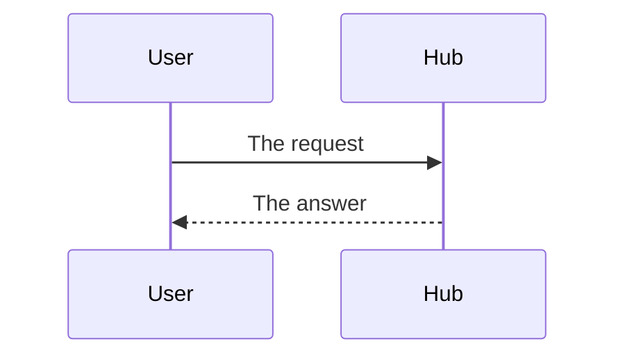

# Specification: The name of the feature

Copy this file to `specs/features/<key>/spec.md`.
Set every field in the frontmatter. See `TRC-008`.
Divide the file into `spec-<subject>.md` files when it grows past 500 lines.
Add `api.yaml` when this feature adds an HTTP route. `SPC-001` gives every artifact.

Write every statement in the language that `LNG` demands.
This document holds every technical decision that the code generation needs.

## 1. Summary

Two or three sentences. What does this feature build?

## 2. Coverage

Each requirement must appear one time in this table.

| Requirement     | Where this specification realizes it |
| --------------- | ------------------------------------ |
| `<KEY>-FR-001`  | Section 4.1                          |
| `<KEY>-NFR-001` | Section 4.2, `<KEY>-SC-003`          |
| `<KEY>-INV-001` | Section 5, `<KEY>-DD-002`            |

A requirement with no row is a defect in this document.

## 3. Guideline compliance

| Rule      | Guideline    | How this specification obeys it |
| --------- | ------------ | ------------------------------- |
| `ARC-###` | Architecture |                                 |
| `PLG-###` | Plugin model |                                 |

Name each section that a rule shapes.

## 4. Design

### 4.1 Components

Name each package, each file, and each type to create or to change.
Give the path.

### 4.2 Data model

One row for each table that this feature adds or changes. `SPC-003` gives the columns.
A scope is `scoped` or `shared`. See `OWN-004`.

| Table    | Schema           | Scope  | Migration                        | Realizes       |
| -------- | ---------------- | ------ | -------------------------------- | -------------- |
| `<name>` | `<plugin_ident>` | scoped | `<YYYYMMDDHHMMSS>_<name>.up.sql` | `<KEY>-FR-001` |

Then give the columns, the constraints, and the indexes of each table.
Draw a diagram when three or more tables relate. See `SPC-005`.

### 4.3 Declarations

One table for each contract surface that this feature adds.
`SPC-003` gives the columns of every surface. Delete a table this feature does not need.

**HTTP routes.** `api.yaml` holds the bodies and the status codes. See `SPC-002`.

| Method | Path                       | Access        | Realizes       |
| ------ | -------------------------- | ------------- | -------------- |
| `GET`  | `/plugins/{id}/api/<path>` | Authenticated | `<KEY>-FR-001` |

**Cron jobs.**

| Identifier | Schedule    | Acts for  | Behavior | Realizes       |
| ---------- | ----------- | --------- | -------- | -------------- |
| `<name>`   | `0 6 * * *` | Each user |          | `<KEY>-FR-002` |

### 4.4 Flow

The sequence of the steps for each main path.
Draw a diagram when the order crosses two components. See `SPC-005`.

### 4.5 Errors

| Condition | Behavior | Message |
| --------- | -------- | ------- |
|           |          |         |

## 5. Design decisions

### `<KEY>-DD-001`

**Realizes:** `<KEY>-FR-001`
**Decision:**
**Rationale:**
**Alternatives:**

A decision that changes more than one plugin becomes an ADR.
See `specs/adr/`.

## 6. Scenarios

### `<KEY>-SC-001`

**Verifies:** `<KEY>-FR-001`
**Layer:** unit, integration, or manual

**Given**
**When**
**Then**

Each non-functional requirement needs a scenario that measures it.

## 7. Build plan

The order of the work. One row for each step.

| #   | Step | Realizes | Done |
| --- | ---- | -------- | ---- |
| 1   |      |          | [ ]  |

## 8. Out of scope for this specification

What the requirements demand but this specification postpones.
Name the reason and the condition that brings it back.

## Retired identifiers

This file has no retired identifier.
